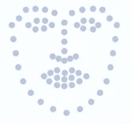
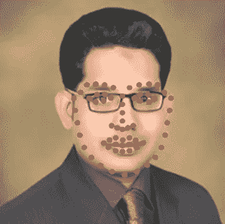

# 面部标志估计应用

> 原文：<https://medium.com/coinmonks/face-landmark-estimation-application-b12d8e470521?source=collection_archive---------6----------------------->

在检测到图像中的人脸后，如之前的帖子[‘人脸检测应用’](https://engmrk.com/face-detection-application/)所示，我们将执行人脸标志估计。人脸地标估计是指识别人脸上的关键点，如鼻尖和眼睛中心。

基于面部标志点的数量，有不同的估计模型。5 点模型是最简单的模型，它只检测每只眼睛的边缘和鼻子的底部。


5 points face landmark model


其他模型包括 68 点面部标志模型，其检测面部上的 68 个不同点，包括眼睛、鼻子、嘴唇和面部形状。



68 points face landmark model



面部标志估计有助于构建应用数字化妆或部件的应用程序。

# 构建一个评估面部特征的应用程序

对于我们的应用程序，我们将使用“dlib”库构建人脸识别模型。“dlib”主要是一个 C++库，然而，我们可以将它的许多工具用于 python 应用程序。人脸识别是一个深度学习模型，准确率为 99.38%。

有关更多详情和参考资料，请访问:

*   【https://pypi.org/project/face_recognition/ 号
*   【http://dlib.net/python/index.html 

face_recognition 内置了执行人脸检测、识别和身份验证任务的功能。首先，我们将把图像加载到一个 NumPy 数组中，并应用 face_landmarks 函数。face_landmarks 函数返回图像中所有人脸的列表。每个面部还具有该面部的所有面部特征的“名称”和“点列表”。使用每个面部特征的标志(眼睛、鼻子、嘴唇等)。)，我们会在五官周围画红色的线。

***注意:*** *下面的代码需要三个 Python 外部库 pillow、face_recognition 和 dlib。*

```
#import external libraries 
import PIL.Image
import PIL.ImageDraw
import face_recognition

# Load the jpg file into a numpy array
image = face_recognition.load_image_file("people.jpg")

# Find all facial features in all the faces in the image
face_landmarks_list = face_recognition.face_landmarks(image)

number_of_faces = len(face_landmarks_list)
print("I found {} face(s) in this photograph.".format(number_of_faces))

# Load the image into a Python Image Library object so that we can draw on top of it and display it
pil_image = PIL.Image.fromarray(image)

# Create a PIL drawing object to be able to draw lines later
draw = PIL.ImageDraw.Draw(pil_image)

# Loop over each face
for face_landmarks in face_landmarks_list:

    # Loop over each facial feature (eye, nose, mouth, lips, etc)
    for name, list_of_points in face_landmarks.items():

        # Print the location of each facial feature in this image
        print("The {} in this face has the following points: {}".format(name, list_of_points))

        # Let's trace out each facial feature in the image with a line!
        draw.line(list_of_points, fill="red", width=2)

pil_image.show()
```

下面是上述代码在不同图像上的输出。


你可以在上面的图片中看到，面部特征被非常精确地标记出来。我们可以进一步扩展我们的应用程序，以应用数字化妆，部件(眼镜，面具…等)。)等等。face_recognition 和本文参考资料的作者 Adam Geitgey 在他的 GitHub 知识库中提供了许多例子。我强烈建议每个人都参加他的课程。

另请阅读:[实时视频中的人脸标志估计](https://engmrk.com/face-landmark-estimation-in-live-video/)

**参考:**

深度学习:亚当·盖特基的人脸识别

> [直接在您的收件箱中获得最佳软件交易](https://coincodecap.com/?utm_source=coinmonks)

[](https://coincodecap.com/?utm_source=coinmonks)