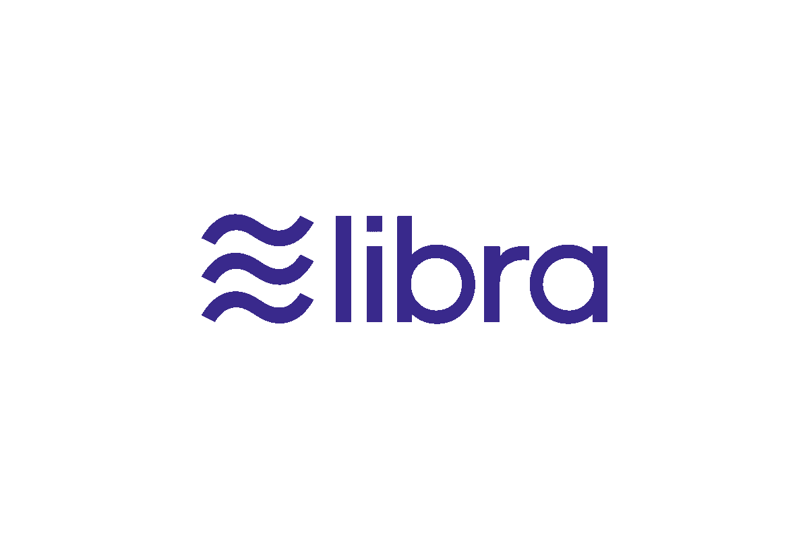

# 脸书的天秤座“区块链”

> 原文：<https://medium.com/coinmonks/facebooks-libra-blockchain-b16d31b5a8b2?source=collection_archive---------6----------------------->

我正在开发一个加密发票和支付工具 [**CryptoFi**](https://cryptofi.co) ，看看吧。

**本周语录-**

> “当我们爱时，我们总是努力变得比我们更好。当我们努力变得更好时，我们周围的一切也会变得更好。”— **保罗·柯艾略(炼金术士)**

本周故事👇 👇

## Libra 区块链

**Libra**

昨天，脸书宣布了今年最令人期待的项目天秤座。Libra 是一种加密货币，旨在“为没有银行账户的人提供银行服务”，并创建一个全球性的包容性金融基础设施。 [Jameson Lopp](https://medium.com/u/efbe66f7cec8?source=post_page-----b16d31b5a8b2--------------------------------) 钻研 Libra 的白皮书，分享他对 Libra 背后技术的想法。

[**…。*阅读詹姆逊对天秤座的循环思想***](/@lopp/thoughts-on-libra-blockchain-49b8f6c26372)

但在声明发布后，美国立法者开始呼吁脸书停止 Libra 的开发。众议院金融服务委员会的资深共和党众议员帕特里克·麦克亨利在给委员会主席、众议员玛克辛·沃特斯的一封信中要求就天秤座项目举行听证会。更多 [***此处阅读***](https://www.theblockcrypto.com/tiny/u-s-lawmakers-are-calling-for-facebook-to-halt-libra-development/) 。

> [直接在您的收件箱中获得最佳软件交易](https://coincodecap.com/?utm_source=coinmonks)

**寿师爷**

[***Komodo 平台***](https://komodoplatform.com/)***—****一个开源项目构建分散技术。*

*给我发微博到 [@coinmonks](https://twitter.com/coinmonks) 或者发邮件到 gaurav@coincodecap.com*

> *“我们是一个非宣传性和非营利性的教育出版物，如果你喜欢阅读《创造僧侣》，[你也可以捐赠给我们](/coinmonks/monks-need-your-help-7440418d67ec)”*

****暂时就这样了，送我❤️，下次见****