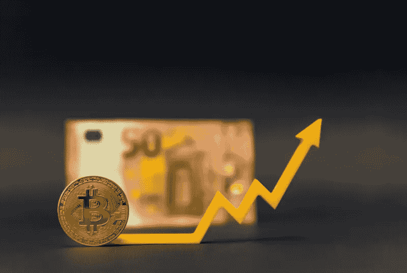

# 决定加密货币价值的因素

> 原文：<https://medium.com/coinmonks/factors-that-determine-the-value-of-cryptocurrency-90248156d95e?source=collection_archive---------7----------------------->

加密货币从根本上来说是不稳定的，因此，对于许多被视为加密货币社区局外人的人来说，它们的价值仍然是一个谜。

那么，是什么推动了加密货币的价值？有一些因素可以帮助确定加密货币的价值。让我们来看看其中的几个:

## **供求**

供求是决定任何可以交易的东西的价值的一个很大的因素，包括所有的数字货币。例如，如果愿意买乙醚的人比愿意卖乙醚的人多，价格就会上涨。如果情况相反，价格就会下降。随着许多加密货币的供应被**限制**，受欢迎的加密货币的价格将会上涨。

## **代币持有者**

这是对加密货币接受度的衡量。这可以通过在互联网上进行搜索来确定，有时通过网站上提供的加密货币的数据/信息来确定。

令牌持有者还可以确定加密货币社区的实力。持有人越多，社区就越强大，从长远来看，这是决定危机时期加密货币可持续性的一个因素。

## **大规模采用**

这影响了需求和供给因素。

众所周知，如果一项资产被大量采用，它将获得巨大的价值。这同样适用于加密货币。以比特币为例，其市场总供应量是有限的，随着其日常使用案例的增加，它将不断导致价值的直接增加。

简而言之，如果一种加密货币的**效用和用途**增加，其需求就会增加，这反过来会增加其价值。

## **外部驱动**

高调人物的话语或推文可能是影响加密货币价值的外部因素。2021 年 5 月，埃隆·马斯克通过他在周六夜现场的预期亮相推高了 [dodgecoin](https://fortune.com/2021/07/09/elon-musk-tweet-dogecoin-blockchain-bitcoin-ethereum/) 的价值，并通过一条推文减少了其在 2021 年 7 月的暴跌。然而，在他表示要与这种加密货币“分手”后，他引发了比特币超过 4.5%的价格下跌。

## **法规**

对加密货币进行监管的呼声不断高涨。如果这种情况发生，它只会导致数字货币被集中，从而影响加密货币的价值。以最近的比特币价格[波动](https://time.com/nextadvisor/investing/cryptocurrency/latest-crypto-news/)为例，上周中国发布了对加密货币交易的禁令，仅一周后，美国美联储主席杰罗姆·鲍威尔发表了一份反击声明，他表示美国无意禁止加密货币。

## **结论**

由于所有这些综合因素的影响，很难准确预测加密货币的价格，但这确实让加密货币市场的交易者和投资者感兴趣。

> 加入 Coinmonks [电报频道](https://t.me/coincodecap)和 [Youtube 频道](https://www.youtube.com/c/coinmonks/videos)了解加密交易和投资

## 另外，阅读

*   [尤霍德勒 vs 科恩洛 vs 霍德诺特](/coinmonks/youhodler-vs-coinloan-vs-hodlnaut-b1050acde55a) | [Cryptohopper vs 哈斯博特](https://blog.coincodecap.com/cryptohopper-vs-haasbot)
*   [如何匿名购买比特币](https://blog.coincodecap.com/buy-bitcoin-anonymously) | [比特币现金钱包](https://blog.coincodecap.com/bitcoin-cash-wallets)
*   [币安 vs FTX](https://blog.coincodecap.com/binance-vs-ftx) | [最佳(SOL)索拉纳钱包](https://blog.coincodecap.com/solana-wallets)
*   如何在 Uniswap 上交换加密？
*   [币安 vs 北海巨妖](https://blog.coincodecap.com/binance-vs-kraken) | [美元成本平均交易机器人](https://blog.coincodecap.com/pionex-dca-bot)
*   [新加坡十大最佳加密交易所](https://blog.coincodecap.com/crypto-exchange-in-singapore) | [购买 AXS](https://blog.coincodecap.com/buy-axs-token)
*   [投资印度的最佳密码](https://blog.coincodecap.com/best-crypto-to-invest-in-india-in-2021) | [HitBTC 评论](/coinmonks/hitbtc-review-c5143c5d53c2)
*   [加拿大最好的加密交易机器人](https://blog.coincodecap.com/5-best-crypto-trading-bots-in-canada) | [赌注加密](https://blog.coincodecap.com/staking-crypto)
*   [如何在印度购买比特币？](/coinmonks/buy-bitcoin-in-india-feb50ddfef94) | [WazirX 评论](/coinmonks/wazirx-review-5c811b074f5b)
*   [比特币主根](https://blog.coincodecap.com/bitcoin-taproot) | [Bitso 评论](https://blog.coincodecap.com/bitso-review) | [排名前 6 的比特币信用卡](/coinmonks/bitcoin-credit-card-bc8ab6f377c6)
*   [最佳免费加密信号](https://blog.coincodecap.com/free-crypto-signals) | [YoBit 评论](/coinmonks/yobit-review-175464162c62) | [Bitbns 评论](/coinmonks/bitbns-review-38256a07e161)
*   [huo bi 的加密交易信号](https://blog.coincodecap.com/huobi-crypto-trading-signals) | [BitMEX 评论](https://blog.coincodecap.com/bitmex-review)
*   [7 个最佳零费用密码交易平台](https://blog.coincodecap.com/zero-fee-crypto-exchanges) | [硬件钱包](/coinmonks/hardware-wallets-dfa1211730c6)
*   [分散交易所](https://blog.coincodecap.com/what-are-decentralized-exchanges) | [比特 FIP](https://blog.coincodecap.com/bitbns-fip) | [Pionex 审查](https://blog.coincodecap.com/pionex-review-exchange-with-crypto-trading-bot)
*   [用信用卡购买密码的 10 个最佳地点](https://blog.coincodecap.com/buy-crypto-with-credit-card)
*   [OKEx 回顾](/coinmonks/okex-review-6b369304110f) | [Kucoin 交易机器人](/coinmonks/kucoin-trading-bot-automate-your-trades-8cf0ca2138e0) | [期货交易机器人](/coinmonks/futures-trading-bots-5a282ccee3f5)
*   [AscendEx Staking](https://blog.coincodecap.com/ascendex-staking)|[Bot Ocean Review](https://blog.coincodecap.com/bot-ocean-review)|[最佳比特币钱包](https://blog.coincodecap.com/bitcoin-wallets-india)
*   [霍比审核](https://blog.coincodecap.com/huobi-review) | [OKEx 保证金交易](https://blog.coincodecap.com/okex-margin-trading) | [期货交易](https://blog.coincodecap.com/futures-trading)
*   [Godex.io 审核](/coinmonks/godex-io-review-7366086519fb) | [邀请审核](/coinmonks/invity-review-70f3030c0502) | [BitForex 审核](https://blog.coincodecap.com/bitforex-review)
*   [Crypto.com 费用](/coinmonks/binance-fees-8588ec17965) | [僵尸密码审查](/coinmonks/botcrypto-review-2021-build-your-own-trading-bot-coincodecap-6b8332d736c7) | [替代品](https://blog.coincodecap.com/crypto-com-alternatives)
*   [有哪些交易信号？](https://blog.coincodecap.com/trading-signal) | [Bitstamp vs 比特币基地](https://blog.coincodecap.com/bitstamp-coinbase) | [买索拉纳](https://blog.coincodecap.com/buy-solana)
*   [ProfitFarmers 回顾](https://blog.coincodecap.com/profitfarmers-review) | [如何使用 Cornix Trading Bot](https://blog.coincodecap.com/cornix-trading-bot)
*   [MXC 交易所评论](/coinmonks/mxc-exchange-review-3af0ec1cba8c) | [Pionex vs 币安](https://blog.coincodecap.com/pionex-vs-binance) | [Pionex 套利机器人](https://blog.coincodecap.com/pionex-arbitrage-bot)
*   [我的加密副本交易经历](/coinmonks/my-experience-with-crypto-copy-trading-d6feb2ce3ac5) | [比特币基地评论](/coinmonks/coinbase-review-6ef4e0f56064)
*   [CoinFLEX 评论](https://blog.coincodecap.com/coinflex-review) | [AEX 交易所评论](https://blog.coincodecap.com/aex-exchange-review) | [UPbit 评论](https://blog.coincodecap.com/upbit-review)
*   [AscendEx 保证金交易](https://blog.coincodecap.com/ascendex-margin-trading) | [Bitfinex 赌注](https://blog.coincodecap.com/bitfinex-staking) | [bitFlyer 审核](https://blog.coincodecap.com/bitflyer-review)
*   [麻雀交换评论](https://blog.coincodecap.com/sparrow-exchange-review) | [纳什交换评论](https://blog.coincodecap.com/nash-exchange-review)
*   [支持卡审核](https://blog.coincodecap.com/uphold-card-review) | [信任钱包 vs MetaMask](https://blog.coincodecap.com/trust-wallet-vs-metamask)