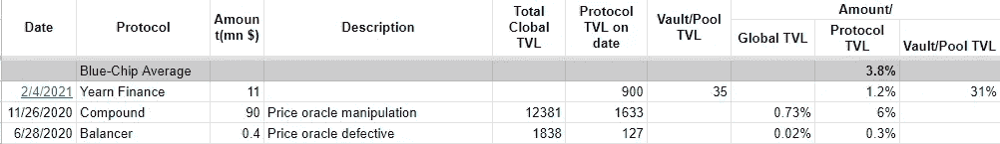

# 为 DeFi 保险寻找合理的保费

> 原文：<https://medium.com/coinmonks/fair-defi-insurance-premium-9c18404beb63?source=collection_archive---------9----------------------->

## 蓝筹 DeFi 项目 2%的溢价应该是公平的，一般项目 2.6%

# 如果你有赤字，你预计会损失多少？

让我们考虑一下 2020 年全年的黑客攻击/漏洞利用。为了简单起见，我们只考虑主要问题。

截至 2020 年，共有 20 起黑客攻击/利用事件，共造成 2400 万美元的损失。到 2020 年底，TVL(总锁定价值)为 115.76 亿美元。

2.03% of DeFi was lost in 2020, with each hacked protocol losing an average of 4.6% of the TVL

为了简单起见，我们认为爱丽丝是唯一的 DeFi 投资者，并在 2020 年向 DeFi 投资了 115.76 亿美元。由于黑客攻击，她在 2020 年损失了 2400 万美元。

Alice 的损失率为 2400 万美元/115.76 亿美元=2%

这是什么意思？

这意味着，如果你在 DeFi 投资 100 美元，预计全年将亏损 2 美元。

# 如果一个协议被黑客攻击/利用，会损失多少？

如上图所示，其中 11 个项目的 TVL 损失高达 30%，平均为 4.6%。

那是什么意思？

这意味着如果你参与的 DeFi 项目被黑客攻击，你预计将损失 4.6%。

# 你如何在 DeFi 中保护你的资金并睡个好觉？

购买保险。

# 平均 DeFi 保险费用应该是多少？

对于保险提供商来说，要想盈利，保费当然应该覆盖预期的损失，也就是 2%。让我们给出一个合理的数字 ***2.6%*** (这也是大多数 Nexus 相互保险的保费)。

但是 2.6%是平均水平，我们都知道基于团队、历史和用户基础，项目的质量是不同的。蓝筹股项目应该更安全，回报率应该低于 2.6%，而新的小型项目的回报率应该远高于 2.6%。

由于风险可能非常高，我们无法估计低额小项目和新项目的溢价。但必须在 2.6%以上。

# 蓝筹项目覆盖成本应该是多少？

对于蓝筹项目，它应该低于 2.6%，因为它们比一般的 DeFi 项目更安全。

## 保险费是由什么决定的？

1.  项目被黑客攻击/利用的可能性。
2.  被黑/被利用时的损失率。

## 蓝筹项目亏损比例？

平衡器、化合物和渴望在黑客攻击中分别损失 0.3%(0.4 百万美元/1.27 亿美元)、6%(9000 万美元/1.633 亿美元)和 1.2%(1100 万美元/9 亿美元)，平均 ***3.8%*** 。

Blue-chip projects lose an average of 3.8% during hacks

如上所述，一般 DeFi 项目预计损失*4.6%。*

## *蓝筹项目覆盖的保费应该是多少？*

*如果不考虑某个项目被黑的可能性，保费应该是(3.8%/4.6%)*2.6%=2.1%。*

*所以把被黑/被利用的可能性作为一个因素，可以有把握地说，*蓝筹项目覆盖率 2% 溢价是公平的。**