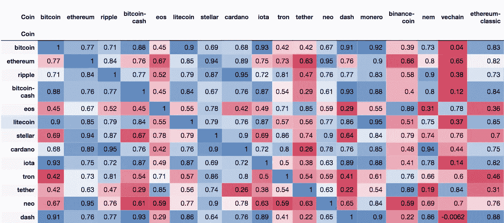
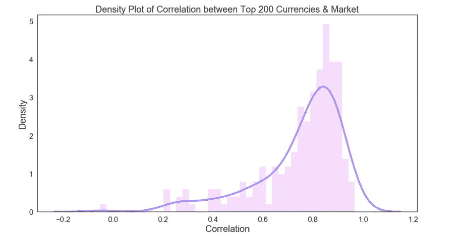
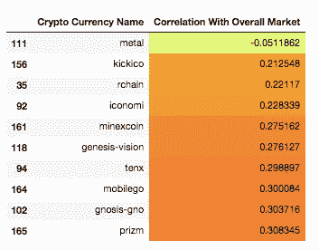
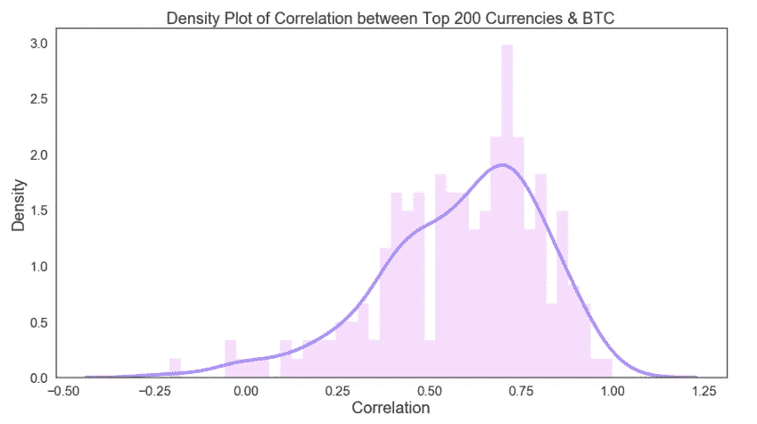
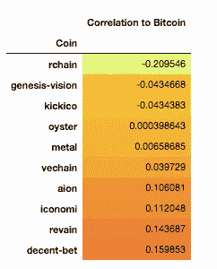
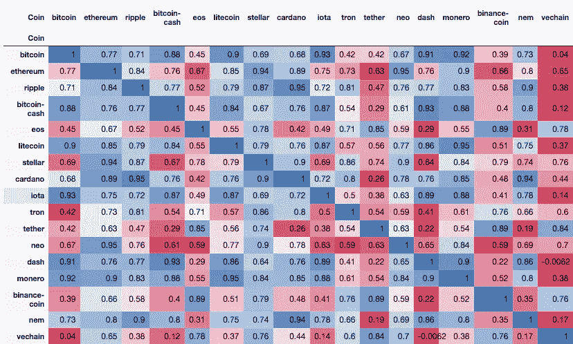

# 下跌的加密货币——哪个抗市场趋势？使用数据分析找出答案

> 原文：<https://medium.com/coinmonks/falling-cryptocurrencies-which-is-resistant-to-market-trend-find-out-using-data-analysis-240db0bdd805?source=collection_archive---------9----------------------->

Correlation between Top Crypto Currency’s Market Caps

使用数据分析了解**前 200 种加密货币**如何抵抗整体加密市场趋势。

你一定看过很多关于*加密货币市场表现不佳*和怀疑论者*在下跌的加密市场中获胜*的文章。一些人可能会认为比特币会反弹，然而，这篇文章不是为了讨论加密市场表现的好坏。

本文旨在了解*货币如何依赖于*整体市场，并找出哪些货币最能抵抗总体市场趋势。我也将分享代码，你也可以进行进一步的分析。

## 为什么发现哪些货币最能抵抗市场波动很重要？

如果你去 https://coinmarketcap.com/，你会注意到所有的货币都有相似的趋势，这在视觉上不同于其他金融市场，在那里你会看到很多混乱。可能的原因是相同的市场趋势或多或少地影响了所有密码。

其中绝大多数都*严重依赖*比特币(BTC) 的性能和价格。因此，如果你是一个秘密投资者，知道哪些不跟随市场来管理风险是有好处的。

在这篇文章中，我们将尝试探索以下内容

1.  加密货币如何与市场相关联
2.  加密货币如何与比特币相关联(BTC)
3.  加密货币是如何相互关联的

## [如果对代码感兴趣可以跳转查看回购 Github](https://github.com/tstreamDOTh/Crypto-Currency-Market-Resistance-EDA)

在我们继续之前有几个假设-

我们只查看 CMC 上至少有 120 天历史数据的硬币。我们将只关注市值最高的 200 种硬币。

我们将考虑 2017 年 7 月 1 日至 2018 年 7 月 1 日期间的数据。您也可以在不同时间段范围内进行这种分析。

# **加密货币如何与**加密货币**市场相关联？**

我们不想重复计算加密货币的市值，所以我们将从总市值中减去加密货币的市值。

> 剩余市值=总市值-单个市值

我们可以计算整个时间段内两者之间的[皮尔逊相关系数](https://en.wikipedia.org/wiki/Pearson_correlation_coefficient)。

*正系数反映正相关&负系数反映负相关。*

我们需要计算前 200 种货币和相应的剩余市值之间的相关系数。然后，我们可以用所有相关系数绘制直方图和密度图。

The area under the curve of a density function represents the probability of getting a value between a range of x values.

从图中你可以清楚地看到，前 200 名中的大多数硬币与市场高度相关。

*   **前 200 个硬币中有 75%的相关性高于 0.6**
*   **前 200 名硬币中有 50%的相关性高于 0.8**

尽管我们对相关性最小的硬币感兴趣。提出了以下观察结果-

Top 10 Crypto Currency Coins with Least Correlation with the Market

# 加密货币如何与比特币相关联？

同样，我们可以用比特币(BTC)来计算排名前 200 的货币硬币的系数

The area under the curve of a density function represents the probability of getting a value between a range of x values.

这个信念被认为是正确的。按市值排名前 200 的硬币与比特币(BTC)密切相关。

*   **前 200 名中 75%的硬币具有高于 0.4 的相关性**
*   **前 200 名中有 50%的硬币相关性高于 0.6**

我们也可以推导出相关性最小的硬币。提出了以下观察结果-

Top 10 Crypto Currency Coins with Least Correlation with the BTC

# 加密货币是如何相互关联的？

为此，我们将选取前 20 种货币，并用渐变颜色绘制一个相关表，以大致了解货币市值的相互依赖程度。

下表显示了顶级加密货币市值之间的相关性

Correlation between Top Crypto Currency’s Market Caps

# 关键要点-

这些观察表明，当市场上涨时，大多数硬币也可能上涨。当市场下跌时，他们肯定会跟着下跌。多样化的投资组合应该持有与此相反的加密硬币。

*注意:相关性随时间变化*

皮尔逊相关系数得出我们所考虑的整个时间段的单一数字。它不考虑随时间的变化，滚动平均比较可能会提供更深入的见解。**然而，这一观察足以用来描述加密货币硬币的行为。**

我会试着写一篇后续文章来进行更多的分析并给出更深刻的见解。

## 你可以在这里找到包含所有代码的 github repo🤖

## 就是这样！如果你有任何问题，请随时发推特给我。

## 关注我来了解我的最新消息。祝您愉快！🎉