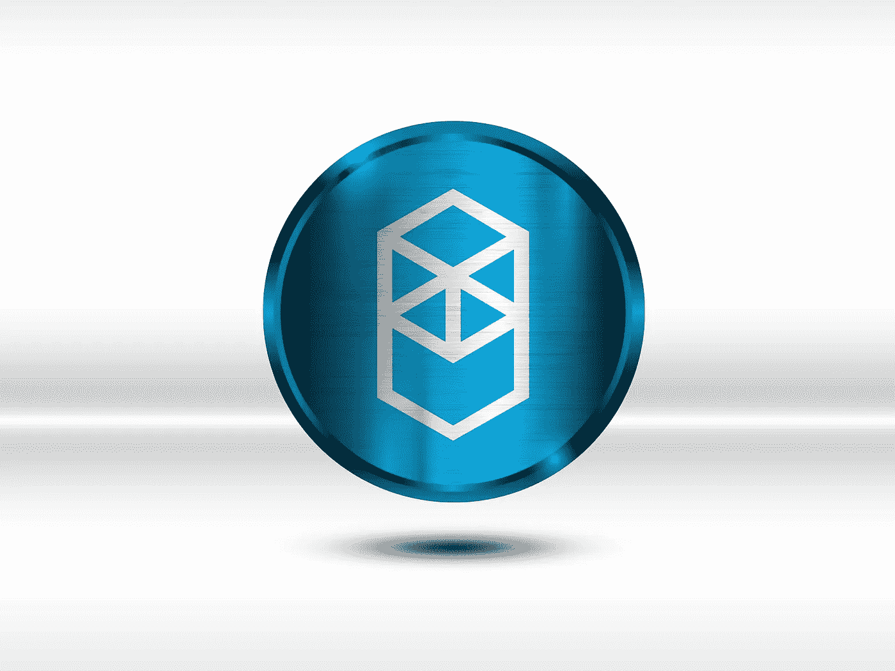
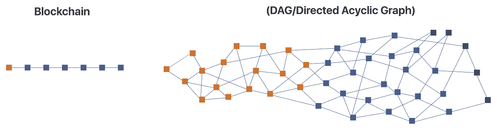

# Fantom 网络

> 原文：<https://medium.com/coinmonks/fantoms-potential-is-scary-for-its-competition-13c0ea5a935e?source=collection_archive---------0----------------------->

pixabay

Fantom 没有得到应有的关注。它由 Fantom 基金会在 2018 年成立，筹集了 3700 万美元，并在炒作和宣传毫无意义的熊市中上线。

Fantom 计划建立一个智能合同网络，作为未来智能城市的基础。截至 2018 年 12 月底，Fantom 在测试网上每秒能够处理 25，000 笔交易，目标是在部署主网时达到 300，000 tps，但 tps 尚未实现。

## 引擎盖下的 Fantom

Source: cbcamerica.org

幻影采用有向无环图(DAG)而不是区块链，这与区块链有根本的不同。与其他区块链不同，这是一种分布式分类帐技术，允许任何连接到网络的计算机并行执行交易。链接到 DAG 的每台计算机将其事务“八卦”给随机的一组相邻节点(计算机)，这些节点将消息“八卦”给另一组随机的节点，以此类推。这些交易像谣言一样，像野火一样在网络上传播，并采取措施确保它们之间没有冲突或重叠。

Source: thesaurus.com

这种配置允许每秒处理数千个事务，并且理论上具有无限的可伸缩性。尽管 Fantom 不是最快的区块链，但最终性比事务速度更重要。

从本质上说，终结性是指一个事务被宣布为“最终”所需的时间长度。在 Fantom 上，交易只需几秒钟就能完成，成本只有几分之一便士。这比其他每秒处理事务速度更高的区块链要快得多。

*智能合约*

Fantom 与智能合约兼容，并使用 EVM(以太坊虚拟机)，使其能够与以太坊互操作。这意味着以太坊开发者会发现在 Fantom 上部署应用程序很简单。虽然存在 TPS 限制，但它们将通过 Fantom 虚拟机来处理，该虚拟机目前正在开发中。

*共识*

“巨蝮属”是 Fantom 自己的利害关系证明共识机制，其中验证器节点必须投入 100 万个 Fantom 令牌(FTM ),并且不能在它们的节点上投入超过 5000 万个 FTM。Fantom 对“不良行为”采取零容忍政策，对于行为不端的验证器，将没收 100%的赌注 FTM。由于其液态打桩功能，打桩 FTM 也可用于 Fantom 的 DeFi 生态系统。Fantom 打算再提供 1000 至 2500 台验钞机，以进一步分散其网络。

## 安德烈·克朗耶

Source: defiprime.com

Fantom 有一位最知名的 DeFi 架构师，他是一位技术天才，构建了最好的领先 DeFi 协议之一——渴望金融，该协议为 TVL 带来了超过 65 亿美元的用户资金。在 7 月份的“公平启动”之后，所有的 YFI 治理令牌都分配给了流动性提供者，没有一个留给创始团队，包括他自己。最初是个人努力使分散化金融的收益率生成自动化，后来发展成了一个近乎神话的机构。这为这位创造者赢得了狂热的崇拜，并被比作比特币的创造者中本聪。

Andre 于 2018 年加入 Fantom，是该网络的主要开发者之一，这增加了该网络的可信度及其真正的未来潜力。

## Fantom 的未来潜力

自 2018 年 7 月以来，Fantom 的 DeFi 中锁定的总价值增长了 800%。目前，Fantom 在其 DeFi 生态系统上锁定了超过 50 亿美元的价值。此外，自推出以来，Fantom 的活跃钱包地址已超过 100 万个。

Fantom 致力于扩展其分散式应用程序(d apps)，并设立了近 3.7 亿 FTM 激励计划基金(10 亿美元市值)，以激励开发者在 Fantom 网络上进行开发。有了这一点，我们确信 Fantom 的生态系统将吸引更多的开发者和 Dapps。

9 月底，Fantom 基金会推出了 Artion FTM NFT 商场，该商场由 Andre Cronje 与名人 Pierre Gasly 合作设计，Pierre gas ly 将发布自己的 NFT 系列。

该项目有一个强有力的路线图，旨在扩大 Fantom 社区并形成新的联盟。

## 机构利益

主要流动性提供者之一的 Alameda Research 已经向 Fantom 投资了 3500 万美元。它的创始人萨姆·班克曼·弗里德曾创建了最成功的交易所之一——FTX 交易所，并且是索拉纳的主要投资者。

Hyperchain 是一家专注于区块链项目和分散协议的知名数字资产管理公司，宣布以 1500 万美元的额外投资收购平台原生令牌 FTM。

Fantom 最近在 Gemini 加密货币交易所上市，这预示着未来将在其他美国交易所上市。比特币基地似乎是下一个，因为它已经得到了比特币基地监护的支持。

## Fantom 中亚伙伴关系

Fantom 是唯一一个与中亚国家政府合作的区块链。Fantom 与塔吉克斯坦合作，为电子政务基础设施、巴基斯坦私立教育机构监管局和一家与政府关系密切的乌兹别克斯坦咨询公司提供支持，乌兹别克斯坦政府有可能在不久的将来获得区块链解决方案。如果 Fantom 继续其目前的道路，它将是一股不可忽视的力量。

## 摘要

Fantom 是区块链的一个项目，结合了其智能联系人竞争对手的最大方面，Fantom 的大部分技术都是基于同行评审的研究，很像 Cardano。Fantom 的使用以太坊虚拟机，到目前为止，它在诱使以太坊原生 DeFi 协议建立在 Fantom 的 DAG 之上方面做得非常出色。Fantom 的赌注，其回报取决于某人对项目的奉献程度，其高额的切片惩罚保证了其共识不会被操纵，这使得它非常安全。

*免责声明:本文包含的信息仅用于教育目的，并不构成 Wheatstones 的任何形式的建议或推荐，用户在做出(或避免做出)任何投资决定时也不打算依赖这些信息。*

> 加入 Coinmonks [电报频道](https://t.me/coincodecap)和 [Youtube 频道](https://www.youtube.com/c/coinmonks/videos)了解加密交易和投资

## 也阅读

 [## 杠杆代币[多头代币]终极指南

### 杠杆化令牌是具有杠杆化风险敞口的 ERC20 令牌，不考虑保证金、要求、管理…

medium.com](/coinmonks/leveraged-token-3f5257808b22)  [## 最佳加密交易所| 2021 年十大加密货币交易所

### 加密货币交易所的加密交易需要了解市场，这可以帮助你获得利润。之前…

blog.coincodecap.com](https://blog.coincodecap.com/crypto-exchange)  [## 2021 年最佳加密借贷平台| 6 大比特币借贷平台

### 获得比特币和其他加密货币的最佳贷款利率

medium.com](/coinmonks/top-5-crypto-lending-platforms-in-2020-that-you-need-to-know-a1b675cec3fa)  [## 2021 年最佳免费加密交易机器人

### 2021 年币安、比特币基地、库币和其他密码交易所的最佳密码交易机器人。四进制，位间隙…

medium.com](/coinmonks/crypto-trading-bot-c2ffce8acb2a)  [## 最佳 4 个加密交易信号电报通道

### 这是乏味的找到正确的加密交易信号提供商。因此，在本文中，我们将讨论最好的…

medium.com](/coinmonks/best-crypto-signals-telegram-5785cdbc4b2b)  [## 5 个最佳社交交易平台[2021] | CoinCodeCap

### 困惑于社交交易和副本交易哪个平台最好？本文将带您了解各种…

blog.coincodecap.com](https://blog.coincodecap.com/best-social-trading-platforms)  [## BlockFi 评论 2021:利弊和利率| CoinCodeCap

### 今天，我们提出了一个全面的 BlockFi 评论，这是一个成立于 2017 年的加密贷款平台，拥有其…

blog.coincodecap.com](https://blog.coincodecap.com/blockfi-review)  [## 如何在印度购买比特币？2021 年购买比特币的 7 款最佳应用[手机版]

### 如何使用移动应用程序购买比特币印度

medium.com](/coinmonks/buy-bitcoin-in-india-feb50ddfef94)  [## 加密税务软件——五大最佳比特币税务计算器[2021]

### 不管你是刚接触加密还是已经在这个领域呆了一段时间，你都需要交税。

medium.com](/coinmonks/best-crypto-tax-tool-for-my-money-72d4b430816b)  [## 存储比特币的最佳加密硬件钱包[2021] | CoinCodeCap

### 保管您的数字资产很容易，但找到正确的存储方式却是一项繁琐的任务。在线钱包有一个风险…

blog.coincodecap.com](https://blog.coincodecap.com/best-hardware-wallet-bitcoin)  [## Pionex 评论 2021 |免费加密交易机器人和交换

### Pionex 是为交易自动化提供工具的后起之秀。Pionex 上提供了 9 个加密交易机器人…

medium.com](/coinmonks/pionex-review-exchange-with-crypto-trading-bot-1e459d0191ea)