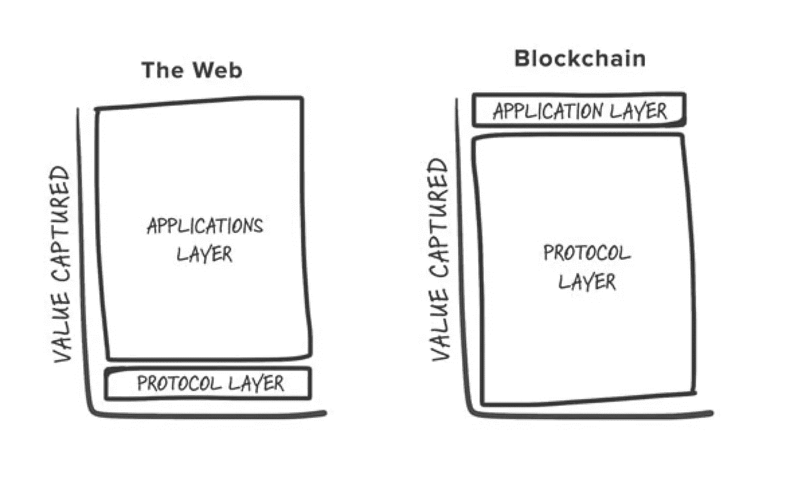
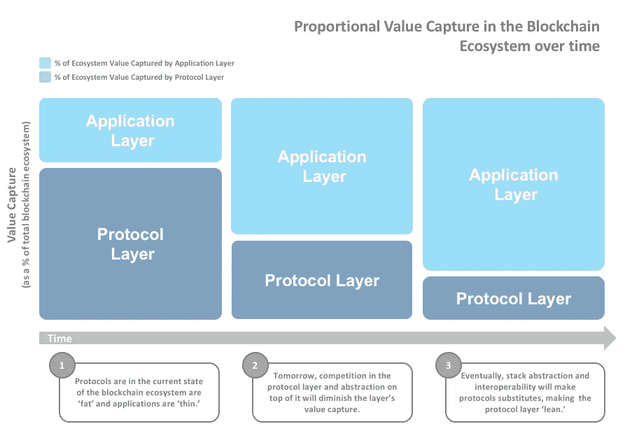

# Fat 协议和价值捕获(第 1 部分，共 2 部分):共享数据层

> 原文：<https://medium.com/coinmonks/fat-protocol-and-value-capture-over-time-part-1-of-2-51c7e7d0ca34?source=collection_archive---------2----------------------->

如果你参与了区块链，那么你可能熟悉 Fat 协议论文，其中 Joel Monegro 假设了区块链时代的价值获取，Web 3.0。他指出，在 Web 2.0(社交互联网时代)，价值积累到“应用层”(即脸书、谷歌、亚马逊等应用程序)。).同时，“协议层”——HTTP、FTP、SMTP 等。—几乎没有价值。

简单地说，在 Web 2.0 中，应用程序很胖，而协议很瘦。Monegro 认为 Web 3.0 中的价值捕获将会完全相反:应用程序将会很瘦，而协议将会很胖。更具体地说，“该协议的市场价值将总是比基于该协议的应用的总价值增长更快”(Monegro 2016)。要进一步了解 fat 协议和价值创造，请查看我们的演示和现场录音:[了解加密中的价值创造和捕获](http://www.decipher.capital/understanding-value-creation-and-capture-in-crypto/)

Source: Monegro’s Fat Protocol post on [USV’s blog](http://www.usv.com/blog/fat-protocols) in April 2016

Monegro 最初在 2016 年提出了这一观点。在当时，这是一个有见地的观察，今天仍然有一些水。我记得第一次读它的时候，我对自己说，“好吧——有道理。”这对我来说很有意义，因为我是从苹果应用程序商店如何获取价值的角度来考虑 Web 3.0 协议的:iOS 应用程序位于苹果平台之上，并向应用程序商店支付费用。类似地，dApps 位于基础层协议之上，并向基础层协议付费。就像随着越来越多的应用程序建立在其平台之上，苹果变得越来越有价值一样，基础层协议也将经历类似的过程，这很有意义。对我来说，协议比应用程序更有价值。

但是，当我开始思考我们今天看到的趋势将如何发展，这个空间将如何演变时，它开始变得越来越没有意义。鉴于今天的协议实际上比它们各自的应用程序更有价值(因为 dApp 空间是新生的)，我可以理解为什么今天的协议还很肥。但我不认为它会持续下去。在未来，协议层将“向外倾斜”，而应用层将“向外倾斜”。如下图所示。

Proportional Value Capture in the Blockchain Ecosystem over time

**协议将会减少，因为(1)共享数据层实际上并没有完全共享，以及(2)堆栈抽象将会削弱协议保持它们所捕获的任何值的能力。**

首先让我们谈谈共享数据层。

**共享数据层**

共享数据层本质上是区块链事务的集合。这是 Monegro 认为协议将会很“肥”的主要原因之一。正如他解释的那样，“共享数据层……极大地降低了准入门槛。”这最终导致“一个充满活力和竞争的应用生态系统，其中大部分价值分配给广泛的股东群体。这就是令牌化协议变得“胖”而其应用变得“瘦”的原因”(Monegro 2016)。

根据 Monegro 的说法，dApps 无法捕获数据，因为共享数据层使所有人都可以访问数据。这一点很重要，因为专有的数据孤岛让脸书、谷歌、亚马逊等公司得以生存。获得并保持竞争优势。因此，没有他们，Monegro 认为 dApps 将无法获得——更不用说——维持任何类型的实质性竞争优势。

这种逻辑的问题在于，它假设 dApps 生成的所有数据都被传递并存储在一个公共的共享数据层中。事情不是这样的。尽管几乎任何类型的数据都可以存储在区块链上，但这并不意味着所有数据都应该存储在那里。

有一些特定类型的数据在区块链上是有意义的，因为这些数据需要保持完整性，以防止一方不公平地欺骗另一方。

一些需要保持完整性的数据示例:

*   账户余额—跟踪账户余额；防止重复支出
*   投票记录—安全投票系统，防止腐败
*   所有权注册—防止所有权欺诈
*   跟踪库存—跟踪出处以防止假冒商品

上述类型的数据需要“防篡改”,并且值得存储在区块链上。因为区块链上的数据是不可变的，所以需要永久保存并且可以从透明和信任中受益的数据往往是区块链的良好用例。

因此，并非所有数据都以相同的方式处理，有些数据在区块链上是有效的，有些数据不需要在区块链上，因为这对于该使用情形来说效率低、成本高且没有价值。

其他类型的数据—社交媒体帖子、待办事项列表、笔记等。—在区块链上存储没有意义。存储这些类型的数据的成本(尤其是当这些数据需要不断修改、不需要信任或者可能需要删除时)远远超过了收益。

也就是说，有一些精选的、高度专业化的区块链是为不同的用例而构建的。例如，建立一个去中心化的 Reddit 在以太坊(汽油费)上效率很低，但 Steemit 让博客和社交分享变得高效，假设你使用 Steemit 区块链。

除了这些例外，每次在区块链上写入数据时，都需要支付采矿费。

让我们仔细看看这些成本。

**在以太坊上存储数据**

由于以太坊是最受欢迎和使用最多的智能合约平台之一，我做了一个实验来确定在区块链上存储 1kb 数据的成本。为此，我编写了一个简单的包含 1kb 数据的智能契约，并在 Mainnet 上运行它。交易可以在这里找到[。](https://etherscan.io/tx/0x1320cc5e2c766bb092ad93cbb57c00048aebf5c93728e5a867c8d57f0f93b647)

1kb 的数据花费了我 1.70 美元。让我们客观地看待这件事。一封普通的电子邮件是 75kb(包括 html 模板、标识、标题等)。).一封普通的电子邮件至少要花费你 75 美元。那是不合理的，完全站不住脚的。我们习惯于发送基本上免费的电子邮件。

这些成本阻碍了 dApps 使用更多的区块链存储。他们只会将它用于他们绝对*有*放在区块链上的数据，尽可能选择不同的数据存储。这些数据存储可以是 AWS、MongoDB 等传统数据库中的任何数据。到其他云数据存储服务。

**数据存储:何时使用哪个**

我们知道 dApps 将与区块链一起使用其他数据存储。现在，问题变成了何时使用哪种类型的数据存储。确定这一点的一种方法是通过数据类型。

考虑非文本数据，如图片、音频、视频等。这些类型的文件将存储在专用的文件存储系统中，如亚马逊 S3 或 IPFS(Inter Planetary File System)——前者是集中式的，后者是分散式的。从技术上讲，非文本数据可以转换为 BLOB(二进制大对象)数据(二进制数据)并存储在区块链上，但这将非常昂贵。微软的 [To BLOB or NOT To Blob](https://www.microsoft.com/en-us/research/publication/to-blob-or-not-to-blob-large-object-storage-in-a-database-or-a-filesystem/?from=http%3A%2F%2Fresearch.microsoft.com%2Fapps%2Fpubs%2Fdefault.aspx%3Fid%3D64525) 探索了何时在数据库和文件系统中以 BLOB 形式存储数据之间的成本和便利性权衡。

简而言之，小于 256kbs 的 BLOB 数据在数据库服务器上没有问题，而文件存储系统最适合 1MB 以上的数据。也就是说，256kb 本身对区块链来说是不合理的。很可能任何接近这个大小的东西最终都会被存储在文件存储系统中。

随着 dApps 利用非区块链数据存储，区块链生态系统将发生转变，如下所示。

Blockchain Shared Data Layer Becomes Fragmented

虽然区块链的可扩展性仍然是一个问题，并且随着其他平台的出现，大多数 dApps 将继续使用类似混合的方法，直到将数据放在区块链上变得经济实惠。

**总结**

共享数据层通常被误解。区块链上的数据将比 Monegro 描述的“通用共享数据层”更加分散。这是因为 dApps 可以控制用户体验，因此可以决定哪些数据存储在区块链上，哪些存储在其他地方。

在这篇文章的第二部分中，我将深入探讨协议层之上的堆栈抽象如何影响区块链生态系统，使协议随着时间的推移越来越精简。

*感谢我的同事* [*乔尔·卡马乔*](/@joel_4033) *和哈什塔·基拉里对这篇文章的反馈。*

**免责声明。**本文仅供参考。本帖表达的观点不是，也不应被理解为投资建议。本文件不是购买或出售此处提及的任何资产的要约，也不是要约邀请。这篇文章中的所有观点都是我个人的，不以任何方式代表[deciper Capital Partners](http://www.decipher.capital/blog)或关联公司的观点。

> [直接在您的收件箱中获得最佳软件交易](https://coincodecap.com/?utm_source=coinmonks)

