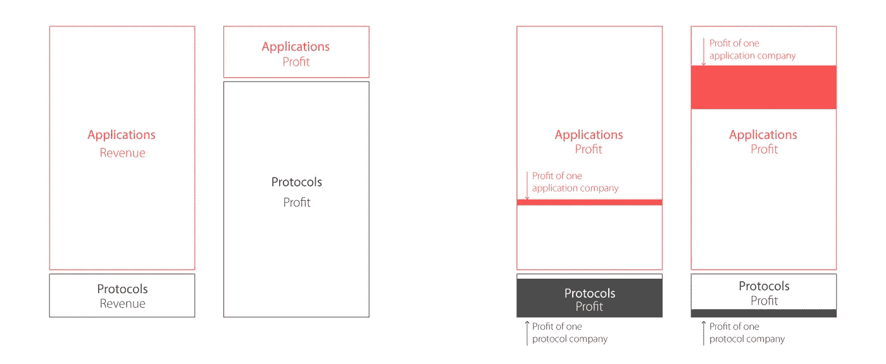

# 脂肪协议或脂肪应用讨论 2.0

> 原文：<https://medium.com/coinmonks/fat-protocol-or-fat-app-discussion-2-0-65517e8ee166?source=collection_archive---------3----------------------->

**总结**

TL；博士；医生

最好将区块链协议与优步/苹果商店等 ISP 或平台业务进行比较，而不是与“HTTP”、“FTP”或“SMTP”进行比较，区块链协议可以被视为集体所有和运营的“业务”，没有大股东；

无论是在网络时代还是在区块链时代，投资“协议”或“应用”都没有正确的答案:一个“协议”可以像淘宝一样获得巨大的价值，也可以像优步或 Zillow 一样亏损；

只有当区块链协议通过技术或网络效应建立了很高的市场壁垒，并且收费低于所创造的价值时，该协议才能获得比应用程序更多的价值。然而，任何开源协议都不太可能保持如此高的壁垒，预计将出现低利润的寡头垄断，就像电信行业所发生的那样；

由于区块链协议不属于任何实体，因此许多平台使用的免费增值模式并不适用，因为没有人拥有“流量”并可以设计产品来将“流量”货币化。因此，即使协议占主导地位，协议的潜在价值也是有限的。

对于没有听说过“fat 协议”的人，请参考[来自联合广场风险投资](https://www.usv.com/blog/fat-protocols)的原文和[来自光速风险投资合伙人](/lightspeed-venture-partners/fat-protocols-vs-fat-dapps-vs-fat-wallets-4d33ead29130)的这篇文章。

**深潜**

**1。** **什么是堪比区块链的协议？**

许多人将区块链协议与“HTTP”、“FTP”或“SMTP”相提并论。从技术上来说，进行比较是正确的，因为所有这些都是协议，是一组确定数据如何传输的规则和规定。

然而，从投资的角度来看，区块链协议和 web 协议之间的比较并不能告诉我们太多。相反，作为区块链的基础设施，**区块链协议应该与互联网基础设施运营商和平台业务相比较**。

作为投资者，我们可以将区块链协议视为由分布在世界各地的许多人拥有和经营的“公司”，没有大股东。采矿费是用户为区块链基础设施向协议运营商支付的钱，就像用户为互联网接入和电子商务基础设施支付的钱一样。

让我们将区块链协议与互联网服务提供商(ISP)和平台企业进行如下比较:

**2。** **为什么 ISP 和平台业务可以和区块链协议相提并论？**

首先，就产品而言，所有的企业都服务于庞大的受众。这些公司可能不会为所有人服务，但它们通常没有非常明确的目标客户群。

**其次，就技术而言，这三个类别中的所有业务都在提供一个基础层，第三方可以在这个基础层上提供差异化的服务/产品。**值得注意的是，所有这些企业都牺牲了可定制性来换取大量受众，同时将差异化留给了第三方。

**第三，业务方面，所有的业务都在支持其他新的第三方业务，并与第三方紧密结合。**这些商家和第三方商家只有两种结果:双赢或者双输。

**3。** **到底什么要紧？**

在 fat 协议论文中，有一个著名的图表，展示了协议层捕获的值和应用层捕获的值。然而，作者没有明确说明“价值”是如何定义的——收入还是利润？另一个问题是:对于投资者来说，总价值重要还是平均值重要？

Fat protocol diagram ([Source](https://www.usv.com/blog/fat-protocols))

在我看来，利润显然比收入更重要。营收不一定反映一家公司创造的价值:亚马逊 2018 年营收 2209.6 亿美元，净利润率 4.03%(89.0 亿美元)，谷歌营收 1298.7 亿美元，净利润率 14.45%(187.7 亿美元)。市场告诉我们，相比亚马逊 58.77%的营收，谷歌为用户创造的价值是亚马逊的两倍以上。**因此，从盈利角度来看，投资者应该考虑谷歌(利润捕获者)而不是亚马逊(收入捕获者)。**

**另一方面，所有公司获取的总价值并不能代表全部情况，而单个公司获取的平均价值才是最重要的。**例如，中国垄断的电子商务市场淘宝/天猫在 2018 财年创造了 7680 亿美元的(平台上商家的销售额)，本身收入为 281.48 亿美元。然而，7680 亿美元的销售额是由大约[1000 万商家](https://www.douban.com/note/609885979/)产生的。因此，淘宝上一个商家的平均年收入约为 76，800 美元，与淘宝的收入相比几乎为零。在利润方面，淘宝/天猫也有大约 53%的利润率，而可以肯定的是，商家通常只有个位数的利润率。**因此，投资者应该投资淘宝网(“协议”)，而不是淘宝网上的商家(“应用”)。**

另一方面:根据 IBIS World 的数据，全球互联网服务提供商在 2018 年创造了约[5636.74 亿美元的收入](https://clients1.ibisworld.com/reports/gl/industry/competitivelandscape.aspx?entid=1716#MSC)，其中最大的五家公司估计占行业收入的不到 40.0%。行业利润率估计为 13.4%。根据美国中央情报局的数据，全球大约有 12，034 家互联网服务提供商。因此，平均而言，一个中小型 ISP 的年收入约为 2811 万美元，利润为 376 万美元。**因此，投资者应投资于网飞(“申请”)，而不是中小型 ISP(“协议”)。**

所以，如果从单个公司的盈利能力来思考，即使在目前的 web 阶段，到底应该投资“协议”公司(包括 ISP、平台)还是“应用”公司，也没有正确的答案。

**4。** **对比还能告诉我们什么？**

*(*[*Source 1*](https://ycharts.com/companies/VZ/profit_margin)*,* [*2*](https://www.alibabagroup.com/en/news/press_pdf/p180504.pdf)*,* [*3*](https://www.cnbc.com/2019/01/29/apple-discloses-services-margin-for-the-first-time.html)*,* [*4*](http://nymag.com/intelligencer/2018/12/will-uber-survive-the-next-decade.html)*,* [*5*](https://www.bloomberg.com/news/articles/2018-09-07/beleaguered-didi-is-said-to-lose-585-million-in-just-six-months)*,* [*6*](https://www.businessinsider.com/airbnb-profit-revenue-2018-2)*,* [*7*](https://www.macrotrends.net/stocks/charts/FB/facebook/profit-margins)*,* [*8*](https://www.macrotrends.net/stocks/charts/Z/zillow/profit-margins)*)*

通过上表，我们可以看到，在很多情况下，平台业务(小企业的“协议”)在交易量大、利润相对较高的情况下非常有吸引力。然而，这并不总是正确的，因为结果取决于平台是否能够建立高市场壁垒。这个逻辑适用于网络“协议”，我相信它也适用于区块链协议。

**5。区块链协议在什么情况下会变得有吸引力？**

基于以上讨论，有理由相信，要使区块链协议比应用程序更具吸引力，需要满足以下要求: **(1)高市场壁垒；(2)创造的高价值。**

对于市场壁垒，应该很容易理解:如果“业务”(记住一个协议可以看作是集体所有和经营的业务)利润很高——人们愿意为此付费，应该会有很多“公司”想从“市场”中分一杯羹。如果出现这种情况，保证金将会减少，许多玩家将会离开市场，而有限数量的玩家的保证金将会保持在低水平。如果一个协议想要建立障碍，它可以利用网络效应(先发优势)或前卫技术。

对于第二个先决条件——创造的高价值，它决定了人们的支付意愿(WTP)。区块链作为一种新型的数据库或基础设施，正在与现有的 web 竞争。人们愿意为“去中心化”付出多少？人们愿意为“隐私”付出多少？如果减少信息泄露的成本高于潜在的危害，谁会为此买单？问问中国人民，他们会告诉你，只要政府保持高 GDP 增长，“自由”就不是无价的。

让我们假设已经发明了一个可行的区块链协议(今天的大多数协议仍然有许多严重的问题限制了它们的采用)，我们使用决策树来评估在什么情况下区块链协议是一个有吸引力的投资机会。

通过决策树，我们可以验证我们的结论。只有在两种情况下，协议才会比基于协议的“应用”更有价值，就像淘宝、脸书和苹果商店发生的那样:

*   **场景 1** :协议因其技术或网络效应难以复制，协议收费低于其创造的价值/消费者感知，应用开发者必须拥有链条上的所有活动(否则应用开发者仍可使用传统基础设施)**。**
*   **场景二**:协议很容易复制，应用开发者同意使用协议并向消费者收取挖矿费，没有人创造一个收费更低的类似协议来竞争，这种情况发生的可能性很小。

因此，显而易见的是，如果一个协议在技术上具有很强的防御性——难以复制——并且为用户创造了很高的价值，那么我们可以期待它成为区块链的淘宝或脸书。如果它不是防御性的，我们也不是纯粹基于不合理的投机进行投资，那么我们可能会预计它会成为另一个 Zillow 或滴滴出行，我们应该等待更好的交易。一个合理的推测例子可以是:由于该公司在自动驾驶时代的潜在不同商业模式，优步即使有负利润率也是有吸引力的。

从比较中我们可以了解到的另一件事是:许多平台免费提供基础设施，但通过其他产品将流量货币化，而这种模式不适用于区块链协议。例如，微信不对用户收费，而腾讯从其游戏中赚了很多钱，大多数用户来自微信平台。**然而，由于区块链协议是由世界上数百万个人集体拥有和运营的，区块链协议的货币化是有限的**:没有人可以独占巨大的流量并设计一个产品来货币化流量，而收取基于使用的费用似乎是唯一的货币化方法。

另一方面，鉴于区块链协议的开源性质，**最终极有可能出现寡头垄断或垄断，且“利润”相对较低。**这是一个类似于优步/Zillow/滴滴出行或互联网服务提供商或电信行业的场景:提供商品几乎没有秘密，人们通过转移到“基础层”——互联网或电话或电视——并提供差异化的服务/产品来获取更多价值。

**总结:**首先，协议不一定比应用有更光明的未来；第二，一个协议只有在能够建立高市场壁垒并向用户提供高价值时才能“成功”；第三，协议预期具有低利润——“开采费”——并且由于其去中心化的性质，不能通过其他方式将用户/流量货币化。

这个研究项目是由耶鲁大学管理学院的范文和我们中心的乔希·利格特合作完成的。

*免责声明:本文不是也不应被视为“投资建议”或关于行动方案的“建议”，包括但不限于任何适用法律或法规中使用的术语。*