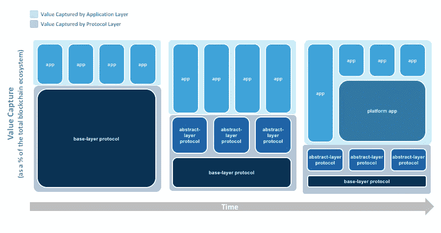

# Fat 协议和价值捕获(第 2 部分，共 2 部分):堆栈抽象

> 原文：<https://medium.com/coinmonks/fat-protocols-and-value-capture-over-time-part-2-of-2-stack-abstraction-2b7e2cd7e826?source=collection_archive---------1----------------------->

这篇文章的第一部分深入探讨了共享数据层为何不像 Monegro 在“Fat 协议”中描述的那样开放。在这部分(第二部分)中，我将探索随着时间的推移，协议层抽象如何将价值从 it 转移到应用层。

要理解这将如何发生，我们必须首先理解以太坊和其他新兴协议只不过是技术平台。它们只是帮助开发人员利用他们所基于的语言的抽象概念。为了让这些平台获得成功，我们需要知道如何在平台和底层编程语言上构建东西的开发人员。简而言之，为了以太坊的成功，我们需要开发人员采用它并在它的基础上构建。

技术平台的采用是我们已经见过无数次的事情。从 iOS 和 Android 到 Twilio 和 AWS，我们已经看到了它。每一次，成功的共同因素是开发人员。[下面是史蒂夫·鲍尔默对此的看法。](https://www.youtube.com/watch?v=BSJS6mgqV64)

也就是说，开发者不会凭空出现。它们的出现是因为该平台共同努力培育开发者社区。*这个*就是导致采用和实际使用的东西。

我曾经是一名 Javascript 开发人员，直到最近我才开始质疑*为什么* Javascript 会成为 web 开发的首选语言。回顾 Javascript 在“网络时代”的起源，并将其与我们现在的情况进行比较，有助于我理解区块链周围的生态系统可能会如何演变。

## **编程语言的演变**

Javascript 之所以成功，是因为它轻巧、易用，并且集成在 Netscape(当时最流行的网络浏览器)中。这使得消费者很容易访问网站，开发者也很容易接触到消费者。随着越来越多的 web 应用程序的建立，工具/库变得越来越复杂。这吸引了创业公司开发更多的网络应用，雇佣更多的网络开发人员。这成为了一个良性的采用循环，其结果是在 Javascript 之上产生了额外的抽象。

随着这种良性循环的不断发展，开发人员发布了诸如 jQuery、Mootools 等开源库。，它在 Javascript 的基础上抽象了许多手动功能，使之变得更加简单易用。

到 2007 年，jQuery 被广泛采用，许多开发人员开始构建 jQuery 插件。这些 jQuery 插件就像“现成的特性”,开发人员可以简单地集成它们，而不必从头构建一个特性。今天，几乎所有你能想到的东西都有 Javascript 插件(日历、电子邮件表单、滑块等等)。).

如果我们看看今天的 web 开发生态系统，它是高度抽象的。消费者不会直接用编程语言来构建。他们用抽象的平台来构建。Wordpress 就是一个很好的例子。Wordpress 为超过 30%的网站提供支持，因为它抽象出了构建和托管网站的复杂性。通过 Wordpress 生态系统中现成可用的所有主题和插件，在 Wordpress 之上还有进一步的抽象。

亚马逊的首席传道者杰夫·巴尔(Jeff Barr)将抽象之上的这种抽象描述为“平台的平台”的创造。在巴尔的文章中，他写道

> “亚马逊网络服务(AWS)不仅是一个构建解决方案的丰富平台，也是一个构建专业平台的平台。客户可以选择直接使用 AWS 云，或者利用这些增值平台”(Barr 2009)。

Heroku 和 Engine Yard 就是两个这样的“增值平台”的例子，它们抽象出了复杂性，在它们的例子中，开发者可以非常容易地管理 AWS 上的 Ruby on Rails 部署。

这种不断增长的生态系统如何通过抽象来扩展的模式已经被一次又一次地展示出来。事实表明，随着生态系统的发展，将会有进一步的抽象，从而为之前的某些功能提供便利。

## 区块链协议的演变

区块链协议也将出现同样的模式——堆栈上将会有抽象，这将有助于为某些垂直行业或利基市场开发底层区块链。这已经在 0x、Augur 等产品中开始发生了。0x 是“DEX 的以太坊”，而 Augur 是“预测市场的以太坊”现在，如果有人想建立一个分散的交换，他或她可以使用 0x，而不是从头开始建立。

随着这些抽象变得越来越复杂，随着应用程序变得越来越胖，协议也会变得越来越薄。这种演变看起来会像下面这样。

Value Capture: Stack Abstraction

这些抽象中的一些甚至可以抽象掉如此多的复杂性(想想“以太坊的 Wordpress”)，以至于用户会蜂拥到抽象中，而不是必须处理基础层协议的复杂性。Wordpress 比学习 web 开发容易使用很多，所以人们显然会使用 Wordpress。随着区块链协议变得越来越抽象，随着时间的推移，协议将开始减少，而 dApps 将有机会获取更多价值。

除了垂直抽象，还有水平抽象。这将以互操作性的形式出现。可互操作的区块链——像 Polkadot 和 Cosmos——将使跨链交易——来自不同协议的两个不同区块链之间的交易——成为可能。想象一下，不仅仅局限于一个区块链协议。这将会改变游戏规则。可互操作的区块链是游戏规则的改变者，因为它们基本上可以使基础层协议商品化。

正如我们不关心脸书或任何其他应用程序的后端一样，dApp 用户也不会关心他们最喜欢的应用程序是基于什么协议构建的。无论脸书使用 PHP 还是 Ruby on Rails，脸书用户都将继续使用它。消费者只关心无缝的用户体验。这可能意味着拥有最佳用户体验和最低交易费用(甚至免费交易)的 dApp 将赢得用户的心。

## **结论**

许多投资者相信肥胖协议的说法。然而，将复杂的 Web 2.0 的结束与新生的 Web 3.0 的开始相提并论是不公平的。区块链生态系统将通过垂直和水平抽象来发展，最终使其更容易开发和使用。

我们还处于区块链时代的早期，围绕协议的基础设施仍然需要开发。也就是说，我们不应该排除 dapp——在更成熟的 Web 3.0 版本中，他们将有巨大的机会创造和获取价值。

**免责声明。**本文仅供参考。本帖表达的观点不是，也不应被理解为投资建议。本文件不是购买或出售此处提及的任何资产的要约，也不是要约邀请。这篇文章中的所有观点都是我个人的，不以任何方式代表[解密资本合伙人](http://www.decipher.capital/blog)或关联公司的观点。

> [直接在您的收件箱中获得最佳软件交易](https://coincodecap.com/?utm_source=coinmonks)

