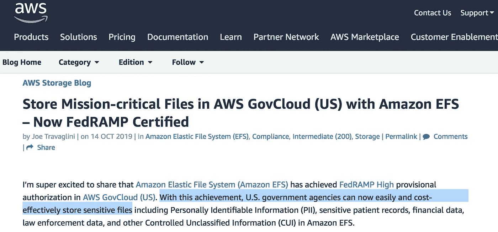
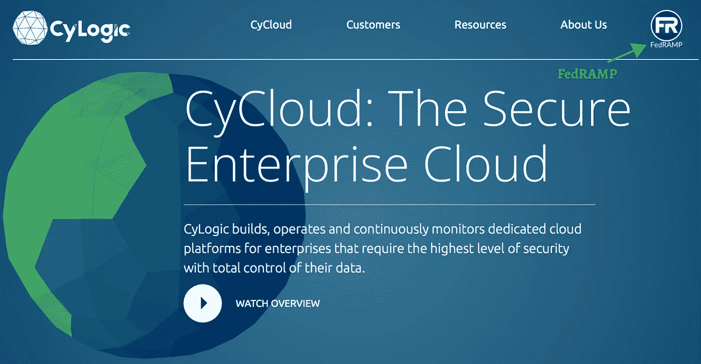
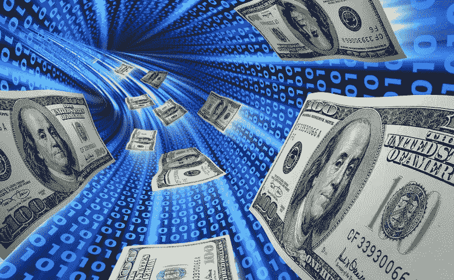

# 联邦调查局出售比特币，巴里·希尔伯特，奥巴马助手允许比特币期货交易所交易基金

> 原文：<https://medium.com/coinmonks/fbi-sells-bitcoin-barry-silbert-and-obama-stooge-permits-bitcoin-futures-etfs-a28ac54ea069?source=collection_archive---------5----------------------->

## *作者:Sebs Solomon—2021 年 10 月 22 日*

T 美国证券交易委员会(SEC)刚刚决定[允许](https://www.nytimes.com/2021/10/18/business/dealbook/bitcoin-etf-proshares.html)首只美国比特币期货[交易所交易基金](https://www.sec.gov/ix?doc=/Archives/edgar/data/1174610/000168386321006052/f10028d1.htm)或 ETF 开始通过纽交所进行交易。那是什么意思？这意味着允许押注比特币价格波动——通过华尔街基于期货的交易所交易基金。ETF 是一篮子可以通过经纪人或股票市场买卖的证券。ETF 结构[使](https://www.fidelity.com/learning-center/investment-products/etf/what-are-etfs)“投资者**做空市场**，获得杠杆，并避免短期资本利得税。”比特币期货交易所交易基金允许投资者交易比特币，而无需通过加密交易所和市场。它允许他们通过传统渠道进行交易，并避免加密货币托管等问题——请再告诉我一次这是如何“对抗经济学？”这使得投资者可以购买 ETF，而无需经历复杂的比特币交易过程。此外，如果投资者预测价格将会下跌，比特币交易所交易基金允许投资者卖空交易所交易基金的股票——这在常规加密市场是做不到的。这基本上是合法化的犯罪，或者只是简单的“照常营业”

**This is legalized crime!** [**Source: Investopedia — ”Bitcoin ETFs Explained”**](https://www.investopedia.com/investing/bitcoin-etfs-explained/)

我建议任何试图理解市场操纵和做空的人去看电影 [*《大空头》*](https://www.imdb.com/title/tt1596363/) *，*，这部电影很好地解释了导致 2008 年房地产市场崩盘的原因——这是过量的高风险次级贷款(永远不会偿还)被捆绑(垃圾债券)并在[衍生品](https://fcic-static.law.stanford.edu/cdn_media/fcic-reports/fcic_final_report_chapter3.pdf)市场交易的结果。基本上，看到房地产市场将要崩溃的人最终会做空抵押贷款支持证券，从而大发横财。这可能让一些对冲基金变得富有，但是，正如许多人所知，它对大多数人产生了毁灭性的影响，这些人要么失去了他们的房子，要么失去了投资于这个市场的养老金。

> 现在，比特币将正式在纽约证券交易所进行投机，在期货市场通过 ETF(允许投资者做空市场)——房地产市场崩盘时发生的事情，也可能很容易在比特币身上发生。

## Gary Gensler，灰度和 SEC+FedRAMP

灰度投资公司(gray Investments)首席执行官迈克尔·索南施林(Michael Sonnenshein)对加里·詹斯勒(Gary Gensler)和美国证券交易委员会(SEC)批准基于比特币期货而非加密货币本身的交易所交易基金(ETF)提出质疑。当 SEC 批准 ProShares 的名为 BITO 的比特币 ETF 时，ProShares (最早提交申请)获得了巨大的优势——该 ETF[不](https://fortune.com/2021/10/19/bitcoin-futures-etf-bito-starts-trading-nyse-crypto/)“投资比特币本身，而是投资期货合约，这是一种加密货币的金融衍生品。”与 Gensler 不同，前 SEC 主席 Jay Clayton 反对比特币交易所交易基金，因为他认为它们可能容易受到市场操纵的影响(这并不意味着我以任何方式支持 Clayton，它们都是幽灵)。2017 年，美国证券交易委员会甚至拒绝了文克莱沃斯比特币信托基金提交的比特币交易所交易基金提案。

当我进一步调查 **ProShares** 时，我发现其中一位联合创始人是 [**路易·梅伯格**](https://www.mayberg.org/the-maybergs) ，他也恰好是 [**CyLogic Inc**](https://www.cylogic.com) 的首席执行官——这是一个为企业提供高级网络安全并严格符合 **FedRAMP** 高授权要求的云平台。联邦风险和授权管理计划，或 [**FedRAMP**](https://www.fedramp.gov) ，为联邦政府保护云服务(设定标准)。获得 FedRAMP 高级授权[被](https://blog.hootsuite.com/what-is-fedramp/)描述为世界上最严格的“软件即服务”认证之一——fed ramp 由**国土安全部**、**国防部**和总务管理局[控制](https://www.fedramp.gov/assets/resources/documents/FedRAMP_Security_Assessment_Framework.pdf)。具体来说，[亚马逊](https://aws.amazon.com/blogs/storage/store-mission-critical-files-in-aws-govcloud-us-with-amazon-efs-now-fedramp-certified/?sc_channel=sm&sc_campaign=Public_Sector&sc_publisher=TWITTER&sc_country=Public+Sector&sc_geo=NAMER&sc_outcome=awareness&trk=GovCloud_TWITTER&sc_content=GovCloud&sc_category=Amazon+Elastic+File+System+(Amazon+EFS)&linkId=75420009)也于 2019 年获得 FedRAMP 认证。

[**Source: Store Mission-critical Files in AWS GovCloud (US) with Amazon EFS — Now FedRAMP Certified**](https://aws.amazon.com/blogs/storage/store-mission-critical-files-in-aws-govcloud-us-with-amazon-efs-now-fedramp-certified/?sc_channel=sm&sc_campaign=Public_Sector&sc_publisher=TWITTER&sc_country=Public+Sector&sc_geo=NAMER&sc_outcome=awareness&trk=GovCloud_TWITTER&sc_content=GovCloud&sc_category=Amazon+Elastic+File+System+(Amazon+EFS)&linkId=75420009)

## 我想我想说的是，ProShares 从 SEC 获得这一优势并不奇怪，因为它的联合创始人之一是 CyLogic 的首席执行官，cy logic 是一家 FedRAMP 认证的公司，在各种行业提供云基础设施和网络安全:银行、保险、医疗保健、律师事务所、能源、航空航天、国防、制造业以及联邦、州和地方政府。

[**CyLogic Inc**](https://www.cylogic.com) — CEO is Louis Mayberg who is co-founder of ProShares, which is just got approval from the SEC to trade Bitcoin futures ETFs in the New York Stock Exchange.

Gray scale Investments——是 [**数字货币集团**](https://dcg.co) (DCG)的子公司，由 **Barry Silbert** 创立。2020 年，Silbert 在 Cointelgraph 的区块链领域最具影响力的 100 人名单中被评为 [#18](https://cointelegraph.com/top-people-in-crypto-and-blockchain-2020/barry-silbert) 。有趣的是，2021 年，Silbert 在 Cointelgraph 的榜单中被评为 [#5](https://cointelegraph.com/top-people-in-crypto-and-blockchain/barry-silbert) 。那是相当大的跳跃。此外，美国证券交易委员会的加里·詹斯勒被评为 2021 年区块链最具影响力人物的第 19 位。旁注；由于期货被视为证券而非商品，因此它们可以受到“1940 年投资公司法”的监管，该法赋予商品和期货交易委员会(CFTC)对其经营的市场额外的控制权和监督权此外，Gensler 曾担任奥巴马时期 CFTC 的主席——2021 年 3 月，CFTC 和证券交易委员会发布了一份联合文件[执法优先事项](https://www.cahill.com/publications/firm-memoranda/2021-03-15-sec-and-cftc-enforcement-priorities-under-the-new-administration/_res/id=Attachments/index=0/SEC%20and%20CFTC%20Enforcement%20Priorities%20under%20the%20New%20Administration.pdf)，他们声称将比前任政府更加注重执法。

> 基本上，加里·詹斯勒只是另一个奥巴马时代的傀儡，他从新自由主义的坟墓中复活，以便为令人憎恶的拜登政府服务。太棒了。

# 巴里·希尔伯特是谁？

巴里·希尔伯特在 2013 年出售没收的比特币时，从联邦调查局**购买了他的大部分比特币——这是与罗斯·乌布里希特丝绸之路有关的[民事没收](https://www.cnbc.com/2015/03/05/feds-auction-135m-worth-of-silk-road-bitcoins.html)的一部分。令人惊讶的是，在 2013 年拍卖当天，一个比特币的价格约为 270 美元——今天(2021 年 10 月)，一个比特币的价值超过 6 万美元。当时，在 2013 年，Silbert 赢得了 48，000 个比特币的[竞标](https://www.cnbc.com/2015/03/05/feds-auction-135m-worth-of-silk-road-bitcoins.html)，这相当于今天的 30 亿美元。据主流新闻报道，这个故事被泄露给公众是因为美国法警发出了一封关于拍卖的电子邮件，其中一个收件人向一个来自加密新闻出版物 CoinDesk 的人展示了这封邮件 CoinDesk 已经被 Silbert 的数字货币集团收购。希尔伯特曾经告诉美国消费者新闻与商业频道他相信:**

> *****绝大多数代币将在未来几年归零，但尽管技术进步缓慢，比特币作为“数字黄金”仍将保持强势。*****

**虽然 Silbert 只是一个人，但他的话很有分量，因为他是加密领域最大的参与者之一。希尔伯特在外交&国防政策上也为 PACs 做出了[贡献](https://www.opensecrets.org/political-action-committees-pacs/industry-detail/Q04/2020)——比如 [**自由西拉 PAC**](http://freesyriapac.org)[**新古巴 PAC**](https://www.newcubapac.com)**亲非 PAC** 。— * *感谢你* [***杰克西斯***](https://www.youtube.com/watch?v=YZ8yku53wyo&t=1s) *找到这些**——所有这些政治行动委员会都与“亲民主”或乔治索罗斯(George Soros)类型的组织有关联，这些组织向北约针对的国家输送资金，以实现政权更迭或其他大的商业利益。这些国家可能有真正的反对派团体，但这类地下组织(资助反对派团体)的目的是为了促进全球资本利益——别无其他。**

# **最后**

**我们中的许多人已经意识到了法定货币中猖獗的腐败，以及这种腐败得到了公然军国主义鲜血的支持这一事实，正是这种军国主义让美元得以存活；因此，我在这里并不主张货币结构保持现状。然而，这并不意味着我会盲目支持比特币、以太坊或任何其他加密货币，因为它“不是石油美元”。我不会对任何选择进入这个领域赚钱的人评头论足，我明白，去吧，得到你的，兄弟。然而，让我感到困扰的是那些试图倡导比特币等加密货币的人，好像这是某种将解放大众的革命性工具，因为这根本不是真的。这种货币完全被银行业寡头所控制，而平民无法控制统治者如何选择用它进行投机。**

## **所以，请(我在跟你说话——另类媒体领域的比特币骗子)不要仅仅因为你很久以前就投资了比特币，并且它为你“工作”了，就向你的观众提供半真半假的信息。**

**我确信你们中的许多人是善意的，也许你们中的一些人甚至不知道这里的黑暗势力，但是我请求你们在把羊带到屠宰场之前做好调查。我一直很安静，对你们大多数人都很友好，不要让我变得刻薄。开玩笑的。不过说真的，你真的认为真正的问题是货币，还是货币通过哪种媒介被使用？首先，数字化所有交易(无论是加密货币还是 CBDCs)将创造一个我们许多人现在都无法想象的监控设备，因为我向你保证，这将是反乌托邦乘以无穷大。**

**想象一下，所有当前最强大和最腐败的白痴都拥有乔治·w·布什或迪克·切尼的道德观，有能力通过地理围栏(通过与这些加密货币或 CBDCs 相关的数字钱包)实时控制你的行动。没给你交税？他们会在未经你允许的情况下从你的电子钱包里把它拿走。没有注射第十针加强剂吗？不幸的是，你将无法购买食品杂货，因为在你有数字合规证明之前，对你的数字钱包的访问是暂停的。在社交媒体上发布他们不喜欢的东西？他们会冻结你的电子钱包，阻止你使用自己的钱，直到你把它拿下来。下次你发表关于奥巴马或南希·佩洛西的尖刻评论时，想想这一点。显然，我是在夸张地说明一个观点，但这些例子并不像你想象的那样牵强。**

**和平与祝福**

****

**[**Source**](https://www.centralbanking.com/central-banks/currency/digital-currencies/3494991/bank-of-canada-paper-offers-advice-on-digital-currency-policy)**

> **加入 Coinmonks [电报频道](https://t.me/coincodecap)和 [Youtube 频道](https://www.youtube.com/c/coinmonks/videos)了解加密交易和投资**

## **另外，阅读**

*   **[电网交易机器人](https://blog.coincodecap.com/grid-trading) | [Cryptohopper 审查](/coinmonks/cryptohopper-review-a388ff5bae88) | [Bexplus 审查](https://blog.coincodecap.com/bexplus-review)**
*   **[如何购买 Monero](https://blog.coincodecap.com/buy-monero) | [IDEX 评论](https://blog.coincodecap.com/idex-review) | [BitKan 交易机器人](https://blog.coincodecap.com/bitkan-trading-bot)**