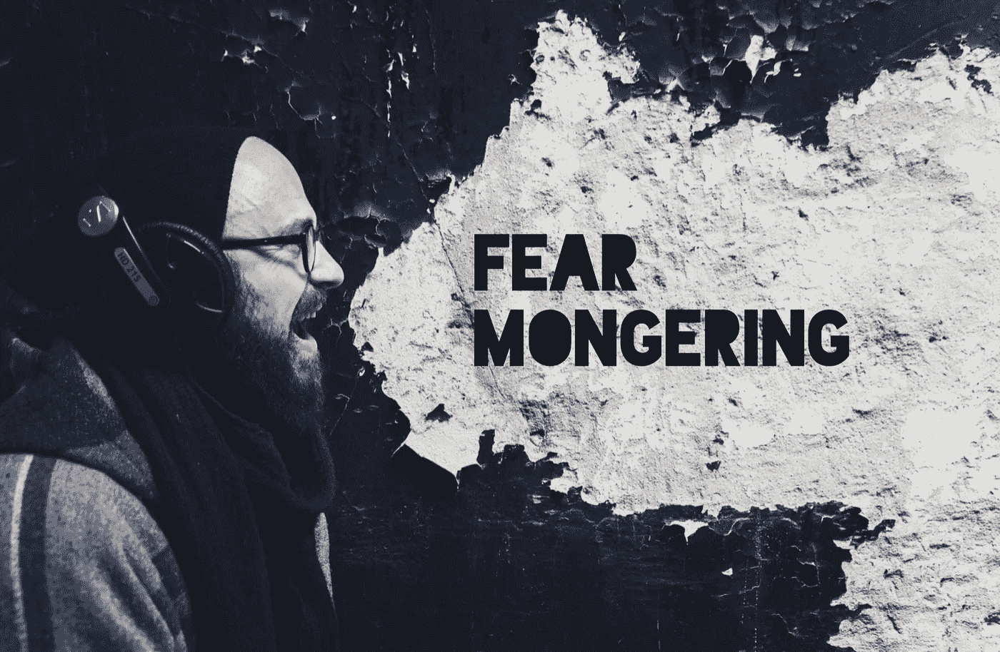
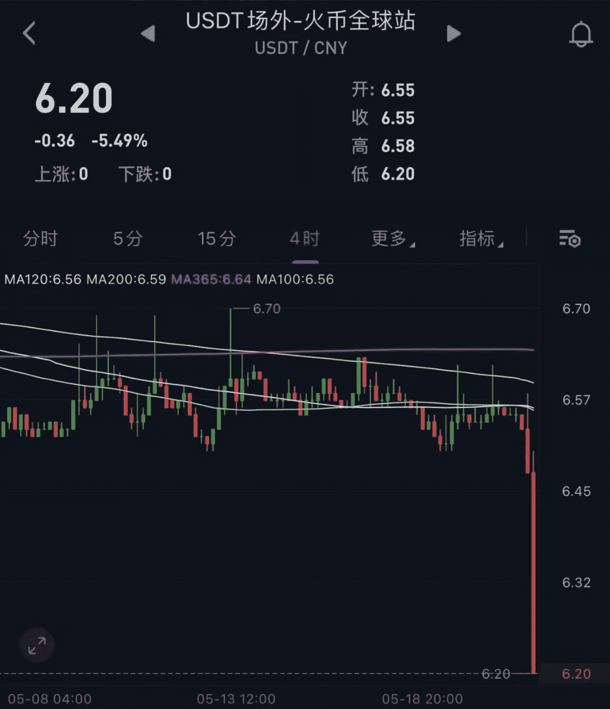
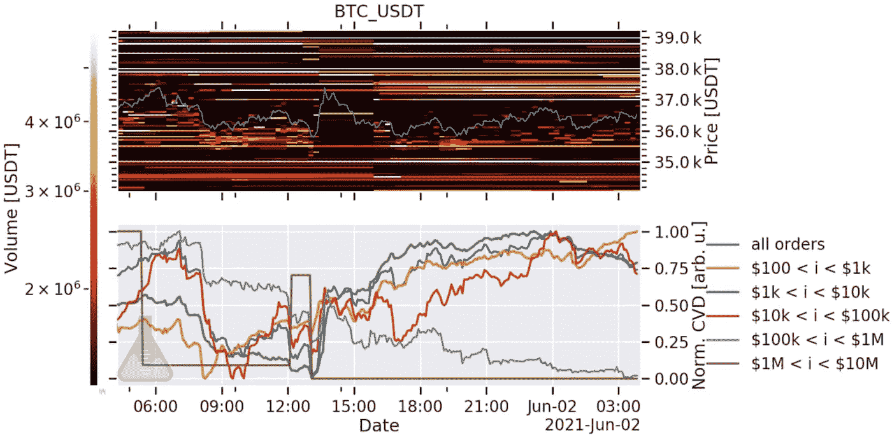

# 散布恐惧

> 原文：<https://medium.com/coinmonks/fear-mongering-d81098f13357?source=collection_archive---------5----------------------->

警告信号越来越明显。

我试图把它们赶走。假装他们不存在。甚至把它记为散布恐惧的人。

毕竟，恐惧是卖点。在如此大的抛售之后，那些宣扬恐惧的人的圣歌肯定会获得更大的关注。

任何一个不确定地坚持自己未经战斗考验的一线希望的人都可能会订阅《蒙日者》。

因为这些从未参与此类活动的投资者眼睁睁地看着自己的加密资产净值被砍成了两半。他们现在是那些贪婪地散播恐惧消息，等待下一只鞋子掉下来的人。

这也是为什么我已经一个多星期没有关注今天的话题了。

我不想被卷入人群中。

毕竟，我们在 *Espresso* 的优势在于市场结构。资本流向哪里，市场推动者在做什么，动力是什么。

但在本周末做了一些研究并深入一些链上流动后，我们发现自己在问自己一个独特的问题:为什么市场上 80%的 USDt 存在。

这个数字代表的是交易所或智能合约中的*而非*金额。USDt 的金额接近 620 亿美元，这个房间里的大象总计接近 500 亿美元。

这些钱足够让一个小国家的 GDP 超过立陶宛和斯洛文尼亚。

意义重大。

更重要的是，500 亿美元附加了一些最宽松的监管准则。

对于任何研究这个数量的人来说，显然存在着某种依赖于系绳的经济能力。我认为这种经济并不像比特币拯救者所说的比特币很少被用于非法目的那样干净。

现在，虽然他们对比特币的评论可能是真的，但对 USDt 的评论可能不是这样。

周末有了这个想法后，我很快想起了本杰明和我在 2019 年的一次对话。

他正忙着用一个放大的望远镜搜寻区块链……当他出来透透气时，我们开始怀疑中国到底发生了什么。有太多疯狂的流量与价格无关。

我们很快就发现了这一点，因为我们看到了来自 Coindesk 的一篇[文章，文章提到了中俄跨境交易中使用的系绳](https://www.coindesk.com/tether-usdt-russia-china-importers)。它暗示了在投机和价格变动之外的一个真实的加密用例。

不幸的是，参与其中的玩家不是那种能很快登上《财富》杂志封面的人。

当时和今天让我们印象深刻的，也是我现在提出来的原因，是这篇文章中的这一行，

> *要从 Tether 本身以美元购买或出售 USDt，交易商必须通过公司的“了解你的客户”( KYC)流程进行验证。然而，由于令牌运行在公共区块链网络(比特币、以太坊和创)之上，任何人都可以接收或发送它，二级交易不受限制。*

继续进一步…

> *回到中国，商人可以很容易地将美元兑换成菲亚特，尽管中国人民银行在 2017 年 9 月禁止了菲亚特至加密的现货交易。*

这篇文章提到了一种独立于密码交易的经济。

当时，我们两个只是把这看作一个有趣的花絮。资本的流动是显而易见的，促进这一进程的交易所的运动也是显而易见的。

但是就我们所做的事情而言，在我们日常活动的范围之外。我们只是想看看链上流动如何影响价格。我们不是刑事调查员。这是行业巨头 stalwart Chainalysis 执行的一项任务。

所以当时我们继续进行一天中的下一个任务，并把它储存在我们的记忆中。

直到最近…

让这件事再次成为焦点的是《街区密码》杂志关于最近中国镇压的文章中的一段话。文章说，

> 这意味着，在国务院会议评论带来的不确定性下，包括矿商在内的当地交易商正看到越来越多的订单通过场外交易柜台将美元兑换成人民币。

这意味着矿商正在清算他们持有的美元。

事实上，这里有一张风险投资家 Dovey Wan 的图表，显示了最近抛售时市场上的这种折价。

上图反映了 USDt 5.5%的折扣。对于一个稳定的硬币来说这是一个巨大的发型。

现在，我并不认为这一事件在短期内对 crypto 有害。我认为我们需要注意的是 USDt 开始竞争的领域。

即跨境交易、主权发行货币和央行数字货币。

这是一个竞争对手可以决定谁能留下谁能离开的竞技场。

在这种背景下，我们开始用新的视角看待中国的雄心。

众所周知，中国即将发行自己的货币。这不是秘密。而中国当局目前正全力以赴开发这种金属。因此，你可以假设政府不希望像 USDt 这样的竞争对手破坏它的成功。

而且，中国可能不是唯一一个对 USDt 高度关注的管理机构。

美国银行家开始吹响号角，表现得好像泰瑟偷走了他们的午餐。

事实上，没有人比怀俄明州两代情信托银行的创始人兼首席执行官凯特琳·龙(Caitlin Long)更担心蒙哥加密用户的自身利益。

她在最近的一篇文章中写道…

> 自 5 月 5 日以来，从华盛顿到北京的监管机构几乎每天都发布一系列旨在驯服加密货币市场的公告。

这是她用大锤敲警钟的方式。

虽然我不太确定这些声明是否每天都有，但我实际上同意她的观点，但要知道她的最终目标是为她的银行和自己的口袋争取业务。

那是因为抨击泰瑟对她有利。这是一个 620 亿美元的机会。她想要她银行里的那笔资金。

但即使有这样的告诫，我也不认为她太离谱了。

原因之一就是现在是六月。你可能还记得几个月前[我们写的](https://jarvislabs.substack.com/p/cryptos-tectonic-plates)fin cen 的 FATF 指南和 VASPs 旅行规则的评论期将在本月结束。

FinCEN 对 VASPs 的主要批评是，像 Uniswap 这样的 dex 应该执行了解你的客户(KYC)政策。这是你可能用你的菲亚特做的事情，在那里他们验证你的身份。

但是对于 dex，他们还没有执行这些程序。

事实是，VASPs 不仅仅是 DEXs 它几乎适用于 DeFi 中的所有智能合约。如果这些政策建议坚持下去，各国开始采纳，加密技术将在一夜之间突然成为监管问题的温床。

这是因为任何基于 Uniswap、Aave 等的智能合同都需要实施反洗钱/KYC 措施。

这对 DeFi 是个打击。

(如果你想亲自阅读，[的报道在这里](https://www.fatf-gafi.org/media/fatf/documents/recommendations/12-Month-Review-Revised-FATF-Standards-Virtual-Assets-VASPS.pdf)。跳到第 72 项“a”。)

另一个值得注意的潜在结果是，如果 FinCEN 坚持要求反洗钱/KYC 的 VASPs，USDt 可能会再次折价出售。

这是因为，如果这些反洗钱/KYC 措施出现在分散的协议中，在 KYC 采购之外运作的大量 USDt 将有更少的途径通过。

坦率地说，我相信这是行业正在等待解决的问题。所有这些非 KYC 的稳定密码和智能合约的问题…监管者和全球领导人希望在不损害密码领域的情况下摆脱它。这就是它们移动如此缓慢的原因。

但一旦这个问题得到解决，我不会对 ETF 很快获得批准感到惊讶。

FinCEN 的意见征询期将于本月晚些时候结束，这是一个值得关注的重要事件。这也将与美国公布其正在进行的 CBDC 的一些初步研究和想法相吻合，这将是向加密领域发出新一波警告的好时机。

这不是一个完整的停止，现在行动警告系绳。这只是对风险和未来可能影响价格的政策措施的讨论。

更多的是让我们看看接下来几周到几个月会发生什么。

好了，关注市场恐惧的人已经够多了，让我们快速了解一下市场的最新情况，让你在接下来的 24 小时里保持清醒。

# 市场更新

事实证明，从昨天的这条推文到现在没什么变化。

我们有一些看跌资金流入交易所。其中一笔是发往币安的 130 万马克。在享受了如此不可思议的比赛后，看到马蒂奇在这里有点下降，我不会感到惊讶。

此外，为了帮助形象化我们所看到的链，我们的朋友弗雷德提供了下面的图表。

真正的要点是下半部分的紫色和棕色线，它们呈下降趋势。翻译过来…鲸鱼是卖的，不是买的。

此外，在上半部分的图表中，请注意蓝色价格线上方的所有黄线。那些是大订单。他们正在从 37k 到 38k 的区域进行填充。这也是我们昨天遭到微妙拒绝的地方。

看跌鲸鱼订单。看跌链上流量。看跌卖出墙。每当我们有一点下降，我们看到流动性进入一些袋子填充。

目前，当我们在波涛汹涌的水域航行时，似乎我们的帆是松弛的。让我们看看明天会带来什么。

你的脉搏在加密，

本·莉莉