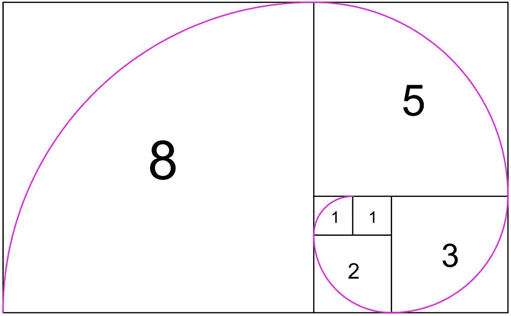

# 坚固性中的斐波那契

> 原文：<https://medium.com/coinmonks/fibonacci-in-solidity-8477d907e22a?source=collection_archive---------0----------------------->



“We’ll ride the spiral to the end and may just go where no one’s been.” — Tool, Lateralus

今天早上浏览[黑客新闻](https://news.ycombinator.com/item?id=18091655)时，我看到一个帖子，基准测试 Github 中最常用的 10 种语言返回斐波纳契数列中的第 *n* 个元素。Solidity 还不是一种非常流行的语言，所以我想我会探索一些解决方案，看看它如何比较。

从数学上讲，斐波那契数列是一个递归函数，它将前面的元素相加以获得下一个元素。像这样:

```
Fn = Fn-1 + Fn-2
```

# 递归

最简单的方法是使用递归，就像这样:

```
//fib(4) = 15540 gas 
//fib(42) = no go
function fib(uint n) public view returns(uint) { 
    if (n <= 1) {
       return n;
    } else {
       return this.fib(n - 1) + this.fib(n - 2);
    }
}
```

不幸的是，递归是不可能的。我确信在紧要关头可以让[工作](https://github.com/web3j/web3j/blob/master/codegen/src/test/resources/solidity/fibonacci/Fibonacci.sol)，但是运行`fib(42)`时 remix 挂起，甚至`fib(4)`也要消耗~15k 的汽油。

# 记忆

对于我的第二种方法，我决定使用一种 *memoisation* 技术，将序列存储在一个内存数组中，按照预期返回第 n 个元素。

```
//fib1(4) = 1593 gas
//fib1(42) = 12237 gas 
//fib1(1042) = no-go...
function fib1(uint n) external pure returns(uint) { 
    uint[] memory sequence = new uint[](n+1);
    for (uint i = 0; i <= n; i++) {
        if (i <= 1) {
            sequence[i] = i;
        } else {
            sequence[i] = sequence[i -1] + sequence[i -2];    
        }
    }
    return sequence[n];
}
```

好一点了，现在`fib1(42)`可以正确返回，但是再次请求`fib1(1042)`会导致混音挂起。这不好，实际上这个问题根本不需要我们把整个序列保存在内存中。

# 循环

需要一种更好的方法，所以我将算法改为只在内存中存储三个变量，并迭代 *n* 次，直到找到序列中的第*n*个元素，如下所示:

```
//fib2(4) =  363 gas
//fib2(42) = 2757 gas 
//fib2(1042) = 65757 gas
function fib2(uint n) external pure returns(uint b) { 
    if (n == 0) {
        return 0;   
    }
    uint a = 1;
    b = 1;
    for (uint i = 2; i < n; i++) {
        uint c = a + b;
        a = b;
        b = c;
    }
    return b;
}
```

那行得通。该功能仍然需要`fib2(1042)`相当多的气体，但[原始挑战](https://github.com/drujensen/fib)的要求要低得多。

通常情况下，我会对结果感到满意，并继续进行一些实际的工作，但我担心没有什么可写的，我已经花了一个上午的时间来研究这个挑战。

# 比奈公式(等价)

我知道比奈的公式在 Solidity 中很难实现，但我想如果我能找到一个 C 语言的实现，我就能翻译它……你知道吗，我在这里找到了一个。

```
//fib2(4) =  796 gas
//fib3(42) = 1399 gas  
//fib3(1042) = 2414 gas
function fib3(uint n) external pure returns(uint a) { 
    if (n == 0) {
        return 0;   
    }
    uint h = n / 2; 
    uint mask = 1;
    // find highest set bit in n
    while(mask <= h) {
        mask <<= 1;
    }
    mask >>= 1;
    a = 1;
    uint b = 1;
    uint c;
    while(mask > 0) {
        c = a * a+b * b;          
        if (n & mask > 0) {
            b = b * (b + 2 * a);  
            a = c;                
        } else {
            a = a * (2 * b - a);  
            b = c;                
        }
        mask >>= 1;
    }
    return a;
}
```

为了好玩，我跑了一下`fib3(1026281039383259811539107)`，只花了~16k 的油。现在*那个*好看！

> [直接在您的收件箱中获得最佳软件交易](https://coincodecap.com/?utm_source=coinmonks)

[](https://coincodecap.com/?utm_source=coinmonks)