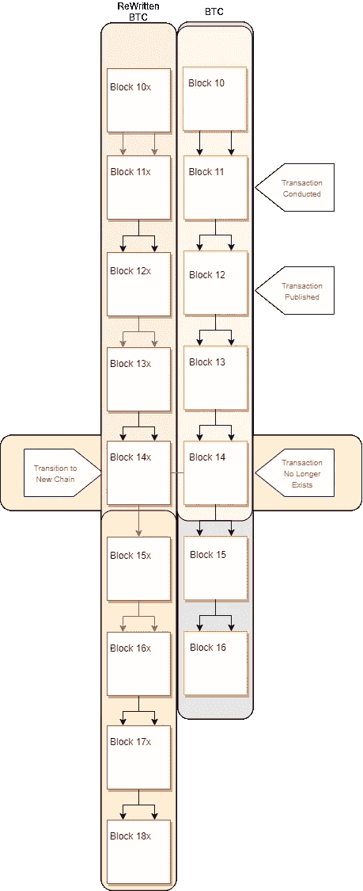

# 比特币的终结

> 原文：<https://medium.com/coinmonks/finality-in-bitcoin-f82890bf39b7?source=collection_archive---------2----------------------->

## 总是几乎，但从不只是完全

***TLDR；
——比特币交易的终结是概率性的，不是绝对的。
-比特币提供史上最佳终结***

每当我们为早餐咖啡之类的东西进行简单的支付时，在我们离开后收到我们的咖啡&离开我们并不担心事后会发生什么；但在如此小的交易中，它甚至没有意义。然而，让我们想象一下，我们在交易的另一边&让我们把它从咖啡重新定义为房地产。假设我们要以 468，000 美元的价格出售一栋房子。一个买家来了，想用他的卡付款。一旦交易发生；(他寄钱来&我们在契约上签字)我们会非常努力地盯着我们的银行账户，直到钱到账。一旦到了银行，我们握手&每个人都高高兴兴地回家。明天早上，我们醒来，穿好衣服，跳到早餐点。我们下订单，刷我们的卡&在我们把卡放回钱包之前，卡因资金不足而被拒绝。我们可能会开始有点恐慌。打开我们的银行应用程序，我们看到我们的余额为 0。我们检查了交易历史日志&从昨天开始就没有任何记录。我们打电话给银行，与经理交谈，发现银行进行了系统升级&昨天的所有交易都丢失了。你给卖房子的人打电话，他们不接。

在金融、区块链和密码的上下文中，有一个必要的货币属性称为终结性。终结性是交易完成且不可撤销的保证。*为了更深入地解释*[*&的三种变体，我之前的文章《区块链风味的终结》*](/coinmonks/blockchains-flavors-of-finality-a019deb4d003) *是完美的起点。*

迄今为止，在人类历史上，就最终结果而言，最有效的货币价值转移工具是实物。案例和要点是现金。一旦现金从一方转移到另一方，交易立即完成。没有神奇的反向交易按钮或支持台可以挑战交易&收回现金；结局是绝对的。

当涉及到在非有形事物中转移货币价值的工具时，如软件终结开始变得更加复杂；正如乞讨时的简短故事所示。

比特币被誉为数字黄金的完美软件代表。它是一种不记名资产，抑制了货币的三个关键属性:它是一种记账单位、交换媒介和价值储存手段。 [*(此处更多关于比特币作为货币)*](/the-capital/searching-for-stability-the-evolution-of-money-e22e335da81f) *。*然而，除了这些属性，比特币还是第一种*去中心化*的货币形式；&去中心化需要权衡。

比特币的核心是 DLT(分布式账本技术)& DLT 需要一种机制来就网络状态达成共识。比特币在中本聪共识下运行，也称为工作证明(PoW)。工作证明提供了两件事；1)极度分散化—这是一种允许网络开放并处理高达 49%分区容差的协议，这意味着即使 49/100 个节点突然离线，网络也将继续运行 2)“最长/最重链”逻辑—网络在具有最多有效事务和最大块高度的链的方向上增长。

除了 PoW，比特币的部分共识是网络前进的速率；也就是 10 分钟/600 秒。这意味着每 10 分钟就有一个新的区块被开采出来&附加到区块链上。这也意味着处理一笔交易需要 10 分钟。

> 在分布式计算的环境中，系统越分散，由于通信开销，它需要更多的时间来处理一些事情。如果 Mary 学到了新东西并想分享，她将花 2 分钟时间与 Bob 分享。在玛丽告诉鲍勃之后，她去和莎莉分享它，这又花了 2 分钟&她现在想让鲍勃和他的朋友分享它。越多的人需要发现一些东西，信息在参与者中传播的时间就越长。

然而，让比特币如此可靠的相同机制也有其自身的细微差别。这种细微差别就是没有绝对的终结。

一旦比特币区块链上发生交易，它就会被广播到网络，被矿工捕获和验证，放入内存池，等待被纳入下一个可用区块。一旦下一个区块被开采和发布，该事务就有效/“最终”。

这里事情变得有趣了；

只有当区块链的结构保持不变时，事务才会保持有效&包括那个特定的事务块。比特币网络可能会面临一些事件，这些事件可能会导致封锁的移除/撤销。

如前所述，PoW 机制可以承受 49%的分区容差&默认选择链最长的网络。然而，它的一个细微差别是允许同时开采两个区块的可能性，即所谓的孤立区块。这是链条顶端的暂时分裂，随着下一个区块的开采而得到解决(发生这种情况的可能性极小，但却是可能的)。假设其中一个块包含事务，另一个不包含。假设挖掘的下一个块在不包括该事务的链的顶部，则该事务将如同从未发生过一样。 ****(来自原始块的事务将被放回内存池&最终被重新挖掘)****

但区块链也有更黑暗、更愤世嫉俗的一面。

如果出现恶意行为者，并且能够成功实施“重写”攻击，那么“重写”数据块中的所有活动都将被完全擦除。

因为系统将对其进行最多工作的链(最长的链)识别为有效链；如果一个恶意行为者组织了一次攻击来转移包含您的交易的块，那么他们将重新挖掘链直到交易点&试图比当前的全球网络更快地挖掘&替换他们的链版本因为您的交易在比特币块 11 中发布，它根本不存在于比特币块 11***x；*** 反过来导致比特币网络上没有那笔交易。

需要注意的是，这种攻击非常复杂，代价也非常高。还需要注意的是，随着每个新数据块被添加到区块链中，这种攻击的可能性会随着每个新数据块而显著降低。

开采的每个新区块不仅保护前一个区块，还保护它之前的每个区块。交易的终结性总是接近 100%,但从来没有完全达到。

根据经验，大多数行业遵循 6 个街区的成熟期。因此，只有在开采了 6 个区块后(大约 60 分钟/1 小时)，才能结算交易所的存款或大型商业交易。

所有这些都不是为了抨击比特币；相反，在我个人看来，比特币的终结性优于历史上的任何东西。

生活中没有什么是可以 100%预测或真正保证的&比特币终结性的独特结构模仿了自然生活中的结构。块之间的时间越长，意味着每个块的安全性越高&每个块的安全性越高，可以放心地通过它传输的价值就越多。

围绕货币结构的小型加密项目正在尝试许多有趣的新实验；如延迟终结；其中块是在历元中“最终确定”的(每 5 个块创建一个历元&一旦一个历元被发布，没有什么可以改变它。)**这是实验性的，仍然会受到精心策划的重写攻击** 听起来可能令人兴奋，但我总是会赌已经奏效的。

> 加入 Coinmonks [电报集团](https://t.me/joinchat/EPmjKpNYwRMsBI4p)，了解加密交易和投资

## 另外，阅读

*   什么是[闪贷](https://blog.coincodecap.com/what-are-flash-loans-on-ethereum)？
*   最好的[密码交易机器人](/coinmonks/crypto-trading-bot-c2ffce8acb2a) | [网格交易](https://blog.coincodecap.com/grid-trading)
*   [3 商业评论](/coinmonks/3commas-review-an-excellent-crypto-trading-bot-2020-1313a58bec92) | [Pionex 评论](/coinmonks/pionex-review-exchange-with-crypto-trading-bot-1e459d0191ea) | [Coinrule 评论](https://blog.coincodecap.com/coinrule-review-a-perfect-trading-bot)
*   [AAX 交易所评论](/coinmonks/aax-exchange-review-2021-67c5ea09330c) | [德里比特评论](/coinmonks/deribit-review-options-fees-apis-and-testnet-2ca16c4bbdb2) | [FTX 交易所评论](/coinmonks/ftx-crypto-exchange-review-53664ac1198f)
*   [n ave 零点回顾](/coinmonks/ngrave-zero-review-c465cf8307fc) | [Phemex 回顾](/coinmonks/phemex-review-4cfba0b49e28) | [PrimeXBT 回顾](/coinmonks/primexbt-review-88e0815be858)
*   [Bybit Exchange 审查](/coinmonks/bybit-exchange-review-dbd570019b71) | [Bityard 审查](https://blog.coincodecap.com/bityard-reivew) | [CoinSpot 审查](https://blog.coincodecap.com/coinspot-review)
*   [3 commas vs crypto hopper](/coinmonks/3commas-vs-pionex-vs-cryptohopper-best-crypto-bot-6a98d2baa203)|[赚取加密利息](/coinmonks/earn-crypto-interest-b10b810fdda3)
*   最好的比特币[硬件钱包](/coinmonks/the-best-cryptocurrency-hardware-wallets-of-2020-e28b1c124069?source=friends_link&sk=324dd9ff8556ab578d71e7ad7658ad7c) | [BitBox02 回顾](/coinmonks/bitbox02-review-your-swiss-bitcoin-hardware-wallet-c36c88fff29)
*   [莱杰 vs n rave](https://blog.coincodecap.com/ngrave-vs-ledger)|[莱杰 nano s vs x](https://blog.coincodecap.com/ledger-nano-s-vs-x)
*   [加密拷贝交易平台](/coinmonks/top-10-crypto-copy-trading-platforms-for-beginners-d0c37c7d698c) | [比特码拷贝交易](https://blog.coincodecap.com/bityard-copy-trading)
*   [Vauld Review](https://blog.coincodecap.com/vauld-review)|[you hodler Review](/coinmonks/youhodler-4-easy-ways-to-make-money-98969b9689f2)|[BlockFi Review](/coinmonks/blockfi-review-53096053c097)
*   最好的[加密税务软件](/coinmonks/best-crypto-tax-tool-for-my-money-72d4b430816b) | [硬币追踪评论](/coinmonks/cointracking-review-a-reliable-cryptocurrency-tax-software-5114e3eb5737)
*   最佳[加密借贷平台](/coinmonks/top-5-crypto-lending-platforms-in-2020-that-you-need-to-know-a1b675cec3fa) | [杠杆代币](/coinmonks/leveraged-token-3f5257808b22)
*   [莱杰纳米 S vs 特雷佐 one vs 特雷佐 T vs 莱杰纳米 X](https://blog.coincodecap.com/ledger-nano-s-vs-trezor-one-ledger-nano-x-trezor-t)
*   [block fi vs Celsius](/coinmonks/blockfi-vs-celsius-vs-hodlnaut-8a1cc8c26630)|[Hodlnaut Review](https://blog.coincodecap.com/hodlnaut-review)
*   [Bitsgap 审查](/coinmonks/bitsgap-review-a-crypto-trading-bot-that-makes-easy-money-a5d88a336df2) | [Quadency 审查](/coinmonks/quadency-review-a-crypto-trading-automation-platform-3068eaa374e1)
*   [埃利帕尔泰坦评论](/coinmonks/ellipal-titan-review-85e9071dd029) | [赛克斯斯通评论](https://blog.coincodecap.com/secux-stone-hardware-wallet-review)
*   [DEX Explorer](https://explorer.bitquery.io/ethereum/dex) | [区块链 API](https://explorer.bitquery.io/graphql)|[local bitcoins 审核](https://blog.coincodecap.com/localbitcoins-review)
*   最佳[区块链分析](https://bitquery.io/blog/best-blockchain-analysis-tools-and-software)工具| [赚比特币](https://blog.coincodecap.com/earn-bitcoin)
*   [加密套利](/coinmonks/crypto-arbitrage-guide-how-to-make-money-as-a-beginner-62bfe5c868f6)指南:新手如何赚钱
*   最佳[加密制图工具](/coinmonks/what-are-the-best-charting-platforms-for-cryptocurrency-trading-85aade584d80) | [最佳加密交易所](/coinmonks/crypto-exchange-dd2f9d6f3769)
*   了解比特币的[最佳书籍有哪些？](/coinmonks/what-are-the-best-books-to-learn-bitcoin-409aeb9aff4b)

> [直接在您的收件箱中获得最佳软件交易](/coinmonks/newsletters/coinmonks)

