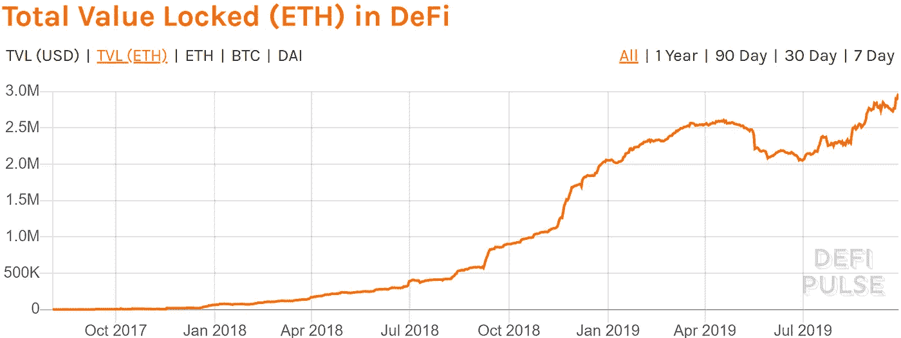
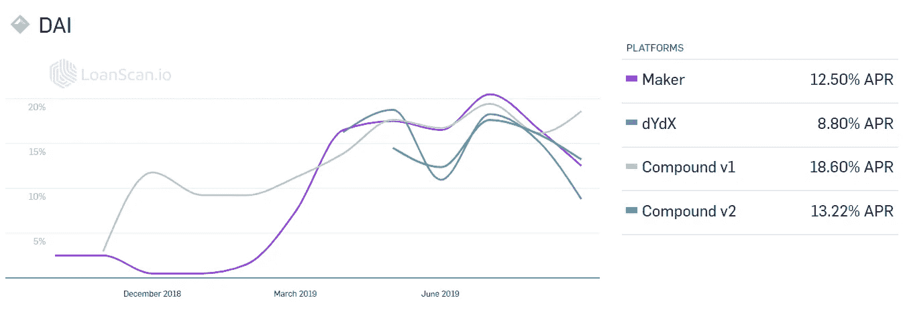

# 金融 2.0 在这里:DeFi(过去)

> 原文：<https://medium.com/coinmonks/finance-2-0-is-here-defi-cbd6ec7e0598?source=collection_archive---------0----------------------->

## 金融生态系统不再为普通人服务；Defi 正在从头开始重建它

## 第一部分:

准备好阅读金融生态系统未来的初级读本了吗？在这个系列中，我们将让你的知识从 0 到 100，这样你不仅可以知道即将发生的事情，还可以实际参与到金融的未来中来。

金融领域在 20 世纪和 21 世纪取得了巨大的发展，出现了令人难以置信的创新。但近年来，令人震惊的是，该系统的巨大好处和价值不再符合许多利益攸关方和系统用户的利益。它成了企业贪婪的牺牲品。

随着区块链技术和类似以太坊的智能合约平台的出现，现在有可能构建任何人可以在任何地方使用的任何类型的应用程序。现在正在建造的东西会让你大吃一惊。

DeFi is blowing up the way that money flows within an economy

从头开始建立一个金融生态系统是很困难的，尤其是当建设者们没有一个名义上的领导来指引他们的方向的时候。这里的建设者是世界上任何地方任何想参与的人。**那就是放权**。我们从 2015 年的货币开始:以太，以太坊区块链的本地货币。与比特币非常相似，但它更进一步，允许执行代码和功能。这是一台全世界都可以使用的电脑。在这台计算机上运行的应用程序被称为**分散应用程序**，简称 dApps。这些 dApps 功能强大，因为它们不在任何单一设备上运行，而是分布在整个网络中，所以它们不容易被关闭。最近金融 dApps 的爆炸式增长催生了它自己的生态系统，被称为分散金融或 DeFi。

Total amount of Ether locked in DeFi is at an all-time high, and continues to grow as new applications are released and get increasingly interconnected.

这些 dApps 正在重建传统的金融世界，并在此基础上进行改进。第一个 dApps 是一个稳定的货币(钉住 1 美元)令牌，以消除系统的波动性。这是建立生态系统的关键基础。在那之后，出现了允许人们用抵押贷款来借钱或贷款的借贷平台。利率是通过算法设定的，因此利率完全由市场决定。

Comparing various DeFi borrowing rates to legacy providers we see that rates are similar, however lending/return rates are vastly different. DeFi is giving the money earned through these loans back to the lenders, unlike legacy financial institutions.

正如我们从回报率上看到的，DeFi 给你的回报率比传统金融要好得多。

为什么？

没有大公司坐在中间，吸收利润，所以它回到你，最终用户谁提供的钱被借出。应该是怎样的。

DeFi 比 legacy finance 更好。原因如下:

1.  **更好的利率**——在借款方，利率由一种随供求波动的算法决定。
2.  **面向所有人的贷款**——任何人都可以在任何时候申请贷款。人们不再受机构的支配来决定他们是否有信用。只要你有贷款的抵押品，你就能得到贷款。这意味着“高风险”借款人的利率往往优于其他选择。
3.  **放贷者的高回报率**——从这些贷款中赚来的钱直接回到放贷者手中。你认为你能从银行的储蓄账户中获得 8%或 10%的利息吗？做梦吧。但是在 DeFi 中这是非常标准的。

**TLDR；**银行烂透了，DeFi 正在打造一个新的生态系统，它的烂透了。

下一步是更复杂的金融工具，如衍生品、保证金交易、合成资产和期货。我们将在下一部分探索这些和其他方面，可以在这里找到[。](/@cobler.d/finance-2-0-is-here-defi-part-2-bb1b503e5ed3)

> [直接在您的收件箱中获得最佳软件交易](https://coincodecap.com/?utm_source=coinmonks)

