# 金融 2.0 来了:DeFi(当下)

> 原文：<https://medium.com/coinmonks/finance-2-0-is-here-defi-part-2-bb1b503e5ed3?source=collection_archive---------2----------------------->

## **第二部分:如何开始赚取高达 15%的利息**

如果你错过了第一部分，[点击这里](/@cobler.d/finance-2-0-is-here-defi-cbd6ec7e0598)或阅读**第一部分 TLDR；**银行很烂，DeFi 正在创造一个新的生态系统，通过去掉中间人，把好处还给你，用户，这个新的生态系统烂得多。

在这一部分，我们将了解该领域涉及的一些风险，了解如何开始，并触及接下来会发生什么(第 3 部分将详细介绍)。

所以你听说你可以用 DeFi 获得高达 15%的利息(连续复利**),你想加入并开始行动。对许多人来说，DeFi 代表了一个建立在更完美的货币形式上的更完美的系统。这是为民主治理提供资金；一个更加开放、公平、包容的体系。欢迎来到金融革命，我的朋友。**

**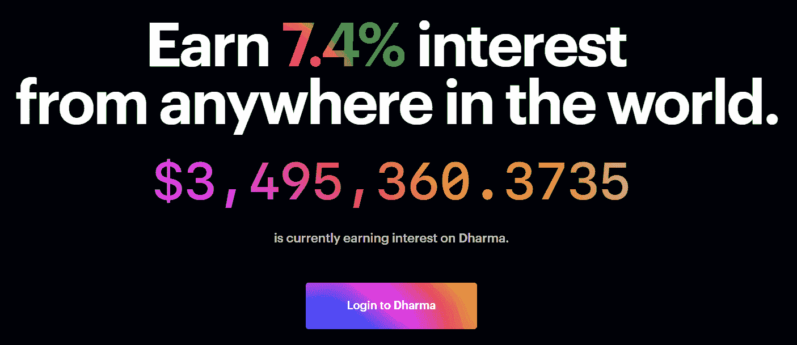**

**On Dharma, you can watch global interest grow in real time, along with the current variable interest rate.**

**在我们开始之前，了解风险是很重要的，因为总会有风险。首先，我们谈论的是一种全新的加密货币技术，这种技术仅存在了 10 年，但对以太坊来说，实际上只有 4 年左右。所以这里面有内在的风险:它是新的，就像任何技术一样，新的缺陷可以在任何时候被发现。事实上，在 Windows 和 iOS 操作系统中仍有**至关重要的**0 天漏洞被发现。还有**协议风险**——底层协议中的风险。因为所有这些基础设施都是建立在以太坊之上的，所以以太坊区块链中可能存在一些缺陷，这将导致系统故障。不仅如此，这些系统都是互操作的，这意味着它们可以互相连接，创造出新的东西，有点像乐高积木。这是所有系统固有的缺陷。这就是为什么银行和像 F-22 猛禽这样的军用车辆使用灭绝语言编码的系统:它们经过了时间的考验，很难被破解，因为很少有人精通他们的语言。因此，虽然不太可能发现破坏系统的错误，但还是有可能的。**

**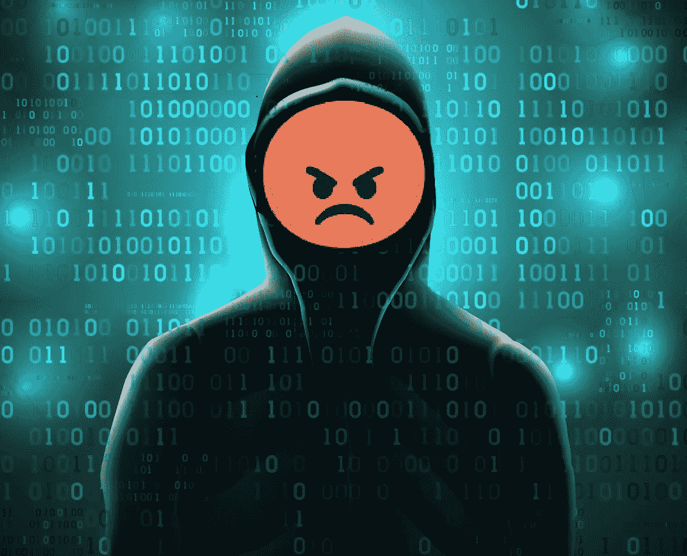**

**The most secure forms of money ever created, Bitcoin and Ethereum, have never had their protocols hacked despite billions of dollars in potential rewards for hackers. In fact in late 2012 Argentine entrepreneur Wences Casares paid professional hackers some $250,000 to hack the Bitcoin protocol. They failed, admitting, “it can’t be done”**

> **……2012 年末，阿根廷企业家温塞斯·卡萨雷斯(Wences Casares)向职业黑客支付了约 25 万美元，以破解比特币协议。他们失败了…**

**重要的是要认识到，黑客有巨大的动机去发现这些漏洞:如果他们能破坏系统，他们就可以洗劫它，并带走潜在的数十亿美元。比特币和以太坊协议都没有被黑过。这是一个复杂的滑动比例；越复杂，它能做的就越多…但我们面临的风险也越大。了解风险？很好，现在我们可以进入有趣的部分了！**

**如果你还不知道拥有 crypto 的基本知识，最好从 YouTube 上的一些介绍视频或 Medium 上的文章开始，以掌握基本知识。开始前我们需要两样东西:一个钱包和一些乙醚。选择可以上网的钱包，如 [MetaMask](https://metamask.io/) (行业标准浏览器钱包)或比特币基地钱包，但硬件和手机/应用钱包也可以。如果你还没有乙醚，这是绕过迪菲公路的基础货币。你至少需要它来支付交易。你可以在政府监管的交易所买到一些，比如 T4 比特币基地 T5、T6 双子星 T7 或 T8 液体 T9。或者去类似 [LocalEthereum](https://localethereum.com/) 的 P2P 交易所一试身手。**

## **追逐那些甜蜜的回报**

**所以你想开始得到高达 15%的利息？让我们开始吧。首先把你的乙醚换成戴，一种与 1 美元挂钩的稳定硬币。你可以[查看这里的列表](https://www.coingecko.com/en/coins/dai/trading_exchanges#panel)看看你能在哪里得到它，但是既然我们进入了 DeFi，让我们从一个 Dex 开始。Dex，或分散交易所，是一个在交易时对你的钱没有控制权的交易所。它是非托管的，这意味着我们不必相信它。因此，让我们来看看 Dex 聚合器 [1inch.exchange](http://1inch.exchange) 。这将有助于我们检查所有的指标，并得到最好的价格，所以我们不会被敲竹杠。酷！想象一下，在机场换钱，他们给你看了他们竞争对手的价格…不太可能。**

**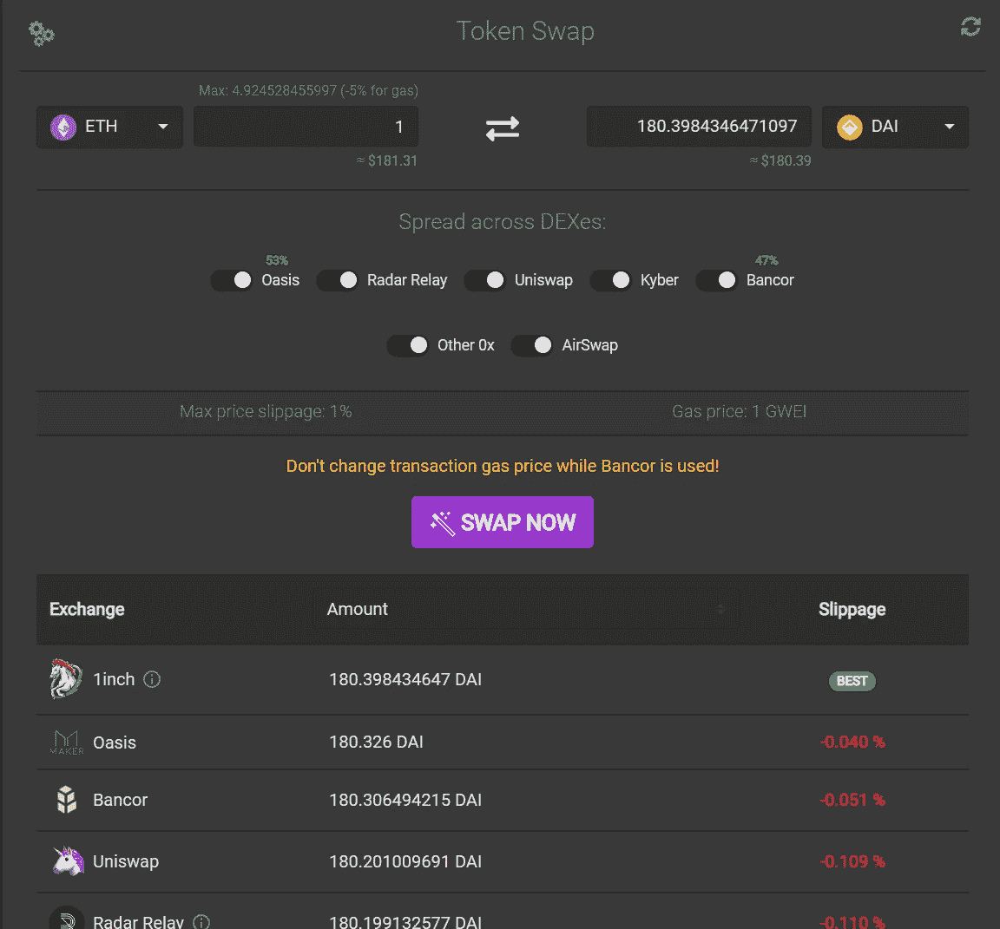**

**This Dex aggregator shows us how much Dai(1 Dai == $1 USD) we can get for 1 Ether, and the various rates at competing Dexes. It shows us slippage (price increase per unit sold) and allows us to split our order among different Dexes to avoid slippage.**

**必要时，聚合器将自动选择最佳价格，并将订单分散到各个站点以避免延误。**

**现在我们有了戴，我们准备投资它，并开始赚取利息。为了找到整个行业的最佳贷款利率，我们将访问 [LoanScan.io](https://loanscan.io/earn/historical?interval=ytd) 查看戴(和其他硬币)的各种利率。**

**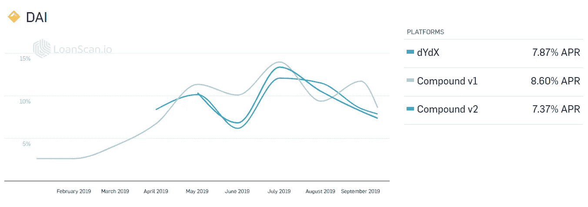**

**The interest rates for lending Dai, courtesy of LoanScan.io. Rates can fluctuate wildly, but the average rate for 2019 is 13.8%.**

**注意 LoanScan 还包括其他集中式解决方案，并不包括每一个去中心化解决方案(少了诺网和支点)。**

**每个平台都略有不同，其复杂性也各不相同。如果你追求最简单的用户体验，[选择复合](https://app.compound.finance/asset/cDAI)。如果你追求最好的价格，请选择 Dydx 或 Dharma。**

## ****复合——适合初学者:****

**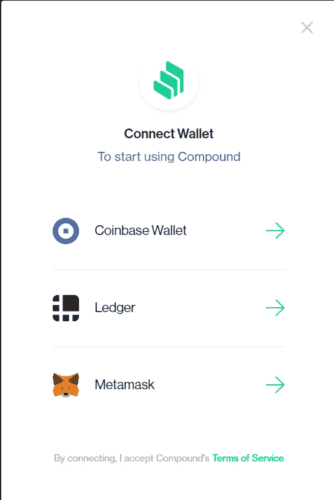**

**Compound currently support 3 wallets, seen above.**

**连接您的钱包，并在请求启用 Dai 时签署消息。**

**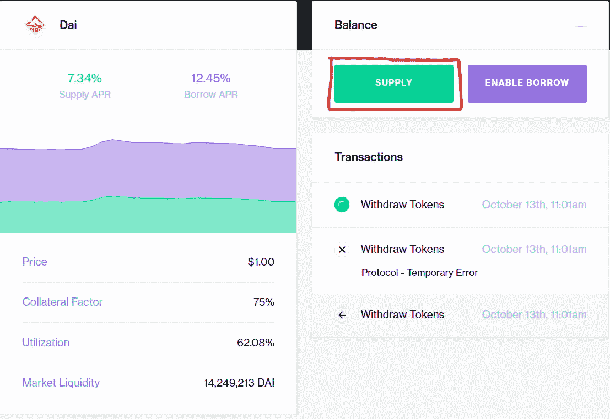**

**The Compound overview for Dai shows the current borrow and lend rates along with other stats**

**单击“供应”按钮，等待弹出窗口:**

**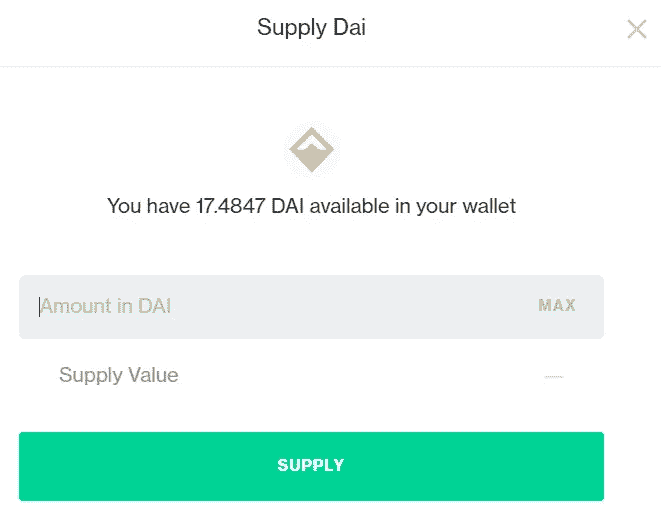**

**Compound knows how much Dai is in your wallet, and shows you how much you can lend out.**

**选择你想借出多少戴。**重要的是:永远不要投资超过你能承受的损失，没有联邦存款保险公司支持这些贷款****

**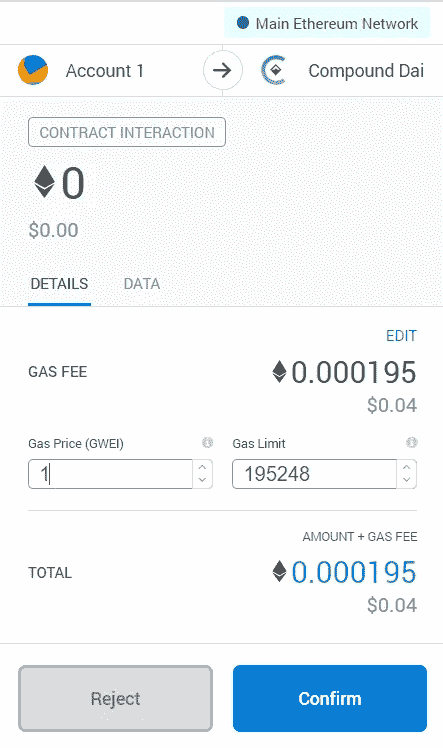**

**MetaMask wallet confirmation for despositing Dai**

**下面是最后一步:确认交易将戴存入 Compound，等待交易通过，大约 30 秒。**

**就是这样！你获得的利息比储蓄账户更高。这并不难，是吗？你可以看到你的总利息收入和你投资了多少。如果您想提取现金，请回到 compound，然后按照提示点击取款。**

**注意，与银行的存单不同，你可以在任何时候取出你的钱，而且不用支付任何罚金。**

## ****dydx-适用于中高级用户:****

**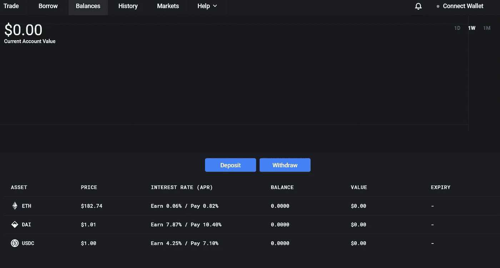**

**dydx has their wallet connect in the upper corner, and lists their interest rates clearly visible.**

**[访问 dydx](https://trade.dydx.exchange/balances) 并连接您的钱包，如果需要，在弹出消息上签名。点击存款按钮，选择戴，输入金额，点击存款。确认交易并等待 30 秒。就是这样！任何存入 dydx 的资金都会自动按照存款页面上规定的利率获得利息。**

**你能想象投资股票或共同基金有这么简单快捷吗？如果银行自动给你的存款利息，那不是很好吗？很容易理解为什么 DeFi 不仅是投资的未来，也是整个金融业的未来。**

## ****这怎么可能？？****

**我的银行只付给我 2%的利息，如果我把钱存进定期存单 6 年，可能是 2.5%。为什么利息这么高？有什么可疑的事吗？**

**号码**

**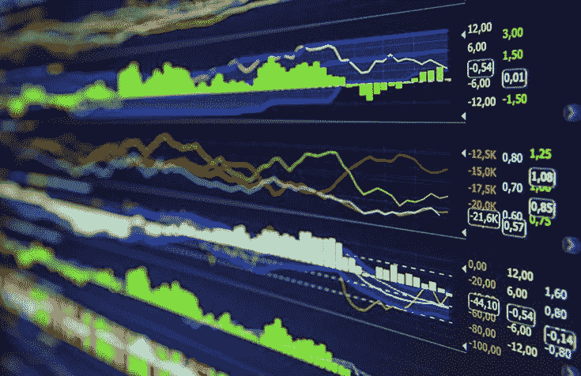**

**Traders take out loans in Dai to fund their strategies, which usually pay greater than the interest rate that they pay on the loan.**

**利率高是因为你在用乙醚这种波动性很大的资产去换戴这种稳定的资产。这样做的话，如果乙醚上涨 20%，你就错过了收益。但如果以太坠落，你也会受到保护。申请贷款的人通常交易这些资产来利用头寸，赚取比他们支付的利率更高的利润。但是如果这些交易者失败了，损失了取出的钱怎么办？**

**别担心。这些贷款是以最低 150% **的比例抵押的(作为偿还贷款的担保，在违约时将被没收)，所以即使他们失去了全部贷款，乙醚价格下跌 50%，这两种情况都不太可能，你的贷款仍然是 100%有担保的。事实上，我们看到大多数贷款人过于谨慎，平均提供 350%的抵押品。****

**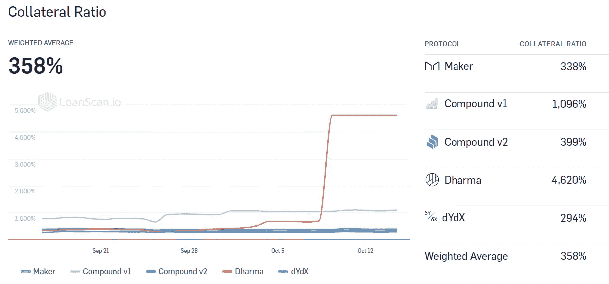**

**The collateral ratios of various lending platforms. Notice the average is a whopping 358%, meaning for every $1 that is lent out, there is $3.58 in reserves. Compare this with modern banks that have a [reserve ratio](https://www.investopedia.com/terms/r/reserveratio.asp) of between 3–10%; for every $1 you have in your account the bank only actually has $0.10**

**所以，现在你有了，你的钱可能获得了最好的回报。**

## **DeFi 的下一步是什么？**

**贷款是一个非常基本和标准的工具，但如果没有人在中间防止攻击，很难让它们安全可靠地工作。既然艰难的工作已经完成，我们可以开始在此基础上创造更多令人兴奋的机会。**

****接下来会发生什么，我们将在第 3 部分探索:****

*   ****原子互换**——两个人之间的交易，没有任何中介。**
*   ****合成资产** -代表一种资产的令牌，如股票，如 AAPL，可以由任何人在任何地方进行交易，以获得新市场的敞口。**
*   **共同基金——根据他们透明的记录选择投资顾问。**

> **[直接在您的收件箱中获得最佳软件交易](https://coincodecap.com/?utm_source=coinmonks)**

****