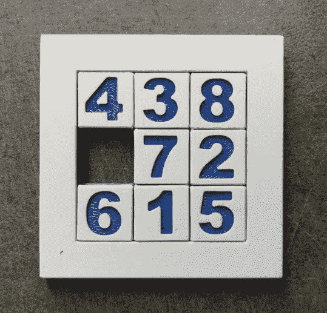

# 金融 2.0 来了:DeFi(未来)

> 原文：<https://medium.com/coinmonks/finance-2-0-is-here-defi-the-future-11a7ec9de9ba?source=collection_archive---------0----------------------->

## 最激动人心的金融革命正在发生。一个光明的未来正在建立；下面是你的钱如何更好地为你工作。

Digital money is here. It’s better and more powerful.

如果你错过了第一和第二部分，检查他们[这里](/coinmonks/finance-2-0-is-here-defi-cbd6ec7e0598)和[这里](/coinmonks/finance-2-0-is-here-defi-part-2-bb1b503e5ed3)。他们解释了什么是分散金融(DeFi)，如何参与，以及为什么你应该参与(赚钱)。

简言之，当前的金融体系既贪婪又排外。他们切断了与世界上很大一部分人口的联系。世界现在比以往任何时候都更富有，然而贫富差距比以往任何时候都更大，而且还在扩大。富人正在囤积他们的财富。没有银行账户或借记卡等现代金融工具，怎么能指望人们迎头赶上或拥有光明的未来？

当前体系的缺陷在于，它是为奖励贪婪者而设计的。没有“做正确的事情”的激励，所以很少有人这样做。DeFi 的一个好处是它赋予了大众权力。

在理解了为什么 **DeFi 是金融的未来**之后，下一个问题是:这个“金融的未来”会有什么样的未来？没有人能准确预测未来。在 1997 年，没有人能预测到 10 年后人们将会直播他们的整个生活。因为这听起来太疯狂了。10 年后，人们的整个财务生活可能会流于形式。

## 实时支付

是的，你没看错。直播你的财务生活。让我们来看看迈克的场景，他是一名来自印度的计算机程序员，过着“[数字流浪者](https://en.wikipedia.org/wiki/Digital_nomad)的生活。他的年薪通常约为 8.5 万美元。也就是每个工作日 335 美元，或者每秒 0.01 美元。每过一秒，你都会看到迈克的工资被存入他的账户。为什么他要等两周才能拿到工资？他今天工作了，他应该得到报酬。越来越多的雇主开始转向“实时工资”薪酬。你也可以看着他在卡拉 ok、共同工作空间和街机上消磨时间，并按秒付费。观看 0.00018 美元被实时提取，因为他与他的朋友一起唱“永远不会让你失望”。他租了一辆车，时间是 36 分 14 秒，他付的钱正好是这个时间，而不是多一秒。等等，以前人们是按天租车的？？

> “这太疯狂了”，迈克想，“我只需要半个小时的车，为什么我要付一整天的钱呢？”!"

迈克登录到他的魔兽世界账户(是的，人们还在玩)，他的账户开始被收费。提前支付整个月的费用？这是什么石器时代？！

> “我每个月只玩几个小时，所以我为什么要为我不使用的东西付费！?"

一切都是一样的。你应该为你使用的东西付费。不多不少。每周只开一个小时的车？只需支付一小时的公路税。迟到半小时去看球赛？不要为那半个小时付钱。实时支付现在可以在像 [Sabelier](https://sablier.app/) 这样的平台上使用(测试版)。

That’s right, no one in the driver’s seat. Self driving taxis are safer and more efficient than human drivers. They will be here very soon, and your car could be one of them.

## 机器经济

汽车等机器可以有自己的钱包。现在，当你在睡觉或工作时，你的车可以自己出租，为杜伯(优步分权制)运送乘客。它接受每行驶一厘米的费用，当电量不足时给自己加满汽油或电，并自掏腰包。当你早上醒来时，你可以看到 374 美元的收入，这已经在一个有息账户 6 个小时，赚取了 1.07 美元的利息。这不是秘密，它就在优步和特斯拉的路线图上。但新的是这个经济体中的资金流动。与优步收取车主 25%的钱不同，应用开发者收取 2%的佣金，剩下的归你所有。这降低了乘客的费用，也让你的口袋里有了更多的钱。

## 合成资产

听起来很复杂，但实际上很简单。合成的意思是人造的，资产是任何有价值的东西。合成资产是真实世界中有价值的事物的数字表示。这些可以是股票和债券，房地产，贵金属，或任何东西。而合成部分是一个代币，或者硬币，在数字世界里代表它。拥有令牌的人拥有资产的合法所有权。传统资产的问题在于它们的*流动性差，*这意味着它们很难被视为现金并四处流动。你的房子可能价值 40 万美元，但是要获得这笔钱或者用你的房子换其他东西需要花费*时间*。想象你的金融资产是这个滑动拼图中的瓦片:如果一些数字被冻结在原地，完成拼图或取得任何进展就会变得更加困难。

Your finances are like a sliding puzzle. When you want to move things around it’s much easier when things can move freely. If they’re locked into place your options become fewer, and you may not be able to solve the puzzle at all.

合成资产把你生活中所有有价值的东西都拿走，让它们变得高度流动。它给你自由。接触到你从未有过的东西。没有人靠工作致富，这不是秘密。你通过投资变得富有。那些没有适当身份证明和银行账户的人无法轻易购买股票、债券或投资房地产。他们的财务前景黯淡。

但是合成材料会改变这一切。

以米格尔为例，他是德克萨斯州的移民，从事农业工作。他没有证件，因此无法获得银行账户或任何现代金融服务。他每周都有现金收入，但需要给墨西哥的家人寄 100 美元。他目前唯一的选择是使用像西联这样的第三方。根据西联汇款的价格估算，他们将收取 9.2%的费用。每一周。事实上，西联汇款去年赚了 56 亿美元，这类交易占了 [79%的业务。](https://www.forbes.com/sites/hilarykramer/2013/05/10/wu-stock-report/)

> …有了 DeFi **，他们比以前多赚了 18%。**

现在，Miguel 选择用加密货币支付:合成美元(sUSD 或 Dai ),这样他就可以将 100 美元的工资直接转到他妻子的账户上。她可以通过 DeFi 借记卡(如 [Monolith](https://monolith.xyz/) 或[Crypto.com](https://crypto.com/en/index.html#))立即使用它，在超市消费，并从自动取款机中提取比索。她获得了更好的汇率，支付的费用也少得多。从她的 DeFi 卡中获得 2%的返现奖励也有所帮助。她得到了她丈夫的血汗钱。当这笔钱存在他们的账户上时，他们还能获得平均 7%的利息。

通过使用美元节省 9%，在 DeFi 卡上返现 2%，在 DeFi 上赚取 7%的利息，**他们比以前多赚了 18%**。这将对米格尔和他的家庭产生巨大的影响

DeFi Cards are changing the game for consumers, offering better perks and savings. Note that Crypto.com is not decentralized yet, but plans to shift in the near future.

这些合成物现在正在像 Synthetix 这样的平台上被创造出来。

合成材料的一个副作用是，它们可以被插入任何有钱的地方。你可以选择用股票或黄金来支付账单，或者用同样的方式从银行账户中提取利息。你的退休账户现在将开始赚取一篮子股票和债券的利息和股息，而不是需要通过收费转换回资产的美元。如果你的银行让你赚取黄金和苹果股票的利息，而不是美元，会怎么样？你会做吗？

## 光速下的房地产

房屋和公寓租赁将不再使用纸质合同和按月支付。相反，房东可以每天获得租金支出。 [RealT](https://realt.co/) 是一家总部位于美国的租赁公司。这意味着你可以购买代表 x%的房子的代币，并且每天将 x%的租金收入支付到你的钱包里。

RealT offers tokens that represent a share in a rental house. Showing the market price of the house, the token price, and how much rent you will earn per as a token holder. A very hands-off way of investing in real estate that generates great returns.

与拥有真实的房地产不同，代币所有者不必担心保险、房屋升级、租户投诉或折旧问题。这使得令牌化的房地产成为退休账户和长期投资的完美投资工具。它还向所有人开放了需求最高的房地产市场，而在此之前，这些市场只对最富有的投资者开放。

尽管由于监管原因没有分散，但这是向更广阔的市场开放的正确方向迈出的一步

Speaking in memes, the future is now.

这些只是未来的几个例子，尽管大多数真正令人兴奋的创新还没有想出来。因此，请关注像[对抗](https://defipulse.com/)和[对抗](https://thedefiant.substack.com/)这样的平台。现在就参与进来，成为未来金钱的一部分，而不是看着它与你擦肩而过。

> [在您的收件箱中直接获得最佳软件交易](https://coincodecap.com/?utm_source=coinmonks)

