# 金融市场—四月份宏观图表摘要(2021 年 4 月 26 日)

> 原文：<https://medium.com/coinmonks/financial-markets-macro-chart-rundown-for-april-4-26-2021-113c012ad088?source=collection_archive---------6----------------------->

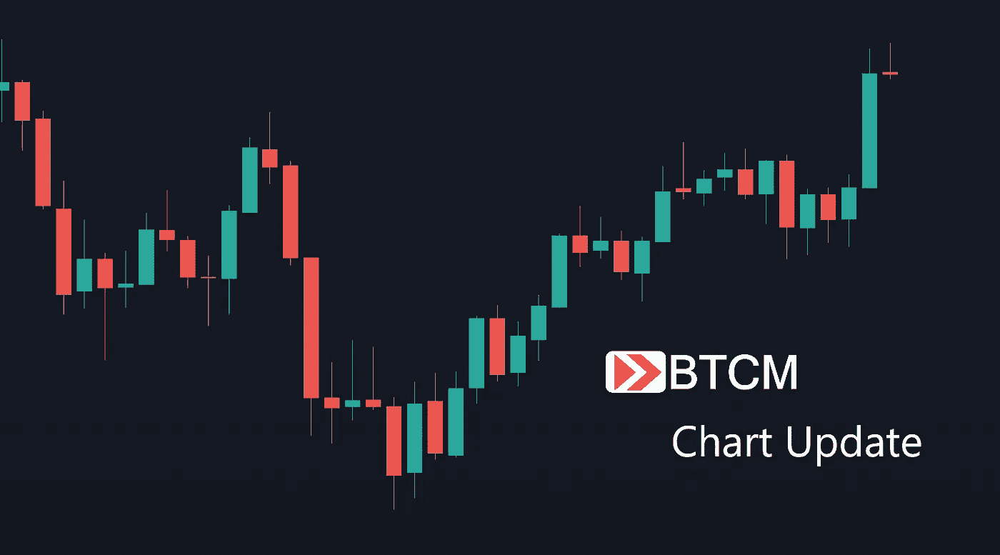

欢迎回到 BTCM 研究中心。如果您觉得这些图表更新信息丰富，请订阅。今天我们研究比特币、美国国债、原油、股票、大宗商品、黄金和白银以及美元！

# 比特币

我只能说我自己，但最近的下跌是艰难的。我为牛市的下一轮爆发做好了一切准备，一切看起来都很好，但当它到来时，它很缓慢，真的 FOMO 从未开始。价格下跌了 25%。

一路上的反弹都在预期的时间到来，包括最近的这次。到目前为止，反弹看起来很强劲，回到了 38.2%的斐波那契线。

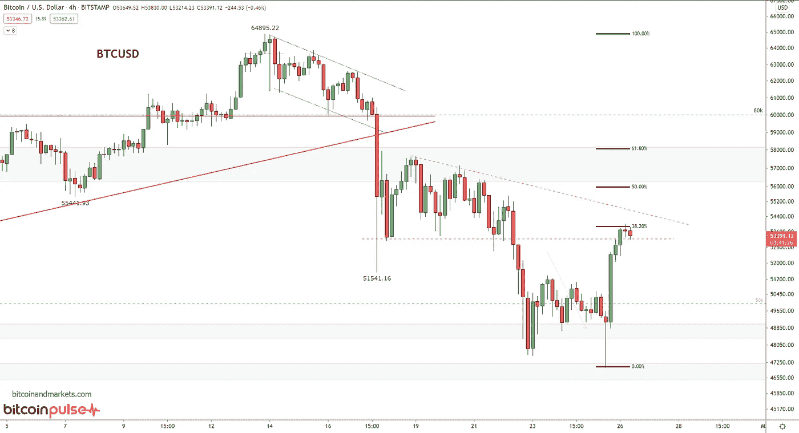

公牛队仍有许多工作要做，但过去的 12 个小时是急需的生命迹象。当然，今年剩下的时间对比特币来说将是巨大的，所以繁荣之前需要一点厄运。

当它突破 58k 美元时要小心，因为在我看来，这是它真正起飞的水平。更多关于比特币的技术分析，以及更多宏观分析，请订阅 bitcoinandmarkets.com 的[比特币脉动](https://bitcoinandmarkets.com/membership/)。

# 美国 10 年期国债收益率

缩小。长期国债在一个明显的领域遇到了一些阻力。将收益率与过去几个月进行比较，会让你对外面发生的事情产生错误的理解。与过去 40 年相比，我们正在测试前期低点的阻力！

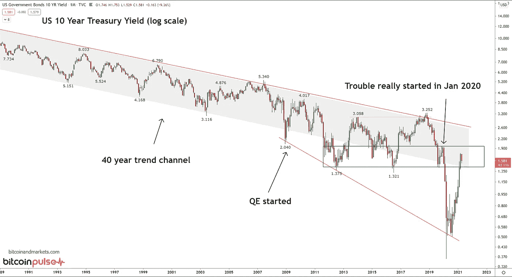

放大看，这是最近 18 个月左右。我预测红色曲线表示收益率逼近历史阻力区。有一点是肯定的，自 2020 年 8 月低点以来，经过 8-9 个月的几乎直线上升，收益率仍仅处于此前的历史低点！？！

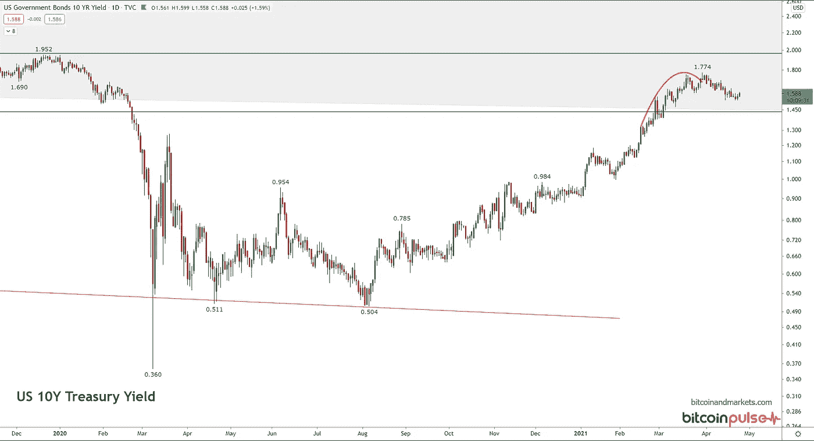

# TLT

这个 ETF 是债券的价格(期限 20 年及以上)，所以它是上述收益率图的倒数。正如你所看到的，它在一个支持区域反弹。在最终反弹之前，还有进一步下跌的空间，但它看起来非常健康，如果它继续下跌，将有大量的支撑。

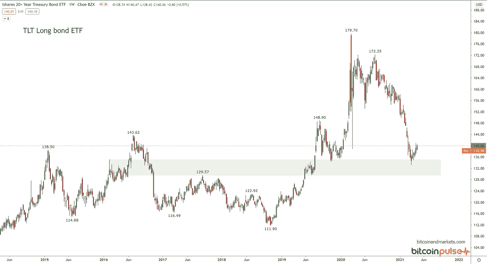

# WTI 原油

我已经写了几篇关于未来油价的文章。超过 60 美元/桶，美国产量将继续攀升。在 60-62 美元之间有一个自然的(暂时的)平衡，在这个平衡中，美国几家大型石油生产商仍对钻探新井犹豫不决，但较小的石油公司可以冒险开始这个过程。低于 60 美元/桶，美国产量会减少，但高于 62 美元/桶，产量会大幅增加。在我看来，需求并不是一个真正的问题，因为市场正在以如此多的过剩产能运转，这一切都与供应有关。

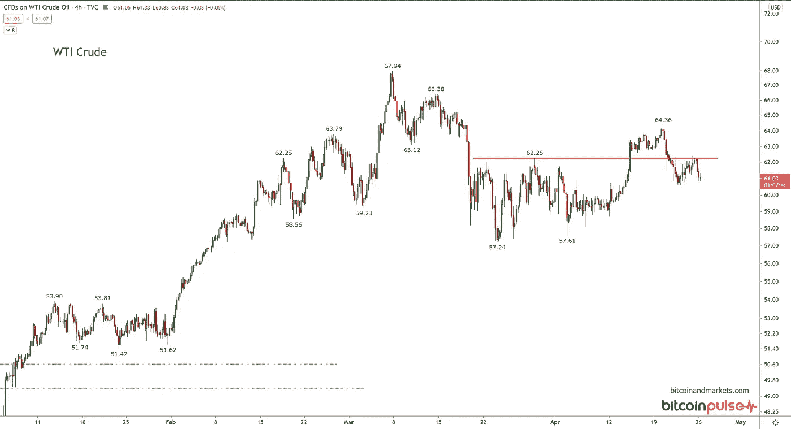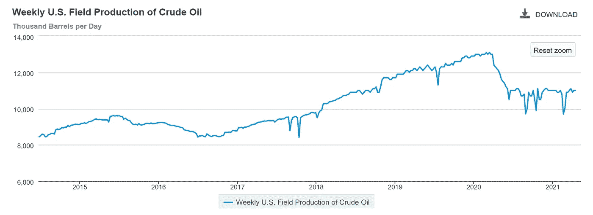

从上图可以看出，美国的产量正稳定在一个平衡区。更高的价格只能恢复 300 万桶/天的产量。

# 股票

我仍然看好美国股票，因为全球资本正在寻找去处，而美国正面临巨大的贸易逆差，这意味着所有的资金都必须回到美国资产。图表显示，在没有重大挫折的情况下，美国股市已经上涨了很长一段时间，因此，如果未来几个月出现一些起伏，我不会感到惊讶。然而，在未来一年里，美国股市应该会继续上涨，下跌肯定是买入的机会。

我知道这与许多专家的观点相反。无论你走到哪里，人们都在说股市的牛市将会可怕地结束。可能会，但不会很快。今天钱会去哪里？发展业务吗？地球上的任何地方？不，去全球化萧条使得资金最终流入美国股票、债券和比特币。

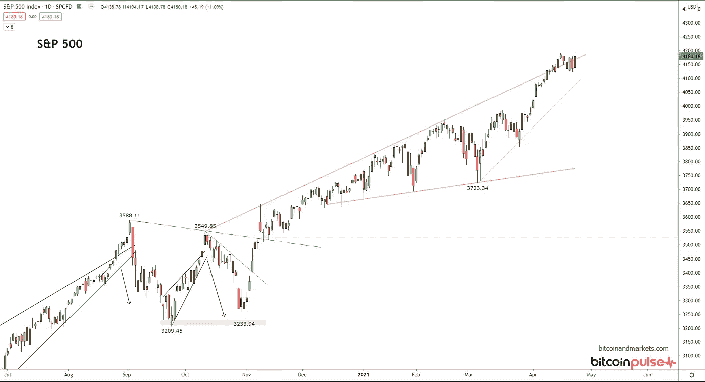

主要股票市场的快速纲要。这些是周线图，让你对每个指数有一个过去几年的感觉。

德国看起来很强劲，但比美国股市更加抛物线，这或许意味着反弹不太稳定。

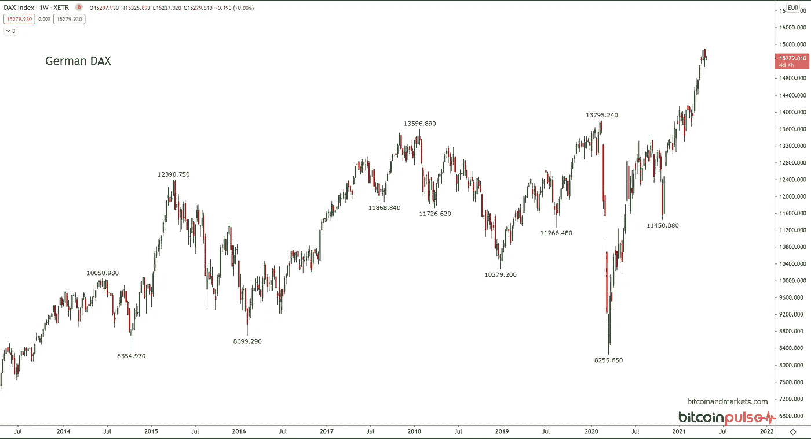

**日本**和德国一样的东西。在日冕底部后，它有一个第一年的大反弹，但现在在周线图上有一个较低的高点。看起来它想要崩溃一点，支持是非常遥远的。

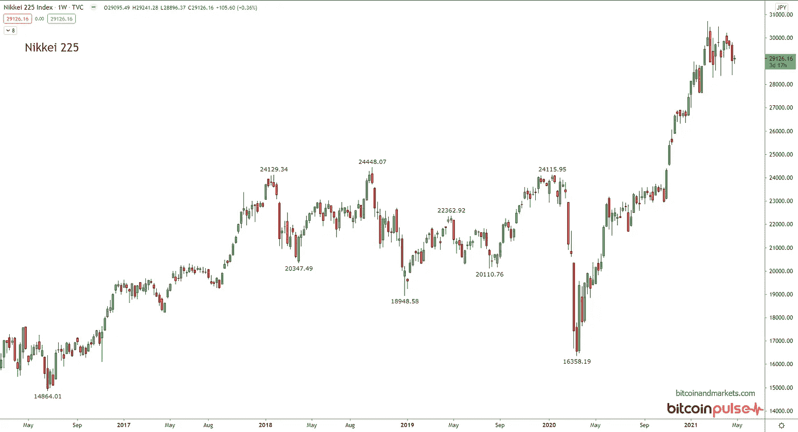

**上证综指的走势与其他市场不同。目前处于高位，但勉强维持，过去几周出现了几次较低的高点。总体而言，亚洲似乎想要开始一次调整。**

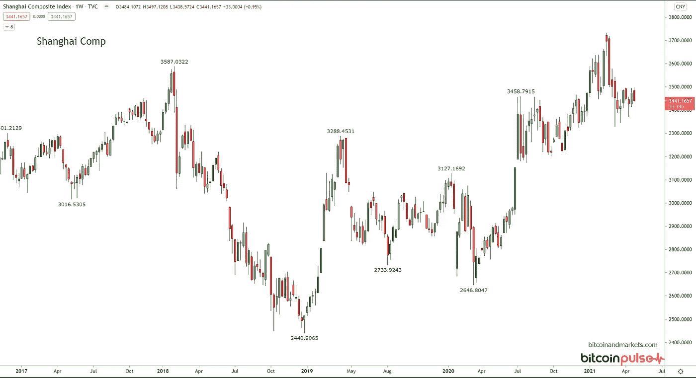

# 商品

高盛大宗商品指数正试图测试 2018 年高点。这是自 2008 年全球金融危机以来大宗商品最强劲的反弹，除了价格继续大幅上涨之外，没有什么会让我感到意外。价格可能会在 2018 年高点上方假装，然后跳水或可能在这里掉头，就像美国国债一样。

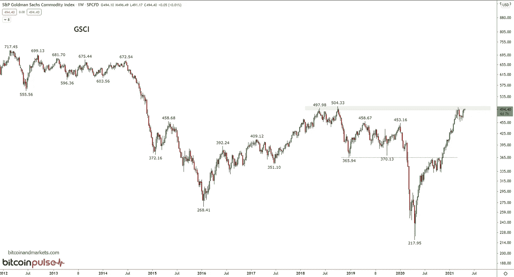

# 黄金和白银

黄金价格小幅回升，接近 1800 美元。虽然它确实突破了 1750 美元附近的阻力，并测试了该水平的支撑，但它的表现看起来很弱。这让我想起了几周前比特币的表现，当时它突破了 62k 美元，看起来接下来的上涨只是开始滚动并下跌 25%。

我不认为黄金或白银会出现这种下跌，但在我看来，这种弱势突破失败并反弹的可能性更大。请记住，2008 年至 2009 年金融危机期间，价格在打破之前的 ATH 后下跌了 35%。35%的跌幅将一直达到 1350 美元。我不认为它会变得那么低，但目前为止它只比最近的 ATH 低 20%。跌至 1550 美元将是 25%的修正，这在我看来仍是一个不错的区间。

当然，它又一次来到了决策点，所以让我们看看会发生什么。

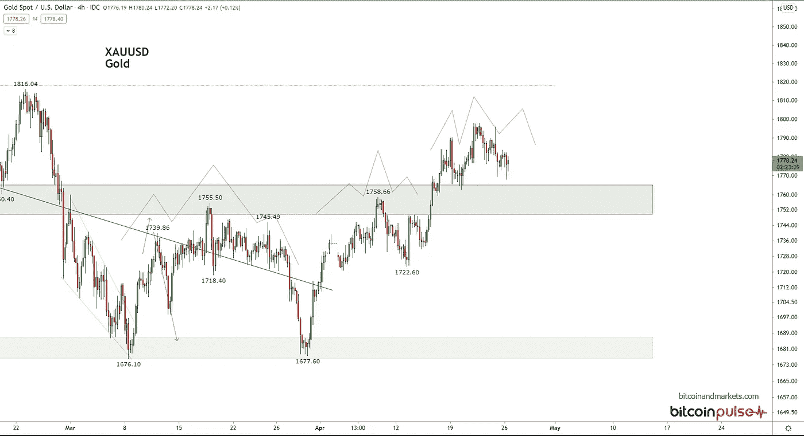

# 银

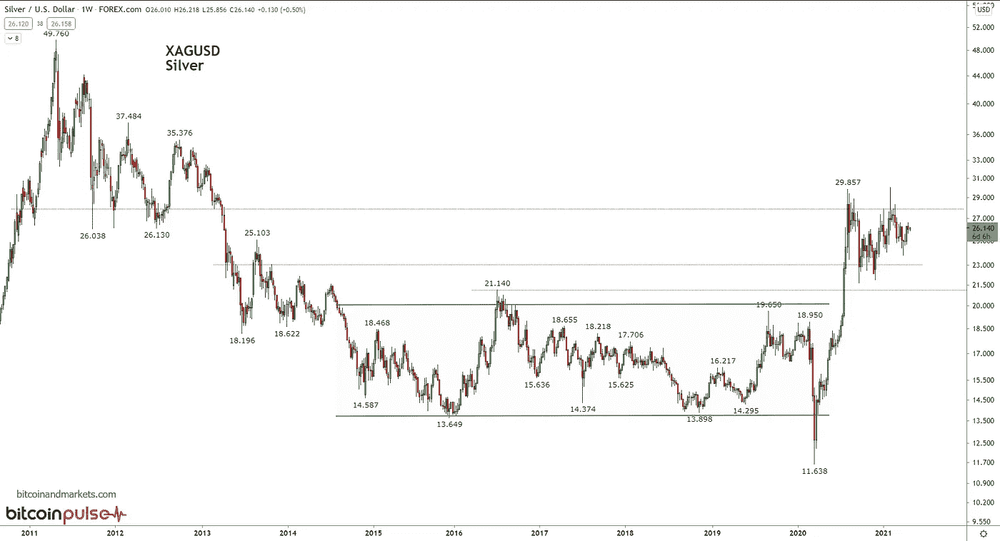

白银的长期图表非常无聊。它肯定会在 2020 年爆发，这很好，但它目前处于无人区。它被困在上方的顶部形态和下方的 5 年盘整区之间。

如果没有黄金，白银也能移动，我希望在未来 6 个月看到一个上升的楔形形态，并突破更高。也就是说，从技术上来说，未来某个时候测试 5 年期价格区间至 22 美元是有意义的。银虫应该希望这种情况尽快发生。

# 美元

让我们用金元来结束它。我对美元突破阴影支撑区域感到惊讶，并立即回测它作为阻力并进一步下跌(下面的第一个图表，4 小时)。我预计美元不会很快大幅走软。如果过去 12 个月的疯狂货币政策甚至不能导致它打破 2018 年的低点，那么底部就在现在。下一站是外汇疲软。

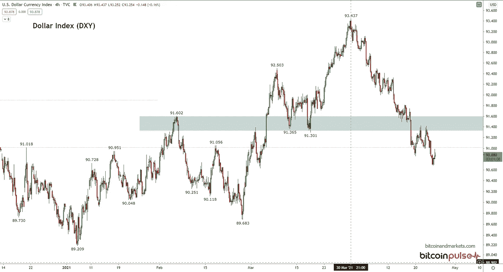

在日线图上，我们有一些连接低点的趋势线的对角线支撑，它在轮廓框内，代表 DXY 在过去 6 个月花了很多时间的范围，所以它应该提供大量的支撑。这是最后一道防线，90.3。如果跌破该水平，可能会出现新的周期低点。

然而，当美元想要走强时，我认为这是美元走强的地方，它可以非常迅速地移动。如果它朝着 92 点突破阴影区域，它可能会强劲快速反弹。

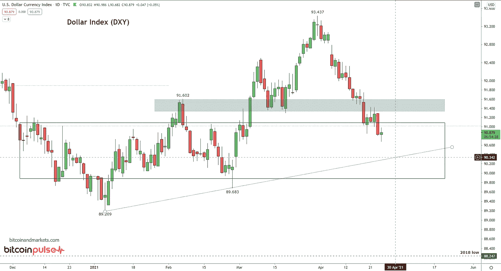

贸易加权美元指数

这是我们拥有的最广泛的美元衡量标准。它比 DXY 指数要宽泛得多。虽然推迟了 10 天，但看起来很相似。除了这个周期的低点，与 2018 年相比，它比 DXY 高出很多。

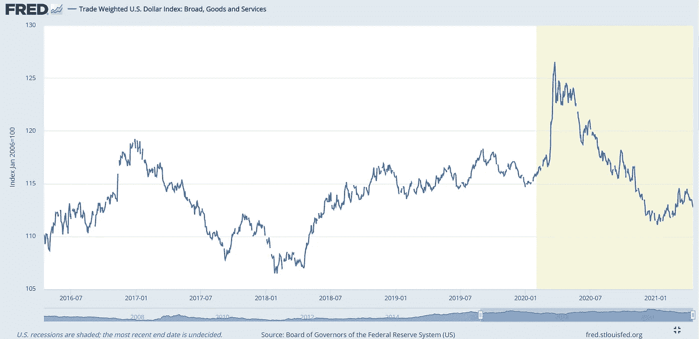

感谢阅读。订阅分享！

> 加入 Coinmonks [Telegram group](https://t.me/joinchat/uiLERCQL1fQ5ZjA1) 并了解加密交易和投资

## 另外，阅读

*   最好的[密码交易机器人](/coinmonks/crypto-trading-bot-c2ffce8acb2a) | [电网交易机器人](https://blog.coincodecap.com/grid-trading)
*   [加密复制交易平台](/coinmonks/top-10-crypto-copy-trading-platforms-for-beginners-d0c37c7d698c) | [五大 BlockFi 替代方案](https://blog.coincodecap.com/blockfi-alternatives)
*   [CoinLoan 点评](/coinmonks/coinloan-review-18128b9badc4)|[Crypto.com 点评](/coinmonks/crypto-com-review-f143dca1f74c) | [火币保证金交易](/coinmonks/huobi-margin-trading-b3b06cdc1519)
*   [尤霍德勒 vs 考尼洛 vs 霍德诺特](/coinmonks/youhodler-vs-coinloan-vs-hodlnaut-b1050acde55a) | [Cryptohopper vs 哈斯博特](https://blog.coincodecap.com/cryptohopper-vs-haasbot)
*   [杠杆代币](/coinmonks/leveraged-token-3f5257808b22) | [最佳密码交易所](/coinmonks/crypto-exchange-dd2f9d6f3769) | [Paxful 点评](/coinmonks/paxful-review-4daf2354ab70)
*   [如何在印度购买比特币？](/coinmonks/buy-bitcoin-in-india-feb50ddfef94) | [WazirX 审核](/coinmonks/wazirx-review-5c811b074f5b) | [BitMEX 审核](https://blog.coincodecap.com/bitmex-review)
*   [双子座 vs 比特币基地](https://blog.coincodecap.com/gemini-vs-coinbase) | [比特币基地 vs 北海巨妖](https://blog.coincodecap.com/kraken-vs-coinbase) | [硬币罐 vs 硬币点](https://blog.coincodecap.com/coinspot-vs-coinjar)
*   [币安 vs 北海巨妖](https://blog.coincodecap.com/binance-vs-kraken) | [美元成本平均交易机器人](https://blog.coincodecap.com/pionex-dca-bot)
*   [印度比特币交易所](/coinmonks/bitcoin-exchange-in-india-7f1fe79715c9) | [比特币储蓄账户](/coinmonks/bitcoin-savings-account-e65b13f92451)
*   [币安收费](/coinmonks/binance-fees-8588ec17965) | [Botcrypto 审查](/coinmonks/botcrypto-review-2021-build-your-own-trading-bot-coincodecap-6b8332d736c7) | [Hotbit 审查](/coinmonks/hotbit-review-cd5bec41dafb) | [KuCoin 审查](https://blog.coincodecap.com/kucoin-review)
*   [我的密码副本交易经验](/coinmonks/my-experience-with-crypto-copy-trading-d6feb2ce3ac5) | [购买硬币评论](https://blog.coincodecap.com/buycoins-review)
*   [加密货币储蓄账户](/coinmonks/cryptocurrency-savings-accounts-be3bc0feffbf) | [YoBit 审查](/coinmonks/yobit-review-175464162c62) | [Bitbns 审查](/coinmonks/bitbns-review-38256a07e161)
*   [最佳比特币保证金交易](/coinmonks/bitcoin-margin-trading-exchange-bcbfcbf7b8e3) | [比特币保证金交易](https://blog.coincodecap.com/bityard-margin-trading)
*   [加密保证金交易交易所](/coinmonks/crypto-margin-trading-exchanges-428b1f7ad108) | [赚取比特币](/coinmonks/earn-bitcoin-6e8bd3c592d9) | [Mudrex 投资](https://blog.coincodecap.com/mudrex-invest-review-the-best-way-to-invest-in-crypto)
*   [BlockFi 信用卡](https://blog.coincodecap.com/blockfi-credit-card) | [如何在币安购买比特币](https://blog.coincodecap.com/buy-bitcoin-binance)
*   [顶级付费加密货币和区块链课程](https://blog.coincodecap.com/blockchain-courses) | [币安评论](/coinmonks/binance-review-ee10d3bf3b6e)
*   [MXC 交易所评论](/coinmonks/mxc-exchange-review-3af0ec1cba8c) | [Pionex vs 币安](https://blog.coincodecap.com/pionex-vs-binance) | [Pionex 套利机器人](https://blog.coincodecap.com/pionex-arbitrage-bot)
*   [在美国如何使用 BitMEX？](https://blog.coincodecap.com/use-bitmex-in-usa) | [BitMEX 回顾](https://blog.coincodecap.com/bitmex-review) | [币安 vs Bittrex](https://blog.coincodecap.com/binance-vs-bittrex)

*最初发表于 2021 年 4 月 26 日《比特币与市场研究》。*