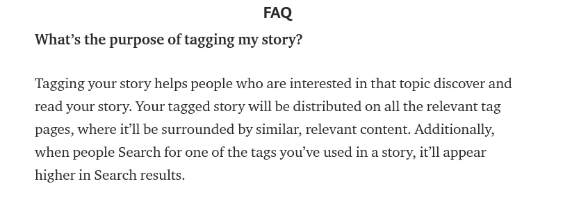
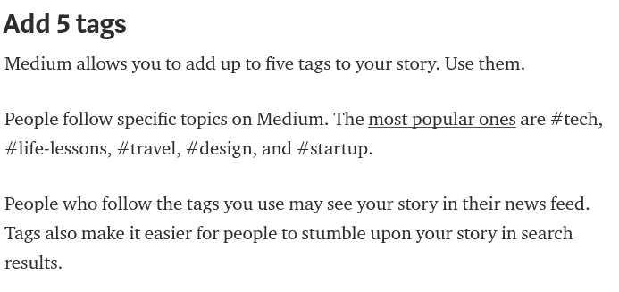
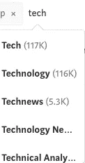

# 为你的故事寻找更好的媒介标签

> 原文：<https://medium.com/coinmonks/find-better-medium-tags-4f4bfcbb0266?source=collection_archive---------1----------------------->

[Source](https://www.google.co.in/url?sa=i&source=images&cd=&cad=rja&uact=8&ved=2ahUKEwiu0dyXl_PcAhXJdH0KHS_pBUcQjxx6BAgBEAI&url=https%3A%2F%2Fvirtualizationreview.com%2Fblogs%2Feveryday-virtualization%2F2016%2F02%2Fusing-vsphere-tags.aspx&psig=AOvVaw0dU_dqn_hIVNhje-Ro1U6y&ust=1534564150380531)

`[***Get published on Coinmonks***](https://medium.com/coinmonks/contribute/home)`

【2019 年 1 月 18 日更新

RIP mediumtags.com，在 AWS 上花了我 100 美元，决定不再运行它。虽然我有旧数据，但如果有人需要，我会卖掉它。它有大约 7000 个标签。到 gaurav@coinmonks.com 找我。

更新(2019 年 1 月 14 日)-最近媒体更新了它的 API，不再有追随者计数。保留旧的追随者数据。发布计数数据保持不变，并定期更新。

> 这是集中式平台的问题，它们永远不会永久存在。公司创造了数据孤岛，并从中攫取利润。数据不应该被控制在中央服务器中以获取利润。自由获取数据应该是每个人的基本权利。
> 
> 向权力下放致敬！！

**cc** [**Ev 威廉姆斯**](https://medium.com/u/268314bb7e7e?source=post_page-----4f4bfcbb0266--------------------------------) **(你杀了中等标记)**

标签在接触你的观众和男孩方面起着重要的作用！它们很重要。下面是来自媒体博客*的一篇题为 [*介绍标签:增加想法之间的联系*](https://blog.medium.com/introducing-tags-to-medium-1b6182fd3dbd) 的文章的图片。*

[source](https://blog.medium.com/introducing-tags-to-medium-1b6182fd3dbd)

我将向您展示另一张图片，它来自标题为 [*的文章，如何在 freeCodeCamp 媒体出版物*](https://medium.freecodecamp.org/how-to-get-published-in-the-freecodecamp-medium-publication-9b342a22400e) 上发表，作者是[昆西·拉森](https://medium.freecodecamp.org/@quincylarson)。

[source](https://medium.freecodecamp.org/how-to-get-published-in-the-freecodecamp-medium-publication-9b342a22400e)

现在我要告诉你一个连 FreeCodeCamp 都不知道的秘密，#tech 有更多的 Post count，这是你输入标签搜索时显示的媒介，但# tech 有更多的追随者。所以**如果你使用的是#tech 而不是#technology，你就无法接触到阅读技术文章的近 50%的受众。**

虽然有其他标准使故事成为趋势，但在看到这条信息后，至少我会在我的科技文章上使用#technology 标签。

另一个例子是#ai 有大约 4k 个追随者，但是人工智能有 674k 个追随者。

> 所以我们做了一个简单的[工具](https://mediumtags.com/)(【https://mediumtags.com】T2)来探索这些标签，帮助你决定哪个标签有更多的读者。

## **关于工具:**

该工具使用了一个中型的 [**Jsonp**](https://en.wikipedia.org/wiki/JSONP) api，它给出了关于帖子和关注者的数据。我们也在存储这些数据，所以在未来，我们可以深入研究这些数据，分析哪些人在关注哪些标签。目前，工具显示这些点。

> **排名** —基于关注者数量
> 
> **追随者** —媒体上标签的追随者数量
> 
> **Post Count** —介质上标签的 Post Count 数量(这是您在介质上搜索标签时看到的)。
> 
> **每个帖子的关注者** —标签的关注者数量/标签的帖子数量

> [直接在您的收件箱中获得最佳软件交易](https://coincodecap.com/?utm_source=coinmonks)

## 工具将如何帮助您:

***追随者每一个岗位*** 都很重要。**每个帖子的关注者越多，说明吸引该类别读者的机会越大。**

例如，查看两个标签的比率。

> #生活经验— 5.57(关注者— 1078464，总帖子— 193716)
> 
> #life - 4.80(关注者—1063013，总帖子—221312)

这告诉我们，每个带有#生活课程标签的帖子平均有 5.57 个关注者，而#生活标签的平均有 4.8 个关注者。因此，如果你使用#life 标签，你在这个类别中就少了一个关注者。

## **顶级标签-**

这个工具还会根据每个帖子的关注者显示排名靠前的标签。因此，如果你正在考虑你的下一个媒体故事，并且想要接触更多的观众。你可以查看哪些是热门标签，并写在这些类别下。

如果你想 ***阅读更多关于标签的文章请查看*** [***这篇***](/@baditaflorin/inside-the-top-1000-tags-on-medium-com-part-1-a1ff96356639)*的伟大文章作者[弗罗林·巴迪塔](https://medium.com/u/3b723c70c152?source=post_page-----4f4bfcbb0266--------------------------------)。*

*如果对你有帮助，请查看并告诉我。*如果您对这些标签有任何功能要求，或者它如何能为您提供更多帮助*，请写在回复中。*

# *❤️喜欢，分享，留下你的评论*

*如果你喜欢这篇文章，不要忘记喜欢，与你的朋友和同事分享，并在下面留下你对这篇文章的评论。
和…*

**

*Follow me*