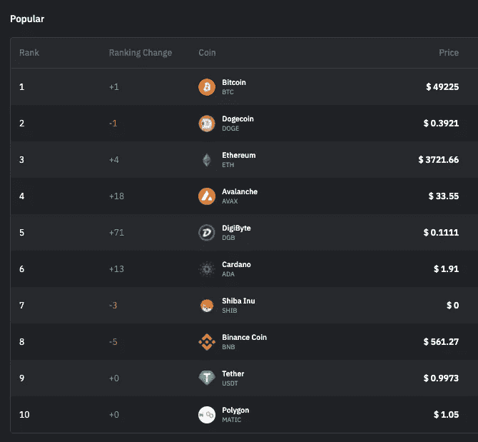
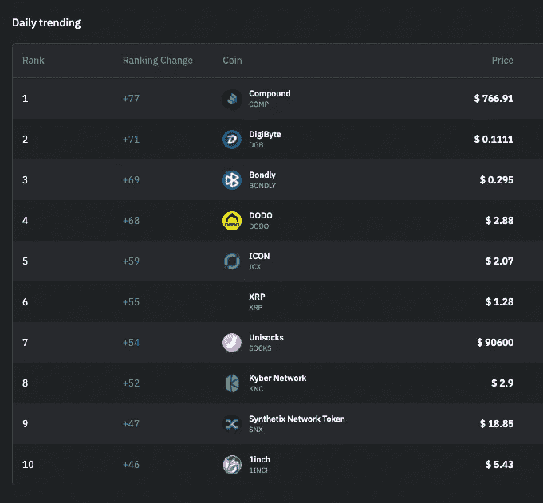
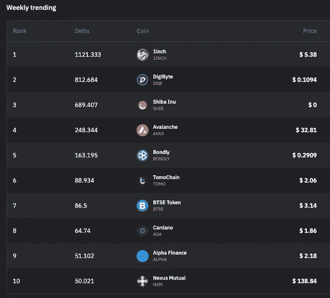

# 在 Twitter 聊天中发现秘密趋势

> 原文：<https://medium.com/coinmonks/finding-crypto-trends-in-twitter-chatter-e6d64f8d52a6?source=collection_archive---------1----------------------->

自从我们上一篇关于如何关注加密新闻的文章以来，Coinfeeds 已经从 reddit 上的一个 T2 机器人发展成了 T4 的一个加密新闻网站。人工智能用于识别新闻标题和推文中提到的硬币，这样你就可以看到关于每个特定硬币的提要。

这让我很好奇，Crypto Twitter 上讨论最多的币是什么？所以我们将此发布到每日推特聊天页面上。

# 演示一天

## 当今最受欢迎的硬币

这是今天的演示，2021 年 5 月 13 日。下面是今天大家谈论最多的币的绝对排名。

比特币通常会排在首位。由于最近发生的事件，Dogecoin 排名第二——前几天它是第一。柴犬仅在几天前才进入前 10 名，但自昨天以来，它的排名已经下降了-3 位。

检查排名与前一天相比变化非常大的硬币总是很有趣的。今天，这些硬币是雪崩(+18)，数码(+71)，和卡尔达诺(+13)

点击硬币，你会看到影响排名变化的最有影响力的推文。对于雪崩，它是:

这是为了回应昨天的新闻，即特斯拉出售比特币是因为它不是可持续开采的，并正在寻找更环保的替代品。此外，Avalanche 今天还发布了一系列其他公告，如与 CoinGecko 的播客，以及在 BTC 土耳其专业版上的上市。你可以点击雪崩看到所有这些推文。

Digibyte 之所以成为潮流，是因为它也声称自己更环保，而且刚刚在 Crypto.com 上市。Cardano 因为更新公告和与其他项目的合作而成为趋势。

Twitter 上排名前 10 的项目也往往是拥有大型社区的成熟项目，通常市值也很大。

我们还展示了一天中排名变化最大的硬币，无论它们在排名中的位置如何—

## **每日趋势币**

今天，流行的硬币是:

# 每周趋势硬币

# 这是怎么创造出来的？

首先，我们使用 Twitter API 监听 800 多个与加密货币相关的 Twitter 账户。这包括加密项目的账户，属于加密团队和创始人的账户，以及经常谈论加密货币的个人。

接下来，我们创建了一个人工智能模型，它可以识别推文何时谈论硬币，然后在知识库中将其解析为一枚硬币。

最后，我们根据提到的硬币汇总推文。

# 我能在哪里找到今天的硬币？

Twitter 聊天页面将在这里托管:[https://coinfeeds.io/discover](https://coinfeeds.io/discover)，并且每天更新。希望你试一试！