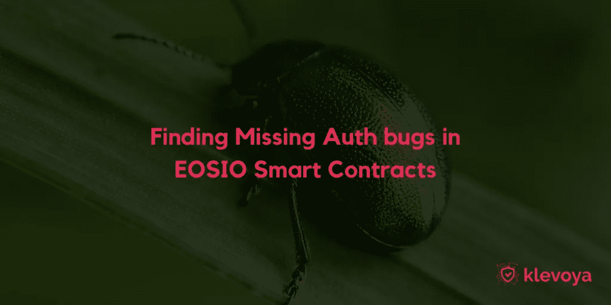

# 在 EOSIO 智能合同中查找缺失的验证错误

> 原文：<https://medium.com/coinmonks/finding-missing-auth-bugs-in-eosio-smart-contracts-242400e10cdc?source=collection_archive---------10----------------------->



这是一系列博客文章，我将在其中介绍一些常见的 EOSIO 智能合约漏洞，然后解释我们如何使用我们的 EOSIO 漏洞扫描器 [Inspect](https://klevoya.com/inspect/) 来执行静态分析，以发现这些漏洞。

本周，我将关注缺失的授权。

# 漏洞

在 EOSIO 中，开发人员可以使用两个函数来控制智能合约动作的授权，方法是检查所声明的动作授权是否等于应该能够运行该动作的帐户。这些是:

*   require_auth(帐户[，权限])
*   has_auth(帐户)

由于缺少授权控制，易受攻击的智能合同向不受信任的帐户(如恶意方)授予授权，以:

*   访问/修改特权智能合同资源，例如智能合同表，
*   代表易受攻击的协定调用其他协定的函数，或者
*   执行任务关键型合同操作，例如代币提款。

让我们来看一个例子，其中设置了一个智能合同，它为 EOS io RAM(EOS io 称之为链上数据库)存储成本付费，在这种情况下，应该检查对数据库的每次写入，以确保调用包含数据库写入的动作的实体具有这样做的适当授权。否则，可能会写入不正确的数据，或者发生 RAM 填充攻击(参见下文的严重性)。

在下面的操作代码中，尽管在定位调用(将数据写入 _users 表)之前有一个 require_auth()调用，但用户不是 RAM 支付者，这允许任何用户使用合同帐户自己的 RAM 写入数据库，从而使合同容易受到 RAM 填充攻击。

Unsafe smart contract action.

修改操作，使用户为 RAM 付费，使操作免受 RAM 填充攻击(因为用户不再使用合同的 RAM 资源):

Smart contract action modified to make it safe.

# 严重

这种类型的漏洞的影响是黑客可以:

*   写入/修改/删除 RAM 中存储的任何数据，这些数据没有受到适当授权检查的充分保护，
*   表面上应该只为智能合同的管理员/特权用户保留的呼叫功能，
*   在 EOSIO 中，RAM 不是免费的，因此黑客可以用虚假数据填充智能合约的 RAM，耗尽 dAPP 的资源，从而导致合法用户拒绝服务。

# 使用 Inspect 查找漏洞

Inspect 采用了一种称为静态分析的技术。静态分析是通过对计算机程序的源代码或某种中间表示进行推理来完成的，而不是实际执行它。

通过 Inspect，我们对 WASM 二进制代码执行静态分析，这是反编译，然后提升到一个专有的中间表示(IR)。Inspect 然后获取 IR，将其表示在数据库中，我们可以从中挖掘已知漏洞的模式。

对包含上述智能合约操作的智能合约运行 Inspect 会产生以下结果:

```
Auth Violation: ✘ Action: emplaceself1 Insn: ($fel) = db_store_i64($feb, $fec, $fef, $feh, $fej, $fek)
```

第一个动作被正确地标记为违反授权检查。当 Inspect 对 WASM 字节代码进行操作时，它会报告 EOSIO 内在 db_store_i64()上发生的违例，该违例对应于调用 launte()的情况。

第二个动作不被报告，因为它是安全的。

在真实的分析场景中，下一步是将这个结果与源代码相关联，并确认这确实是一个漏洞。

还有什么？接下来您希望我覆盖哪些漏洞？

*原载于 2021 年 3 月 8 日*[*【https://klevoya.com】*](https://klevoya.com/blog/finding-missing-auth-bugs-in-eosio-smart-contracts/)*。*

> 加入 Coinmonks [Telegram group](https://t.me/joinchat/EPmjKpNYwRMsBI4p) 并了解加密交易和投资

## 另外，阅读

*   [什么是融资融券交易](https://blog.coincodecap.com/margin-trading)
*   最好的[密码交易机器人](/coinmonks/crypto-trading-bot-c2ffce8acb2a) | [网格交易](https://blog.coincodecap.com/grid-trading)
*   [3 商业评论](/coinmonks/3commas-review-an-excellent-crypto-trading-bot-2020-1313a58bec92) | [Pionex 评论](/coinmonks/pionex-review-exchange-with-crypto-trading-bot-1e459d0191ea) | [Coinrule 评论](/coinmonks/coinrule-review-2021-a-beginner-friendly-crypto-trading-bot-daf0504848ba)
*   [AAX 交易所评论](/coinmonks/aax-exchange-review-2021-67c5ea09330c) | [德里比特评论](/coinmonks/deribit-review-options-fees-apis-and-testnet-2ca16c4bbdb2) | [FTX 交易所评论](/coinmonks/ftx-crypto-exchange-review-53664ac1198f)
*   [n 零复习](/coinmonks/ngrave-zero-review-c465cf8307fc) | [Phemex 复习](/coinmonks/phemex-review-4cfba0b49e28) | [PrimeXBT 复习](/coinmonks/primexbt-review-88e0815be858)
*   [Bybit Exchange 审查](/coinmonks/bybit-exchange-review-dbd570019b71) | [Bityard 审查](/coinmonks/bityard-review-7d104239be35) | [CoinSpot 审查](https://blog.coincodecap.com/coinspot-review)
*   [3 commas vs Cryptohopper](/coinmonks/3commas-vs-pionex-vs-cryptohopper-best-crypto-bot-6a98d2baa203)|[赚取加密利息](/coinmonks/earn-crypto-interest-b10b810fdda3)
*   最好的比特币[硬件钱包](/coinmonks/the-best-cryptocurrency-hardware-wallets-of-2020-e28b1c124069?source=friends_link&sk=324dd9ff8556ab578d71e7ad7658ad7c) | [BitBox02 回顾](/coinmonks/bitbox02-review-your-swiss-bitcoin-hardware-wallet-c36c88fff29)
*   [总账 vs n 平均](/coinmonks/ledger-vs-ngrave-zero-7e40f0c1d694) | [总账 nano s vs x](/coinmonks/ledger-nano-s-vs-x-battery-hardware-price-storage-59a6663fe3b0)
*   [密码本交易平台](/coinmonks/top-10-crypto-copy-trading-platforms-for-beginners-d0c37c7d698c)
*   [CoinLoan 审查](/coinmonks/coinloan-review-18128b9badc4) | [YouHodler 审查](/coinmonks/youhodler-4-easy-ways-to-make-money-98969b9689f2) | [BlockFi 审查](/coinmonks/blockfi-review-53096053c097)
*   最好的[加密税务软件](/coinmonks/best-crypto-tax-tool-for-my-money-72d4b430816b) | [硬币追踪评论](/coinmonks/cointracking-review-a-reliable-cryptocurrency-tax-software-5114e3eb5737)
*   最佳[加密借贷平台](/coinmonks/top-5-crypto-lending-platforms-in-2020-that-you-need-to-know-a1b675cec3fa) | [杠杆代币](/coinmonks/leveraged-token-3f5257808b22)
*   [block fi vs Celsius](/coinmonks/blockfi-vs-celsius-vs-hodlnaut-8a1cc8c26630)|[Hodlnaut Review](/coinmonks/hodlnaut-review-best-way-to-hodl-is-to-earn-interest-on-your-bitcoin-6658a8c19edf)
*   [Bitsgap 审查](/coinmonks/bitsgap-review-a-crypto-trading-bot-that-makes-easy-money-a5d88a336df2) | [Quadency 审查](/coinmonks/quadency-review-a-crypto-trading-automation-platform-3068eaa374e1) | [Bitbns 审查](/coinmonks/bitbns-review-38256a07e161)
*   [埃利帕尔泰坦评论](/coinmonks/ellipal-titan-review-85e9071dd029) | [赛克斯斯通评论](/coinmonks/secux-stone-hardware-wallet-review-15-discount-coupon-2020-7577032faa6e)
*   [本地比特币审核](/coinmonks/localbitcoins-review-6cc001c6ed56) | [加密货币储蓄账户](https://blog.coincodecap.com/cryptocurrency-savings-accounts)
*   最佳[区块链分析](https://bitquery.io/blog/best-blockchain-analysis-tools-and-software)工具| [赚比特币](/coinmonks/earn-bitcoin-6e8bd3c592d9)
*   [加密套利](/coinmonks/crypto-arbitrage-guide-how-to-make-money-as-a-beginner-62bfe5c868f6)指南| [如何做空比特币](/coinmonks/how-to-short-bitcoin-568a2d0b4ae5)
*   最佳[加密制图工具](/coinmonks/what-are-the-best-charting-platforms-for-cryptocurrency-trading-85aade584d80) | [最佳加密交易所](/coinmonks/crypto-exchange-dd2f9d6f3769)
*   [如何在印度购买比特币？](/coinmonks/buy-bitcoin-in-india-feb50ddfef94) | [瓦济克斯审查](/coinmonks/wazirx-review-5c811b074f5b)
*   [印度比特币交易所](/coinmonks/bitcoin-exchange-in-india-7f1fe79715c9) | [比特币储蓄账户](/coinmonks/bitcoin-savings-account-e65b13f92451)
*   [CoinDCX 评论](/coinmonks/coindcx-review-8444db3621a2) | [加密保证金交易交易所](https://blog.coincodecap.com/crypto-margin-trading-exchanges)

> [直接在您的收件箱中获得最佳软件交易](/coinmonks/newsletters/coinmonks)

[](https://medium.com/coinmonks/newsletters/coinmonks)