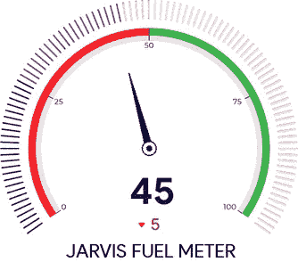
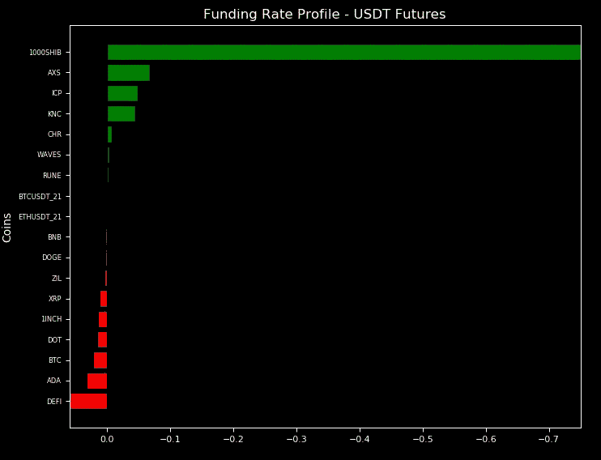
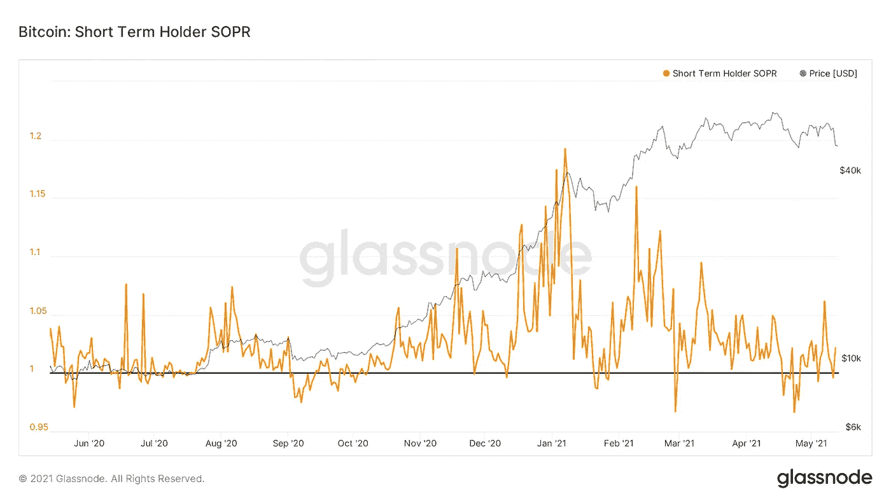
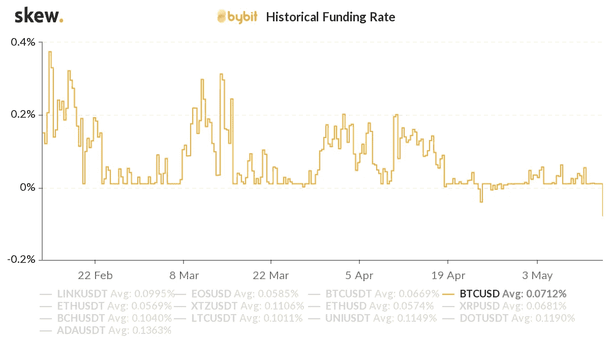
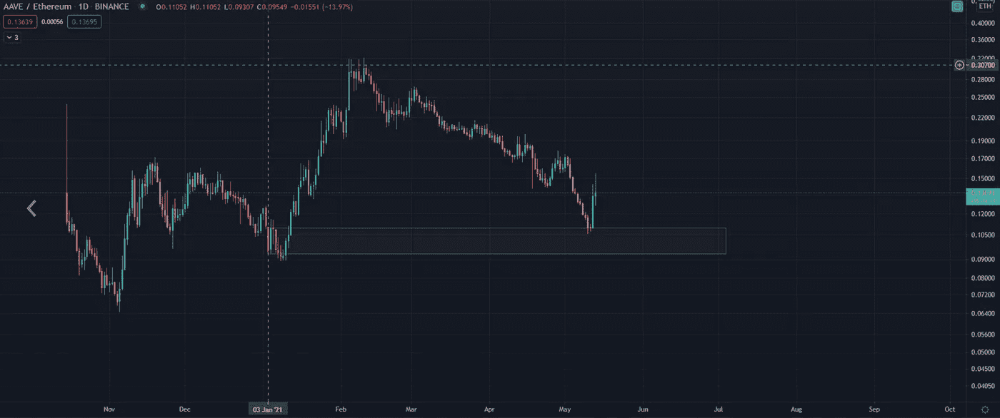
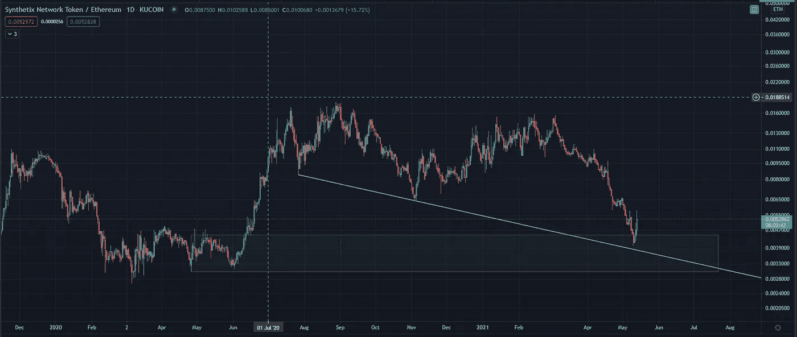
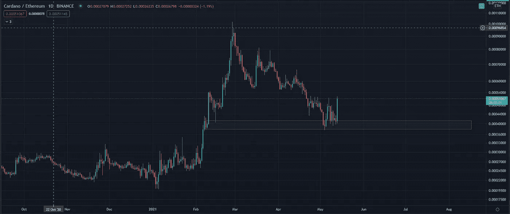

# 在伊隆事件后寻找路点

> 原文：<https://medium.com/coinmonks/finding-waypoints-in-the-elon-aftermath-df7174b9e8e?source=collection_archive---------3----------------------->

我们这个时代最有影响力的人物之一，被认为是比特币的倡导者…

投下一颗炸弹。

我不认为我们需要进入它的细节，因为你可能已经在各种社交媒体网站上搜索了数百个不同的镜头。

在这样做的时候，很明显，震惊让每个人都惊呆了。

这是众所周知的黑天鹅事件。

现在，当灰尘仍在我们周围盘旋时，曾经熟悉的路点在薄雾中消失了。

余震仍有感觉，没有人觉得我们是在坚实的土地上。

幸运的是，我们追踪的钱包中有一个似乎是知情的。你们现在都知道我们在谈论谁……[帕布鲁](https://t.co/w7mxfAQbkY?amp=1)。

他本周做了三笔交易。本周早些时候，他发了 2k，大约 36 小时前发了 2k，然后在埃隆用他的推特打开舱门之前又发了 4k。

巴勃罗在发推特之前知道埃隆吗？

我不确定。

但是在看了这个钱包法案后…实际上不仅仅是一个钱包…很明显，不管他们是谁，他们似乎在播放之前就知道重大新闻。每次他们似乎都在把握市场时机，避免重大抛售。

为此，我们感谢知道他们。在他们的核心圈子里。坦白地说，我们不想知道他们是谁…因为那会破坏一些阴谋。

相反，如果他或她正在阅读，我们只会说谢谢你帮助我们和我们的客户再次避免重大伤害。

现在，正如我前面所说的，我们都在从炮弹休克中恢复过来。埃隆在 Twitter 上关于比特币的言论是一个打击。现在我们可以看到市场缺少几天前的流动性。

这也是为什么燃油表显示的是暗淡的 45 度。事情变化很快。

流动性下降的部分原因是 USDT 的运动。

特别是不久前我们在系绳上看到的铸造。我的意思是……不久前，我们还说动用了数十亿美元的绳索。这发生在抛售之后。

移动超过 10 亿美元不是你对某些事情的反应。你这么做是因为市场正在按计划发展。

然而，埃隆的爆炸不在计划之内。

反过来，USDT 号正在后退……我们目睹了一些最近铸造的 USDT 号返回到未使用的系绳上。这很奇怪。

**为什么会这样？**

我们不能 100%确定。或许埃隆股价下跌给潜在买家带来了不确定性。或者也许买家不再需要那么多 USDT，因为它的跌幅超过预期。或者也许“计划”没有按计划进行。

*为什么*总是很棘手。

但是对我们来说，我们真的不需要知道为什么。我们只知道，当 USDT 像这样波动时，这是一个看跌信号。

有钱能使鬼推磨。

这意味着我们需要保持超级谨慎。我们提到我们正处于一场狗屎风暴中可能是轻描淡写。不管怎样，我们身处其中，是时候经受考验了。

尽管这一切听起来很可怕，很不确定，但还是有一些积极的方面。

首先，融资利率。不仅仅是完全重置，我们现在看到一些融资利率变成了负值。当市场开始过度看跌时，这往往会发生。

此外，SOPR 得到了重置。这个指标告诉我们短期持有者的利润情况。现在指标是 1，这告诉我们我们是中性的…

又一个见证了“重置”的指标。

然后是 Bybit……它对比特币的融资利率变成了负数。上次发生这种情况时，价格在 24-48 小时后触底。之后价格回升了 12000 美元。

所以我们在这里拿着我们的包，想着什么时候尘埃落定。上述指标告诉我们，我们对市场过于悲观，这可能导致反转。

不幸的是，在流动性和连锁交易方面，市场仍然缺乏动力。

这告诉我们，期货交易者仍然需要等待。

但随着许多指标开始向熊市方向偏离，这往往意味着反转的可能性很大。

从我们的长期观点来看，这个周期的顶部没有被记录，考虑用美元成本平均你的现货头寸。

今天我们将留给你一个新的想法…它与灰度无关。那是改天的事了…

# 下一对

开始调出 XXX/ETH 配对的图表。有一些有趣的图表可以看看。随着如此多的资本流入 ETH，从图表的角度来看，这可能变得可靠。

请记住，dex 的主要配对是 XXX/ETH，这就是这些图表变得相关的原因。

此外，ADA 智能合约即将推出，这或许可以解释为什么 ETH 会流入 ADA。

这里有一些 ETH 配对的例子可以观察…

AAVE/联邦理工学院

SNX/联邦理工学院

ADA/ETH

好了，今天我说的够多了。

不要做任何鲁莽的事。这个地方不错。期货仍然是一个禁忌。我们仍在等待动力的建立…同时，在你的空闲时间开始浏览一些 XXX/ETH 图表。

明天会有更多。

你的脉搏在加密，

本·莉莉

附注——要跟进我们的日常见解和分析，请务必[订阅此处](https://jarvislabs.substack.com/welcome)。

> 又念:[比特币基地卡评](https://blog.coincodecap.com/coinbase-card-review)