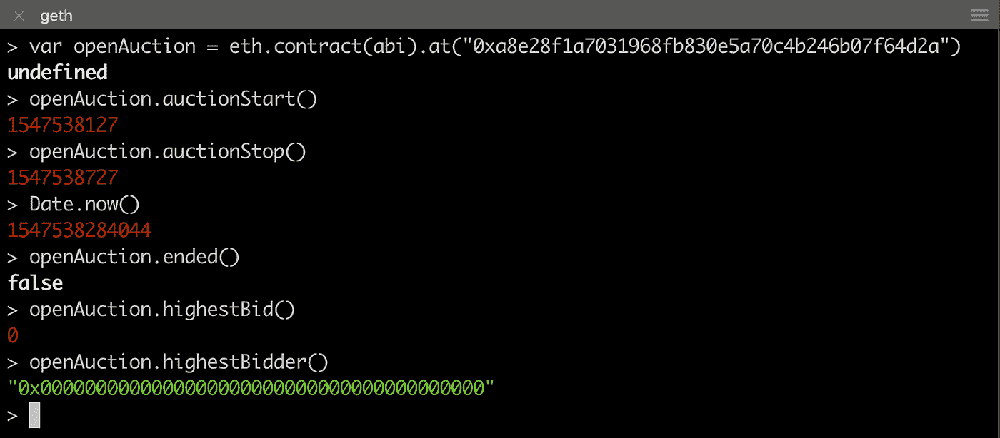

# 第一次尝试 Vyper

> 原文：<https://medium.com/coinmonks/first-attempt-on-vyper-eb1d1ccea6ed?source=collection_archive---------2----------------------->

# 概观

Solidity 是以太坊世界事实上的契约编码语言。然而，自从她的诞生以来，人们不断发现这种编码语言的问题，并要求一种更好的语言。Vyper 目前开始得到更多的关注。

本文绝不是对以太坊两种合约编码语言的深入比较。相反，我尝试用一个示例应用程序来做一个实际的比较，看看将相同的逻辑写入这两种语言时会有什么不同。编译后，只要逻辑正确，无论使用哪种编码语言，契约部署和交互都应该是一样的。因此，我使用 Vyper 编码的契约中的字节码遍历了几个测试用例。

希望这对那些还没有看过 Vyper 的人来说是第一次接触，并能引起他们的一些兴趣来进一步探索以太坊世界中这种新的契约语言。

# 待建合同:公开拍卖

这是一个非常简单的应用程序。公开拍卖假设某样东西通过拍卖公开出售，任何人(拥有以太坊账户)都可以用自己的以太竞价。

当部署契约时，我们需要指定两条信息:

*   受益人，拍卖时间结束后，谁将获得最高出价。这由以太坊地址表示。
*   拍卖时间(秒)，这是拍卖的周期。投标在拍卖期间被接受，在拍卖结束时被拒绝。只有在拍卖期结束后，投标才会转让给受益人。

在拍卖期间，合同是公开招标的，并跟踪最高出价和投标人作为其状态变量。当它看到一个出价更高的投标人时，该合同将把以前的最高出价退还给以前的投标人，并保留新的出价。合同只是拒绝低于当前最高价的投标。

注意:它决不是一个拍卖合同的最好和最优化的实现。关于如何使拍卖合同更好、更安全，有很多讨论。这只是一个演示拍卖基本操作的最小合同。

注意:这个合同代码改编自 Vyper ( [链接](https://vyper.readthedocs.io/en/v0.1.0-beta.6/vyper-by-example.html))中的例子和 Blockgeeks ( [链接](https://www.youtube.com/watch?v=sviTkGp6D_Q))的一个视频。

# 合同代码:并列

## 相似结构

Solidity 和 Vyper 的结构非常相似，可以很容易地分为三个部分，

*   状态变量:可以为合同定义变量的地方。这些变量永久保存在已部署契约的存储 trie 中，并且只能通过调用契约函数来更新。
*   构造函数:部署协定时执行一次的创建代码。它用于初始化状态变量。
*   功能:在合同部署后，通过事务调用一个或多个功能。一旦被调用，函数中的代码就会被执行(在 EVM 上)，状态变量和其他状态也会相应地更新。


下面是如何使用两种编码语言实现逻辑的。


只是两种语言之间的一个快速比较，

*   Solidity 的编码格式是类 JavaScript 的(可以说)，而 Vyper 显然是基于 Python 的。看看如何定义构造函数和函数，如何用 *self* 引用一个状态。
*   Vyper 中定义的数据类型更多，比如*时间戳*、*时间增量*、 *wei_value* 等。
*   Visibility(如 public、private)和 payable 等其他关键字在 Vyper 中被编码为注释。

当然，在比较代码时会有更多的差异，但这些只是我们在这两份合同中并排观察到的。

# 编译和部署

像其他领域的任何编码语言一样，Solidity 和 Vyper 都有自己的编译器。编译的目标是为契约部署生成两条信息:应用程序二进制接口(ABI)和字节码。

*   ABI:当我们以人的方式与一个已部署的契约交互时，就会用到它(带有 SDK 或命令行的应用程序)
*   字节码:它是包含指令的机器代码，在部署契约和调用函数时由 EVM 执行。


我用于代码编译的工具是

*   remix([http://remix.ethereum.org](http://remix.ethereum.org))以太坊合约的在线工具
*   vyper online([https://vyper . online](https://vyper.online))vyper 合同编制的在线工具


Bytecode truncated in both contracts

我们不会对它们的 ABI 和字节码进行逐字节的比较，因为我们不期望两者都生成相同的代码。我们也不会对字节码的大小和消耗做出结论，因为目前我们只有一个合同，没有进行非常详细的分析。然而，只要我们能够通过执行函数实现相同的逻辑，我们就假设两者都工作正常。

对于 Solidity 编码的契约和 Vyper 编码的契约，字节码的部署是相同的。记住，两种字节码将交付相同的功能和逻辑，EVM 不关心字节码是从哪种编码语言开发的。

# 使用以太坊模拟器和 Geth 客户端进行测试

为了展示编译的结果，我们将部署契约。这是我们将要执行的步骤。


由于两者都产生相同的结果，这里我只将捕获的代码截图放在 **Vyper** 中。

我的屏幕分成两部分:右手边是 ganache-cli 以太坊模拟器，它有 10 个以太坊帐户，每个帐户有 100 个以太。

左手边是我部署契约并与部署的契约交互的地方。


第一步

首先我们定义变量 **abi** 和**字节码**。然后使用命令 *eth.contract()。新*部署合同。注意 **eth.accounts[9]** 是受益人，拍卖持续时间是 600 秒(10 分钟)。

```
> eth.contract(abi).new(eth.accounts[9], 600, {from: eth.accounts[0], data: bytecode, gas: 1000000})
```


我们从 ganache-cli 窗口获取合同 ID。现在，我们为这个已部署的契约定义一个对象 **openAuction** 。我们使用 **openAuction** 与这个部署的契约进行交互。

```
> var openAuction = eth.contract(abi).at(<contract address>)
```

开始时，我们看到拍卖开始和停止的时间(以秒为单位)。 *Date.now()* 给出当前时间(以毫秒为单位)。它小于拍卖停止时间，意味着我们仍处于拍卖期间。

此外，我们看到最高出价目前为零，还没有投标人提交投标。



第二步

投标人 **eth.accounts[1]** 提交一份包含 10 个醚的标书。交易正在处理中。现在最高出价和最高出价者反映了这个出价。注意 **eth.accounts[1]** 余额为~90 醚，比之前的余额少了 10 醚(加上竞价交易消耗的一些气)。


第三步

另一个投标人 **eth.accounts[2]** 提交了一份包含 15 个醚的投标。交易执行后，最高出价和最高出价者反映这一新的出价。不出所料，15 个醚从 **eth.accounts[2]** 处被拍走，而 **eth.accounts[1]** 拿回资金，因为它不再是最高出价。


第四步

另一个投标人 **eth.accounts[3]** 试图以 12 个醚的值投标，这低于当前的最高出价(15 个醚)。结果是根据我们的契约代码(断言)进行恢复。同时，最高出价和最高出价者保持为步骤 3。


第五步

**eth.accounts[0]** 试图执行 *endAuction()* 函数，该函数要求结束拍卖。然而，这又是一个回复，因为拍卖时间还没有结束。当前时间仍小于拍卖停止时间。


第六步

拍卖时间结束后(见当前时间现在大于拍卖停止时间)， **eth.accounts[0]** 现在可以执行 *endAuction()* 函数。根据代码设计，状态变量 ended 现在为真，最高出价(15 个醚)被转移给受益人(**eth . accounts【9】**)。


第七步

拍卖时间结束后，如果任何帐户试图提交出价，则会发生回复，因为出价仅在拍卖期间被接受(断言)。


第八步

如果有人试图再次执行 *endAuction()* ，就会发生 revert，因为整个拍卖已经结束。


# 结束和进一步参考

Vyper 的结构与 Solidity 几乎相同(事实上，其他区块链框架中的所有智能契约编码看起来都非常相似)。使用 Vyper 的编译器，我们可以取回 ABI 和字节码，并以正常的方式部署和交互契约。

如果你有兴趣了解更多关于 Vyper 的信息，在这个[站点](https://github.com/ethereum/vyper/wiki/Vyper-tools-and-resources)有一个资源列表。不要忘记 Vyper 仍处于测试阶段，随着时间的推移会有所发展。

> [在您的收件箱中直接获得最佳软件交易](https://coincodecap.com/?utm_source=coinmonks)

[](https://coincodecap.com/?utm_source=coinmonks)