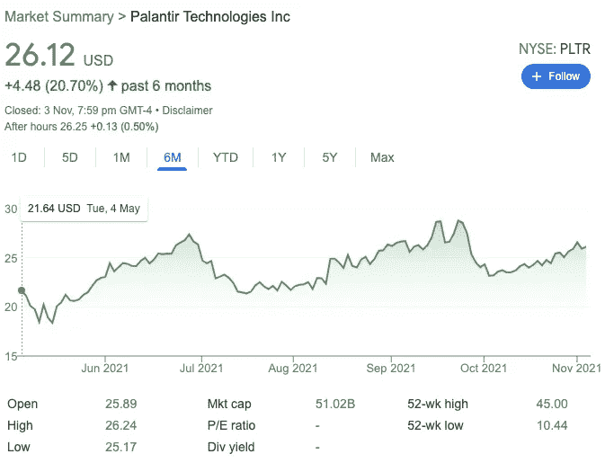
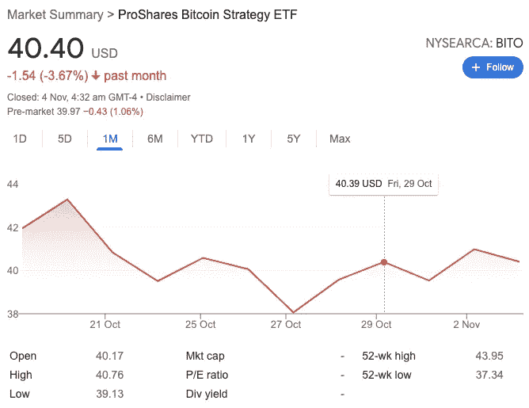
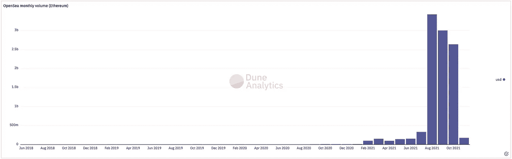
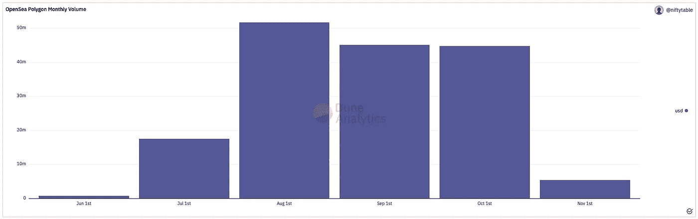
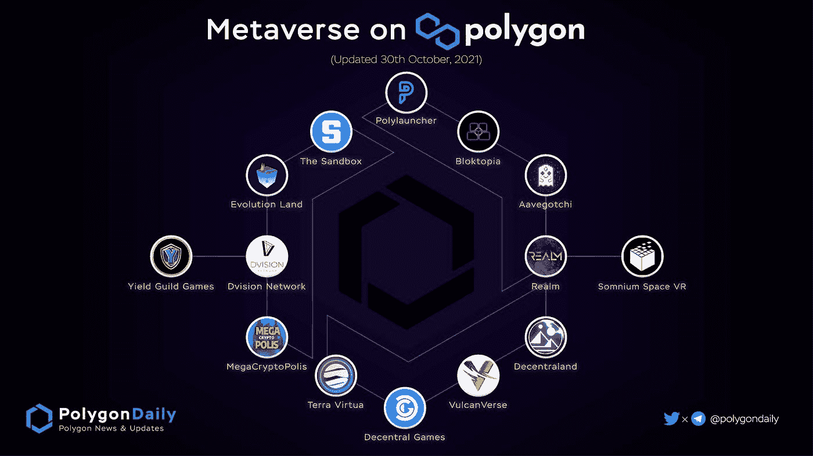

# 第一个比特币 ETF、以太坊、Matic 和元宇宙——第一部分

> 原文：<https://medium.com/coinmonks/first-bitcoin-etf-ethereum-matic-and-metaverse-part-i-c7ded8b4beef?source=collection_archive---------6----------------------->

## 新一代引领的有趣趋势—[2021 年 10 月]

Photo by [Anna Shvets](https://www.pexels.com/@shvetsa?utm_content=attributionCopyText&utm_medium=referral&utm_source=pexels) from [Pexels](https://www.pexels.com/photo/portrait-of-shiba-inu-dog-4588013/?utm_content=attributionCopyText&utm_medium=referral&utm_source=pexels)

十月充满了激动人心的事件。我会分享一些关于我的财产的更新。

# **目录**

## [帕兰提尔](#21a7)

## →[Palantir 的新催化剂——8 亿美元的陆军合同](#8fda)

## [加密货币](#2249)

## → [首个比特币 ETF 获批](#f729)

## → [ETH — Matic — NFTs](#966e)

## → [元宇宙](#7149)

# 帕兰提尔

*下一个季度报告的截止日期是 2021 年 11 月 9 日。*

Screenshot captured from google.com.

Palantir 于今年 7 月推出了 Foundry for Builders。本月早些时候，Palantir 宣布了一批新的参与者。这项工作旨在帮助初创公司以简单、廉价的方式为其数据建立一个集中的操作系统，从而加强其独特的价值主张。

> “Palantir Foundry 作为完全托管的 SaaS 提供，它提供了一个端到端的平台，从云托管和数据集成到灵活的分析、可视化、模型构建、运营决策和决策捕获。将这些功能作为单个平台的一部分可以消除摩擦，并防止用户在孤立技术间移动时丢失数据历史记录、安全性和隐私。”—[businesswire.com](https://www.businesswire.com/news/home/20210720005346/en/Palantir-Introduces-Foundry-for-Builders)

他们的商业模式包括从大公司扩张到更小的高速增长的公司。该公司最初只与和校友有联系的公司合作。现在，这一举措正慢慢扩展到其他初创公司。我认为这是帕兰提尔的明智之举。面对来自其他面向消费者的数据平台提供商的激烈竞争，如 Verint，一家与超过 85%的财富 100 强公司合作的 SaaS 公司，它必须找到增加其消费者产品的方法。花时间与初创公司一起成长，比试图说服大公司转移数据要容易得多。

## Palantir 的新催化剂——8 亿美元的陆军合同

美国陆军授予 Palantir 一份价值 8.23 亿美元的合同，这是其现代化遗留战场情报系统努力的一部分。作为此次收购的结果，Palantir 将协助美国陆军提供一个全球情报数据网络，使其能够在全球范围内分发情报数据。

> 什么是数据结构？
> 
> 数据结构是一种架构和一组数据服务，可为混合多云环境中的各种终端提供一致的功能。这是一个强大的体系结构，它标准化了跨云、内部和边缘设备的数据管理实践和实用性。在数据结构提供的众多优势中，数据可见性和洞察力、数据访问和控制、数据保护以及安全性很快成为重中之重。—[netapp.com](https://www.netapp.com/data-fabric/what-is-data-fabric/)

简而言之，士兵将能够获得由数量呈指数增长的传感器和国家情报机构收集的及时情报。由于政府资金目前占 Palantir 业务的近三分之二，这份合同无疑将进一步扩大 Palantir 最大的增长引擎。

# 加密货币

今年，我通过持有几个密码来分散投资组合。由于主要硬币的牛市，我能够平衡其余美国股票的损失。

## 首个比特币 ETF 获批

Screenshot from google.com

全球已经有几家合法的加密货币交易所允许投资者直接投资比特币。然而，BITO 比特币交易所交易基金为传统投资者提供了较低的拥有成本，这些投资者过去通过富达(Fidelity)和先锋(Vanguard)等传统投资经纪公司进行投资。有趣的是，大多数人认为像这样的 ETF 直接持有比特币。这不是真的。相反，它持有比特币期货合约。

 [## ETF 数据、分析和教育，满足您的决策需求。

### 在所有的 ETF 噪音中需要一些焦点？了解 Trackinsight 如何帮助您做出更好的投资决策。

www.trackinsight.com](https://www.trackinsight.com/en/article/bito-etf-how-futures-etfs-work) 

因此，ETF 投资者需要支付管理费，而且一旦合约到期，还必须承担与转入期货合约相关的成本。相比较而言，这导致交易标的资产时表现较低。就价格变动而言，这对大多数比特币投资者来说是个好消息，因为它增加了交易量。未来，我相信会有更多的公司加入 Proshare，提供自己的比特币 ETF，这可能会进一步稳定加密市场。

## ETH — Matic — NFTs

Image from [https://polygon.technology/brand-resources/](https://polygon.technology/brand-resources/)

你们有些人知道，我是以太坊和 Matic(现在叫 Polygon，是给 Polygon 网络加油的以太坊令牌)的坚定信徒。最近 NFT 市场的繁荣让我对 ETH 和 Matic 比以往任何时候都更有信心，为什么呢？

首先，让我们看看 Matic 与 Eth 的关系。众所周知，以太坊希望通过 ETH 2.0 成为区块链的互联网。然而，以太坊的联合创始人之一 Vitalik Buterin 指出，由于内部团队冲突，而不是因为技术困难，升级到 ETH 2.0 可能需要数年时间。面对来自 Polkadot 和 Chainlink 的竞争，以太坊推出了 Matic network 这一缩放解决方案，从此成为 Polygon。以太坊的功能和核心协议层现在可供无数区块链和分散式应用程序访问，而不受以太坊缓慢的交易时间和高昂的燃气费的限制。此外，Polygon 已经推出了他们的 SDK(目前处于测试阶段)和协议，当与以太坊的安全性相结合时，可以轻松部署高度安全和可伸缩的区块链。AAVE 和 Curve Finance 是另外两个将其协议移植到 Matic sidechain 的主要平台。这样，最终用户可以使用 DeFi，而不必支付高昂的气费来换取 ETH。

我们现在对 Matic 有了更好的理解。Matic 和 ETH 的成长能否归功于对 NFT 兴趣的高涨？由于我不想花时间解释什么是 NFT，我会在这里留下一个链接，如果你感兴趣的话，你可以了解更多。

 [## 人们在非食物疗法上花费了数百万。什么？为什么？

### NFT，或不可替代的令牌，已经存在一段时间了，但是“NFT”是什么意思呢？几个…

www.theverge.com](https://www.theverge.com/22310188/nft-explainer-what-is-blockchain-crypto-art-faq) 

非功能性测试在艺术中最常用。一旦购买了数字艺术品，就向购买者提供数字真品证书。分析平台 DappRadar 报告称，Opensea 的总交易额超过 65 亿美元，是目前最大的 NFT 市场。自 2021 年 7 月以来，Opensea 一直在将 Polygon POS 集成到区块链支持中，使其用户能够更快、更便宜地进行交易。根据其[官方网站](https://medium.com/r?url=https%3A%2F%2Fblog.polygon.technology%2Fsails-up-on-the-opensea-nft-marketplace-opensea-comes-to-polygon%2F)，OpenSea 仅占以太坊交易量的 1.5%。这意味着增长的空间仍然很大。此外，由于 Polygon 的低天然气交易费，它可能会在未来超过其兄弟姐妹的受欢迎程度。所以，随着对 NFTs 兴趣的不断上升，相信在不久的将来，Matic 和以太坊会变得更有价值。

**Monthly Volume has maintained on Ethereum NFTs on OpenSea. Image from** [https://dune.xyz/queries/3469/6913](https://dune.xyz/queries/3469/6913)

**Monthly Volume has maintained on Polygon NFTs on OpenSea. Image from** [https://dune.xyz/queries/130812/257532](https://dune.xyz/queries/130812/257532)

## 虚拟空间

脸书的名字最近被改成了 Meta，目的是让元宇宙充满生机。拥有元宇宙焦点的隐字，比如法力，也因为名字的改变而飙升。尽管 Mana 在投资者中获得了牵引力，但许多人可能不知道 Polygon 自 6 月以来一直在支持元宇宙平台——沙盒。由于更好的用户体验和减少的碳足迹，该平台将整个 NFT 系统迁移到多边形区块链。在最近的一份公告中，公司[宣布](https://www.businesstimes.com.sg/garage/metaverse-platform-the-sandbox-secures-us93m-in-series-b-round-led-by-softbank-vision-fund-2)已经在软银愿景基金 2 牵头的 B 轮基金中筹集了 9300 万美元。元宇宙不断增长的经济将提高多边形区块链及其本国货币 Matic 的效用，导致代币价格大幅上涨。此外，随着乙醚燃烧，乙醚的排放量将继续下降。因此，以太坊用户和以太持有者将受益于去中心化元宇宙的出现。

Image from [https://twitter.com/MihailoBjelic/status/1456091349745295362/photo/1](https://twitter.com/MihailoBjelic/status/1456091349745295362/photo/1)

# 第二部分

我看涨 Palantir 和我目前持有的一些加密货币的原因已经在上面解释过了。我还有待澄清我持有柴犬、阿达等币的理由。下一部分将解释我对第四季度中国市场的展望，以及为什么我认为现在投资柴犬和 Ada 可能是明智之举。

*请跟随我，继续关注我的第二部分分析。*

# 关于作者

Woen Yon 是新加坡的一名数据科学家。他的经验包括为几家跨国企业开发先进的人工智能产品。

Woen Yon 与少数聪明人合作，为当地和国际初创企业主提供网络解决方案，包括网络爬行服务和网站开发。他们非常清楚构建高质量软件的挑战。如果你需要帮助，请不要犹豫，给他发一封电子邮件到 wushulai@live.com。

他喜欢交朋友！欢迎在 [LinkedIn](https://www.linkedin.com/in/woenyon/) 和 [Medium](https://laiwoenyon.medium.com/) 上与他联系

 [## 赖文渊-媒体

### 阅读赖文渊在媒体上的文章。数据科学家，TDS 特约撰稿人。我喜欢结交来自世界各地的朋友…

medium.com](/@laiwoenyon) 

# 参考

1.  [https://seeking alpha . com/article/4461289-palantir-stock-needs-a-catalyst](https://seekingalpha.com/article/4461289-palantir-stock-needs-a-catalyst)
2.  [https://hypercharts.co/pltr](https://hypercharts.co/pltr)
3.  [https://www . business wire . com/news/home/20210720005346/en/Palantir-Introduces-Foundry-for-Builders](https://www.businesswire.com/news/home/20210720005346/en/Palantir-Introduces-Foundry-for-Builders)
4.  [https://finance . Yahoo . com/news/palantir-introduces-second-coquet-foundry-203000798 . html](https://finance.yahoo.com/news/palantir-introduces-second-cohort-foundry-203000798.html)
5.  [https://www . Reuters . com/technology/bit coin-futures-highlight-some-陷阱-new-etfs-2021-10-19/](https://www.reuters.com/technology/bitcoin-futures-highlight-some-pitfalls-new-etfs-2021-10-19/)
6.  [https://academy . shrimpy . io/post/what-is-polygon-matic-and-how-can-it-save-ether eum](https://academy.shrimpy.io/post/what-is-polygon-matic-and-how-can-it-save-ethereum)
7.  [https://www . investing . com/news/cryptocurrency-news/eth-20-update-what-taking-so-long-2526352](https://www.investing.com/news/cryptocurrency-news/eth-20-update-whats-taking-so-long-2526352)
8.  [https://medium . com/nerd-for-tech/top-10-NFT-market place-41 f2ca 114162](/nerd-for-tech/top-10-nft-marketplace-41f2ca114162)
9.  [https://blog . polygon . technology/sails-up-on-the-open sea-NFT-market place-open sea-comes-to-polygon/](https://blog.polygon.technology/sails-up-on-the-opensea-nft-marketplace-opensea-comes-to-polygon/)
10.  [https://www . business times . com . SG/garage/元宇宙-platform-the-sandbox-secures-us93m-in-series-b-round-lead-by-Softbank-vision-fund-2](https://www.businesstimes.com.sg/garage/metaverse-platform-the-sandbox-secures-us93m-in-series-b-round-led-by-softbank-vision-fund-2)

> 加入 Coinmonks [电报频道](https://t.me/coincodecap)和 [Youtube 频道](https://www.youtube.com/c/coinmonks/videos)了解加密交易和投资

## 另外，阅读

*   [如何购买 Monero](https://blog.coincodecap.com/buy-monero) | [IDEX 评论](https://blog.coincodecap.com/idex-review) | [BitKan 交易机器人](https://blog.coincodecap.com/bitkan-trading-bot)
*   [如何在 Bitbns 上购买柴犬(SHIB)币？](https://blog.coincodecap.com/buy-shiba-bitbns) | [币安](https://blog.coincodecap.com/binance-in-india)
*   [币安 vs 比特邮票](https://blog.coincodecap.com/binance-vs-bitstamp) | [比特熊猫 vs 比特币基地 vs Coinsbit](https://blog.coincodecap.com/bitpanda-coinbase-coinsbit)
*   [如何购买 Ripple (XRP)](https://blog.coincodecap.com/buy-ripple-india) | [非洲最好的加密交易所](https://blog.coincodecap.com/crypto-exchange-africa)
*   [非洲最佳加密交易所](https://blog.coincodecap.com/crypto-exchange-africa) | [Hoo 交易所评论](https://blog.coincodecap.com/hoo-exchange-review)
*   [eToro vs robin hood](https://blog.coincodecap.com/etoro-robinhood)|[MoonXBT vs by bit vs Bityard](https://blog.coincodecap.com/bybit-bityard-moonxbt)
*   [Stormgain 回顾](https://blog.coincodecap.com/stormgain-review) | [Bexplus 回顾](https://blog.coincodecap.com/bexplus-review) | [币安 vs Bittrex](https://blog.coincodecap.com/binance-vs-bittrex)
*   [Bookmap 评论](https://blog.coincodecap.com/bookmap-review-2021-best-trading-software) | [美国 5 大最佳加密交易所](https://blog.coincodecap.com/crypto-exchange-usa)
*   [如何在 FTX 交易所交易期货](https://blog.coincodecap.com/ftx-futures-trading) | [OKEx vs 币安](https://blog.coincodecap.com/okex-vs-binance)
*   [如何在势不可挡的域名上购买域名？](https://blog.coincodecap.com/buy-domain-on-unstoppable-domains)
*   [印度的秘密税](https://blog.coincodecap.com/crypto-tax-india) | [altFINS 审查](https://blog.coincodecap.com/altfins-review) | [Prokey 审查](/coinmonks/prokey-review-26611173c13c)
*   [区块链 vs 比特币基地](https://blog.coincodecap.com/blockfi-vs-coinbase) | [比特坎评论](https://blog.coincodecap.com/bitkan-review) | [币安评论](/coinmonks/binance-review-ee10d3bf3b6e)
*   [Coldcard 评论](https://blog.coincodecap.com/coldcard-review) | [BOXtradEX 评论](https://blog.coincodecap.com/boxtradex-review)|[uni swap 指南](https://blog.coincodecap.com/uniswap)
*   [阿联酋 5 大最佳加密交易所](https://blog.coincodecap.com/best-crypto-exchanges-in-uae) | [SimpleSwap 评论](https://blog.coincodecap.com/simpleswap-review)
*   购买 Dogecoin 的 7 种最佳方式
*   [iTop VPN 审查](https://blog.coincodecap.com/itop-vpn-review) | [曼陀罗交易所审查](https://blog.coincodecap.com/mandala-exchange-review)
*   [美国最佳加密交易机器人](https://blog.coincodecap.com/crypto-trading-bots-in-the-us) | [经常性回顾](https://blog.coincodecap.com/changelly-review)
*   [A-Ads 审查](https://blog.coincodecap.com/a-ads-review) | [Bingbon 审查](https://blog.coincodecap.com/bingbon-review) | [Mudrex 投资](https://blog.coincodecap.com/mudrex-invest-review-the-best-way-to-invest-in-crypto)