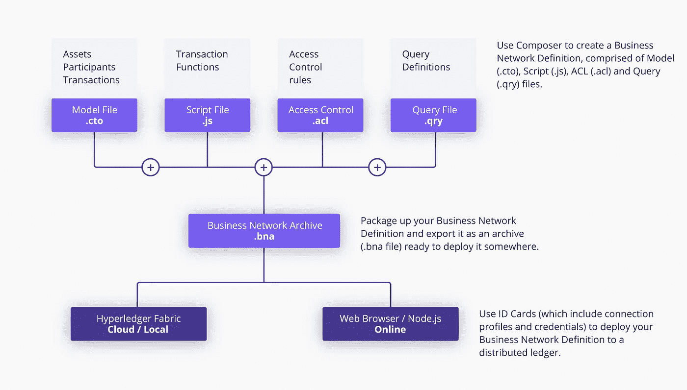

# 第一个使用 Hyperledger Composer 的商业网络

> 原文：<https://medium.com/coinmonks/first-business-network-using-hyperledger-composer-ba1691c5e466?source=collection_archive---------0----------------------->


Hyperledger Composer 是一个广泛的、开放的开发工具集和框架，使开发区块链应用程序更加容易。主要目标是加速实现价值，并使您的区块链应用程序与现有业务系统的集成更加容易。

*   您可以使用 Composer 在几天内快速开发用例并部署区块链解决方案。
*   Composer 允许您对业务网络建模，并将现有系统和数据与区块链应用程序集成。
*   Hyperledger Composer 支持现有的 [Hyperledger Fabric 区块链](https://hyperledger.org/)基础设施和运行时。
*   Hyperleder Composer 生成业务网络档案(bna)文件，您可以在现有的 Hyperledger 结构网络上部署该文件

您可以使用 Hyperledger Composer 对业务网络进行建模，其中包含您的现有资产以及与其相关的事务

## Hyperledger Composer 的关键概念

1.  区块链状态存储:它存储您的 hyperledger composer 应用程序中发生的所有交易。它将交易存储在 Hyperledger 结构网络中。
2.  连接配置文件:连接配置文件到配置 JSON 文件，帮助 composer 连接到 Hyperledger Fabric。您可以在用户的主目录中找到连接配置文件 JSON 文件。
3.  资产:资产是有形或无形的商品、服务或财产，并存储在注册表中。资产可以代表业务网络中的几乎任何东西，例如，待售房屋、销售清单、该房屋的土地注册证书。资产必须有唯一的标识符，但是除此之外，它们可以包含您定义的任何属性。
4.  参与者:参与者是商业网络的成员。他们可能拥有资产并提交交易。参与者必须有一个标识符，并且可以有任何其他属性。
5.  身份和 ID 卡:参与者可以与一个身份相关联。ID 卡是身份、连接配置文件和元数据的组合。ID 卡简化了连接到企业网络的过程。
6.  事务:事务是参与者与资产交互的机制。您可以在 JavaScript 中定义事务处理逻辑，也可以为事务发出事件。
7.  查询:查询用于返回关于区块链世界国家的数据。查询在业务网络中定义，并且可以包括用于简单定制的可变参数。通过使用查询，可以很容易地从您的区块链网络中提取数据。使用 Hyperledger Composer API 发送查询。
8.  事件:事件在模型文件中定义。一旦定义了事件，它们就可以由交易处理器功能发出，以向外部系统指示分类帐发生了重要的事情。
9.  访问控制:Hyperledger 是企业区块链，访问控制是任何企业区块链的核心功能。使用访问控制规则，您可以定义谁可以在业务网络中做什么。访问控制语言足够丰富，可以捕捉复杂的条件。
10.  历史记录注册表:历史记录注册表是一个专门的注册表，记录成功的交易，包括提交交易的参与者和身份。历史记录将事务存储为历史记录资产，这些资产在 Hyperledger Composer 系统名称空间中定义。

## 让我们创建第一个 Hyperledger Composer 应用程序

步骤 1:启动本地的 Hyperledger Composer Online 版本。点击部署新的业务网络


Hyperledger Composer Playground Online version

步骤 2:选择空的业务网络


第三步:填写基本信息，选择空的营业网点，点击右侧面板的“部署”按钮


Fill basic information


select empty business network

步骤 4:连接到我们刚刚部署的“硬件-资产”业务网络


click on “connect now” button


Inside hardware-assets business network

步骤 5:点击左侧面板中的“+添加文件…”并选择“模型文件(。cto)”


在模型文件中编写以下代码。模型文件包含资产，在我们的例子中是硬件，在我们的例子中参与者是组织的雇员，当分配硬件给雇员时进行交易。每个模型都有额外的属性。确保您拥有正确且唯一的名称空间。在这个例子中，我使用“com.kpbird”作为名称空间。您可以使用此命名空间访问所有模型，即 com.kpbird.Hardware、com.kpbird.Employee

```
/**
 * Hardware model
 */namespace com.kpbirdasset Hardware identified by hardwareId {
 o String hardwareId
 o String name
 o String type
 o String description
 o Double quantity
 → Employee owner
}
participant Employee identified by employeeId {
 o String employeeId
 o String firstName
 o String lastName
}
transaction Allocate {
 → Hardware hardware
 → Employee newOwner
}
```

Hyperledger 建模语言参考:[https://hyperledger . github . io/composer/reference/CTO _ language . html](https://hyperledger.github.io/composer/reference/cto_language.html)

第六步:点击左侧面板中的“+添加文件…”并选择“脚本文件(*。js)"


在脚本文件中编写以下代码。在脚本中，我们可以定义事务处理逻辑。在我们的例子中，我们希望将硬件分配给员工，因此，我们将更新硬件的所有者。确保在函数@params 和@transaction 上面有注释

```
/**
 * Track the trade of a commodity from one trader to another
 * [@param](http://twitter.com/param) {com.kpbird.Allocate} trade — the trade to be processed
 * [@transaction](http://twitter.com/transaction)
 */
function allocateHardware(allocate) {
 allocate.hardware.owner = allocate.newOwner;
 return getAssetRegistry(‘com.kpbird.Hardware’)
 .then(function (assetRegistry) {
 return assetRegistry.update(allocate.hardware);
 });
}
```

Hyperledger Composer 脚本文件参考:[https://hyperledger . github . io/Composer/reference/js _ scripts . html](https://hyperledger.github.io/composer/reference/js_scripts.html)

步骤 7: permissions.acl 文件示例已经可用，请在 permissions.acl 文件中添加以下代码。

```
/**
 * New access control file
 */
 rule AllAccess {
 description: “AllAccess — grant everything to everybody.”
 participant: “ANY”
 operation: ALL
 resource: “com.kpbird.**”
 action: ALLOW
 }rule SystemACL{
 description: “System ACL to permit all access”
 participant: “org.hyperledger.composer.system.Participant”
 operation: ALL
 resource: “org.hyperledger.composer.system.**”
 action: ALLOW
}
```

Hyperledger Composer 访问控制语言参考:[https://hyperledger . github . io/Composer/reference/ACL _ Language . html](https://hyperledger.github.io/composer/reference/acl_language.html)

步骤 8:现在，是时候测试我们的硬件资产业务网络了。Hyperledger composer 在自己的 composer 面板中提供“测试”功能。点击顶部面板中的“测试”选项卡


Test feature of Hyperledger Composer

步骤 9:创建资产。单击左侧面板中的“硬件”,然后单击右上角的“+创建新资产”,并添加以下代码。我们将在下一步创建员工#01。点击“新建”按钮

```
{
 “$class”: “com.kpbird.Hardware”,
 “hardwareId”: “MAC01”,
 “name”: “MAC Book Pro 2015”,
 “type”: “Laptop”,
 “description”: “Mac Book Pro”,
 “quantity”: 1,
 “owner”: “resource:com.kpbird.Employee#01”
}
```


After adding Hardware assets

步骤 10:让我们创建参与者。单击“员工”，然后单击“+创建新参与者”并添加以下代码。我们将增加两名员工

```
{
 “$class”: “com.kpbird.Employee”,
 “employeeId”: “01”,
 “firstName”: “Ketan”,
 “lastName”: “Parmar”
}
```

点击对话框上的“新建”

```
{
 “$class”: “com.kpbird.Employee”,
 “employeeId”: “02”,
 “firstName”: “Nirja”,
 “lastName”: “Parmar”
}
```


We have two employees

第 11 步:该进行交易了，我们将把 Macbook Pro 从 Ketan(员工#01)分配给 Nirja(员工#02)。点击左侧面板中的“提交交易”按钮。在交易对话框中，我们可以在顶部的“交易类型”下拉菜单中看到所有交易功能。


Submit Transaction Dialog

```
{
 “$class”: “com.kpbird.Allocate”,
 “hardware”: “resource:com.kpbird.Hardware#MAC01”,
 “newOwner”: “resource:com.kpbird.Employee#02”
}
```

现在，我们将 Mac01 分配给员工 02。在事务对话框中更新上述 JSON 后，单击提交按钮。你一按提交键。已处理的交易和交易 Id 将生成。


第 12 步:点击左侧面板中的“所有交易”来验证所有交易。在以下截图中，您可以看到添加资产、ass 参与者和分配所有操作都被视为交易。“查看记录”将为我们提供有关交易的更多信息。


All Transactions

步骤 13:现在，是时候将“硬件-资产”业务网络部署到 Hyperledger Fabric 了。单击顶部面板中的“定义”选项卡，然后单击左侧面板中的“导出”按钮。导出将创建 hardware-assets.bna 文件。


Download hardware-assets.bna file

。bna 是业务网络档案文件，包含模型、脚本、网络访问和查询文件



source: [https://hyperledger.github.io/composer/introduction/introduction](https://hyperledger.github.io/composer/introduction/introduction)

步骤 14:启动 Docker 并从~/fabric-tools 目录运行以下命令

将业务网络安装到 Hyperledger Fabric，如果已经安装了业务网络，您可以使用“更新”而不是“安装”

```
$composer runtime install -c PeerAdmin@hlfv1 -n hardware-assets
```


以下命令将部署并启动 hardware-assets.bna 文件。在执行以下命令之前，请更改 hardware-assets.bna 文件。networkadmin.card 文件将根据之前的命令在~/fabric-tools 目录中生成。

```
$composer network start — card PeerAdmin@hlfv1 — networkAdmin admin — networkAdminEnrollSecret adminpw — archiveFile /Users/ketan/Downloads/hardware-assets.bna — file networkadmin.card
```


要连接商务网络，您需要连接卡。因此，我们可以使用以下命令导入 networkadmin.card

```
$composer card import -f networkadmin.card
```

要确保 networkadmin.card 成功安装，您可以使用以下命令列出卡

```
$composer card list
```


以下命令将确保我们的硬件资产业务网络在 Hyperledger Fabric 中成功运行。

```
$composer network ping — card admin@hardware-assets
```


现在是时候与 REST API 进行交互了。要开发 Web 或移动应用程序，我们需要 REST API。您可以运行以下命令来为硬件资产业务网络生成 REST API。

> [在您的收件箱中直接获得最佳软件交易](https://coincodecap.com/?utm_source=coinmonks)

[](https://coincodecap.com/?utm_source=coinmonks)

```
$composer-rest-server
```


rest server will ask few basic information before generate rest api


REST API for our hardware assets


REST API methods for all operations

享受你的第一个商业网络…