# 🚀第一个在恒星区块链上使用门票的活动

> 原文：<https://medium.com/coinmonks/first-event-that-use-tickets-on-stellar-blockchain-9754eb0f4b3f?source=collection_archive---------1----------------------->

我们刚刚推出了门票聊天机器人的 MVP 试点测试，它已经售罄！

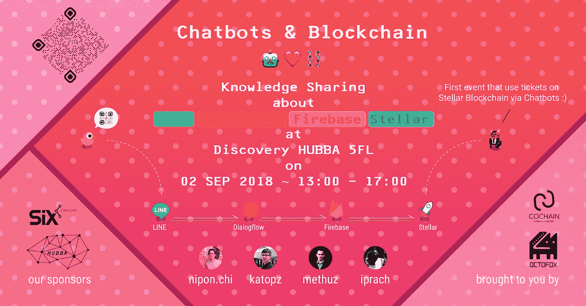

First event that uses tickets on
Stellar Blockchain via Chatbots :)

**TLDR** :从 **13:50** 到 **16:58** 开始在[T3 测试网](https://stellar.expert/explorer/testnet/tx/314aefe671cec8af0f7b1fc7194ab5684ddc815ae1ecb6e20cc40d2d60966ef8)上售票，50/50 的票已经售完([有一些 bug](https://github.com/catcatio/catcat-firebase/issues))。耶！

[](https://www.facebook.com/events/2185490331770352/) [## 聊天机器人和区块链

### 编辑描述

www.facebook.com](https://www.facebook.com/events/2185490331770352/) 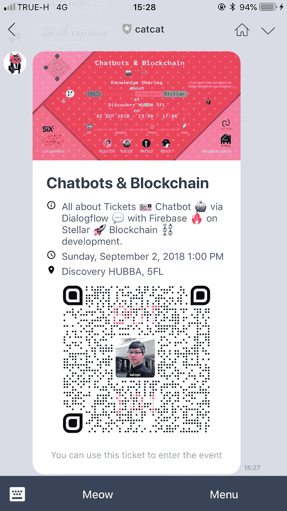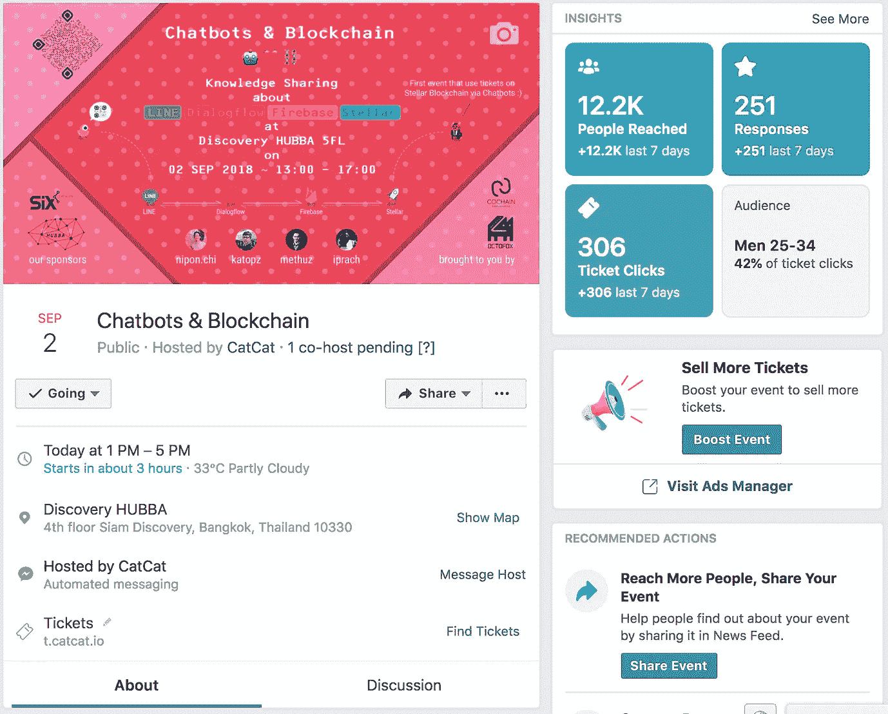

12.2K Reached, all 50 tickets has been sold!

# 我们学到了什么？

## **1。行**限制用户为 50

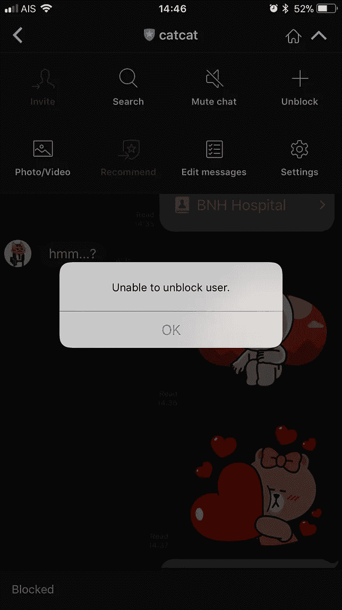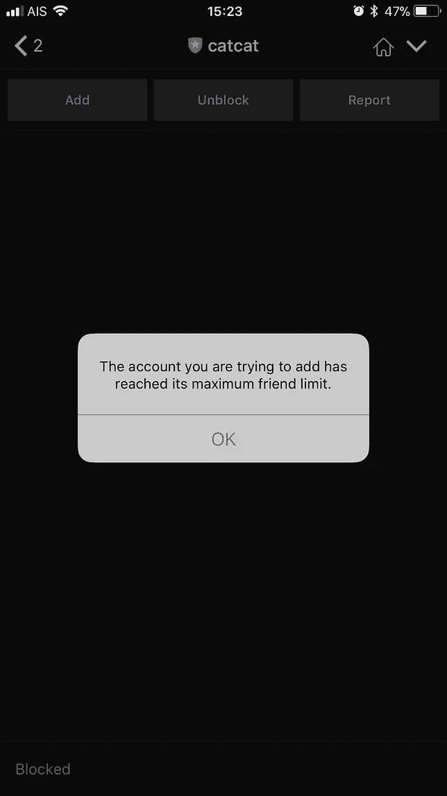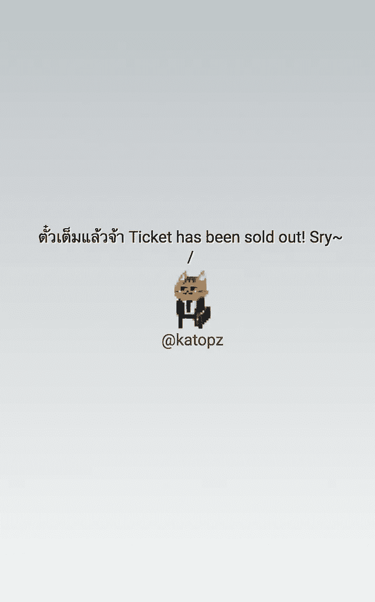

Awwww

*   如果你是用户…你不能添加猫猫为好友(很明显)，但你仍然可以聊天和买票。在这种情况下，我们需要显示门票售罄页面和/或通过聊天机器人告诉用户。
*   如果你是开发人员…不要对你的机器人封锁自己！因为你将**“无法解锁用户”**并且你不能再添加好友或与你的机器人聊天(真倒霉！).

## 2.iOS 和 Android 的 8.11.0 及更高版本支持快速回复功能。

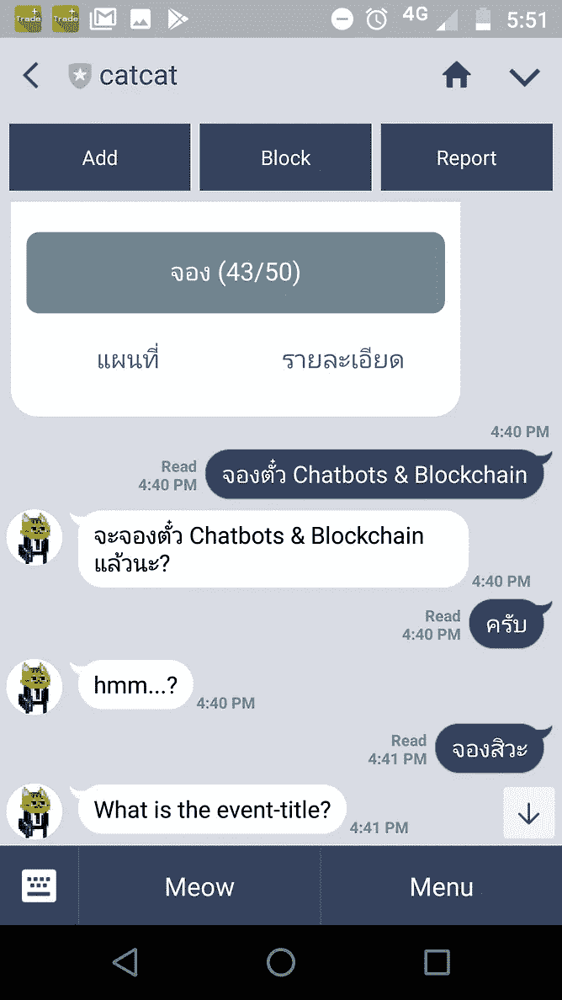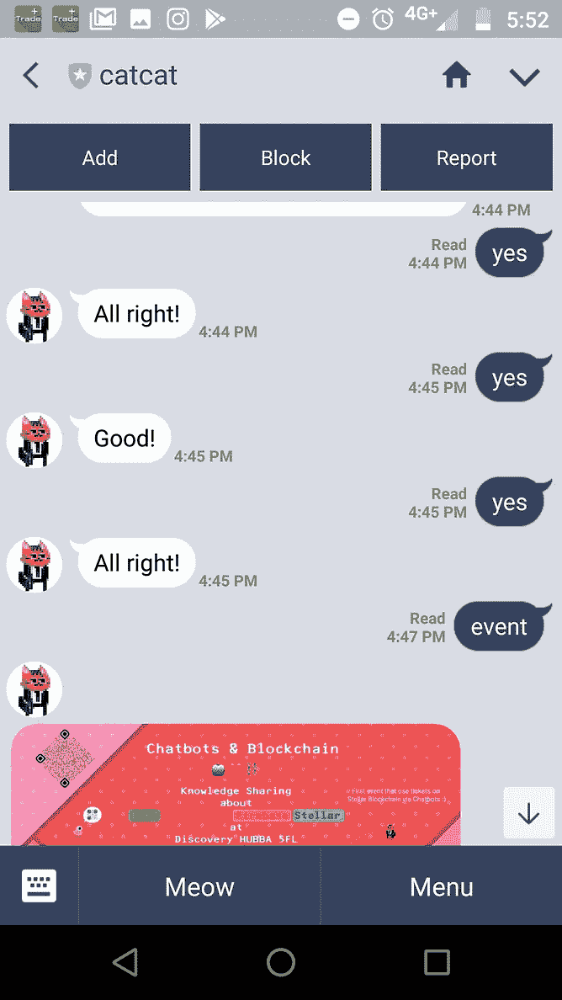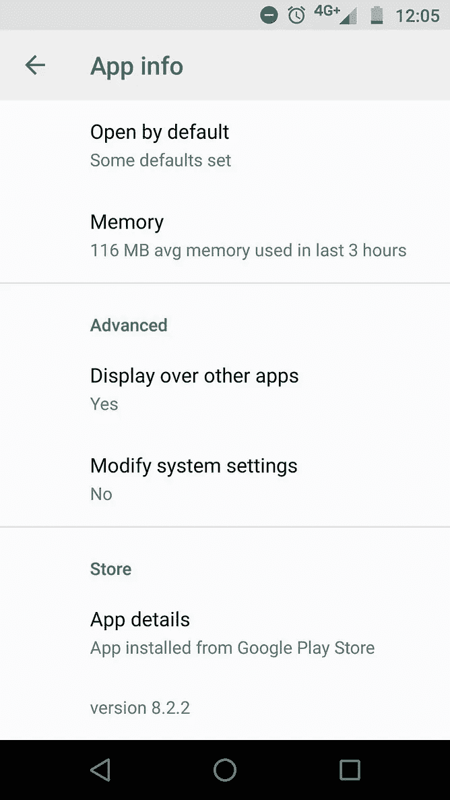

User now piss off! SRY!

## 3.我们忘记处理标签，它变得不明确

```
catcat-bots | 210 | 54.84MB | ✏️ --> undefined
catcat-bots | [dev]
catcat-bots | /usr/app/node_modules/@google-cloud/translate/src/index.js:211
catcat-bots | [dev] callback(err, null, resp);
catcat-bots | [dev] ^
catcat-bots | [dev]
catcat-bots | [dev] TypeError: callback is not a function
catcat-bots | [dev] at /usr/app/node_modules/@google-cloud/translate/src/index.js:211:9
catcat-bots | [dev] at Object.handleResp (/usr/app/node_modules/@google-cloud/common/src/util.js:135:3)
catcat-bots | [dev] at /usr/app/node_modules/@google-cloud/common/src/util.js:465:12
catcat-bots | [dev] at Request.onResponse [as _callback] (/usr/app/node_modules/retry-request/index.js:198:7)
catcat-bots | [dev] at Request.self.callback (/usr/app/node_modules/request/request.js:185:22)
catcat-bots | [dev] at emitTwo (events.js:126:13)
catcat-bots | [dev] at Request.emit (events.js:214:7)
catcat-bots | [dev] at Request. (/usr/app/node_modules/request/request.js:1161:10)
catcat-bots | [dev] at emitOne (events.js:116:13)
catcat-bots | at Request.emit (events.js:211:7)
catcat-bots | [dev]
catcat-bots | app crashed
catcat-bots | [dev]
catcat-bots | npm run dev exited with code 0
catcat-bots | -->
catcat-bots | Sending SIGTERM to other processes..
```

## 4.Stellar **testnet** 可以很好地处理(尽管它有 3 个节点) :

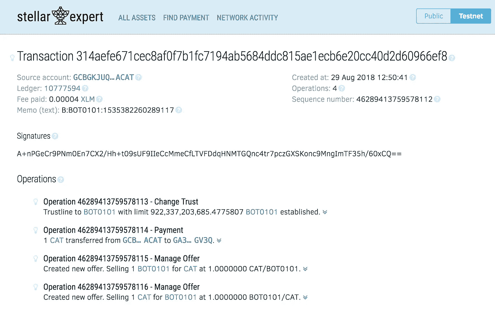

Look ma! Tickets onchain!

## 5.我们需要监控仪表板，好看的一个:)

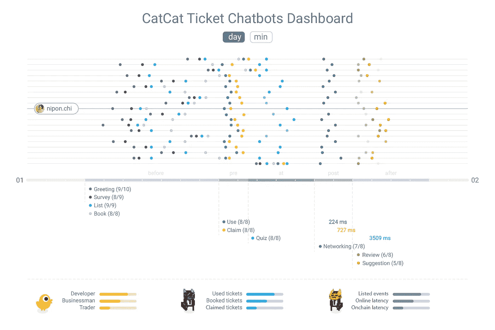

Lucky us! we had good designer ;)

让我们看看确认流程如何在本周末的 活动中 [**(太刺激了！)**](https://www.facebook.com/events/2185490331770352/)

# 谢谢！

HUBBA 为我们提供了一个舒适的工作空间！

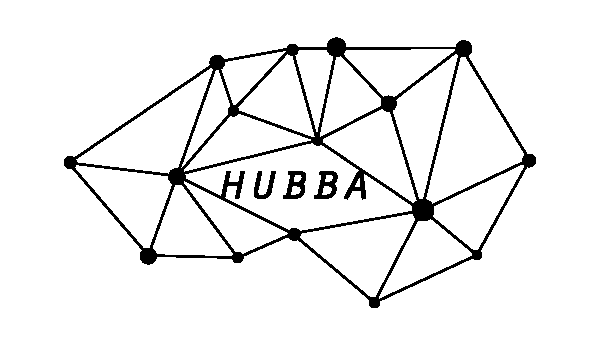

**HUBBA**

[](http://www.hubbathailand.com/coworking-space-discovery-hubba) [## HUBBA Thailand |合作空间—探索 HUBBA

### 一个令人惊叹和方便的共同工作空间和活跃的社区。通过服务、活动和技术来帮助我们的会员…

www.hubbathailand.com](http://www.hubbathailand.com/coworking-space-discovery-hubba) 

## 这是一个正在进行的故事，你可以看到下面的第一部分。

[](/coinmonks/catcat-chatbots-on-stellar-blockchain-46cfa31a1c4c) [## 🤖恒星区块链上的猫猫聊天机器人

### 我们目前正在开发聊天机器人，它将 Dialogflow 用于聊天平台，将 Firebase 用于云功能和存储…

medium.com](/coinmonks/catcat-chatbots-on-stellar-blockchain-46cfa31a1c4c) 

## 未完待续:)

> [直接在您的收件箱中获得最佳软件交易](https://coincodecap.com/?utm_source=coinmonks)

[](https://coincodecap.com/?utm_source=coinmonks)