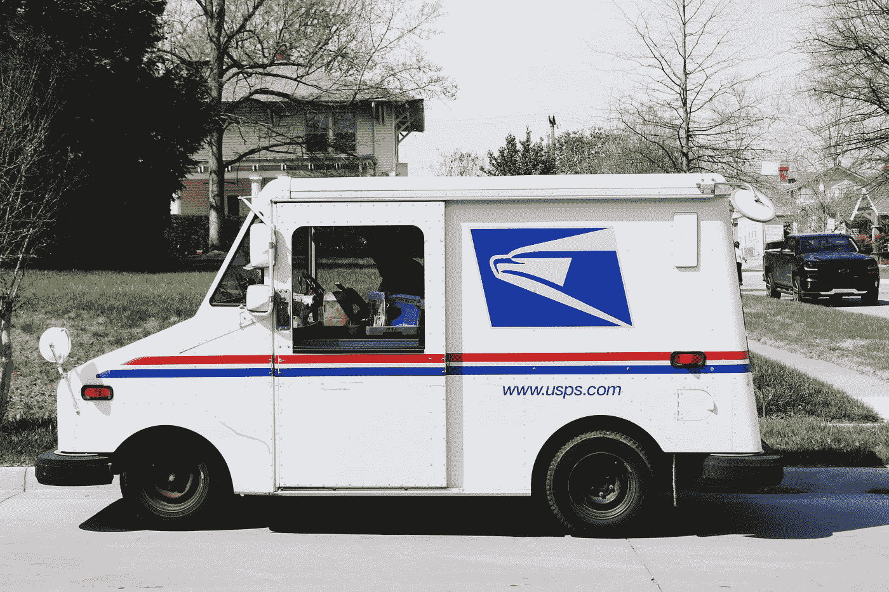
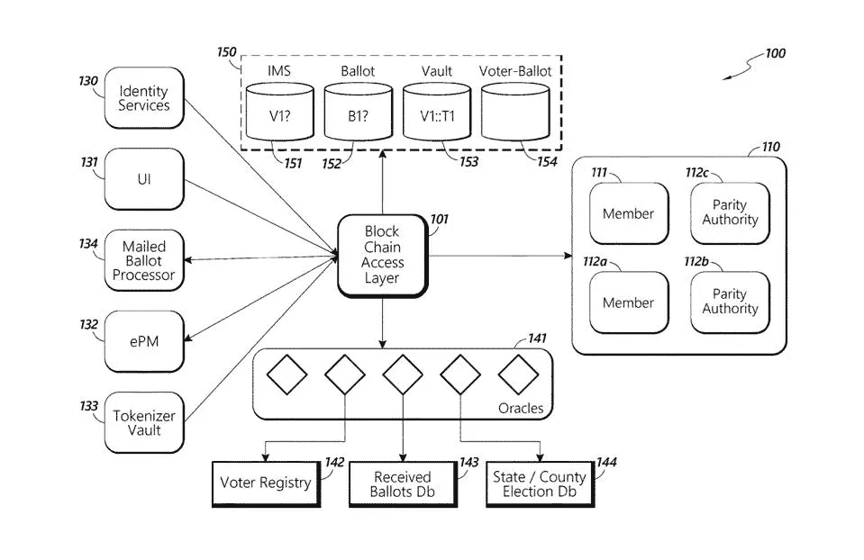
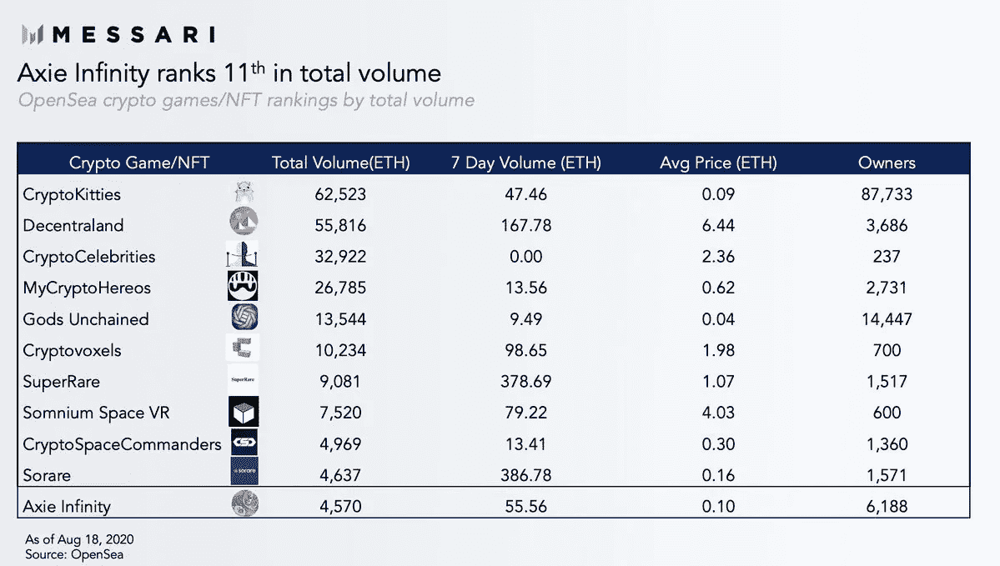

# 先看中国数字元在行动/渣打银行进行区块链交易/ USPS 专利区块链投票系统

> 原文：<https://medium.com/coinmonks/first-look-at-chinas-digital-yuan-in-action-standard-chartered-bank-conducting-blockchain-64338c2b668c?source=collection_archive---------2----------------------->

Photo by [Pope Moysuh](https://unsplash.com/@pope_moisa?utm_source=unsplash&utm_medium=referral&utm_content=creditCopyText) on [Unsplash](https://unsplash.com/s/photos/mail?utm_source=unsplash&utm_medium=referral&utm_content=creditCopyText)

*2020 年 8 月 21 日*

***本周在《风景》****……游戏的名字已经转向了万物企业，不过稍后会有更多的介绍。我们第一次看到* ***中国的数字元*** *在行动，这要感谢一段在* ***微信*** *上流传的视频分享，以教育当地市民。下面全面分解。好了，回到企业，我们不仅见证了采用增长的转变(上升、上升、上升*🚀)，但是对这个术语的重新定义不仅仅是一个“*专用网络”此外，****SAP****在分享其与****ether uem****的 Mainnet 的集成细节中跳了出来。不甘落后的****meta mask****采用新的软件许可，瞄准商机，而* ***三菱*** *推出了区块链平台，将金属交易数字化。但是等等，还有呢！* ***渣打银行*** *成功利用区块链技术进行了* ***孟加拉*** *的首笔区块链贸易交易。*

*美国专利商标局公布了一项来自* ***美国邮政*** *的专利申请，名为“安全投票系统”，描述了使用区块链技术来确保邮寄投票的安全。* ***泰国*** *正准备将其司法系统记录移至区块链。如果这还不够的话，我们看到了关于跨链互操作性的深入的使用案例和公告，****DAOs****，****Uniswap****的惊人增长，对****【NFT****(不可替换令牌)市场和* ***Axie Infinity* 的深入分析**

## 🚨奖金🚨:2020 年第 3 季度行业状况:区块链

请在 8 月 26 日美国东部时间 [**中午 12:00 加入我的节目，我将现场深入剖析 2020 年区块链的变化，并为您提供一份成功实现这一转变以及未来几个月的路线图。我们将关注 DeFi、令牌化、CBDCs、Oracles、数字身份、存储、虚拟经济等主题。不要忘记所有这些年底的发布，以及它们对你的业务意味着什么。说到商业，我将分享你需要了解的活跃的企业用例，以及风险投资在哪里下注。此外，我还将介绍总体活动、新的业务模式、全球数据驱动的趋势、机会领域等等！那里见，但别忘了**](https://www.topionetworks.com/events/5f074106843bac20626e2922)**[保住你的位子](https://www.topionetworks.com/events/5f074106843bac20626e2922)！**

## 📮[美国邮政服务用一项新的区块链专利反击特朗普对邮寄投票的攻击](https://www.forbes.com/sites/jasonbrett/2020/08/13/us-post-counters-trump-attacks-on-mail-in-voting-with-a-new-blockchain-patent/)

Source: [Forbes](https://www.forbes.com/sites/jasonbrett/2020/08/13/us-post-counters-trump-attacks-on-mail-in-voting-with-a-new-blockchain-patent/#46cd842e5b43)

美国专利商标局公布了一项来自 USPS 的名为“安全投票系统”的专利申请，该申请描述了使用区块链技术来确保邮件投票的安全。该系统将选民身份和选票分离以确保选票匿名，并将选票存储在区块链中的分布式分类账上。当涉及投票时，邮政服务不是唯一探索区块链技术好处的部门……[阅读更多](https://www.theblockcrypto.com/linked/72226/mastercard-crypto-card-wirex)

*相关:🇹🇭* [*泰国正准备将司法系统记录转移到区块链*](https://www.coindesk.com/thailand-blockchain-court-of-justice)

## 🏦[渣打银行孟加拉国首张区块链信用证](https://tbsnews.net/economy/banking/standard-chartered-bank-issues-countrys-first-blockchain-letter-credit-119776)

渣打银行成功利用区块链技术进行了孟加拉国的首笔区块链交易。该银行为服装出口商 Viyellatex Ltd 和在 Contour 区块链网络上纺织的 Viyellatex 之间的贸易开具了信用证。据报道，整个交易是无纸化的，通过 Contour 网络数字化完成。… [阅读更多信息](https://tbsnews.net/economy/banking/standard-chartered-bank-issues-countrys-first-blockchain-letter-credit-119776)

*相关:💳一场主宰加密借记卡的竞赛已经开始*

## 🚗[三菱推出金属交易区块链平台](https://cointelegraph.com/news/mitsubishi-launches-blockchain-platform-for-metal-trading)

三菱旗下的金属和矿产子公司推出了一个区块链平台，将金属交易数字化。该平台由三菱公司与美国区块链公司 Skuchain 合作开发，建立在 Skuchain 的 EC3 平台之上，用于区块链的供应链管理和金融。使用 ECO 平台，交易方将签署贸易文件并上传到区块链。然后，他们可以与他人实时共享签署的文件，并隐藏他们不想透露的任何商业敏感信息……[阅读更多信息](https://cointelegraph.com/news/mitsubishi-launches-blockchain-platform-for-metal-trading)

*相关:📖* [*IP 澳洲和 NRL 审判区块链打击假货*](https://fortunecryptotoday.com/2020/08/ip-australia-and-nrl-trial-blockchain-to-combat-counterfeits/)

## 💼[随着技术的成熟，全球企业开始接受上市的区块链](https://cointelegraph.com/news/global-enterprises-embrace-public-blockchains-as-technology-matures)

全球一些价值数十亿美元的企业已经采用区块链技术，通过单一网络在多方之间高效共享敏感数据。虽然这个概念很受欢迎，但区块链技术的早期采用者经常发现，由于安全问题和更大的控制需求，他们被吸引到专用网络。然而，随着区块链领域的不断成熟，企业思维方式也发生了转变。虽然“企业区块链”曾经被定义为私有网络… [阅读更多](https://cointelegraph.com/news/global-enterprises-embrace-public-blockchains-as-technology-matures)

*相关:* ⚙️ [*SAP 与以太坊 mainnet*](https://blogs.sap.com/2020/08/21/sap-integration-with-ethereum-mainnet/)*——*[*凯文小*](https://medium.com/u/1546c399b2d2?source=post_page-----64338c2b668c--------------------------------)

## 👾[加密游戏遭遇治理:检验 Axie Infinity](https://messari.io/article/crypto-gaming-meets-governance-examining-axie-infinity)

[Messari](https://messari.io/article/crypto-gaming-meets-governance-examining-axie-infinity)

DeFi 并不是唯一一个找到适合加密产品市场的部门。随着像 [SuperRare](https://medium.com/u/7f04ad9748f4?source=post_page-----64338c2b668c--------------------------------) 和 [Axie Infinity](https://medium.com/u/f4f989915036?source=post_page-----64338c2b668c--------------------------------) 这样的平台继续增长，游戏和不可替代代币(NFT)正在成为下一个值得关注的趋势。凭借活跃的 Uniswap 市场、健康的二级交易市场和即将推出的治理令牌，Axie Infinity 已准备好利用 DeFi、游戏和 NFTs 领域的这些趋势。游戏和 DeFi 的用户开始融合，这可能会刺激 NFT 游戏的进一步增长……[阅读更多](https://cointelegraph.com/news/global-enterprises-embrace-public-blockchains-as-technology-matures)作者[梅森·尼斯特伦](https://medium.com/u/77cd1f84b592?source=post_page-----64338c2b668c--------------------------------)和[梅萨里](https://medium.com/u/7cf93d3c3400?source=post_page-----64338c2b668c--------------------------------)

# 💸数字货币/中央银行:

过去几个月，更确切地说是最近几周，我一直在密切关注不断增长的央行数字货币(CBDC)市场。因为在区块链地貌的这个区域，全球活动持续增加，而且没有减缓的迹象。

特别是中国🇨🇳，其数字货币/电子支付(DCEP)系统取得了进一步的积极发展，最近宣布将测试扩展到香港和大湾区。此外，我们还在微信上与中国农业银行合作发布的一段视频中首次看到了数字人民币:

正如 Maria Shen 在她的 [tweet](https://twitter.com/mariashen/status/1296225281779220480) 中描述的那样，我们看到一位女士从她的银行卡中取出 50 元人民币&将其兑换成中国新的数字人民币。第一次拍摄带来了许多问题。虽然 Maria 在她的帖子中分享了许多伟大的作品，但我要补充的是，这只是我们即将见证的这一类别的开始。

金融体系和整体包容性正迅速受到挑战，并比以往任何时候都更受关注。是的，我们有围绕 DeFi 或分散融资的所有活动，但要密切关注拉美、南美、印度和非洲等市场。这些地区已经看到围绕金融体系的大规模投资和开发。我期待着更多的到来，这将进一步为未来令人兴奋的数字化十年奠定基础。

# 本周的更多内容:

💸 [Ripple 的目标是成为加密货币世界的亚马逊](https://cointelegraph.com/news/ripple-aims-to-become-the-amazon-of-the-cryptocurrency-world)

🚜[企业和农民现在可以通过 Arbol 平台和 Chainlink 数据对冲天气风险](https://www.arbolmarket.com/businesses-and-farmers-can-now-hedge-weather-risk-through-the-arbol-platform-and-chainlink-data/)

💸 [BlockFi](https://medium.com/u/e911918f3768?source=post_page-----64338c2b668c--------------------------------) [从大学、NBA 球星和其他人那里筹集了 5000 万美元](https://www.coindesk.com/blockfi-50m-series-c)

🏔️ [揭开珠穆朗玛峰:雪崩的 Mainnet 发布候选](/avalabs/unveiling-everest-avalanches-mainnet-release-candidate-670e0ca5e28e)——[ava 实验室](https://medium.com/u/f7c9f4ea738f?source=post_page-----64338c2b668c--------------------------------)

📖[道豪斯·V2](/daohaus-club/daohaus-v2-86591e6f0595)——[库珀·特利](https://medium.com/u/af8b40222d18?source=post_page-----64338c2b668c--------------------------------)

🏦[了解加密信贷市场](/coinshares/understanding-crypto-credit-markets-6d1fe2a8676c) — [Meltem Demirors](https://medium.com/u/6cf31b9735f9?source=post_page-----64338c2b668c--------------------------------)

📖[交叉链在这里:近地天体、ONT、宇宙和近地发射互操作性协议](https://cointelegraph.com/news/cross-chain-is-here-neo-ont-cosmos-and-near-launch-interoperability-protocols)

♎脸书的天秤座可能会扰乱抵押贷款市场

🧑‍🎤[Avatar 直销是下一个消费者直销吗？](https://www.forbes.com/sites/cathyhackl/2020/08/09/is-direct-to-avatar-the-next-direct-to-consumer/)

# DApps(分散式应用)手表:

## 🦄[解开 Uniswap:链上做市商的未来](/dragonfly-research/unbundling-uniswap-the-future-of-on-chain-market-making-1c7d6948d570)

Uniswap 现在是 DeFi 上最大的单一“交易所”。它通常发布的交易量大于大多数集中式交易所。Uniswap 彻底改变了 DeFi，带来了数十亿美元的交易量，并引发了 AMM(自动做市商)设计的复兴。在我的[上一篇文章](/dragonfly-research/what-explains-the-rise-of-amms-7d008af1c399)中，我解释了 Uniswap 是如何工作的，以及为什么 AMMs 主导 DeFi 交易量。但我相信 Uniswap 不可避免地会被拆分……[阅读更多](/dragonfly-research/unbundling-uniswap-the-future-of-on-chain-market-making-1c7d6948d570)Haseeb Qureshi[的文章](https://medium.com/u/8bc4e5f8b505?source=post_page-----64338c2b668c--------------------------------)

## 📖 [*Cardano 被评为 Github*](https://heraldsheets.com/cardano-ranked-blockchain-with-highest-developers-activity-on-github/) 上开发活跃度最高的区块链

加密货币的独立评级提供商 Weiss Crypto Ratings 将 Cardano 评为“行业最佳技术”卡尔达诺被评为 Github 上开发活动最多的区块链，击败了来自顶级区块链的竞争对手，如[以太坊](https://medium.com/u/d626b3859bc9?source=post_page-----64338c2b668c--------------------------------)……[阅读更多](/irisnet-blog/develop-your-first-dapp-using-the-public-chain-node-service-provided-by-bsn-760a2c83fd78)

*相关:📖* [*Acala 在 Polkadot Testnet*](/acalanetwork/acala-launches-the-1st-parachain-on-polkadot-testnet-682c02bad08b)*——*[*Bette Chen*](https://medium.com/u/8d475d21e811?source=post_page-----64338c2b668c--------------------------------)

## 📖 [Hashed 首席执行官 Simon Kim 解释了为什么以消费者为中心的应用是区块链的未来](https://finance.yahoo.com/news/hashed-ceo-simon-kim-explains-214540593.html)

韩国卓越的区块链风险投资公司 [HASHED](https://medium.com/u/a726a6b0feee?source=post_page-----64338c2b668c--------------------------------) CEO，软银风险投资亚洲风险合伙人 Simon Seojoon Kim 在 2019 年韩国区块链周上发表了开幕演讲。他认为，Klaytn 和 Chai 之所以在采用方面取得如此巨大的成功，是因为他们非常注重从入职的角度创造流畅的用户体验。金说:[克莱恩](https://medium.com/u/2cd1485f110a?source=post_page-----64338c2b668c--------------------------------)和柴的成功的共同因素是用户不必考虑如何保护他们的私人密钥

📖[使用 BSN](/irisnet-blog/develop-your-first-dapp-using-the-public-chain-node-service-provided-by-bsn-760a2c83fd78) — [BSN](https://medium.com/u/6a485161573d?source=post_page-----64338c2b668c--------------------------------) 提供的公共链节点服务开发您的第一个 DApp

📖[来自红枣科技的贺一帆:如何理解 BSN 的“区块链”](/@bsnbase/yifan-he-from-red-date-technology-how-to-understand-blockchain-in-bsn-83cee1c131e3)——[BSN](https://medium.com/u/6a485161573d?source=post_page-----64338c2b668c--------------------------------)

🦊[流行的以太坊钱包 MetaMask 采用新的软件许可作为坚定的目光商机](https://www.theblockcrypto.com/linked/75751/metamask-new-software-license-commercial)——[meta mask](https://medium.com/u/17995a9c1d1c?source=post_page-----64338c2b668c--------------------------------)

# 🚨2020 年第三季度行业状况:区块链🚨

[Topio Networks](https://www.topionetworks.com/events/5f074106843bac20626e2922)

8 月 26 日东部时间 中午 12 点 [**请加入我，我将对 2020 年区块链的变化进行实时深入的分析，并为您提供一个成功导航的路线图以及未来几个月的路线图。我们将关注 DeFi、令牌化、CBDCs、Oracles、数字身份、存储、虚拟经济等主题。不要忘记所有这些年底的发布，以及它们对你的业务意味着什么。说到商业，我将分享你需要了解的活跃的企业用例，以及风险投资在哪里下注。此外，我还将介绍总体活动、新的业务模式、全球数据驱动的趋势、机会领域等等！那里见，但别忘了**](https://www.topionetworks.com/events/5f074106843bac20626e2922)**[保留你的座位](https://www.topionetworks.com/events/5f074106843bac20626e2922)！**

# 🎙️研究:2020 年区块链和 DApps 状况:

Source: [Topio Networks](https://www.topionetworks.com/markets/dapps-stack-landscape-5de8d07eb9abe453e04203f8)

*现已上市，免费赠送的是我最新研究的去中心化应用或* [***DApp“堆栈”景观图***](https://s3.amazonaws.com/spoke-profiles-prod-assets/uploads/a069e1e1e798c975d4eca968c72f4ac1352d62a4/original/DApps_Stack_Landscape_Q2_2020.pdf?utm_source=Social%20Media&utm_medium=LinkedIn&utm_campaign=Topio%20-%20Dapps%20Landscape%20update&utm_content=S3%20Link)**—Q2 2020 年版。这张地图提供了新兴 DApps 行业的全面概述和分类，突出显示了在构建下一代应用程序中发挥重要作用的 400 多家全球公司。作为奖励，我包括了一些生态系统玩家和团体，当你准备发布你的应用时，你需要熟悉它们。如果这是你看到的第一个版本，那就把它当作你进一步理解不仅仅是这个行业，而且是构建一个完全或部分去中心化的应用程序所需的所有核心技术的指导性路线图(DApp)。**

**

*Source: [Topio Networks](https://www.topionetworks.com/markets/blockchain-landscape-5bf43854b9abe4633c1f87da)*

**另外，你可以找到我的 Q1 2020 对整个* [***区块链格局***](https://www.linkedin.com/posts/kyleellicott_q12020-blockchain-landscapekyleellicotttopionetworks-activity-6638879840634310656-UNtB) *的研究。这是《风景》的第五版。你会发现地图上包括 747 家公司(总共 900 多家独特的+更广泛的关键生态系统参与者)，它们从 2010 年到 2020 年筹集了 220 多亿美元的资金，仅 2017 年以来就投资了 180 多亿美元！**

*📣*想要了解区块链、DApps、DeFi 和 FinTech 行业的所有头条新闻、投资、深入研究和最新动态吗？* [***订阅***](https://www.topionetworks.com/newsletters) *关注我的* [***推特***](https://twitter.com/kyleellicott) *每周更新还有更多！**

## *另外，阅读*

*   *最好的[密码交易机器人](/coinmonks/crypto-trading-bot-c2ffce8acb2a)*
*   *[密码本交易平台](/coinmonks/top-10-crypto-copy-trading-platforms-for-beginners-d0c37c7d698c)*
*   *最好的[加密税务软件](/coinmonks/best-crypto-tax-tool-for-my-money-72d4b430816b)*
*   *[最佳加密交易平台](/coinmonks/the-best-crypto-trading-platforms-in-2020-the-definitive-guide-updated-c72f8b874555)*
*   *最佳[加密借贷平台](/coinmonks/top-5-crypto-lending-platforms-in-2020-that-you-need-to-know-a1b675cec3fa)*
*   *[最佳区块链分析工具](https://bitquery.io/blog/best-blockchain-analysis-tools-and-software)*
*   *[加密套利](/coinmonks/crypto-arbitrage-guide-how-to-make-money-as-a-beginner-62bfe5c868f6)指南:新手如何赚钱*
*   *最佳[加密制图工具](/coinmonks/what-are-the-best-charting-platforms-for-cryptocurrency-trading-85aade584d80)*
*   *[莱杰 vs 特雷佐](/coinmonks/ledger-vs-trezor-best-hardware-wallet-to-secure-cryptocurrency-22c7a3fd391e)*
*   *了解比特币最好的[书籍有哪些？](/coinmonks/what-are-the-best-books-to-learn-bitcoin-409aeb9aff4b)*
*   *[3 商业评论](/coinmonks/3commas-review-an-excellent-crypto-trading-bot-2020-1313a58bec92)*
*   *[AAX 交易所评论](/coinmonks/aax-exchange-review-2021-67c5ea09330c) |推荐代码、交易费用、利弊*
*   *[德里比特评论](/coinmonks/deribit-review-options-fees-apis-and-testnet-2ca16c4bbdb2) |选项、费用、API 和测试网*
*   *[FTX 密码交易所评论](/coinmonks/ftx-crypto-exchange-review-53664ac1198f)*
*   *[n 零审核](/coinmonks/ngrave-zero-review-c465cf8307fc)*
*   *[Bybit 交换审查](/coinmonks/bybit-exchange-review-dbd570019b71)*
*   *[3Commas vs Cryptohopper](/coinmonks/cryptohopper-vs-3commas-vs-shrimpy-a2c16095b8fe)*
*   *最好的比特币[硬件钱包](/coinmonks/the-best-cryptocurrency-hardware-wallets-of-2020-e28b1c124069?source=friends_link&sk=324dd9ff8556ab578d71e7ad7658ad7c)*
*   *最佳 [monero 钱包](https://blog.coincodecap.com/best-monero-wallets)*
*   *[莱杰 nano s vs x](https://blog.coincodecap.com/ledger-nano-s-vs-x)*
*   *[bits gap vs 3 commas vs quad ency](https://blog.coincodecap.com/bitsgap-3commas-quadency)*
*   *[莱杰 Nano S vs 特雷佐 one vs 特雷佐 T vs 莱杰 Nano X](https://blog.coincodecap.com/ledger-nano-s-vs-trezor-one-ledger-nano-x-trezor-t)*
*   *[block fi vs Celsius](/coinmonks/blockfi-vs-celsius-vs-hodlnaut-8a1cc8c26630)vs Hodlnaut*
*   *[bits gap review](/coinmonks/bitsgap-review-a-crypto-trading-bot-that-makes-easy-money-a5d88a336df2)——一个轻松赚钱的加密交易机器人*
*   *为专业人士设计的加密交易机器人*
*   *[PrimeXBT 审查](/coinmonks/primexbt-review-88e0815be858) |杠杆交易、费用和交易*
*   *[埃利帕尔泰坦评论](/coinmonks/ellipal-titan-review-85e9071dd029)*
*   *[赛克斯石评论](https://blog.coincodecap.com/secux-stone-hardware-wallet-review)*
*   *[BlockFi 评论](/coinmonks/blockfi-review-53096053c097) |从您的密码中赚取高达 8.6%的利息*