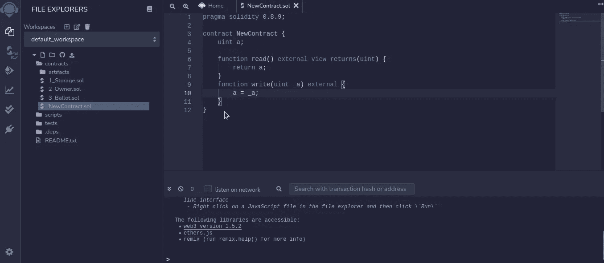

# 成为 blokchain 开发者的第一步

> 原文：<https://medium.com/coinmonks/first-step-to-became-a-blokchain-developer-c5dde3422527?source=collection_archive---------9----------------------->

Solidity 是一种创建区块链应用程序的语言。你可以用它在包括以太坊在内的 200 多个区块链网络上创建智能合约。语法看起来像 javascript，但它的工作方式非常不同。

要开始使用 Solidity，你可以去 https://remix.ethereum.org/的→一个智能合约的在线 IDE。

然后转到文件编辑器，为您的智能合约创建一个新文件(NewContract.sol)。solidity 的文件扩展名是 **sol。**

**首先**，在进度声明中指定 solidity 的版本。

**其次**，您用合同关键字和您的智能合同的名称定义一个新的智能合同。您可以定义变量，它们的值将存储在区块链中。要定义变量，你必须指定它们的类型。Solidity 就是我们所说的不同于 javascript 的静态类型语言。要与这些变量交互，您可以创建函数。若要读取变量，请定义一个只读函数。与 javascript 相比，函数签名稍微复杂一些。在函数体中，您返回变量，就是这样，您还可以定义函数来修改智能合约的变量。

在这种情况下，函数签名稍微简单一点。在该功能中，您可以修改合同的变量，新值将保存在区块链上。可靠是我们所说的编译语言，这意味着你不能直接运行它的代码，这与 javascript 相反。

对于编译步骤，你进入**编译菜单，**选择正确版本的 solidity 并点击编译。

现在你的代码已经被编译成我们称之为 evm 字节码的一系列区块链可以理解的指令。

下一步是部署您的智能合约并与之交互。为此，您可以转到**部署选项卡**。

您选择合同，单击 deploy，然后您可以看到合同实例。在这个框中，您可以通过调用不同的函数来与您的合同进行交互

它被部署在本地区块链和安全的沙箱上，在那里你可以犯错误和进行实验。

这是对可靠性的一个非常快速的介绍。如果你想更深入地了解可靠性，你可以在免费教程[https://cryptozombies.io/](https://cryptozombies.io/)中找到更多。

> 加入 Coinmonks [电报频道](https://t.me/coincodecap)和 [Youtube 频道](https://www.youtube.com/c/coinmonks/videos)了解加密交易和投资

## 也阅读

 [## 杠杆代币[多头代币]终极指南

### 杠杆化令牌是具有杠杆化风险敞口的 ERC20 令牌，不考虑保证金、要求、管理…

medium.com](/coinmonks/leveraged-token-3f5257808b22)  [## 最佳加密交易所| 2021 年十大加密货币交易所

### 编辑描述

blog.coincodecap.com](https://blog.coincodecap.com/crypto-exchange)  [## 2021 年最佳加密借贷平台| 6 大比特币借贷平台

### 获得比特币和其他加密货币的最佳贷款利率

medium.com](/coinmonks/top-5-crypto-lending-platforms-in-2020-that-you-need-to-know-a1b675cec3fa)  [## 2021 年最佳免费加密交易机器人

### 2021 年币安、比特币基地、库币和其他密码交易所的最佳密码交易机器人。四进制，位间隙…

medium.com](/coinmonks/crypto-trading-bot-c2ffce8acb2a)  [## 最佳 4 个加密交易信号电报通道

### 这是乏味的找到正确的加密交易信号提供商。因此，在本文中，我们将讨论最好的…

medium.com](/coinmonks/best-crypto-signals-telegram-5785cdbc4b2b)  [## 5 个最佳社交交易平台[2021] | CoinCodeCap

### 编辑描述

blog.coincodecap.com](https://blog.coincodecap.com/best-social-trading-platforms)  [## BlockFi 评论 2021:利弊和利率| CoinCodeCap

### 编辑描述

blog.coincodecap.com](https://blog.coincodecap.com/blockfi-review)  [## 如何在印度购买比特币？2021 年购买比特币的 7 款最佳应用[手机版]

### 如何使用移动应用程序购买比特币印度

medium.com](/coinmonks/buy-bitcoin-in-india-feb50ddfef94)  [## 加密税务软件——五大最佳比特币税务计算器[2021]

### 不管你是刚接触加密还是已经在这个领域呆了一段时间，你都需要交税。

medium.com](/coinmonks/best-crypto-tax-tool-for-my-money-72d4b430816b)  [## 存储比特币的最佳加密硬件钱包[2021] | CoinCodeCap

### 编辑描述

blog.coincodecap.com](https://blog.coincodecap.com/best-hardware-wallet-bitcoin)  [## Pionex 评论 2021 |免费加密交易机器人和交换

### Pionex 是为交易自动化提供工具的后起之秀。Pionex 上提供了 9 个加密交易机器人…

medium.com](/coinmonks/pionex-review-exchange-with-crypto-trading-bot-1e459d0191ea)