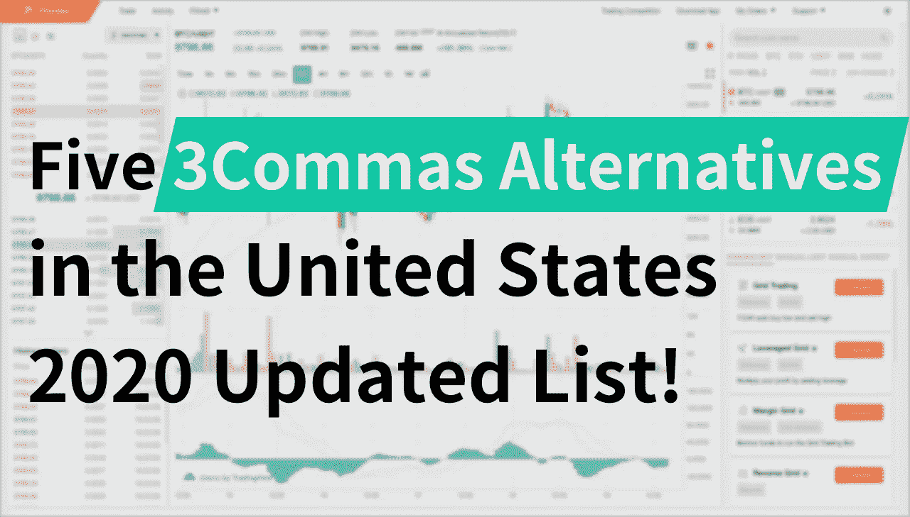
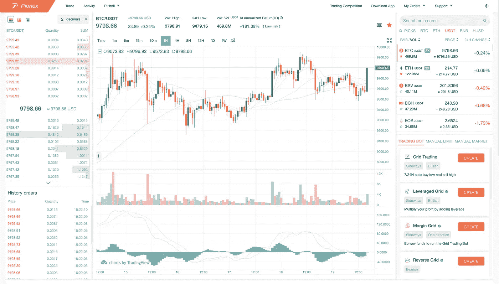
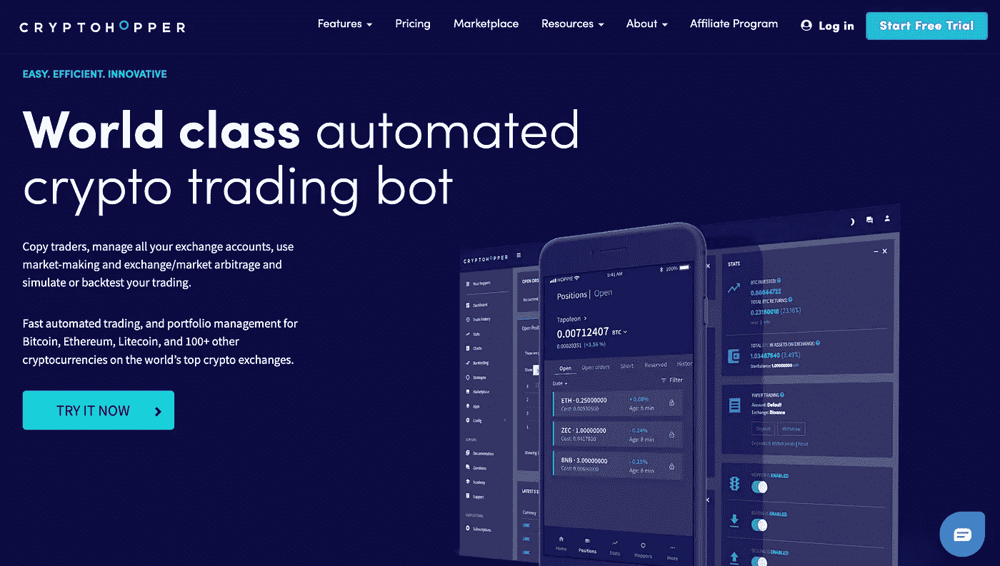

# 美国的五种 3Commas 替代品— 2020 年

> 原文：<https://medium.com/coinmonks/five-3commas-alternatives-in-the-united-states-2020-b50ea69ab93e?source=collection_archive---------2----------------------->

## Pionex，Cryptohopper，BitUniverse，Shrimpy 和 Zignaly。

# 你为什么需要加密交易机器人

加密市场是全天候开放的，并且高度不稳定，这就是为什么对机器人的需求比以往任何时候都更普遍。

由于许多人选择被动交易比特币，无法投入动态市场分析所需的时间。**因此，加密交易机器人将有利于用户进行高效交易。**

> [3Commas](https://3commas.io/?c=tc252152) 是一个非常好的[加密交易机器人](/coinmonks/whats-the-best-crypto-trading-bot-in-2020-top-8-bitcoin-trading-bot-c16adeb13317)，但是它太贵了，而且功能有限。

出于某种原因，我的一些朋友似乎对 3Commas 工具不满意，正在寻找替代工具。最近，我有机会测试这三种常用语，我想在这篇文章中与你分享。

> 欢迎在本帖中评论其他 3 种 Commas 替代品。如果值得推荐，我会去看看，写篇评论。

您也可以阅读我们全面的 [3Commas 评论](/coinmonks/3commas-review-an-excellent-crypto-trading-bot-2020-1313a58bec92)，让我们知道您对 3Commas 的看法。

# 你现在应该尝试的五个[3 建议](https://3commas.io/?c=tc252152)

我将在帖子中介绍五个 3Commas 备选方案。

## 3 条消息的第一种选择— [Shrimpy](https://www.shrimpy.io/signup?r=I6VFZ7d2E)

Shrimpy 是一个付费的加密交易机器人服务。这也是 3Commas 没有的功能。

当然，Shrimpy 是一个 3Commas 替代机器人，这就是为什么我在这里列出它。但它是专为投资组合管理、索引、再平衡和战略回溯测试而设计的。

最好的部分是当你持有硬币时，重新平衡你的投资组合。它支持 10+加密交换。

> [**现在试试 Shrimpy 吧。**](https://www.shrimpy.io/signup?r=I6VFZ7d2E)
> 
> **读** [**读**](https://blog.coincodecap.com/shrimpy-crypto-trading-bot-review)

## 3Commas 的第二种选择— [Pionex](https://www.pionex.com/en-US?r=BI2UEarX)

[Pionex](https://www.pionex.com/en-US?r=BI2UEarX) 是内置[交易机器人](https://blog.coincodecap.com/five-best-crypto-trading-bots)的交易所。这是 2017 年以来我见过的最好的交易机器人平台之一。它聚合了币安和火币的流动性，并在此基础上提供了一个免费的交易机器人。

**使用 Pionex 时不需要为 API 键而烦恼。**到目前为止，[**Pionex**](https://www.pionex.com/en-US?r=BI2UEarX)**上有 **9 个交易机器人:**电网交易机器人、杠杆电网机器人、保证金电网机器人、无限电网机器人、反向电网机器人、杠杆反向电网机器人、美元成本平均机器人、TWAP 机器人和跟踪获利机器人。**

这也是我推荐 [Pionex](https://www.pionex.com) 作为 3 种 Commas 替代品之一的主要原因。 [Pionex](https://www.pionex.com) 上有很多[交易机器人](https://blog.coincodecap.com/five-best-crypto-trading-bots)，而且很好用。

[Pionex](https://www.pionex.com) 是安全的，并已获得新加坡和美国的 MAS 和 MBS 许可证 [Pionex](https://www.pionex.com) 是我列表中的第一个 3Commas 替代品。

> [**现在开始在 Pionex 上使用加密交易 Bot。**](https://www.pionex.com/en-US?r=BI2UEarX)
> 
> **读作** [**Pionex 评论**](/coinmonks/pionex-review-exchange-with-crypto-trading-bot-1e459d0191ea)

## 3Commas 的第三种选择— [Cryptohopper](https://www.cryptohopper.com/?atid=15596)

Cryptohopper 是一个付费的加密交易机器人，是另一个 3Commas 的替代品。

在成为付费会员之前，你可以在 Cryptohopper 免费试用 7 天。

Cryptohopper 上比较知名的交易机器人之一就是做市机器人。它类似于 Pionex 中的网格机器人，但它更专注于从订单簿上的价差中获利。

[**试用 Cryptohopper，免费试用 7 天**](https://www.cryptohopper.com/?atid=15596)

## 3 个命令的第四种选择— [BitUniverse](https://www.bituniverse.org)

BitUniverse 是我向新手推荐的唯一免费加密交易。据我所知，双向交易是向交易所收费，而不是向用户收费。

BitUniverse 最棒的功能是网格交易机器人，有了它，你可以自动在一个价格范围内低买高卖一枚硬币。它已经支持了包括币安、火币、Bittrex 在内的 20 多家交易所。

也有其他机器人喜欢跟踪止盈，停止限制。所有的机器人都可以永久免费使用！

BitUniverse 也是唯一一个真正与交易所合作的加密交易机器人应用。你可以看到，BitUniverse 已经与 KuCoin、币安、Bithumb 和许多其他主要交易所展开了联合交易竞争。这是我将 BitUniverse 列为我最喜欢的 3 个 Commas 替代品之一的主要原因。

[**今天在 BitUniverse 上用网格 Bot。**](https://www.bituniverse.org)

## [3 命令的第五种替代](https://3commas.io/?c=tc252152)—[zig analy](https://zignaly.com)

Zignaly 上最神奇的功能是拷贝交易和电报信号机器人。这是我将 Zignaly 列为 3Commas 替代品的主要原因。

Zignaly 是加密货币日内交易者的一个工具，他们希望自动化他们的交易策略。制定您的交易策略 View 外包 it Zignaly 为您在币安、Bittrex、Poloniex、KuCoin、BitMex 等五大密码交易所进行交易。

[**现在试试 Zignaly。**](https://zignaly.com)

## [3Commas](https://3commas.io/?c=tc252152) 的第六种选择— Altrady

Altrady 独特的自动化加密交易工具每天都有成千上万的交易者使用，通过自动化交易来实现回报最大化。该公司提供几种类型的机器人，包括网格和信号机器人，为有经验的交易者提供了一种简单的方法，让他们在没有任何知识或技能的情况下，在快节奏的市场中占据优势。

**具有上下拖动功能的 Altrady 网格机器人**

Altrady 网格机器人是交易者利用市场涨跌趋势的完美工具。有了它，你可以指定价格上限和下限，这样你的交易将永远是安全的，即使有一个巨大的波动！你还可以止盈止损，这使得交易比以往任何时候都容易。

**具有 TradingView Webhook 或基于加密的扫描仪信号的备用信号机器人**

信号机器人是以最小的努力参与行动的好方法。只需配置您的进入和退出设置，然后让这个机器人为您做所有的工作！

为了使用带有自定义信号的信号机器人，您必须配置带有 webhook 的信号机器人

# 3Commas 免费替代品

对我来说，Pionex 和 BitUniverse 是 3Commas 的免费替代品。只要团队有一个透明的商业模式，就值得尝试免费的 3Commas 替代品，如 BitUniverse 和 Pionex。

如果我找到其他 3 种 Commas 替代品，我会更新列表。随时评论，让我知道我错过的其他加密交易机器人！

# 内容

# 3 常见的免费替代品

1.  多虾的
2.  皮奥克斯
3.  隐跳虫
4.  双宇宙
5.  齐格纳里
6.  奥尔特拉蒂

> [在您的收件箱中直接获得最佳软件交易](https://coincodecap.com/?utm_source=coinmonks)

