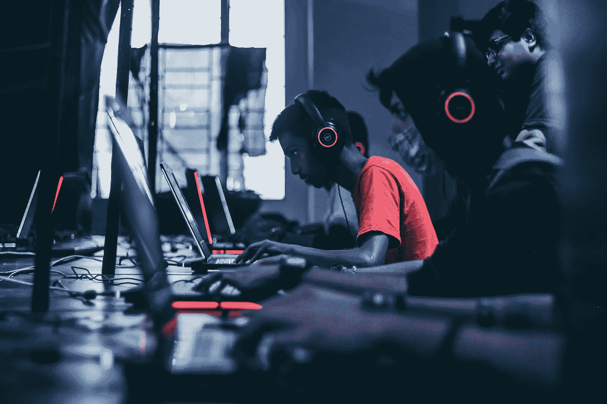
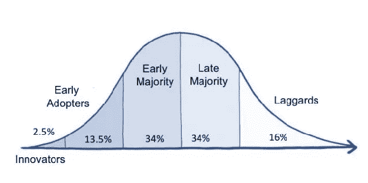
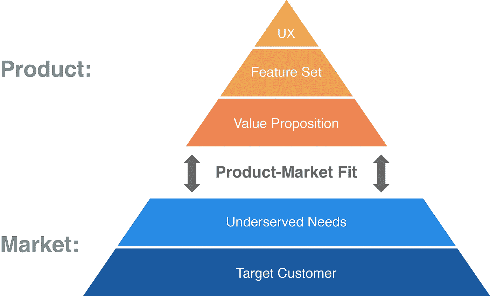

# 阻碍区块链奥运会成为主流的五个基本问题

> 原文：<https://medium.com/coinmonks/five-hurdles-that-blockchain-gaming-needs-to-overcome-to-become-mainstream-b8baa0a7f067?source=collection_archive---------2----------------------->

Photo by [Fredrick Tendong](https://unsplash.com/@fko2?utm_source=unsplash&utm_medium=referral&utm_content=creditCopyText) on [Unsplash](https://unsplash.com/s/photos/gaming?utm_source=unsplash&utm_medium=referral&utm_content=creditCopyText)

# 摘要

在区块链游戏成为主流之前，有五个关键障碍需要克服:

1.  玩家大致了解区块链及其对游戏的好处
2.  发现区块链与游戏的市场契合度
3.  玩家在他们的区块链互动中拥有无缝的用户界面/UX
4.  缩放问题已修复，区块链可以满足数百万玩家的需求
5.  AAA 工作室将其数百万美元的预算用于区块链游戏

# 游戏的当前状态

尽管区块链博彩业越来越受欢迎，但目前的生态系统仍处于起步阶段:

*   游戏开发者主要是小团队或工作室，他们正在尝试区块链的不同应用
*   所有区块链游戏的 dau 总数*小于[的 20k](https://dappradar.com/) 。这相当于 Steam[4700 万 DAUs](https://www.statista.com/statistics/733277/number-stream-dau-mau/) 的 0.04%*
*   大多数参与者是投机者和秘密原生者，而不是“主流”游戏玩家

区块链游戏不存在。但是需要什么呢？本文旨在强调区块链游戏主流化的关键步骤。

# 引领区块链游戏主流

以下是我认为将使区块链游戏成为主流的五个因素。我对主流的定义是超过 50%的玩家玩过使用区块链的游戏。

## 1.大众市场区块链理解

当我告诉我的(铁杆)游戏朋友我做了什么时，我得到的标准回答是:

> “什么是区块链？它在游戏中是如何工作的？当我在游戏中购买物品时，我不是已经拥有了吗？”

颠覆一个行业的唯一方法就是解决一个问题。但是你怎么能解决一个人们不知道存在的问题呢？

在区块链游戏成为主流之前，基础教育是必需的。玩家应该广泛理解什么是区块链(账本)以及它提供了什么(真正的所有权)。

没有对区块链的广泛了解，主流玩家不会转向区块链游戏。

需要进行大量的教育，而我们仅仅处于采用曲线的第一阶段。

*图表 1:创新采用曲线*

Adoption [bell curve](https://en.wikipedia.org/wiki/Technology_adoption_life_cycle) — we are at the beginning

## 2.发现区块链与游戏的市场契合度

区块链允许许多新的游戏机制。这些术语在行业中尚未标准化。一些不完全的例子包括:

*   二级市场——玩家拥有游戏中的物品，并可以在市场上交易这些物品来换取真钱
*   游戏赚钱——玩家可以玩游戏并获得奖励(ETH 或物品),这让他们可以将时间货币化
*   分享收入——内容创作者/玩家可以为游戏招募玩家并获得奖励(例如，当你推荐他们或当他们在你的“土地”上战斗时，获得所有玩家花费的百分比)
*   投资赚钱——投机者可以在不参与游戏的情况下进行交易和投资，目的是获利
*   更多:去中心化的决策、与第三方合作的激励机制、一劳永逸等等。

这些产品的问题在于它们都处于起步阶段。目前还不完全清楚哪个区块链使能的机械师工作得最好，他们有多有效，以及在什么情况下他们是有效的。

一旦这些区块链机制得到完善(并且找到了区块链与游戏的市场契合度)，区块链游戏将拥有超越普通游戏的先天优势。

> 游戏需要从“简单地使用区块链”发展到“足够好”*,因为*可以使用区块链。

*附件二:产品市场契合度图*

Blockchain-to-game fit can be likened to ‘product-market fit’ concept from [Lean Startup](https://leanstartup.co/a-playbook-for-achieving-product-market-fit/)

## 3.无缝用户界面/UX

为了让区块链游戏成为主流，它必须有无缝的用户界面/UX。众所周知，区块链的可用性问题必须在区块链游戏吸引大众市场之前得到解决。理想情况下，应该有一个无缝的用户界面/UX，模仿一个正常的游戏:

*   市场的行为就像在游戏中一样，不会因为区块链处理的限制而有时间延迟
*   区块链项目跨平台运行，具有移动、PC 和控制台功能
*   管理你钱包里的物品应该是无缝的，玩家可能甚至不知道他们在处理区块链(但知道他们“拥有”他们的物品)
*   信用卡购买是标准的，以消除在玩游戏之前必须注册第三方交易所和购买加密货币的痛苦

## 4.缩放问题已修复

以太坊是最受欢迎的区块链游戏。然而，ETH 事务目前被限制在每秒 10-15 个。这给一个游戏带来了很大的问题，在这个游戏中，玩家可能一秒钟要处理 100 或 1000 个事务。

如果不破坏以太坊网络，游戏目前无法在大众市场水平上运作——即使他们有足够多的玩家。

因此，在游戏成为主流应用之前，必须解决 ETH 扩展解决方案。潜在的解决方案包括:

*   满足交易限额的游戏级别调整(使用非区块链解决方案或部分集中)
*   以太坊通过 ETH2.0 或其他机制作为平台进行扩展
*   游戏转向其他每秒能处理更多事务的区块链

## 5.大型电影公司屈服于区块链

区块链目前只能走一局。玩家仍然会被高质量、设计精良和有趣的游戏所吸引。

目前区块链游戏开发商的预算有限，无法与 AAA 游戏竞争，因此即使他们设计出更好的游戏，也很难吸引主流玩家。

为了让区块链真正成为主流，像暴雪、EA 和育碧这样的大工作室(他们已经开始探索 T1)需要将区块链加入他们的游戏中。他们的大家伙。

目前有很大的阻碍因素阻碍他们这样做:

*   实施成本极高
*   扰乱当前玩家基础的巨大风险
*   需要改变他们的盈利模式

然而，总有一天，区块链的附加值会超过风险和成本，我们会看到 AAA 级工作室转向这项新技术。

当这种情况发生时，我们将会看到质量和游戏性达到像《T2》魔兽世界《T3》或《T4》英雄联盟《T5》水平的游戏，但是会有《区块链》的额外好处。

*请分享您的想法，告诉我们将区块链游戏推向大众需要什么或不需要什么——欢迎其他意见！*

如果你喜欢这篇文章，请鼓掌并关注我的 [*中*](/@xderek.lau) *或* [*微博*](https://twitter.com/xdereklau) *。*

> [直接在您的收件箱中获得最佳软件交易](https://coincodecap.com/?utm_source=coinmonks)

