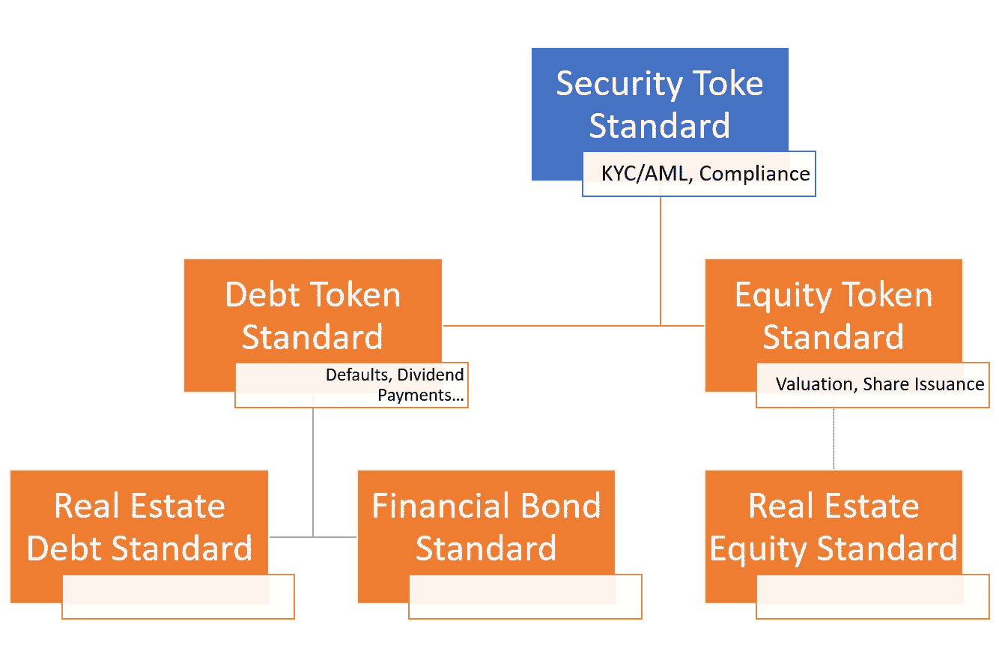

# 可以改进当前一代安全令牌平台的五个简单功能

> 原文：<https://medium.com/coinmonks/five-simple-features-that-can-improve-the-current-generation-of-security-token-platforms-1868c41dadbd?source=collection_archive---------1----------------------->

在我的安全令牌 2.0 论文文章中，我提出了下一波安全令牌平台的一系列想法。其中一些想法涵盖了高度复杂的主题，如治理或定价模型，我认为这些对于安全令牌的主流采用至关重要。然而，向安全令牌 2.0 架构的过渡需要一些时间。最近，我花了一些时间深入研究了安全令牌领域中一些最流行的平台，并将它们的功能与我正在介绍的一些令牌化场景相关联。因此，我列出了一些基本功能，我认为这些功能可以真正改善当前一代安全令牌平台，帮助发行者、投资者和开发者。在我看来，这些功能是对现有安全令牌平台的自然扩展，不需要对当前架构进行重大更改。以下是我最喜欢的五种能力。一如既往，我们欢迎反馈，只要它是合理的，并且不包含仇恨邮件😉

# 1-JavaScript 接口

与一些更主流的区块链协议相比，大多数安全令牌平台的编程模型都相当初级。因此，我们仍然没有看到区块链开发人员对安全令牌空间感到非常兴奋，也没有相关的第三方在当前的安全令牌平台组上构建 DApps。显然，这也是安全令牌空间年轻化的体现。

我认为在这方面很有帮助的一个特性是提供 JavaScript/NodeJS 接口，与安全令牌协议(如 Polymath、TrustToken 或 Securitize 的 DS)进行交互。请考虑将 Polymath.js 或 DSProtocol.js 作为一个接口，允许您开始发布安全令牌、提交适当的文档、指定需要遵守的初始法规或简单地查询发布过程的状态。

提供 JavaScript/NodeJS 桥的想法最近在许多流行的区块链协议中变得流行起来，作为一种改进开发人员足迹和支持创建第三方工具和应用程序的方法。像 [{SetProtocol}](https://docs.setprotocol.com/api) 或者 [Origin Protocol](https://github.com/OriginProtocol/origin-js) 甚至 [Stellar](https://www.stellar.org/developers/js-stellar-sdk/reference/index.html) 这样的项目在这方面做得非常好。

# 2-智能合同目录

随着安全令牌平台的发展，几乎可以肯定的是，它们将创建不同的智能合约，这些合约抽象了加密证券的许多监管或集成组件。智能合约有几个类别，如合规、与交易所整合或与投资者池整合，这些已经与证券代币发行相关。

发现适用于特定平台的智能合约、其预期功能、SLA 和负责方是一个简单的功能，可以真正提高安全令牌平台的可用性。我们可以把这个特性想象成一个简单的智能合约目录(一个应用程序商店),开发者可以在其中浏览和发现针对特定安全令牌发行的不同智能合约。

# 3-真正的安全令牌标准

安全令牌空间发展得如此之快，以至于对标准的需求正从一个花哨的需求变成这个新兴行业的一个非常重要的元素。像博学者 T2 这样的公司已经率先推出了第一批安全令牌标准 T3，但是他们肯定需要一些帮助。当前的安全令牌标准浪潮几乎不足以模拟现实世界中不同类型的加密证券的行为。

在我看来，安全令牌需要不同级别的标准，而不是单一的标准。就像我们有不同类型的证券，如股票、债券、商品、债券和衍生品一样，我们也可以使用一套反映安全令牌行为的分级标准协议。基本的安全令牌标准可以抽象出监管方面，如 KYC/反洗钱或渠道管理。基于通用安全令牌标准的债务令牌标准可以添加新的功能，例如股息支付或仲裁。房地产债务令牌可以使用房地产行业特有的功能来扩展债务令牌标准。按照这种思路，这里有一个安全令牌标准的基本层次结构，我认为它可以指导标准的创建过程。

# 4-披露市场和分析

【Stephen McKeon 教授经常使用术语“披露市场”来指代一种模式，在这种模式下，授权的第三方可以报告与安全令牌相关的信息。从房地产租赁估价的审计报告到私人公司的财务信息，披露是评估证券表现的一个关键因素。缺乏可靠的披露机制是阻碍大型机构投资者充分参与证券代币市场的因素之一。

作为对披露市场的补充，我相信安全令牌平台可以从宏观经济指标、令牌性能指标等领域更高水平的分析中受益。

# 5-编程模型和开发人员体验

即使按照区块链标准，大多数安全令牌协议的当前编程经验也是相对复杂的，并且从功能角度来看非常有限。我相信这是阻止区块链开发者进入安全令牌领域的一个原因。像[证券化](https://github.com/ethereum/EIPs/issues/1400)这样的公司已经开始通过发布他们的[开发者平台](https://developer.securitize.io/)来应对这一挑战，但是在这一领域还需要做更多的工作。

我们已经探讨了 JavaScript 接口的概念，将其作为一种机制来改善当前一代安全令牌平台的开发人员体验，但在这方面还有其他一些想法可能会有所帮助。以下是我想到的一些

容器化开发人员实例，以便他们可以很容易地提供。

在云区块链基础设施(如 AWS 或 Azure)上启用安全令牌平台的实例。

为开发者的贡献提供一个清晰的机制，使其进入主平台。

提供测试框架来验证安全令牌的当前功能。

# 其他功能

我选择了五种能力，它们似乎在相对容易交付(按照区块链的标准，容易并不容易)之间取得了恰当的平衡😉)并填补了当前安全令牌平台组中的一个重要空白。其他方面，如更好的工具、身份治理模型、oracle 支持以及与 Civic(身份)、{SET}(衍生工具)或 0x(分散交换)等基础协议的互操作性也很重要。像 [Securitize](http://securitize.io) 、 [TrustToken](https://www.trusttoken.com/) 和 [Polymath](https://polymath.network/) 这样的安全令牌平台已经在短时间内取得了长足的进步，因此，我们有望在不久的将来看到其中的一些功能。

> [直接在您的收件箱中获得最佳软件交易](https://coincodecap.com/?utm_source=coinmonks)

