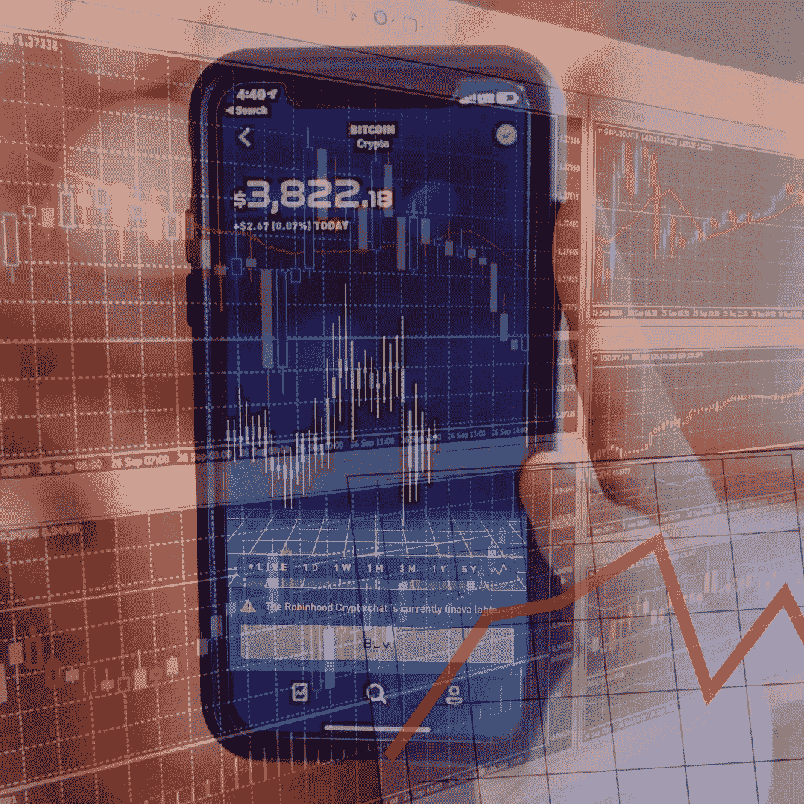

# 投资 Crypto 之前要问自己的五件事

> 原文：<https://medium.com/coinmonks/five-things-to-ask-yourself-before-investing-in-crypto-74b68ea50a0a?source=collection_archive---------4----------------------->

> 风险来自于不知道自己在做什么——沃伦·巴菲特

## ***Crypto 是一个很像旧东西的新事物***

正如我在[之前的一篇文章](/coinmonks/crypto-risk-management-to-vc-or-not-to-vc-60dc3682a857)中提到的，加密投资更像天使投资或风险资本，而不是股票或外汇市场的投资或交易。加密空间充满了*承诺*和*潜力*，但尚未交付*功能*。也就是说，创新的数量惊人，但我们还没有达到普通人在日常生活中看到创新成果的程度。

例如，最近的一项调查发现，尽管近一半的美国人听说过比特币，但只有 1%的人曾经交易或使用过比特币。总体而言，只有 16%的美国人曾经购买、出售或交易过任何加密资产。相比之下，美国股市几乎有 60%的人口持有股票。换句话说，crypto 还不是主流。此外，在加密资产被广泛使用之前，还需要达到几个里程碑。

> 只有 16%的美国人曾经购买、出售或交易过任何加密资产

两个最大的里程碑是:标准化和监管指导。标准化是一个技术问题，可能会被市场解决(不管是好是坏)。监管是一个人为问题，可能*会被市场解决(例如 [FINRA](https://www.finra.org/#/) 会被股票解决)，或者*可能*会被政府当局解决。如果你正在考虑投资加密资产，那么*可能是*、*可能是、*和*可能是*是你应该重点考虑的词。*

*这些词代表*不可知的*风险。不管你做了多少研究或分析，根本没有办法知道这些风将吹向何方。索拉纳会取代以太坊吗？谁也说不准。卡尔达诺会主宰这两者吗？有可能。有没有人在某个地方的计算机实验室里修修补补，将所有这些选项打得落花流水？有可能。政府会禁止其境内的密码交易吗？他们可能会。*

*关键是，在一天结束时，这是一个*猜测*什么可能会出现在上面。有不同的策略来增加你购买一个加密项目并从中获利的几率。它们可以分为三个基本类别:技术分析；基本面分析；和“相信你的直觉”。各有利弊。*

> *在一天结束时，这是一个猜测，什么可能会出现在顶部*

## ****麻痹经分析可能会省你一些钱****

*技术分析(TA)使用统计数据和概率，根据历史数据预测未来的价格走势。基本面分析(FA)使用可测量的数据来量化公司或项目的当前和未来价值。“相信你的直觉”(TYG)使用特殊的数据和指标来评估一个项目或公司的价值和潜力。*

*有了 TA，追随者所做的就是用概率来决定所有市场参与者的情绪。一个简单的例子可能是这样的:“上一次市场以这种方式移动，在这些基本条件下，出现了大规模抛售，因此我现在要卖掉。”技术分析*通常*是有效的，但是对初始假设高度敏感。低估或未能管理概率曲线的“尾部”是许多 TA 交易者失败的原因，尤其是散户。*

*对于 FA，追随者所做的是使用度量来比较一个未知的资产和相似的资产。一个简单的例子可能是这样的:XYZ 公司有 2000 万股流通股，每股 1 美元。ABC 公司做了类似的事情，但他们有 200 亿股流通股，每股 1 美元。如果 XYZ 的表现有美国广播公司的一半好，那么他们的股票应该会大幅上涨，因为可供选择的股票更少了，所以我会购买 XYZ 的股票基本面分析通常也有效，但它对市场情绪高度敏感。低估，或不能解释非理性，或外部力量是许多 FA 交易者失败的原因，尤其是散户。*

*对于 TYG，追随者所做的是依靠经验和个人见解的融合来确定资产是否有价值。一个简单的例子可能是这样的:“YouTube 权威人士说，XYZ·托肯的访问量下个月将会增长 1000 倍。我所有的朋友都在谈论 XYZ。XYZ 有一个蓝色的标志，我喜欢蓝色。因此，我打算买下 XYZ，”TYG 是大多数散户的败落之地。这也是通过制造市场动荡来破坏 TA 和 FA 的原因。*

## ****一刀切****

*在现实中，我认为大多数加密投资者使用所有的组合。一个简单的例子可能是:‘一个朋友告诉我关于 XYZ·托肯的事。我看了网站，听起来很有趣。我读了白皮书，看了市值。在 Reddit 上没有太多人谈论它，但那些谈论它的人有很多可信度。两年来价格一直很低，但最近一直在稳步上涨。该公司还刚刚宣布了一项重大的新功能，解决了 ABC 公司一直难以解决的一个问题。我知道很多人在美国广播公司起飞时赚了钱，我可以看到 XYZ 做同样事情的可能性。因此我打算购买 XYZ 代币。*

*有趣的是，不管你最终如何购买 XYZ，一旦投资成功，所有这些例子都有与 T2 相同的风险。XYZ 会上升，会下降，或者保持不变。地球上没有一个人能 100%肯定或准确地告诉你什么事情会发生，或者什么时候会发生。那些声称他们知道事后会发生什么的人——在*的所有*案例中——都患有[生存偏差](https://www.jstor.org/stable/2962224)和[控制错觉](https://www.ncbi.nlm.nih.gov/pmc/articles/PMC4013923/)。*

## ****问自己五个问题****

*所以，如果你听说了一个项目，或者正在调查一个项目，在投资之前你应该做些什么呢？提问。*

**1。你个人对这个项目感兴趣吗？**

*兴趣要知情，要根植于知识。我对太空旅行很感兴趣，但我对太空旅行是如何进行的知之甚少。金融对我来说也很有趣，但是我有很多金融知识。如果我投资一家太空旅行公司，我的投资将比投资一家金融公司风险大得多。建议:要么坚持你所知道的，要么在你购买之前显著增加你所知道的。*

**2。提出的主张与现实相符吗？**

*很容易说你将成为下一个谷歌。这很难做到。XYZ 公司说他们将彻底改革这个行业？怎么会？之前有其他公司尝试过吗？为什么没用？XYZ 会有什么不同？是否有另一家公司(或十家)在尝试做同样的事情？他们真的交付了有用的东西吗？外卖:结果>话；概率>可能性；炒作=谨慎。*

**3。你的期望与现实相符吗？**

*我看到人们一直在猜测 Dogecoin 或 Shiba Inu 会在未来达到某个价格点，比如“Doge 会涨到 10 美元吗？”当然，真正的答案是谁也不知道。但是，可能的答案是什么呢？Dogecoin 的 [tokenomics](https://bravenewcoin.com/insights/doge-price-analysis-you-can't-keep-a-good-dog-down) 似乎不支持 10 美元的 Dogecoin，Doge 背后的核心理念是低价值、无摩擦的交易。换句话说，如果 Dogecoin 以目前流通的代币数量达到 10 美元，它的市值将超过 1 万亿美元。客观地说，目前只有价值约 1060 亿美元的英镑纸币在流通中(T2)。要点:对照现实世界的价值观测试你的期望。*

**4。你想修补和交易，还是 hodl？**

*我侄子最近开始摆弄密码。尽管在加密知识测验中只获得了 71%的分数，他已经开始投入资金了。他的第一个冲动是交易。我给他的建议是不惜一切代价避免。总的来说，交易包括试图把握市场时机，低买高卖。而且，一般来说，它不适用于风险投资，也没有霍德林那么管用。对批评者，我说:[这个](https://www.researchgate.net/publication/24091730_Boys_Will_Be_Boys_Gender_Overconfidence_And_Common_Stock_Investment)，[这个](https://www.jstor.org/stable/2962224)，还有[这个](https://www.ncbi.nlm.nih.gov/pmc/articles/PMC4013923/)。在高度不稳定和波动的市场中，交易尤其危险。建议:如果你想安全地交易，坚持投资股票——这样你会更快地赔钱。*

**5。你能负担得起吗？**

*记住，现在投资加密就像大众的风险投资。但是，美国的风险资本仅限于合格的投资者是有原因的。合格的投资者有更多的钱去冒险，也有更多的钱去亏损。风险投资在别人还没有意识到的地方寻找价值。这是一个巨大的风险，但如果项目启动，回报也是巨大的。但是，只有当风险投资家能够把他们的资金留在那里，直到项目启动或者失败，这种方法才会奏效。风险投资不会买一个项目，希望它涨到足以支付下个月的租金。秘诀:为了增加你成功的可能性，像一个风险投资家那样行动。买入+持有+等待+希望=你的最佳选择。*

*加密空间正在迅速发展。未来五年将带来创新和效率，我相信这将改变我们所知的世界。如果你对秘密投资感兴趣，你是在表达自己有兴趣成为变革的一部分，而不是一个目击者。而且，如果你真的很幸运的话，这也可能会改变你的经济生活。有大量的东西需要学习，但是如果你坚持上面的原则，你可以睁大眼睛开始走上这条路。你的策略会随着你的知识而发展。同时，注意安全，玩得开心！这是一个激动人心的时刻！*

> *加入 Coinmonks [电报频道](https://t.me/coincodecap)和 [Youtube 频道](https://www.youtube.com/c/coinmonks/videos)了解加密交易和投资*

## *另外，阅读*

*   *[南非的加密交易所](https://blog.coincodecap.com/crypto-exchanges-in-south-africa) | [BitMEX 加密信号](https://blog.coincodecap.com/bitmex-crypto-signals)*
*   *[MoonXBT 副本交易](https://blog.coincodecap.com/moonxbt-copy-trading) | [阿联酋的加密钱包](https://blog.coincodecap.com/crypto-wallets-in-uae)*
*   *[Remitano 审查](https://blog.coincodecap.com/remitano-review)|[1 英寸协议指南](https://blog.coincodecap.com/1inch) | [购买 Floki](https://blog.coincodecap.com/buy-floki-inu-token)*
*   *[Bitget 评论](https://blog.coincodecap.com/bitget-review) | [双子星 vs BlockFi](https://blog.coincodecap.com/gemini-vs-blockfi) | [OKEx 期货交易](https://blog.coincodecap.com/okex-futures-trading)*
*   *[OKEx vs KuCoin](https://blog.coincodecap.com/okex-kucoin) | [摄氏替代品](https://blog.coincodecap.com/celsius-alternatives) | [如何购买 VeChain](https://blog.coincodecap.com/buy-vechain)*
*   *[币安期货交易](https://blog.coincodecap.com/binance-futures-trading)|[3 commas vs Mudrex vs eToro](https://blog.coincodecap.com/mudrex-3commas-etoro)*
*   *[在印度利用加密套利赚取被动收入](https://blog.coincodecap.com/crypto-arbitrage-in-india)*
*   *[德国最佳加密交易所](https://blog.coincodecap.com/crypto-exchanges-in-germany) | [WazirX P2P](https://blog.coincodecap.com/wazirx-p2p)*
*   *[印度的加密税](https://blog.coincodecap.com/crypto-tax-india) | [altFINS 审查](https://blog.coincodecap.com/altfins-review) | [Prokey 审查](/coinmonks/prokey-review-26611173c13c)*
*   *[布洛克菲 vs 比特币基地](https://blog.coincodecap.com/blockfi-vs-coinbase) | [比特坎评论](https://blog.coincodecap.com/bitkan-review) | [币安评论](/coinmonks/binance-review-ee10d3bf3b6e)*
*   *[Coldcard 评论](https://blog.coincodecap.com/coldcard-review) | [BOXtradEX 评论](https://blog.coincodecap.com/boxtradex-review)|[uni swap 指南](https://blog.coincodecap.com/uniswap)*
*   *[阿联酋 5 大最佳加密交易所](https://blog.coincodecap.com/best-crypto-exchanges-in-uae) | [SimpleSwap 评论](https://blog.coincodecap.com/simpleswap-review)*
*   *[购买 Dogecoin 的 7 种最佳方式](https://blog.coincodecap.com/ways-to-buy-dogecoin) | [ZebPay 评论](https://blog.coincodecap.com/zebpay-review)*
*   *[iTop VPN 审查](https://blog.coincodecap.com/itop-vpn-review) | [曼陀罗交易所审查](https://blog.coincodecap.com/mandala-exchange-review)*
*   *[比特币基地 vs 瓦济克斯](https://blog.coincodecap.com/coinbase-vs-wazirx) | [比特鲁点评](https://blog.coincodecap.com/bitrue-review) | [波洛涅克斯 vs 比特克斯](https://blog.coincodecap.com/poloniex-vs-bittrex)*
*   *[美国最佳加密交易机器人](https://blog.coincodecap.com/crypto-trading-bots-in-the-us) | [经常性回顾](https://blog.coincodecap.com/changelly-review)*
*   *[A-Ads 审查](https://blog.coincodecap.com/a-ads-review) | [Bingbon 审查](https://blog.coincodecap.com/bingbon-review) | [Mudrex 投资](https://blog.coincodecap.com/mudrex-invest-review-the-best-way-to-invest-in-crypto)*
*   *[最好的卡达诺钱包](https://blog.coincodecap.com/best-cardano-wallets) | [Bingbon 副本交易](https://blog.coincodecap.com/bingbon-copy-trading)*
*   *[印度最佳 P2P 加密交易所](https://blog.coincodecap.com/p2p-crypto-exchanges-in-india) | [柴犬钱包](https://blog.coincodecap.com/baby-shiba-inu-wallets)*