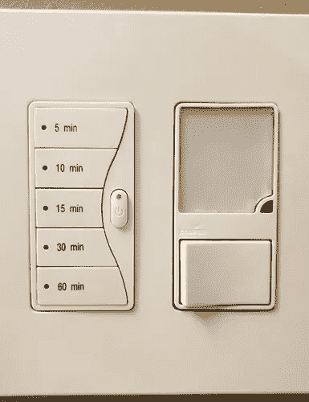
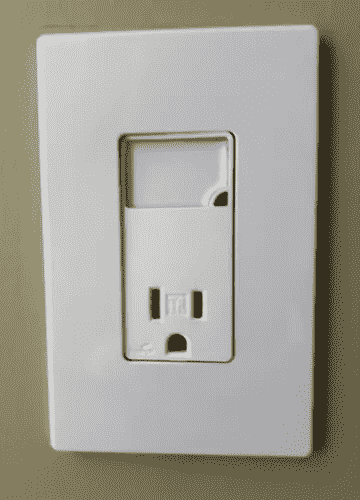
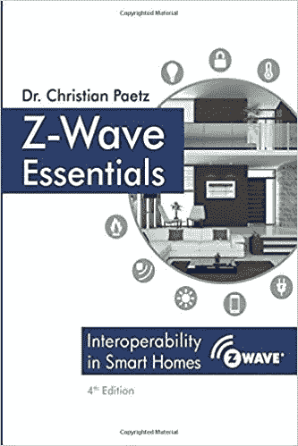

# 让您的智能家居设备系列更上一层楼的五件事

> 原文：<https://medium.com/coinmonks/five-things-to-take-your-line-of-smart-home-devices-to-the-next-level-2f06a21b6683?source=collection_archive---------3----------------------->

## 致三星的公开信

今天早些时候，我收到了一封来自三星 SmartThings 部门的电子邮件，他想告诉我“让你的智能家居更上一层楼的五件事。”我最近一直在玩 Z-Wave，碰巧我有自己的“智能”设备供应商应该做的事情清单。我记下我的想法，保持他们的五件事格式，并把它们发送给三星。这篇文章的其余部分是电子邮件。

亲爱的聪明人，

非常感谢你的邮件，解释如何把我的智能家居提升到一个新的水平。请允许我就如何将智能家居设备供应商提升到下一个水平提供类似的建议。

***让您的智能家居产品更上一层楼的五件事***

**首先是户外传感器。**

据我所知，除了购买气象站，几乎没有 Zigbee/Z-Wave 解决方案来测量室外温度、湿度和/或光线。不仅我全面的谷歌搜索没有发现除了 [Aeotech 多传感器](https://amazon.com/dp/B0151Z8ZQY)(关于户外适用性的不同规格清单有冲突)，而且有无数 SmartThings 论坛讨论要求这种类型的设备。如果你制造一些被认证为防雨的传感器，市场将会吞噬它们。请尽快考虑这样做。

**两个:室内风扇/灯光控制器**

任何将吸顶灯升级为风扇的人在开关盒中都有一根负载线，但需要控制这两个设备。我能找到的唯一解决方案是安装在风扇内部的汉普顿湾灯/风扇控制器。虽然这种方法有效，但该设备的控制是一个手持遥控器。配电盘被完全忽略，必须用空白插件封闭。

我们需要的是一个风扇内解决方案和一个匹配的墙内控制器。风扇内解决方案将类似于汉普顿湾单位:下罩灯和风扇负荷控制器。墙壁控制器不会直接控制负载，但会使用场景或 Z-Wave 关联来控制罩下风扇和照明负载。

**三:道路照明**

Cooper 生产了一系列 Decora 风格的开关和插座，其中的设备是一个光电池控制的 led 灯。在插座的情况下，灯取代了两个插座中的一个。在开关的情况下，设备的下半部分是一个侧面的摇臂开关，灯在顶部。我家里大约有十几个这样的设备，不会被 Z-Wave 取代。这里有几个例子:

LED lighted switch and receptacle by Cooper Wiring Devices

**四:无处不在的温度感应**

每个设备都应该感应并报告温度。考虑能够精确定位燃烧结构中的热点、追踪火灾的起源和蔓延、评估阻燃材料和灭火控制的功效，以及通过实时下载报告而不是等待几天或几周进行实验室分析所带来的影响。还要考虑根据日照负荷、冷负荷等了解围墙内设备温度变化的诊断能力。绝缘不足？我们可以确定。管道设计不佳导致室内小气候不均匀？我们可以确定。

或者我们****可以识别类似的东西，如果每个设备都有一个热敏电阻并报告温度。至少，每个硬连线设备都应该这样做。**

****五:无线集线器****

**我隔壁的美国电话电报公司互联网服务是这样设置的，即调制解调器只能与 PC 通信。它使用 MAC 地址过滤，并将 DHCP 地址分配限制在一台设备上。除了切换到 Spectrum Cable & Internet 或支付赎金购买第二个 IP 地址和路由器端口，我的邻居无法使用 SmartThings hub，因为它需要硬连线连接。他们当然可以使用 Echo Plus 作为无线集线器，除非他们真正想要的东西——车库门传感器——无法被 Alexa 识别。**

**人们不禁要问，由于缺少硬连线以太网连接，SmartThings 没有为多少客户提供服务。由于这似乎是美国电话电报公司的事情，这可能是一个相当大的数字，即使只是美国电话电报公司网络中的一些地区以这种方式限制客户。**

****总之……****

****

**在他的书 [Z-WAVE ESSENTIALS](https://amazon.com/dp/171870822X) 中，Christian Paetz 博士有几个图表专门呼吁户外传感器的存在，以实现特定的“如果-这-那-那”场景。因此，对于新的 Z-Wave 爱好者来说，发现除了购买一个成熟的气象站之外，没有这样的设备存在，这是可以理解的惊讶。对于厂商来说，发现这是在线论坛中的一个长期话题，并且在现有 Z-Wave 用户社区中存在一个潜在的非常大的市场应该不会感到惊讶。**

**无处不在的温度感应建议只是常识。只需几便士和几行代码，我就可以在 Arduino 上添加一个热敏电阻，制成一个温度传感器，足以区分人类居住空间的任何正常温度与被火焰吞没或冻结的岩石固体之间的差异。因此，即使是具有高误差容限的廉价热敏电阻的额外功能也将超过任何可能的成本，这是显而易见的。这些应该成为标准，如果市场不提供，那么，像安全带一样，立法应该要求温度传感，因为这对公共利益是必要的。三星可以成为这方面的领导者，立即在他们制造的每个 Z-Wave 或 Zigbee 产品中添加温度传感器，然后在会议上展示这样做的法医好处。**

**我提出的所有其他问题都存在于完全愚蠢的设备和智能设备之间的市场空间。例如，我的 path lighting 作为一个哑插座或开关比作为一个智能 Z-Wave 等效物更有用，因此十几个开关和插座都不会被替换。我可能会 3D 打印一个设备，将我的新汉普顿湾风扇遥控器安装在现有的电灯开关上或旁边。如果你对这个词的定义仅仅停留在功能上，而完全没有考虑到形式，这才是“聪明”。**

**就目前的情况而言，市场喜欢称之为“智能家居”的东西更适合称为“智能房屋”，因为智能很大程度上局限于建筑外壳内。即使在这个狭窄的定义中，“智能”仍然是许多常见使用案例的理想选择，例如带有集成灯具的吊扇。在这一点上，一些使用案例，如火灾探测和智能设备的取证功能，似乎还没有得到考虑。尽管家庭自动化已经变得很好，但许多愿景仍未实现，缺失部分所代表的潜在市场仍无人认领。至少目前是这样。让我们都希望这种情况能尽快改变。**