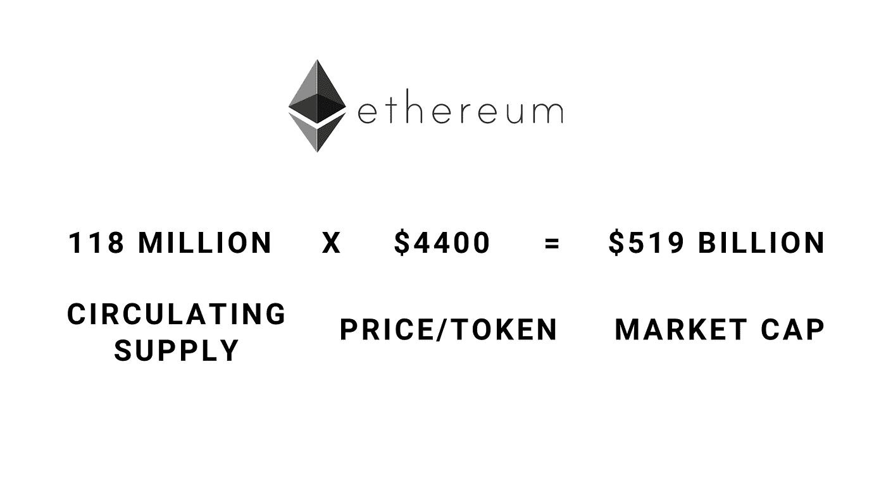
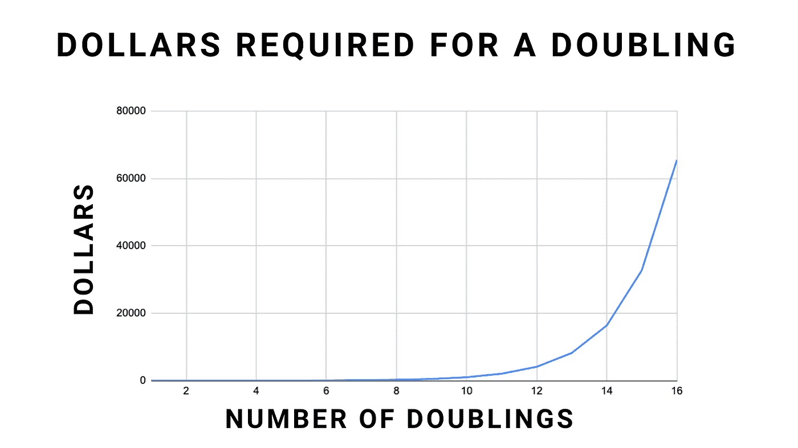
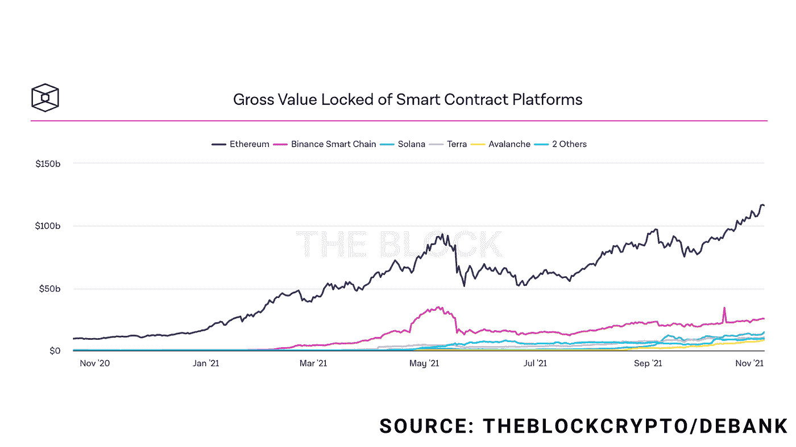
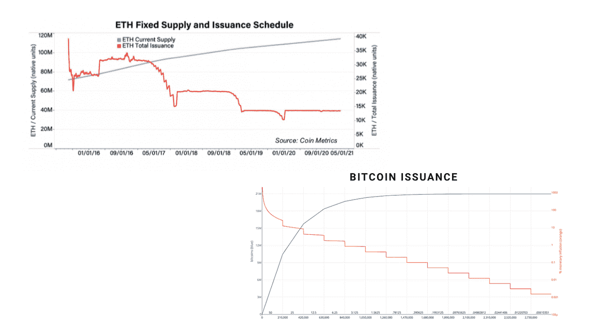
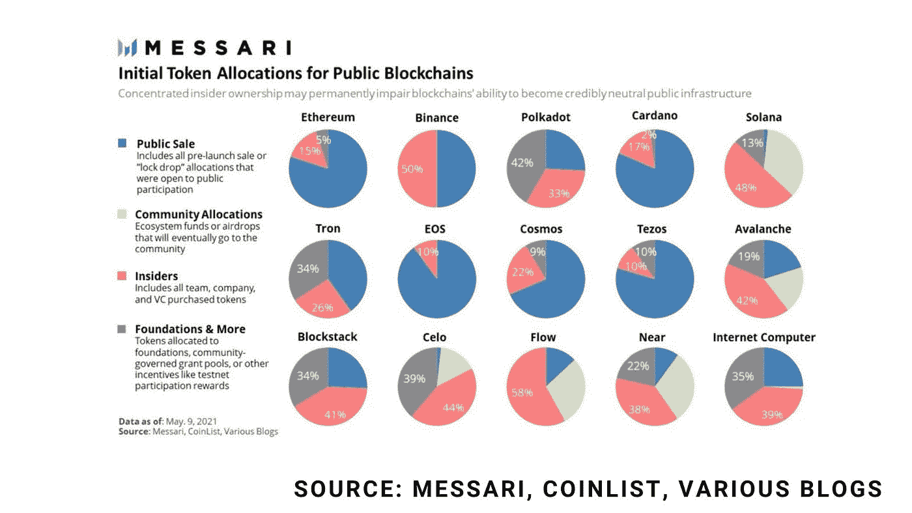
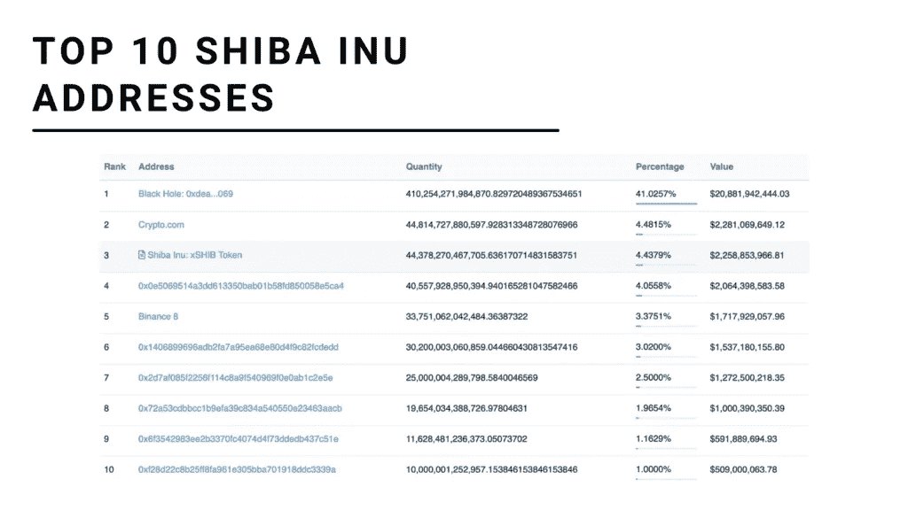
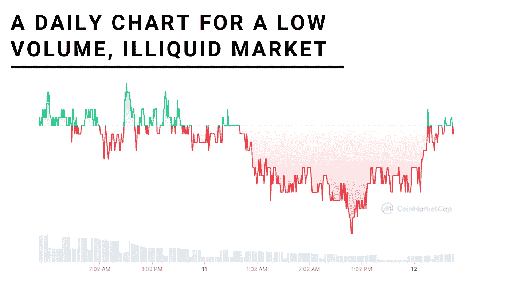
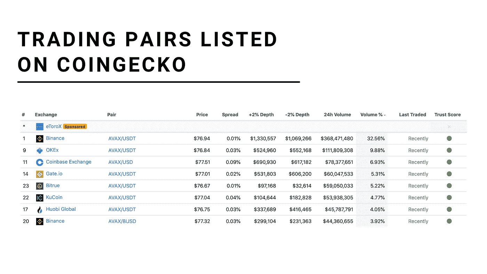

# 寻找爆炸性替代硬币的五个被低估的指标

> 原文：<https://medium.com/coinmonks/five-underrated-metrics-for-finding-explosive-altcoins-6d68d0d5cc87?source=collection_archive---------4----------------------->

## 我只把一小部分内容放在媒体上。如果你想获得所有加密实用主义新闻更新、投资公告和 altcoin 报告的全部信息，请在此免费注册简讯。

> *没有数据，你只是另一个有观点的人。”*
> 
> *–爱德华·戴明*

我写道[以投资替代币](https://cryptopragmatist.com/sign-up-medium/)为生，随着我看到越来越多的新投资者进入这个领域，我看到越来越多关于替代币如何工作、成长和行为的误解。为了帮助教育社区的新成员和更新有经验的人的基础知识，今天我将讨论五个指标，如果你想对替代硬币进行明智的投资，这些指标是绝对必要的。

这些指标的共同点是它们客观且无可争议；现实可以有不同的解释方式，但这些指标是无可争议的。由于这种确定性，它们代表了一个基础，在这个基础上我们可以得出更合理的和(希望)有益的结论。

这些数据不仅能帮助我们找到隐藏的金币宝石，还能帮助我们避开危险信号。这些概念没有特定的顺序。

​

# 1.市值

**发现地:** CoinGecko，CoinMarketCap，TradingView

**定义:**市值是衡量加密货币总规模的指标。它是单个代币的价格乘以流通中的代币总数。稀释市值反映了单个代币的价格乘以将被创造的代币总量。

**解读市值:**

市值是有意义的，因为密码的大小有助于我们理解多少增长是可能的或合理的。对于给定的加密货币来说，价格翻一番，需要资本投入的指数级增长。查看下图:

举个现实生活中的例子，比特币经历了 1000 倍的上涨，仅用了 30 个月(2010 年 9 月—2013 年 3 月)，价格从 0.06 美元涨到 60 美元。接下来的 1000 倍用了 96 个月。再过 1000 倍，比特币的价值将达到 1.14 万亿美元，超过全球经济总量的 12 倍。这可能不会发生。

比特币要想从今天的价格翻一番，需要注入超过 1 万亿美元的资本。这是可能的，但不是一个小壮举。但是一枚 100 万美元的 altcoin 绝对可以经历 1000 倍。它需要不到 10 亿美元的新资本，这甚至不会让它进入市值前 100 名。正是因为这个原因，柴犬不会去一美元:只是没有足够的钱在世界上。

**为什么重要:**上图向我们展示了一枚替代硬币的大部分收益发生在其生命周期的早期。因此，尽管较小的密码风险大得多，但它们有更大的上升空间，因为较少的资本可以改变价格。

​

# 2.锁定的总价值(TVL)

**产地:**守宫壁虎

**定义:**给定协议中存放(或锁定)的所有资产的总和。资产被锁定，为贷款提供担保，产生利息，或被押上以获得更多的硬币。

**解释锁定的总值:**

出于各种原因，加密货币都是有价值的——比特币之所以有价值，是因为它是一种分散的、可转移的价值储存手段。Monero 是有价值的，因为它是一种私人货币。以太坊是有价值的，因为它创建了智能合同，即分散的协议，以存储和转移网络用户之间的价值。

总价值锁定(TVL)是基于第三种类型的价值，即价值可以通过存款、用作抵押品、用作流动性或用于利息的赌注来存储在密码中。协议中锁定的美元价值是估算该资产内在基本价值的一种方式。

那么，这个 TVL 对于给定加密货币的价值意味着什么呢？一些生态系统产生巨大的现金流和价值锁定费，然后再分配给用户(创客 Dao 和 Abracabra Money 就是两个例子)。对于像 AAVE 这样的协议，产生的费用被用来回购令牌并烧掉，造成了通缩供应压力。Uniswap 甚至不为使用他们的协议收费，但是所有锁在里面的资产都代表了真正的价值。

一个与 TVL 密切相关的统计数据是 TVL 比率，这是一个加密的市值与其锁定的总价值的比率。在许多情况下，投资者将 TVL 比率小于 1 的加密视为其被低估的信号，而 TVL 比率超过 1 则意味着该资产可能被高估。这太简单了，一些有价值的密码(比如比特币)没有 TVL。这并不意味着它们毫无价值。

不要用 TVL 来评估协议本身，而是用它来理解锁定的价值如何为令牌持有者创造财富以及对加密货币的需求。

**重要原因:**总价值锁定可以让您了解加密生态系统的健康状况，以及协议创造的内在价值。

​

# 3.通货膨胀率

**在哪里找到的:**白皮书、官方文档、谷歌

**定义:**通货膨胀率是一种加密货币的代币供应量增加的速率。当硬币/代币被开采或通过赌注创造出来时，供应量就会膨胀。

**解读通货膨胀率:**

膨胀表示在加密生态系统中如何创建令牌，这是加密供应方的一个关键方面。随着代币的产生，它们被添加到市场中，并且必须被对代币的更多需求所抵消。如果需求没有超过新供给，密码将会下跌。

一些密码是通货紧缩的。比特币总有一天会没有通货膨胀，一旦以太坊开采了它的全部供给，它就会通货紧缩，每笔交易都会烧掉代币。您可以在下图中看到这些密码的令牌发布时间表。

通胀供给不一定是坏事，通缩供给也不总是好事，但如果我们理解了生产如何影响供给和需求，我们就能更好地理解导致密码价格上涨或下跌的因素。

**为什么重要:**通货膨胀率让我们可以了解给定加密货币的供应量是如何变化的。通货膨胀率越高，要保持同样的象征性价格，密码就需要增长得越大。

​

# 4.硬币分配

**发现地点:**官方文档、白皮书、区块链探索者

**定义:**分析硬币分布包括查看网络中代币的分布，并查看该分布是否过于集中。

**解读硬币分配:**

或许加密货币背后最重要的原则是去中心化:在网络上分配权力给我们自由和自主权的想法。当硬币被集中时，网络的完整性被破坏，权力变得巩固。不均衡的分配也产生了操纵价格的问题。

分布式网络防止小团体获得对协议的过多控制或操纵价格。当一个代币发行时，创始人和投资者的分配就完成了。你可以在下面看到一些最大的密码的分布。

​

但是随着加密技术的发展和成熟，这种分布会发生变化。由于大多数区块链是上市的，我们实际上可以使用像 [etherscan.io](https://app.convertkit.com/campaigns/7428384/etherscan.io) 这样的区块链探索者来看看最大的钱包控制了多大比例的供应。以下是柴犬上最大的钱包，例如:

有些地址是已知的，并已标记。第一个地址是一个烧毁地址，意味着 SHIB 被送到那里，不能恢复(密码使用象征性烧毁作为一种通货紧缩策略)。排名第四的钱包在柴犬拥有 20 亿美元，超过供应量的 4%。如此大规模的销售可能会压低价格。

**为什么重要:**如果硬币或代币分配不均，这意味着某些团体和个人对代币及其价格拥有更大的权力。这在某种程度上是必然会发生的，但差距越大，问题就越大。

​

# 5.交易量

**产地:** CoinGecko，CoinMarketCap

**定义:**交易量是在给定时间段内来回交易的价值金额，通常以美元衡量。

**解读交易量:**

当我们进入或退出交易时，我们是在参与一个开放的市场，在这里我们与屏幕另一边的一个真实的人互动。在一个给定的市场中交易的所有人的总和就是交易量，来回交易的价值越多，这个市场通常就越有效率和流动性。

成交量很重要，因为它可以帮助我们避免参与可能被操纵的流动性差的市场。流动性差的市场也使得进出交易变得困难。请看下图:

每一个平点都是一个没有交易发生的时间段——这意味着你不可能以市价退出交易。像 CoinGecko 这样的服务可以在一个地方向你展示一种加密货币的所有市场和交易量。大盘股显然会有更大的交易量，但大量的小盘股对小投资者来说有足够的流动性。

集中交易可以提供关于流动性和交易量的有价值的信号。当一个替代硬币在 CEX 上市时，这意味着团队认为该资产具有足够的流动性，可以拥有一个公平有效的市场，并且该资产周围将有足够的交易量，可以为交易所产生费用收入。

**为什么重要:**交易量不大的密码是效率更低的市场，当你进入和退出交易时，可能会导致不公平的交易。交易量大、流动性高的市场不太可能被操纵。

# 包扎

作为一名独立的 altcoin 研究员，我的目标是帮助加密投资者做出有论文支持的明智投资决策。虽然这些指标和统计数据绝非包罗万象，但它们将帮助你避免常见的危险信号，并帮助你寻找被低估的宝石。狩猎愉快！

[**点击这里**](https://cryptopragmatist.com/sign-up-medium/) **每周从 Crypto Pragmatist 获取内容，绝对免费。**

> 加入 Coinmonks [电报频道](https://t.me/coincodecap)和 [Youtube 频道](https://www.youtube.com/c/coinmonks/videos)了解加密交易和投资

## 另外，阅读

*   [如何购买 Monero](https://blog.coincodecap.com/buy-monero) | [IDEX 评论](https://blog.coincodecap.com/idex-review) | [BitKan 交易机器人](https://blog.coincodecap.com/bitkan-trading-bot)
*   [如何在 Bitbns 上购买柴犬(SHIB)币？](https://blog.coincodecap.com/buy-shiba-bitbns) | [印度币安](https://blog.coincodecap.com/binance-in-india)
*   [币安 vs Bitstamp](https://blog.coincodecap.com/binance-vs-bitstamp) | [比特熊猫 vs 比特币基地 vs Coinsbit](https://blog.coincodecap.com/bitpanda-coinbase-coinsbit)
*   [如何购买 Ripple (XRP)](https://blog.coincodecap.com/buy-ripple-india) | [非洲最好的加密交易所](https://blog.coincodecap.com/crypto-exchange-africa)
*   [非洲最佳加密交易所](https://blog.coincodecap.com/crypto-exchange-africa) | [胡交易所评论](https://blog.coincodecap.com/hoo-exchange-review)
*   [eToro vs robin hood](https://blog.coincodecap.com/etoro-robinhood)|[MoonXBT vs by bit vs Bityard](https://blog.coincodecap.com/bybit-bityard-moonxbt)
*   [Stormgain 回顾](https://blog.coincodecap.com/stormgain-review) | [Bexplus 回顾](https://blog.coincodecap.com/bexplus-review) | [币安 vs Bittrex](https://blog.coincodecap.com/binance-vs-bittrex)
*   [Bookmap 评论](https://blog.coincodecap.com/bookmap-review-2021-best-trading-software) | [美国 5 大最佳加密交易所](https://blog.coincodecap.com/crypto-exchange-usa)
*   [如何在 FTX 交易所交易期货](https://blog.coincodecap.com/ftx-futures-trading) | [OKEx vs 币安](https://blog.coincodecap.com/okex-vs-binance)
*   [如何在无法阻挡的域名上购买域名？](https://blog.coincodecap.com/buy-domain-on-unstoppable-domains)
*   [印度的加密税](https://blog.coincodecap.com/crypto-tax-india) | [altFINS 审核](https://blog.coincodecap.com/altfins-review) | [Prokey 审核](/coinmonks/prokey-review-26611173c13c)
*   [Blockfi vs 比特币基地](https://blog.coincodecap.com/blockfi-vs-coinbase) | [比特坎评论](https://blog.coincodecap.com/bitkan-review) | [币安评论](/coinmonks/binance-review-ee10d3bf3b6e)
*   [Coldcard 评论](https://blog.coincodecap.com/coldcard-review) | [BOXtradEX 评论](https://blog.coincodecap.com/boxtradex-review)|[uni swap 指南](https://blog.coincodecap.com/uniswap)
*   [阿联酋五大最佳加密交易所](https://blog.coincodecap.com/best-crypto-exchanges-in-uae) | [SimpleSwap 评论](https://blog.coincodecap.com/simpleswap-review)
*   购买 Dogecoin 的 7 种最佳方式
*   [iTop VPN 审查](https://blog.coincodecap.com/itop-vpn-review) | [曼陀罗交易所审查](https://blog.coincodecap.com/mandala-exchange-review)
*   [美国最佳加密交易机器人](https://blog.coincodecap.com/crypto-trading-bots-in-the-us) | [经常性评论](https://blog.coincodecap.com/changelly-review)
*   [A-Ads 审查](https://blog.coincodecap.com/a-ads-review) | [Bingbon 审查](https://blog.coincodecap.com/bingbon-review) | [Mudrex 投资](https://blog.coincodecap.com/mudrex-invest-review-the-best-way-to-invest-in-crypto)