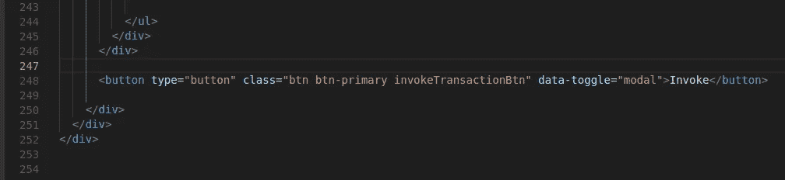
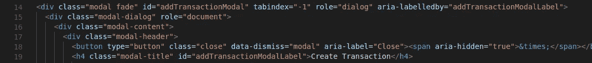
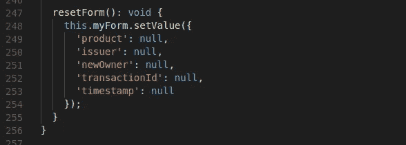
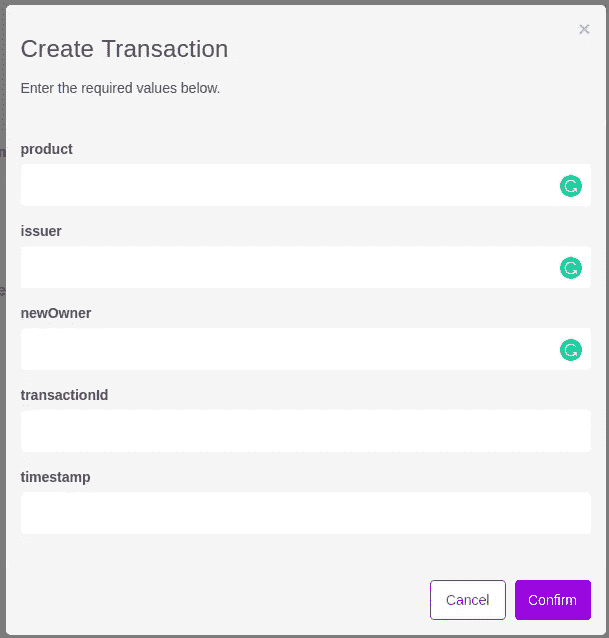
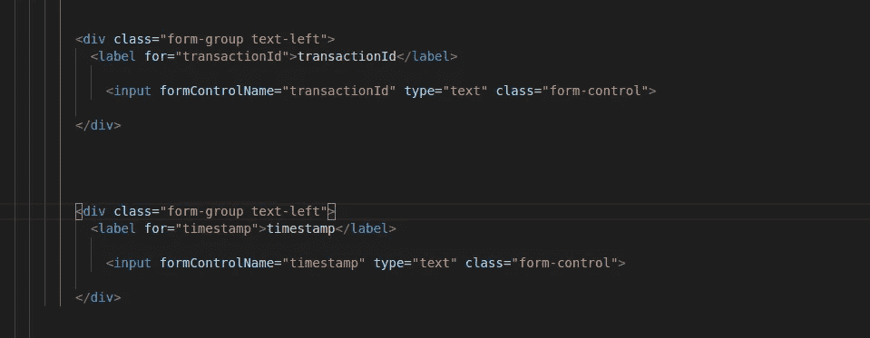
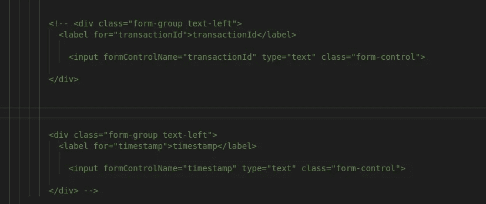

# 为 Hyperledger 结构区块链应用程序修复 Angular 中的事务处理问题

> 原文：<https://medium.com/coinmonks/fixing-transaction-issue-in-angular-for-hyperledger-fabric-blockchain-application-fe7e28a7bb6e?source=collection_archive---------4----------------------->

这篇文章指导你如何在 angular 前端修复 **Invoke Transaction** 按钮。


运行 **Yeoman 后，**为我们的业务网络生成 angular app，我们可以看到我们可以创建、编辑和删除资产和参与者，但是**调用事务**按钮不起作用。

这是因为 invoke 按钮没有正确映射到 addTransactionModal。

按照以下步骤解决问题。

# **第一步:修复调用按钮**

转到代码的最后一行。



我们可以看到调用按钮不起作用，因为 ***点击*** 功能没有描述，并且 ***数据目标*** 缺失。所以用下面一行代替那一行。

```
<button (click)="resetForm();" type="button" class="btn btn-primary" data-toggle="modal" data-target="#addTransactionModal">Invoke</button>
```

当点击 Invoke 按钮时，它调用**addtransactionmode**，该模式在**transaction.component.html 文件的开头定义。**



addTransactionModal

它还调用 resetForm()，这在**transaction . component . ts .**中有描述。每当我们单击 **Invoke** 按钮时，它就会清空输入表单。



resetForm code

# **步骤 2:固定额外输入**

保存代码文件后，当您运行它时，它就工作了。但是时间戳和 transactionId 也显示在表单中。



Create Transaction

要解决这个问题，我们应该在**transaction.component.html 文件中找到这个表单代码。**



我们可以看到，还为这个 transactionId 和时间戳定义了输入框。这些应由 hyperledger 结构生成，用户不应输入这些内容。因此，通过注释掉上面的行来解决这个问题。



我使用 visual studio 作为我的主要代码编辑器。选择所有的行，点击 **Ctrl+/** 可以一次注释所有选中的行。保存文件并运行应用程序。

瞧吧！！！

调用事务按钮现在工作正常。这花了我几乎几天的时间来找出为什么点击时按钮不工作。

现在你已经有了一个功能齐全的 angular 应用程序，适用于你的 hyperledger 模型。