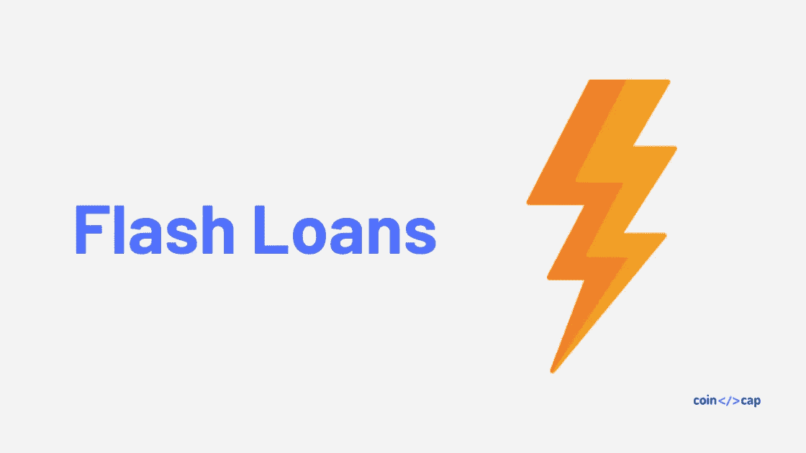

# 快速贷款——无抵押借款

> 原文：<https://medium.com/coinmonks/flash-loans-borrow-without-collateral-e315ce1ae931?source=collection_archive---------1----------------------->

## 面向所有人的加密流动性

DeFi(去中心化金融)生态系统正在不断创新，并展示了当你拥有可编程资金时可以实现的事情。快速贷款是这个生态系统中的最新成员。

## 什么是闪贷？

一种在一次交易中借出并偿还的贷款，称为闪贷。因此，你不需要任何抵押品的快速贷款。以下是闪贷的属性:

*   在一次交易中借和还
*   不需要抵押品
*   借款人需要归还原始借款金额+少量费用(目前为 0.09%)
*   交易需要成功完成，否则一切将被还原，你需要支付唯一的燃气费(以太坊需要执行交易)

## 闪贷是如何运作的？

闪贷是由 [Aave 项目](https://aave.com/?utm_source=coincodecap.com)推出的，这是一个建立在[以太坊](https://blog.coincodecap.com/tag/ethereum/)之上的借贷协议。

Aave 协议支持典型的抵押贷款。任何人都可以借用和出借[以太坊](https://blog.coincodecap.com/tag/ethereum/)和其他使用 Aave 协议的代币。当你借出代币时，你根据当前的利率来赚取。这就是协议获得流动性的方式。这些是定期抵押贷款，可以借一段时间。

> [**在 CoinCodeCap**](https://coincodecap.com/category/lend-and-borrow) 上查看最佳借贷项目

在快速贷款的情况下，任何人都可以借入这种流动性，并与其他协议一起使用(套利、互换、交易、根据不同协议借入或借出等)..)，并在单笔交易中还款。

借款人需要用很少的手续费归还原金额；否则，整个事务将被还原，不会影响。

## 快速贷款的好处

快速贷款是分散金融生态系统中的一项重要创新。快速贷款的一个巨大好处是，现在人们不需要抵押品就可以获得疯狂的流动性。所以现在每个人都可以成为‘鲸鱼’。

## 闪贷的使用案例

闪贷有几百个用例看你是多大的书呆子。快速贷款正在融入整个 DeFi 生态系统。让我们讨论一些用例。

**套利**

利用市场之间的价格差异来获利被称为套利。使用闪贷，现在任何人都可以利用大量的流动性在多个分散的交易所之间套利。 [ArbitrageDao](/@bneiluj/flash-boys-arbitrage-dao-c0b96d094f93) 是一个项目，它正在为此目的利用 Aave 的闪贷。

**债务再融资**

假设你以 10%的利率从复利协议中获得债务。但是另一个协议提供 5%的债务。在这种情况下，你可以在没有任何抵押品的情况下，以 5%的利率为你的债务进行再融资。以下是步骤。

*   借用 Aave 协议中的闪贷
*   偿还你在复合协议上的债务
*   以 5%协议利率从第二协议借款
*   偿还您的快速贷款

## 正在总结…

Flash loans 是 DeFi composability 的重要组成部分，它增加了整个生态系统的可用性。这种创新在传统金融界是不存在的。

DeFi 展示了当你去除中介，拥有可编程货币时，一个高效的金融生态系统是什么样子的。要了解更多关于闪贷的信息，请查看 [Aave 的 discord group](https://aavewatch.now.sh/) 。

**另外，请阅读**

*   [**什么是 Dapps？**](https://blog.coincodecap.com/what-are-dapps-an-ultimate-guide/)
*   [**智能合约钱包**](https://blog.coincodecap.com/best-smart-contract-wallet/)
*   [**十大以太坊简讯**](https://blog.coincodecap.com/ethereum-newsletters/)

> [直接在您的收件箱中获得最佳软件交易](https://coincodecap.com/?utm_source=coinmonks)

