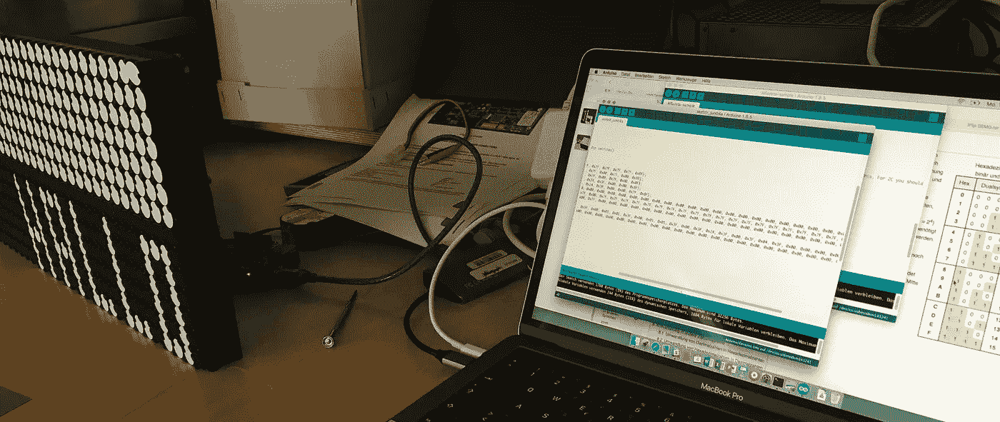
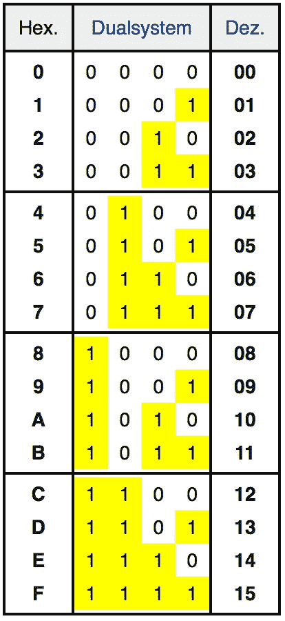
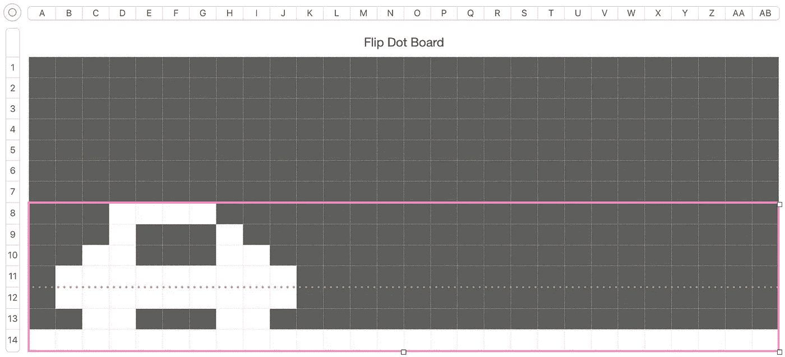

# 带 Arduino 和 RS485 屏蔽的翻点显示器

> 原文：<https://medium.com/coinmonks/flip-dot-display-with-arduino-and-rs485-shield-ca2cec1b971a?source=collection_archive---------3----------------------->



我们有两块阿尔法·泽塔的[翻转点板 xy5 和一个与之相连的 Arduino uno。](https://flipdots.com/en/products-services/flip-dot-boards-xy5/)

> 声明:自从我最后一次使用 Arduino 以来，已经有 5 年了，而且很少经历过教程阶段。

Hi there

首先，flip dot 板上有一堆 Dip 开关。从阿尔法·泽塔提供的文件中，我们得到了土地的布局。
起初，我从下面的翻转板开始，将引脚设置为

```
speed setting: 1-OFF 2-ON 3 — ON
address : 1 (8 pos dip switch: 1:on 2 -8: off)
```

这相当于大约 57600 英镑的汇率

```
void setup() 
{
 Serial.begin(57600); 
}
```

因此，对于地址字节，我们有 *0xFF* 。我将进一步发挥这一点，当连接第二个翻转点板。

向电路板发送串行消息时，我们需要发送以下字节:

As 头*0x 80*；作为即时命令，我们用的是，*0x 85*；其次是地址；要显示的消息；以及结束字节 *0x8F* 。

对于我们的信息，我们有一个简单的 28 x 7 点阵。每列由一个字节表示。

例如，黑白条纹交替出现的消息如下所示:

```
byte black_stripes[] = {0x80, 0x85, 0xFF, 
0x00, 0x7F, 0x00, 0x7F, 0x00, 0x7F, 0x00, 
0x7F, 0x00, 0x7F, 0x00, 0x7F, 0x00, 0x7F, 
0x00, 0x7F, 0x00, 0x7F, 0x00, 0x7F, 0x00, 
0x7F, 0x00, 0x7F, 0x00, 0x7F, 0x00, 0x7F, 
0x8F};
```



Table as seen on wikipedia

我不得不再次用十六进制符号[来描述我的大脑，但后来又回到了 0 和 1，因为这样更容易将图像从视觉网格转换成数组——至少对我的大脑来说是这样。](https://en.wikipedia.org/wiki/Hexadecimal)

当发送消息时，必须指定要通过的数组的长度。根据需要翻转的点的数量，不同信息的帧速率会有所不同。

```
void loop() { 
Serial.write(black_stripes, 32);
delay(25);
Serial.write(white_stripes, 32);
delay(150);
}
```

当玩一个基本的均衡器时，速度变化很大。为了获得一致的刷新率，我不得不把它设置得很慢。最令人信服的视觉体验是我给均衡器一个随机的取值范围，除了我们从消息点接收到的变化来刷新。

```
byte equalizer_values[] {
 B0000001, // 01
 B0000011, // 02
 B0000111, // 03
 B0001111, // 04
 B0011111, // 05
 B0111111, // 06
 B1111111, // 07
};
```

在这里，我努力摆脱十六进制，在代码中使用更形象的表示法。

```
void loop(){Serial.write(header);
Serial.write(instant_command);
Serial.write(address);

 for (int i = 0; i < rows; i++) {

 int n = random(0,7);
 Serial.write(equalizer_values[n]);

 };

 Serial.write(end);
 rows ++;
 delay(random(50,150));}
```

Where is the music ;)

通向图形的桥梁。直接从我的头脑中构建它们似乎有点麻烦，所以我只是在转换成字节值之前建立了一个小的电子表格作为可视化的指导。



basic car setup

这就转化为:

```
byte car[] = {
 B0000001, // 01
 B0001101, // 02
 B0011111, // 03
 B1111111, // 04
 B1001101, // 05
 B1001101, // 06
 B1001101, // 07
 B0111101, // 08
 B0011111, // 09
 B0001111, // 10
 B0000101, // 11
 B0000001, // 12
};byte road[] = {
 B0000001, // 01
};
```

我只是画了更多的路来让车过马路。

```
delay(200);
 Serial.write(header);
 Serial.write(instant_command);
 Serial.write(display_address);

 for (int i = count; i < 27; i++) {
 Serial.write(road, 1);
 };

 Serial.write(car, 12);
 Serial.write(end);
 count ++;
```

The car going :D

接下来会有很多事情。我试着写点东西，把信息传递出去，但最终只是定义字母和排列它们的单调乏味的工作。但最有可能的是，我将深入研究 Arduino 通过 firmata 与 [vvvv 的连接。但那是以后的事了。](https://vvvv.org/documentation/firmata-protocol)

以下链接帮助了我:

## 扎克/ [控制电磁翻盘显示器](https://community.particle.io/t/controlling-an-electromagnetic-flip-disc-display-alfa-zeta-flip-dots/28200)

[](https://community.particle.io/t/controlling-an-electromagnetic-flip-disc-display-alfa-zeta-flip-dots/28200) [## 控制电磁翻转盘显示器(阿尔法-泽塔翻转点)

### 大家好，我有一个兼职项目，我终于找到了一些时间来工作，我想分享我的初步进展…

community.particle.io](https://community.particle.io/t/controlling-an-electromagnetic-flip-disc-display-alfa-zeta-flip-dots/28200) 

## [iizukak](https://gist.github.com/iizukak)/[flip _ dot _ clock . ino](https://gist.github.com/iizukak/b30992dcd80a1d2ddb77b1b5e79ed480)