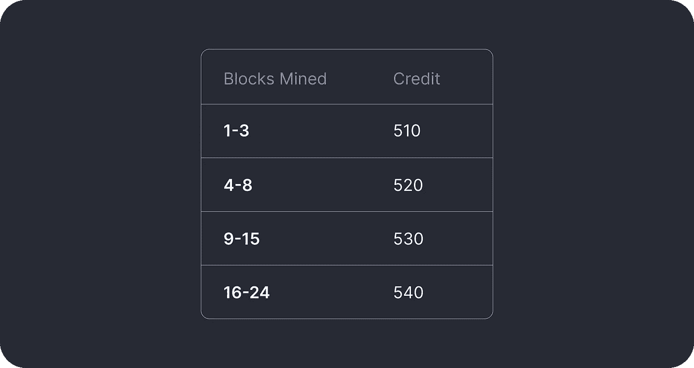
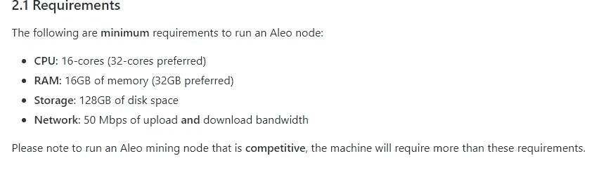
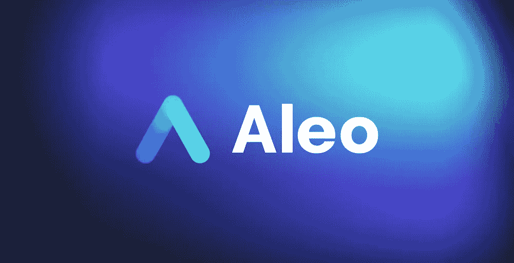

# aleo——一个激励性的测试网

> 原文：<https://medium.com/coinmonks/flux-foretellers-my-attitude-about-ambassador-program-54d8cb8e8ddb?source=collection_archive---------6----------------------->

[https://www.aleo.org/post/incentivized-testnet-announcement](https://www.aleo.org/post/incentivized-testnet-announcement)

**🚀2021 年 11 月 23 日，Aleo 团队宣布了激励性测试网络！**

**💰** [**我们知道那些家伙有钱**](https://www.aleo.org/post/aleo-raises-28m-to-build-the-future-of-private-applications)**(～2800 万美元)，他们有能力奖励我们！**

我真的很喜欢他们透明的评分系统

> 奖励:
> 
> testnet 2
> 1000 万的 1.5%的初始供应量——针对开采至少 1 个区块
> 500 万的每个人——针对前 100 名矿工

# 要求:

你需要强大的机器:)

[https://github.com/AleoHQ/snarkOS#3a-run-an-aleo-client-node](https://github.com/AleoHQ/snarkOS#3a-run-an-aleo-client-node)

## 我建议你至少开采一个区块，因为这样你会有更多的机会获得奖励。只有少数人(100 名矿工)会获得 33%的奖励。

# 我的联系人:

*   [*电报*](https://t.me/Tommmymlt)
*   [*GitHub*](https://github.com/Unlimitedmolot)
*   [*推特*](https://twitter.com/Unlimitedmolot)

# 如何在 Aleo 上追踪？

# Aleo？

[*推特*](https://twitter.com/AleoHQ)

[*电报*](https://t.me/aleorussian)

[*不和谐*](https://discord.gg/aleohq)

[*网站*](https://www.aleo.org/blog)

> 加入 Coinmonks [电报频道](https://t.me/coincodecap)和 [Youtube 频道](https://www.youtube.com/c/coinmonks/videos)了解加密交易和投资

# 另外，阅读

*   [火币交易机器人](https://coincodecap.com/huobi-trading-bot) | [如何购买 ADA](https://coincodecap.com/buy-ada-cardano) | [Geco？一次回顾](https://coincodecap.com/geco-one-review)
*   [加密复制交易平台](/coinmonks/top-10-crypto-copy-trading-platforms-for-beginners-d0c37c7d698c) | [五大 BlockFi 替代方案](https://coincodecap.com/blockfi-alternatives)
*   [CoinLoan 点评](https://coincodecap.com/coinloan-review)|【Crypto.com】点评 | [火币保证金交易](/coinmonks/huobi-margin-trading-b3b06cdc1519)
*   [Bybit vs 币安](https://coincodecap.com/bybit-binance-moonxbt)|[stealth x 回顾](/coinmonks/stealthex-review-396c67309988) | [Probit 回顾](https://coincodecap.com/probit-review)
*   [顶级付费加密货币和区块链课程](https://coincodecap.com/blockchain-courses)
*   [CBET 评论](https://coincodecap.com/cbet-casino-review) | [库科恩 vs 比特币基地](https://coincodecap.com/kucoin-vs-coinbase) | [拜比特 vs 比特币基地](https://coincodecap.com/bybit-vs-coinbase)