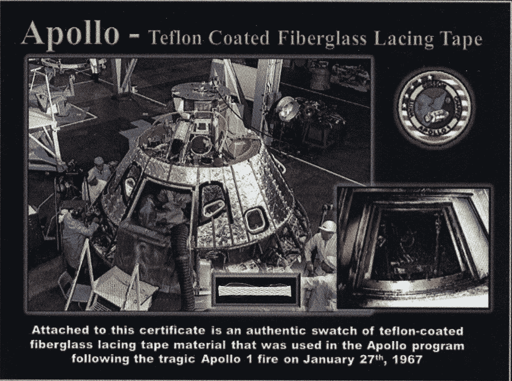

# 飞往月球给了我们特氟隆

> 原文：<https://medium.com/coinmonks/flying-to-the-moon-gave-us-teflon-f1749a5e5c57?source=collection_archive---------0----------------------->

## 区块链真的像他们说的那么糟糕吗？

***TL；博士:*** *即使你不是加密货币的爱好者，那么在这个主题中的研究仍然有有效的用途，相关的技术可能仍然适合你。*

我不得不承认，我并不喜欢加密货币。我知道这意味着我可能不是一个酷孩子。

我不喜欢比特币怎么比某些国家用的电还多。我不喜欢我怎么能让以太网每秒只能处理 [15 笔交易](https://bravenewcoin.com/insights/vitalik-ethereum-en-route-to-a-million-transactions-per-second)，而传统的证券交易所每秒可以处理 80，000 笔交易。

看起来区块链只是用一种更慢、更贵、更污染的方式来解决一个我们已经有其他解决方案的问题。

## 回到 1969 年

当我们飞向月球时，一些反对者同样抱怨说，我们应该把时间和金钱花在经济动荡和世界饥饿上。

虽然从技术上来说，[美国宇航局没有发明特氟隆](https://www.nasa.gov/offices/ipp/home/myth_tang.html)，但它确实给大众带来了它的用途。如果没有美国国家航空和宇宙航行局的太空探索，也许我们永远不会有特氟隆、velcro、婴儿配方奶粉和所有其他在太空探索中使用的东西的广泛使用，这些东西在地面上也非常有用。

## 回到未来

或者说，回到现在。今天，我们有越来越多的区块链技术的追随者。在很大程度上，这些追随者正在努力为他们支持的技术找到一个有效的用例。我们已经有了银行，但它们确实不足。可悲的是，当我们使用中央交易所为我们处理加密货币时，加密的状态似乎正在重新发明银行业，除了前面提到的巨大环境成本。

> 但是，等一下。我们难道不是在再造一个旧的银行业世界，包括所有附属系统和交易对手风险吗？也许吧，是的。迈克尔·J·凯西

 [## 利害关系证明可能导致加密银行。让我们避开那个-硬币台

### Michael J. Casey 是 CoinDesk 顾问委员会主席，也是麻省理工学院区块链研究的高级顾问

www.coindesk.com](https://www.coindesk.com/proof-of-stake-could-lead-to-crypto-banking-lets-avoid-that) 

## 但是……特氟隆！

区块链研究所开发的一项衍生技术是零知识证明。对零知识证明的非常简短的描述是，我们有能力验证陈述(*例如* *【我被授权使用该资源】*)，而无需访问源数据(*例如授权用户列表*)。还有许多其他的零知识证明应用程序，但这已经超出了本文的范围。

这看起来像魔术，就像公钥-私钥对加密术看起来像魔术一样。

## 那么，这些东西怎么会比区块链本身更有用呢？

假设您在一个新兴市场中有一组用户，他们很少或根本无法访问互联网，他们交换数据的唯一方式是通过网状网络，但他们仍然希望只与可信方共享数据。

例如，在印度尼西亚有一群棕榈油农民，他们希望了解有机农业的精彩之处，以及如何重新利用他们现有的土地，而不是继续砍伐森林来种植棕榈。正在努力为这些农民带来教育和分享知识的能力。这个项目的一个问题是，在印度尼西亚热带雨林附近的棕榈田里几乎没有互联网。

实现知识共享的技术之一是建立一个论坛，农民可以在那里与他们信任的人分享他们的经验。实际的连接层可以通过网状网络或 wifi 实现——在山顶或雨林中相遇的对等点之间的直接连接。下一个挑战是选择与谁分享。我们如何相信一个人被授权阅读我必须分享的数据？具体来说，我如何知道一个用户是否是拥有该授权的用户组的成员？

此外，这些新兴市场对现代技术的访问有限，因此我们不能指望他们有足够的磁盘空间来承载所有用户的完整状态(我们也不想这样做，因为这可能涉及隐私泄露)，也不能指望他们有能力在自己的设备上执行繁重的计算(*即没有工作证明*)。

进入**零知识证明**。它们占用很少的空间，并且在计算上很容易验证。此外，它们不依赖于访问可信外部机构的能力。

## 您现在可以使用的零知识证明实现

 [## 如何使用加密累加器来证明集合成员资格，而不暴露集合或…

### 我给出了一个简单的例子，一个证明者和一个验证者事先并不知道对方，只是在…

medium.com](/@anders.borch/how-to-use-cryptographic-accumulators-to-prove-set-membership-without-exposing-the-set-or-the-ad93d9868aec) 

你认为，这些是如何让我的生活变得更轻松，让我更有效率，或者为我解决了任何问题？

首先，新兴市场现在在你的雷达上，你现在又多了一个工具，可以在你过去认为由于网络连接不畅等原因而完全无法到达的地方开始构建解决方案。

也许，仅仅是也许，下次有新的东西出现时，你会更加意识到从整个区块链混乱中衍生出来的技术。

*所以也许所有区块链的东西并不都是坏的…*

> [在您的收件箱中直接获得最佳软件交易](https://coincodecap.com/?utm_source=coinmonks)

