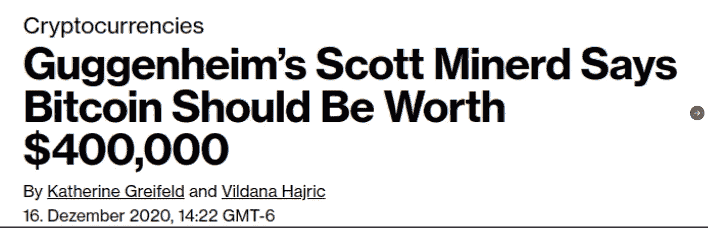

# 跟随比特币的信号，而不是噪音

> 原文：<https://medium.com/coinmonks/follow-bitcoins-signal-not-the-noise-f72d0665e60a?source=collection_archive---------4----------------------->

Illustration from [https://moviewriternyu.files.wordpress.com](https://moviewriternyu.files.wordpress.com/) & [Liquid00](https://btcartgallery.com/2014/11/17/simple-bitcoin-wallpaper-by-liquid00/)

我们经常太沉迷于我们的生活，以至于我们无法缩小视野，看到更大的画面。我们过分关注的小而不重要的时刻会让我们看不到真正的目标是什么。在投资中，当利润受到威胁时，短期观点往往成为许多人遵循的信号。

比特币也是如此。散户投资者过度关注短期，允许大型基金、新闻媒体和文章吓走他们的比特币头寸。

我认为那些过分重视基金、新闻媒体和文章的观点和声明的人是在倾听噪音，而不是关注信号。相反，投资者应该后退一步，寻找隐藏在噪音中的信号。

在这篇文章中，我将展示一个最近的“噪音”的例子，以及可以帮助我们在噪音中找到信号的链上度量。

# 噪音

2020 年 12 月 16 日，Guggenheim Partner 的首席投资官(CIO)Scott Minerd 与[彭博](https://www.bloomberg.com/news/articles/2020-12-16/guggenheim-s-scott-minerd-says-bitcoin-should-be-worth-400-000)一起公开表示，比特币应该价值 40 万美元。声明发布时，比特币的交易价格约为 22000 美元。巧合的是，比特币的价格也在不久后飙升，达到 42000 美元左右。

Source: Cryptocurrencies

Bitcoin trading ~$22,000 on December 16, 2020 — Tradingview.com

Source: Josh Fineman, SA news Editor

据 2021 年 1 月 20 日 [Coindesk](https://www.coindesk.com/guggenheim-minerd-bitcoin-top) 报道，Scott Minerd 告诉美国消费者新闻与商业频道，比特币的价格已经突破今年的**，应该会回落到 20，000 美元的水平。**斯科特·米纳德(Scott Minerd)在短短一个月内的情绪逆转让许多人认为，古根海姆的合伙人尚未完成他们在比特币上的建仓，比特币 40 万美元的目标价格过早公布。**不管是什么情况，根据基金经理的声明决定买卖比特币可能不是规划投资的最佳方式，因为他们必须首先考虑公司的利益。相反，跟着信号走…**

# 信号

在介绍中，我提到我会举一个链上指标的例子来帮助我们区分信号和噪声。在此之前，我想简单描述一下什么是链上指标。

比特币在区块链上运行，交易被记录并存储在分布式账本中。这个网络产生了大量的金融数据，我们可以利用这些数据来深入了解网络的健康状况和活动。比特币网络产生的数据被称为链上指标。找到这些指标的一个很好的来源是通过 [Glassnode](https://glassnode.com/) 。

好了，现在我们已经解决了这个问题…

衡量我们所处周期的一个相当好的指标是[**(SOPR)**](/unconfiscatable/introducing-sopr-spent-outputs-to-predict-bitcoin-lows-and-tops-ceb4536b3b9)**。** SOPR 是一个指标，**让我们看到比特币何时被出售获利。**

据[雷纳托白木](/unconfiscatable/introducing-sopr-spent-outputs-to-predict-bitcoin-lows-and-tops-ceb4536b3b9)，

> “当 SOPR > 1 时，这意味着已消耗产出的所有者在交易时是盈利的；否则，他们就不知所措了。”

Source: Glassnode by [Willy Woo](https://medium.com/u/a8f4de44a01d?source=post_page-----f72d0665e60a--------------------------------)

看图表，SOPR 触及 1，并在 2021 年 1 月 25 日左右略低于 1。如上所述，当 SOPR 大于 1 时，投资者卖出比特币获利。低于 1，投资者将亏本出售。当 SOPR 触及 1 或以下时，可视为底部或重置；为下一步做准备。

为什么？

我相信原因是由于卖方的疲惫。随着越来越少的投资者能够卖出获利，抛售将会平息，从而设定价格的底部。

**比特币链上相对强度指数(RSI)** 是另一个很好的指标，用于确定价格行为是否有底部。在股票的传统技术分析中，RSI 是一个流行的动量指标。

在传统的股票分析中，RSI 值在 30-70 之间被认为是黄金区域；不太热也不太冷。RSI 值低于 30 代表超卖价格行为，此时卖方最有可能耗尽，RSI 值高于 70 代表超买价格行为。

比特币不遵循这一传统标准。**在牛市周期中**，比特币依靠 50-75 的 RSI 值生存。正如你在比特币链上 RSI 的图表中看到的那样，当前的扩音器模式与 2017 年的牛市周期类似。目前的 RSI 值(紫色)接近趋势线。这是当前价格即将触底的信号。比特币的价格行动并未过热，并准备进一步走高。

Source: Charts.woobull.com by [Willy Woo](https://medium.com/u/a8f4de44a01d?source=post_page-----f72d0665e60a--------------------------------)

下一个要考虑的指标是**比特币实体的净增长。**根据 [Rafael Schultze-Kraft](/glassnode-insights/how-many-entities-hold-bitcoin-e945ecc5d0a1) ，实体净增长被定义为:

> *“网络中独特实体的净增长。该指标被定义为新实体和“消失的”实体(余额为零的实体，在之前的时间戳上有非零余额)之间的差异*

这一指标让我们可以看到新的比特币采纳者或用户的数量。如下图所示，有相当数量的新用户加入网络。即使最近有所下降，我们平均每天仍会看到约 1.5 万名新比特币用户，这几乎高于 2020 年的任何一天。

Source: Glassnode by [Willy Woo](https://medium.com/u/a8f4de44a01d?source=post_page-----f72d0665e60a--------------------------------)

最后，**流动性&非流动性供给**和**流动性供给变化**是确定比特币是被弱手还是钻石手=)(强手)操控的两个重要指标。

**流动性和非流动性供应** metric 分析比特币实体，并将其分为非流动性、流动性和高流动性类别。我不打算详细说明指标是如何计算的，但如果你感兴趣，我会在这里[链接它](https://insights.glassnode.com/bitcoin-liquid-supply/)。根据 glassnode insights，这一指标表明 [~78%](https://insights.glassnode.com/bitcoin-liquid-supply/) 的比特币流通供应缺乏流动性(在冷藏钱包中)。

Source: Glassnode

**流动性供应变化**显示，最近的比特币购买者正在将它们从交易所转移到冷藏钱包中。存储在交易所的比特币是流动的，存储在冷藏钱包的比特币是不流动的。这种从流动性到非流动性的变化进一步限制了公开市场上比特币的供应，并随着需求的增加给价格带来了上行压力。

Source: Glassnode by [Willy Woo](https://medium.com/u/a8f4de44a01d?source=post_page-----f72d0665e60a--------------------------------)

# 结论

过于关注噪音往往会导致你过早出售比特币，或者等到机会就在眼前时再买入。倾听基金、新闻渠道和文章不是规划投资的最佳策略。在我的例子中，我们看到一家大型基金的首席信息官收回了他最近的看涨言论，并引用比特币的价格已经跑得太远太快，以及今年已经见顶。

然而，链上指标显示了一个完全不同的故事…

**SOPR** 向我们展示了平均每天出售比特币获利变得越来越少；在我看来导致卖家精疲力尽。**比特币链上 RSI** 进一步支持卖方耗尽的观点，因为 RSI 接近趋势线的下限。这两个指标都表明比特币价格接近底部。**比特币实体净增长**向我们展示了越来越多的比特币接受者正在进入网络，即使在当前从 42，000 美元到 30，000 美元的回撤期间；这表明投资者正在利用这一回撤作为买入机会，在下一次上涨之前抢购更多比特币。最后，**液体&非流动供应**和**液体供应变化**说明了比特币的大部分流通供应是高度非流动的，存储的偏好是将他们的比特币从交易所取出并冷藏。

总结一下——比特币目前的价格很可能已经触底或接近触底。投资者正在利用这一时机抢购更多的硬币，并将其冷藏起来。比特币的流通供应越来越缺乏流动性，当机构投资者有需求时；依我看，价格会飞涨。

随着比特币的价格继续走高，将会有更多的 FUD 新闻和文章出现。双花 FUD 去[监管](/coinmonks/regulation-is-coming-for-bitcoin-6f9693237e19) FUD 已经在流传了。听信这些基金、新闻媒体和文章，而不对他们所说的进行适当的分析，肯定会导致一个糟糕的决定。

在做任何决定之前，一定要检查你的新闻来源。后退一步，专注于信号。如果你这样做，你会看到更大的图景，这一图景对比特币相当乐观。

*比特币的信号越来越大，你在跟着它走吗…？*

> 加入 coin monks[Telegram group](https://t.me/joinchat/EPmjKpNYwRMsBI4p)学习加密交易和投资

## 另外，阅读

*   什么是[闪贷](https://blog.coincodecap.com/what-are-flash-loans-on-ethereum)？
*   最好的[密码交易机器人](/coinmonks/crypto-trading-bot-c2ffce8acb2a) | [网格交易](https://blog.coincodecap.com/grid-trading)
*   [3 商业评论](/coinmonks/3commas-review-an-excellent-crypto-trading-bot-2020-1313a58bec92) | [Pionex 评论](/coinmonks/pionex-review-exchange-with-crypto-trading-bot-1e459d0191ea) | [Coinrule 评论](https://blog.coincodecap.com/coinrule-review-a-perfect-trading-bot)
*   [AAX 交易所评论](/coinmonks/aax-exchange-review-2021-67c5ea09330c) | [德里比特评论](/coinmonks/deribit-review-options-fees-apis-and-testnet-2ca16c4bbdb2) | [FTX 密码交易所评论](/coinmonks/ftx-crypto-exchange-review-53664ac1198f)
*   [n 零审核](/coinmonks/ngrave-zero-review-c465cf8307fc)
*   [Bybit Exchange 审查](/coinmonks/bybit-exchange-review-dbd570019b71) | [Bityard 审查](https://blog.coincodecap.com/bityard-reivew)|[inter tax 审查](https://blog.coincodecap.com/interdax-review)
*   3Commas vs Cryptohopper
*   最好的比特币[硬件钱包](/coinmonks/the-best-cryptocurrency-hardware-wallets-of-2020-e28b1c124069?source=friends_link&sk=324dd9ff8556ab578d71e7ad7658ad7c) | [BitBox02 回顾](/coinmonks/bitbox02-review-your-swiss-bitcoin-hardware-wallet-c36c88fff29)
*   [总账 vs 平均](https://blog.coincodecap.com/ngrave-vs-ledger)
*   [密码拷贝交易平台](/coinmonks/top-10-crypto-copy-trading-platforms-for-beginners-d0c37c7d698c) | [比特码拷贝交易](https://blog.coincodecap.com/bityard-copy-trading)
*   [莱杰 nano s vs x](https://blog.coincodecap.com/ledger-nano-s-vs-x)
*   [Vauld 审查](https://blog.coincodecap.com/vauld-review) | [YouHodler 审查](/coinmonks/youhodler-4-easy-ways-to-make-money-98969b9689f2) | [BlockFi 审查](/coinmonks/blockfi-review-53096053c097)
*   最好的[加密税务软件](/coinmonks/best-crypto-tax-tool-for-my-money-72d4b430816b) | [硬币追踪评论](/coinmonks/cointracking-review-a-reliable-cryptocurrency-tax-software-5114e3eb5737)
*   最佳[加密贷款平台](/coinmonks/top-5-crypto-lending-platforms-in-2020-that-you-need-to-know-a1b675cec3fa)
*   [莱杰纳米 S vs 特雷佐 1 vs 特雷佐 T vs 莱杰纳米 X](https://blog.coincodecap.com/ledger-nano-s-vs-trezor-one-ledger-nano-x-trezor-t)
*   [BlockFi vs 摄氏](/coinmonks/blockfi-vs-celsius-vs-hodlnaut-8a1cc8c26630) | [Hodlnaut 回顾](https://blog.coincodecap.com/hodlnaut-review)
*   [Bitsgap 审查](/coinmonks/bitsgap-review-a-crypto-trading-bot-that-makes-easy-money-a5d88a336df2) | [四种货币审查](/coinmonks/quadency-review-a-crypto-trading-automation-platform-3068eaa374e1)
*   [埃利帕尔泰坦评论](/coinmonks/ellipal-titan-review-85e9071dd029) | [赛克斯斯通评论](https://blog.coincodecap.com/secux-stone-hardware-wallet-review)
*   [BlockFi 评论](/coinmonks/blockfi-review-53096053c097) |在您的密码中赚取高达 8.6%的利息
*   [DEX Explorer](https://explorer.bitquery.io/ethereum/dex) 和[区块链 API](https://explorer.bitquery.io/graphql)
*   [加密套利](/coinmonks/crypto-arbitrage-guide-how-to-make-money-as-a-beginner-62bfe5c868f6)指南:新手如何赚钱
*   最佳[加密制图工具](/coinmonks/what-are-the-best-charting-platforms-for-cryptocurrency-trading-85aade584d80)
*   了解比特币的[最佳书籍有哪些？](/coinmonks/what-are-the-best-books-to-learn-bitcoin-409aeb9aff4b)

> [直接在您的收件箱中获得最佳软件交易](/coinmonks/newsletters/coinmonks)

