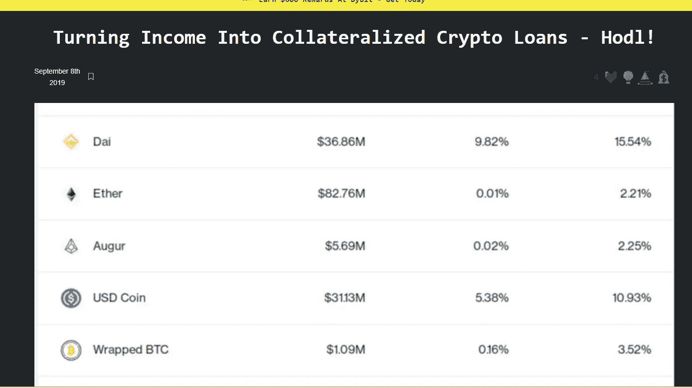

# 遵循我自己该死的建议&用 Bitwage.com 平均成本

> 原文：<https://medium.com/coinmonks/following-my-own-damn-advice-dollar-cost-averaging-with-bitwage-com-2b1f4984ead?source=collection_archive---------2----------------------->

[https://twitter.com/jarettdunn/status/1430938990845247489](https://twitter.com/jarettdunn/status/1430938990845247489)

所以就在大约两年前我写了 [**这个**](https://hackernoon.com/turning-income-into-collateralized-crypto-loans-hodl-pflrr2bzq) :

就在一分钟前，我写了这个: