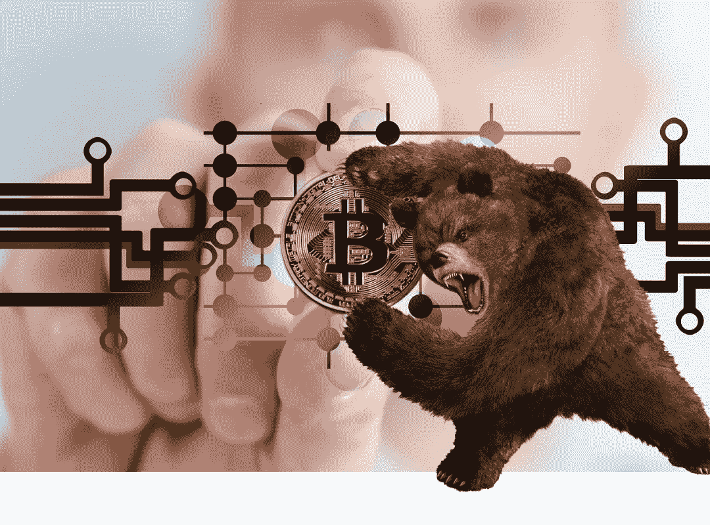

# FOMO No Mo:新手智能加密投资

> 原文：<https://medium.com/coinmonks/fomo-no-mo-smart-crypto-investing-for-beginners-56caaaab908f?source=collection_archive---------4----------------------->

> 当每个人都有相同的想法时，就不会有太多的思考发生——杰西·利弗莫尔

在这篇文章中，我将向你介绍加密投资的野生，怪异，错综复杂的世界。我花了相当多的时间观察 YouTube 的影响者并阅读文章。在很大程度上，这是一大堆废话。有一些理智的声音，但我发现它们在加密信息生态系统中很少见。根据我的经验，所谓的客观分析往往只是赤裸裸的炒作和点击诱饵。

## ***我离开底楼特快电梯走楼梯***

我从一个不同的地方来到 crypto。我是 2010 年比特币的早期使用者。直到 2008 年崩盘前，我一直在买入黄金和白银。随着我持有的少量黄金和白银开始上涨，我获得了可观的利润。为了寻找投资的地方，我开始研究比特币。当时拿回比特币是件痛苦的事。但我来自一个技术行业，虽然花了一段时间(我认为是三四周的合法努力)，我还是拥有了比特币。

如果我没记错的话，我有几百个——也许更多，也许更少。这是一个小数目，我记得我拿着它们大约一两个月，然后就把钱包删除了。它们从 0.20 美分“暴跌”到 0.10 美分(或类似的价格)，我认为这只是一个大笑话。我在游戏中的“皮肤”数量是如此之少，以至于我没有理由千方百计去卖这些东西。

哎呦。

当比特币开始触及数千美元时，就像是在饼干中被踢了一脚。我也知道我永远不会——我是说*永远不会——持有比特币，直到它让我变得富有。一旦比特币涨到 5 美元或 10 美元，我就会卖掉它们，获得可观的利润！这里有一个教训，我将进一步探讨它。*

> 当比特币开始触及数千美元时，就像被踢到饼干里一样

几年后，加密货币再次引起了我的注意。从法学院毕业后，我开始攻读金融服务法律硕士学位，专攻合规和风险管理。我的很多研究都围绕着证券、破产和金融犯罪。在为《银行法杂志》撰写反洗钱法规系列文章时，crypto 再次进入我的视野。我的研究让我对当时(2015 年左右)加密货币的状态印象不深。六年过去了，事情发生了很大的变化。

## ***新的旧的世界重新开始***

今天有成千上万的数字硬币和代币在互联网上流通。几乎任何人，只要有适度的技术技能，都可以创造一种新的硬币或代币。今天的加密空间让我想起了互联网的早期。随着互联网泡沫的破灭，成千上万的互联网公司一夜之间涌现出来。公司通常只拥有一个网站和一个*可能*成功的想法，最终以大规模首次公开募股(IPO)而告终，并获得了巨额投资。

与今天的密码领域有明显的相似之处。就像网络泡沫一样，新实体的准入门槛非常低。同样，加密的革命性潜力是巨大的。在网络泡沫破裂之前，几乎所有进来的钱，尤其是来自散户投资者的钱，都是纯粹的投机——基本上是一群数字[投机者](https://www.merriam-webster.com/dictionary/wildcatter)在胡作非为。可以肯定的是，很多人在这段时间赚了很多钱。几年后，许多人变得破产、失望和痛苦。

今天，大致相同的事情正在发生，尽管可以说规模更大。秘密经济现在是泡沫吗？差不多[肯定](https://www.sciencedirect.com/science/article/pii/S0167268120301505)。这是否意味着你应该避免投资？看情况。当任何一个头脑正常的人都没想到亚马逊会从灰烬中重生时。易贝和 Priceline 也是如此。关键是，*有人*现在正投资于下一件大事*—*，而他们甚至没有意识到这一点。大多数人不是。问题是，你对这些几率有多满意？

> 秘密经济现在是泡沫吗？几乎可以肯定。

现在开始很容易。与 2010 年我拿到第一枚比特币时相比，这简直太简单了！很像互联网的早期，道路的规则还没有建立起来。但是谨慎的监管者(尤其是在发达国家)正在加强对加密市场的监控。也就是说，我几乎可以向你保证，更多的行业法规即将出台。我仍然不确定这是一件好事还是坏事。

尽管如此，这里有一个快速的步骤:

在比特币基地开户(用户友好)

完成了解你的客户(KYC)程序

存款(借记卡、 [ACH](https://www.nacha.org/content/what-is-ach) 或银行电汇)

挑选你喜欢的列出的硬币或代币

按照步骤购买

就这样，你在游戏里。如果你想知道是否可以使用你的信用卡，答案通常是'[不](https://cointelegraph.com/news/us-bank-wells-fargo-bans-crypto-purchases-with-its-credit-cards)'，不需要借助于现金预支(请不要这样做)。那么，现在你进来了，下一步是什么？这是一个价值万亿美元的问题！

根据我的经验，加密爱好者倾向于将加密资产视为新奇的工具。人们普遍认为，加密是一种全新的思考和经营方式，不知何故,“旧”规则不再适用。我看待事物的方式和范-博伊斯有些不同。证券交易委员会(SEC)已经[发布了](https://www.sec.gov/news/public-statement/statement-clayton-2017-12-11)大量关于加密货币和代币的公告和指南。证交会的简短回答？这些东西是证券，就像股票一样。

## ***玫瑰别称……***

在你开始投资之前，有一些重要的警告是 YouTubers 在宣传他们最新的“这个硬币下个月会涨 1000 倍”计划时容易忽略的。首先，很少有审慎的监管者关注加密市场。俗话说，猫不在，老鼠会玩。在缺乏监管的情况下，这个领域充斥着[罪犯、骗子、诈骗犯、拉地毯者和黑客](https://journals.sagepub.com/doi/abs/10.1177/1057567719827051)，所有这些人都可能将你的实际资金置于风险之中。

公平地说，遗留的金融体系中充斥着同样类型的人。想到伯尼·麦道夫了吗？更不用说[汇丰](https://www.icij.org/investigations/fincen-files/hsbc-moved-vast-sums-of-dirty-money-after-paying-record-laundering-fine/)、[富国](https://www.fool.com/investing/2017/09/24/a-timeline-of-wells-fargos-sales-scandal.aspx)、[德意志银行](https://www.reuters.com/article/us-deutsche-bank-settlement-gold/deutsche-bank-to-pay-60-million-to-settle-u-s-gold-price-fixing-case-idUSKBN13R2N1)、[西联](https://www.justice.gov/opa/pr/western-union-admits-anti-money-laundering-and-consumer-fraud-violations-forfeits-586-million)，还有*其他的几千个*。重点是，我认为金融世界——不仅仅是加密——对各种各样的骗子都有吸引力。

在美国证券交易委员会和蓝天法案出台之前，股票交易现在看起来很像加密交易。地毯拉，欺诈性产品，毫无价值的投资，庞氏骗局，泵和转储，先令，以及其他一切你今天在加密中看到的事情都发生在当时的股票上。但也是 T2 的大企业 T3 让 T4 赚了很多钱。

> 在美国证券交易委员会(SEC)和“蓝天”法律出台之前，股票交易当时看起来很像现在的加密交易

这是它没有被彻底禁止的主要原因之一。相反，监管者专注于通过金融认证将大众拒之门外。基本上，[合格的](https://www.investor.gov/introduction-investing/general-resources/news-alerts/alerts-bulletins/investor-bulletins/updated-3)投资者可以提前拿到入场券。股票发起人可以向他们兜售股票，寻求资本的人也可以接近他们。粗略的想法是他们能承受损失。不过，它们的好处是高风险、高潜在收益。

与此同时，大众必须等到公开发行后才能买入。但这是安全的，因为上市是一项艰巨的任务。对于一家公司来说，通过这一过程是其成功潜力的有力标志。因此，投资 it 远比投资一家新的创业公司风险小。对他们来说，好处是收益适中，风险低得多。

## ***我们不需要没有臭味的规则***

完全没有任何监管*，这是 crypto 独自发展的基本方向。当前的生态系统有两个主要的互动领域:大型集中交易所(CEX)和广泛开放的分散交易所(DEX)。让一枚硬币在“一级”CEX 上市，比如比特币基地，就像让一只股票在纽约证券交易所公开上市一样。CEX 是 Reddit 用户、迷因币购买者、崭露头角的 YouTubers 以及可能具有现实世界潜力的*项目所在地。它是零售人群的零售空间。**

*鲨鱼在游泳。如果你是一个加密新手，你肯定应该购买 DEX 硬币或代币。你在与精通技术、拥有丰富密码、能够承受高风险损失的早期采用者竞争。对于一个没有经验的投资者来说，购买 DEX 是一个将 1000 美元变成 850 美元(扣除成本和费用)的好方法，可以获得持有高风险代币的特权。这是假设他们不会在一周后用它来换取一枚他们在 YouTube 上听说的 DEX 硬币。*

*在以后的文章中，我将会写更多关于如何安全地使用 DEX 以及如何有效地进行你自己的研究(DYOR)。在那之前，我只想说小心 DEX。那么，在 CEX 买什么呢？有很多选择，但这里有一些想法:*

*多边形(MATIC)*

*链环(链环)*

*卡尔达诺*

*波尔卡多(点)*

*图表(GRT)*

*我拥有多边形和图形。我认为 Chainlink，Cardano 和 Polkadot 也是很好的主意。都只是建议。关键是，没有人能说哪个项目会“起飞”…这是任何人的猜测。你听到的另一个原因是[生存偏差](https://www.youtube.com/watch?v=bpf18AoZNug)弥漫在加密信息领域。所以，挑你喜欢的吧。选择你感兴趣的，你觉得有用的东西。这样做，你的学习将会有趣得多。而且，你可能会很幸运！*

*至于策略，在你购买之后，我建议你像孩子对待玩具一样看待加密投资。你想成为那个把玩具留着欣赏的孩子吗？或者，你想成为那个玩他们的玩具并用它们换其他玩具的孩子吗？这大概就是做 T2 和做交易者的区别。在这个领域还有其他赚钱的方法，但那是另一篇文章了。*

*回到我的比特币经历，我得到了一个新玩具，拿出来，带着它跑来跑去，觉得无聊，就扔掉了。这给了我一个教训，当我玩我的玩具时，我太冲动了。现在，如果价格上涨，我可能会卖掉一个玩具，但除此之外，我会找到我喜欢的玩具，并把它们放在包装里。*

> *加入 Coinmonks [电报频道](https://t.me/coincodecap)和 [Youtube 频道](https://www.youtube.com/c/coinmonks/videos)了解加密交易和投资*

## *也阅读*

* [## 杠杆代币[多头代币]终极指南

### 杠杆化令牌是具有杠杆化风险敞口的 ERC20 令牌，不考虑保证金、要求、管理…

medium.com](/coinmonks/leveraged-token-3f5257808b22)  [## 最佳加密交易所| 2021 年十大加密货币交易所

### 编辑描述

blog.coincodecap.com](https://blog.coincodecap.com/crypto-exchange)  [## 2021 年最佳加密借贷平台| 6 大比特币借贷平台

### 获得比特币和其他加密货币的最佳贷款利率

medium.com](/coinmonks/top-5-crypto-lending-platforms-in-2020-that-you-need-to-know-a1b675cec3fa)  [## 2021 年最佳免费加密交易机器人

### 2021 年币安、比特币基地、库币和其他密码交易所的最佳密码交易机器人。四进制，位间隙…

medium.com](/coinmonks/crypto-trading-bot-c2ffce8acb2a)  [## 最佳 4 个加密交易信号电报通道

### 这是乏味的找到正确的加密交易信号提供商。因此，在本文中，我们将讨论最好的…

medium.com](/coinmonks/best-crypto-signals-telegram-5785cdbc4b2b)  [## 5 个最佳社交交易平台[2021] | CoinCodeCap

### 编辑描述

blog.coincodecap.com](https://blog.coincodecap.com/best-social-trading-platforms)  [## BlockFi 评论 2021:利弊和利率| CoinCodeCap

### 编辑描述

blog.coincodecap.com](https://blog.coincodecap.com/blockfi-review)  [## 如何在印度购买比特币？2021 年购买比特币的 7 款最佳应用[手机版]

### 如何使用移动应用程序购买比特币印度

medium.com](/coinmonks/buy-bitcoin-in-india-feb50ddfef94)  [## 加密税务软件——五大最佳比特币税务计算器[2021]

### 不管你是刚接触加密还是已经在这个领域呆了一段时间，你都需要交税。

medium.com](/coinmonks/best-crypto-tax-tool-for-my-money-72d4b430816b)  [## 存储比特币的最佳加密硬件钱包[2021] | CoinCodeCap

### 编辑描述

blog.coincodecap.com](https://blog.coincodecap.com/best-hardware-wallet-bitcoin)  [## Pionex 评论 2021 |免费加密交易机器人和交换

### Pionex 是为交易自动化提供工具的后起之秀。Pionex 上提供了 9 个加密交易机器人…

medium.com](/coinmonks/pionex-review-exchange-with-crypto-trading-bot-1e459d0191ea)*