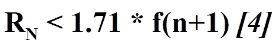

# Fomo3D:庞氏还是赌博？

> 原文：<https://medium.com/coinmonks/fomo3d-ponzi-or-gambling-cc70faf6ba35?source=collection_archive---------1----------------------->


许多人认为 Fomo3D 在早期是一个庞氏骗局，而在后期则变成了一个完全的赌博游戏。这是真的吗？

# **一、基于区块链的赌博背景**

赌博从来都不是一个新的想法。然而，传统赌博有许多限制。例如，游戏由运营商控制，运营商将有强烈的动机滚走所有投入的资本。此外，在大多数国家，赌博一直受到严格的控制和监督，因此公众只能有限地参与。

区块链以其分散化的特点而闻名，它发现自己在博彩业上有很好的应用。许多公司已经使用区块链技术建立了赌博或预测平台。这些以区块链为基地的赌博平台通常是建立在以太坊上，有智能合约[【1】](#ftnt1)。一旦游戏的开发者在智能合约上编写并实现了代码，游戏开始了，游戏规则就永远不会改变，除非开发者在以太坊上再写一个智能合约(开始一个新游戏)。一旦游戏开始，以太坊上的智能合约将像“赌博机”或“无人赌场”一样工作，卖票和支付奖励由智能合约根据预设的规则自动完成。因此，这些平台吸引了许多参与者，因为去中心化特征意味着更高的可信度或公平程度。

# **二世。Fomo3D 游戏规则**


[**Fomo3D**](https://exitscam.me/play) 是一种彩票游戏，大奖得主是最后一个使用 ETH[【2】](#ftnt2)(一种密码)购买密钥(一张彩票)的人，在倒计时定时器倒计时到零之前。在一轮比赛中，计时器不断倒数到零。每次购买一把钥匙，购买者就成为新的“私人钥匙持有者”,额外的时间被加入倒计时。每次购买时，钥匙的价格都会稍微贵一些。当计时器到达零时，最后一个买钥匙的人赢得这一轮。在这一轮结束时，底池(奖励池)中的 ETH 被瓜分。

基本规则包括[【3】](#ftnt3):

1.  每购买一个密钥，循环计时器增加 30 秒，达到 24 小时的硬性上限；
2.  时间是按键添加的，向下舍入。所以 2.5 键= 60 秒；
3.  关键价格的调整非常缓慢和渐进，每次购买都会略微增加(请参见下一节中的详细价格函数)；
4.  每次购买钥匙的收入将根据以下附表 1[【4】](#ftnt4)进行分割:
5.  最终密钥购买者确定后，奖金池(奖励池)将按照以下附表 2 进行划分[【5】](#ftnt5):


Schedule 1


Schedule 2

# **三世。价格功能**

通过检查开源的 Fomo3D 项目[【6】](#ftnt6)的代码，我们发现价格函数代码:

```
** @dev calculates how much eth would be in contract given a number of keys*** @param _keys number of keys “in contract”*** @return eth that would exists**function eth(uint256 _keys) {**return* *((78125000).mul(_keys.sq()).add(((149999843750000).mul(_keys.mul(1000000000000000000))) / (2))) / ((1000000000000000000).sq());**}*
```

简而言之，在总投资的 ETH 和发行的密钥总数之间有一个函数。根据代码，总投入 ETH (Q)和钥匙总数(K)之间的函数为:


我们可以将等式简化如下:


其中*甲* = 78125000/10^36，*乙* = 74999921875000/10^18

**键号 *n* 的价格为:**


**因此，价格函数将为:**


其中*甲* = 78125000/10^36，*乙* = 74999921875000/10^18.

# **四。战略分析**

因为一个玩家是否会赢将取决于下一个玩家的行动，如果有的话，我们想要检查任何一个玩家的潜在策略。假设有一个参与人(n)和参与人(n +1)，我们得到的收益矩阵如下:


为了理解玩家可以选择什么策略，我们首先将变量表示如下:

价格的数字 *n* 键: **Pn = f(n)**

第*轮*的奖励池(壶): **R(N)**

第 *N* 轮总投资: **S(N)**

根据上述规则，我们可以得到 **R(N)** 的以下等式:


因此，我们得到:


根据上面的讨论，我们得到价格函数 **f(n)** 如下:


其中*甲* = 78125000/10^36，*乙* = 74999921875000/10^18.

现在我们检查回合 *N* 并评估“赢”和“输”情况下的收益:


假设玩家 *n* 有 *x* 赢的概率和*(1-x)*输的概率，这意味着下一个玩家 *(n + 1 玩家)*有 *x* 不买的概率和*(1-x)*买的概率。

因此，玩家 *n* 在第 *N* 轮的预期总收益应该是:


其中如果玩家 *n* 不是赢家，则 *p* (玩家 *p* )是 N 回合的赢家。

显然，如果 **f(n) < =收益(总)**，那么一个玩家就有参与的动机。

**场景 1:当 *n* 和 *N* 很小时**

当 *n* 和 *N* 都非常小时， *RN* 与收益的其他部分相比非常小，如果我们假设博弈可以在第 *N* 轮之后发生许多轮。相反，在接下来的几轮中，收益分成的回报是


，将远远大于赢得当前回合的收益(前两部分)。

因此，很明显


当 *n* 和 *N* 都非常小时将成立。因此，玩家有强烈的动机在游戏的前几轮购买密钥，这更像是一个庞氏骗局。

**场景二:当 *n* 和 *N* 非常大**

在这种情况下，我们会想，是否会有一个博弈的结局，没有理性的投资者会参与下一轮，因为钥匙的价格变得高于潜在收益。

案例 1:如果没有这样的结局，游戏将永远继续下去，因为潜在的总收益总是高于钥匙的价格。

情况 2:如果有这样的结局，我们假设回合 *N* 是游戏的最后一回合。玩家 *n* 在扣除他/她购买密钥的成本后应该有一个非负的预期总收益，而玩家 *n + 1* 在扣除参与成本后应该有一个负的预期总收益。

现在我们尝试评估情况 2 是否会存在。

根据上面的讨论，扣除成本之前的总回报将是:


由于 *n* 和 *N* 都非常大，并且这是最后一轮，我们可以将等式简化如下:


由于参与人 *n* 知道由于负的后成本收益，参与人 *n + 1* 肯定不会参与这个博弈，这里 *x* 等于 1。因此，总的成本后收益为:


换句话说，我们需要证明:


如果我们假设有 *k* 个玩家参与第 *N* 轮，根据价格函数 f(n)，我们可以得到:


我们需要核实


因此，我们需要证明:


显然，当 k > 5 时，不等式*将成立，因为 *a* 和 *f(n)* 将总是正的。(需要更多的努力来证明当 k < =5 时，不等式*【1】*仍然成立)*

***因此，R(N) > = 2.08 * f(n)成立。***

*同时，我们需要确保参与人 *n + 1* 的总后成本收益为负:*

****

*我们将不等式*【3】*简化为:*

*同样，如果我们假设有 *k* 个玩家参与第 *N* 轮，根据价格函数 f(n)，我们可以得到:*

**

*我们至少需要证明:*

**

*这意味着:*

**

*简而言之，我们需要证明:*

**

*显然，当 k >= 5 时，不等式*【6】*不成立。因此，等式*【4】*几乎不成立(需要更多的努力来证明当 k < 5 时，拐角情况不成立)。*

***因此，游戏永远不会结束，说明这个游戏一旦开始，一个理性的玩家总会参与进来。***

*因此，如果所有玩家都期望新玩家随后加入( *x = 0* )，那么实际收益将是:*

**

***如果一轮永不结束**，每个玩家的总预期后成本收益为:*

**

***如果一轮意外结束**，由于 *n* 已经很大了，收益的第一部分会很小。因此，玩家的总预期后成本收益是:*

**

***因此，在“后期”阶段，它仍然是一个庞氏骗局，因为在这个无限游戏中永远不会有“后期”阶段，实际回报将主要来自以下玩家的关键销售。**(虽然由于第一部分将是正无穷大，所以*【7】**【8】*将始终为正似乎是合理的，但还需要更多的努力来证明这一点。)*

# *动词 （verb 的缩写）结论*

*因此，与许多人认为的不同，该游戏即使在“后期”阶段也不会成为赌博游戏，因为该游戏极有可能永远不会结束。这个游戏是一个无休止的庞氏骗局，即使在游戏已经开始了许多回合之后。然而，回报可能没有早期的钥匙持有者高。*

*[【1】【https://blockgeeks.com/guides/smart-contracts/】](#ftnt_ref1)*《智能合约:将取代律师的区块链技术》*:*

*[【2】](#ftnt_ref2)维基百科，*《以太坊》*:[https://en.wikipedia.org/wiki/Ethereum](https://www.google.com/url?q=https://en.wikipedia.org/wiki/Ethereum&sa=D&ust=1557424731407000)*

*[【3】](#ftnt_ref3)fomo 3d 维基:[https://fomo3d.hostedwiki.co/pages/Fomo3D%20Explained](https://www.google.com/url?q=https://fomo3d.hostedwiki.co/pages/Fomo3D%2520Explained&sa=D&ust=1557424731410000)*

*[【4】](#ftnt_ref4)有四个分割时间表选项，称为“Snek”、“Whale”、“Bull”和“Bear”。为了简化我们的分析，我们假设有相同比例的参与者会选择这些时间表。因此，我们汇总了四个时间表，并将平均份额分布数放入此分析中。详见:[https://fomo 3d . hosted wiki . co/pages/fomo 3d % 20 解释#the-teams](https://www.google.com/url?q=https://fomo3d.hostedwiki.co/pages/Fomo3D%2520Explained%23the-teams&sa=D&ust=1557424731408000)*

*同上*

*[【6】](#ftnt_ref6)fomo 3d 合同代码:[https://gist . github . com/unsir/19 a 368 c 18 da 58 b 2988859773 a 186 e 681 # file-fomo-sol-l 1780](https://gist.github.com/unsir/19a368c18da58b2988859773a186e681#file-fomo-sol-L1780)*

*[](https://coincodecap.com)*

> *[直接在您的收件箱中获得最佳软件交易](https://coincodecap.com/?utm_source=coinmonks)*

*[](https://coincodecap.com/?utm_source=coinmonks)*