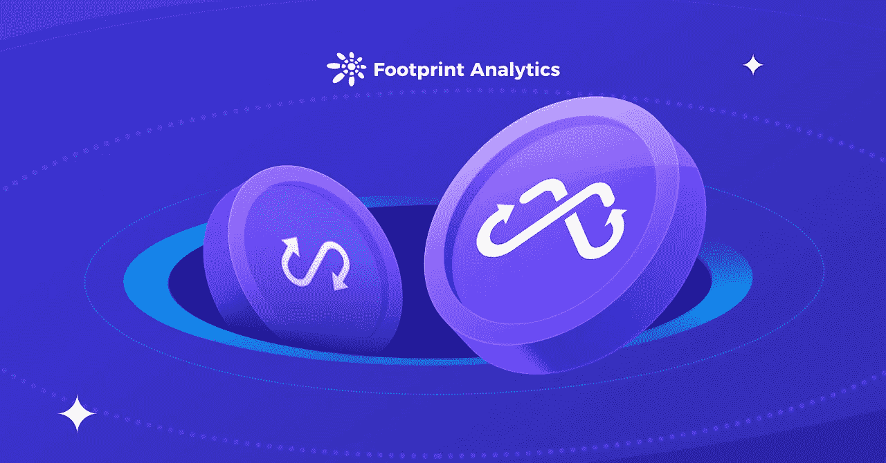
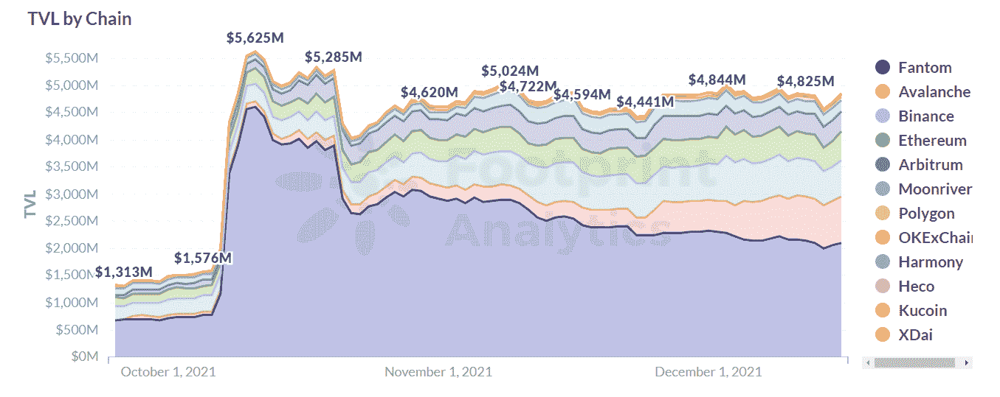
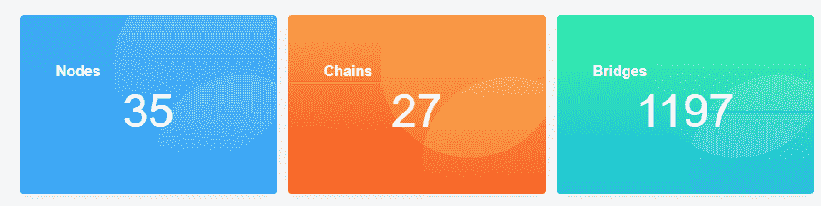
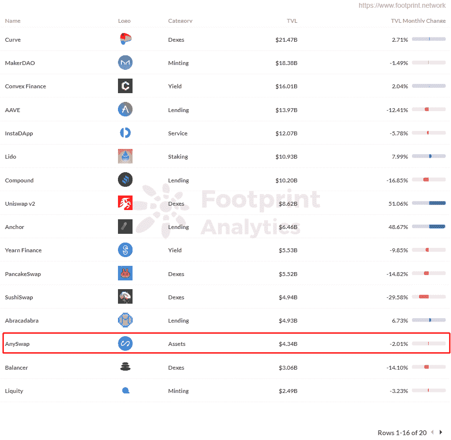
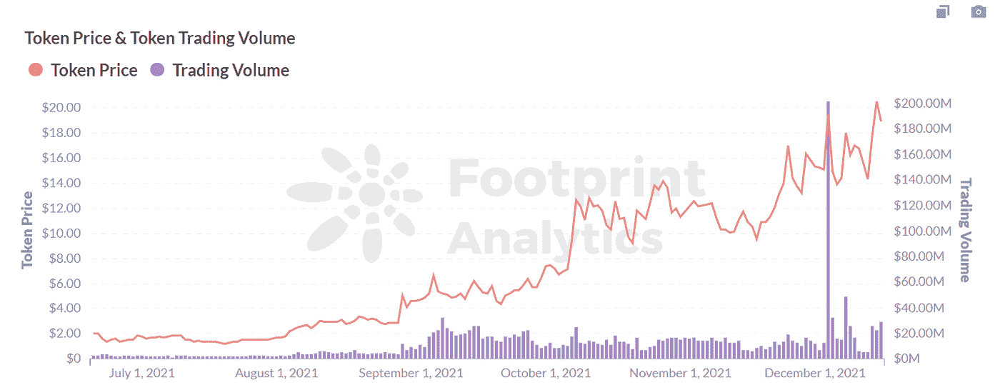
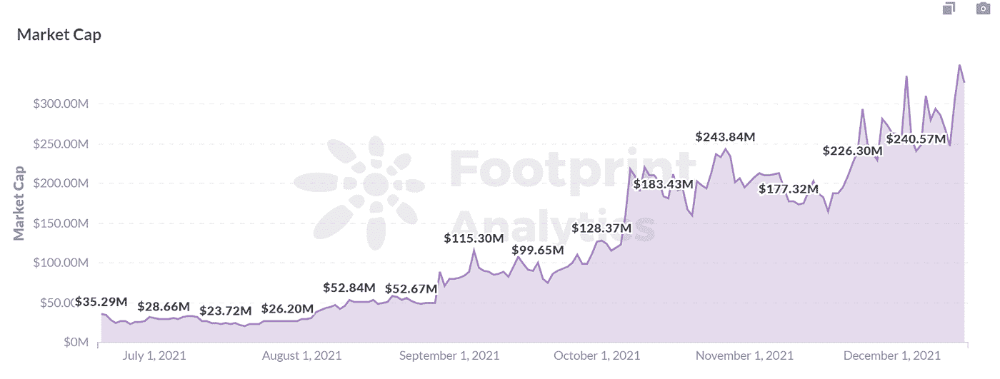
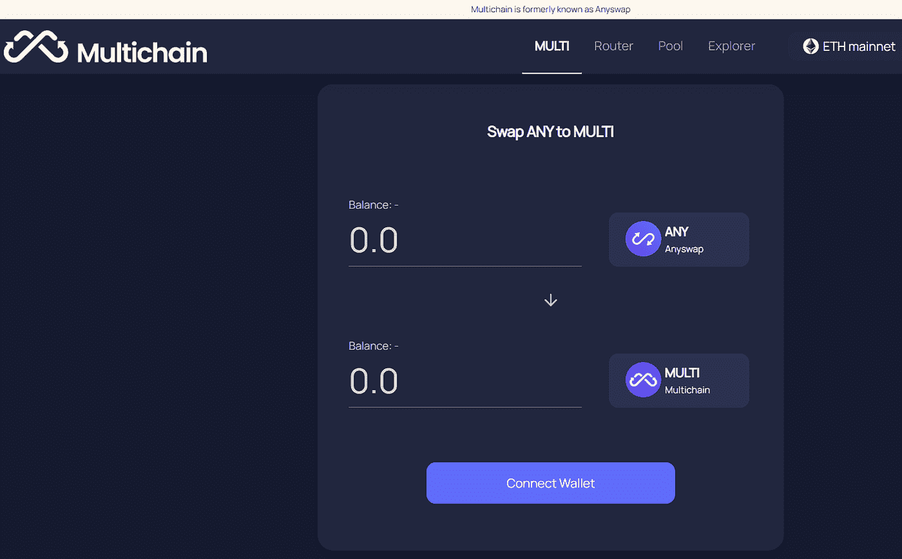
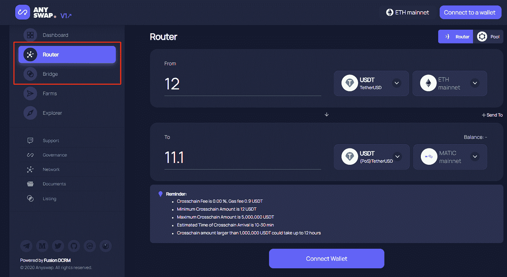
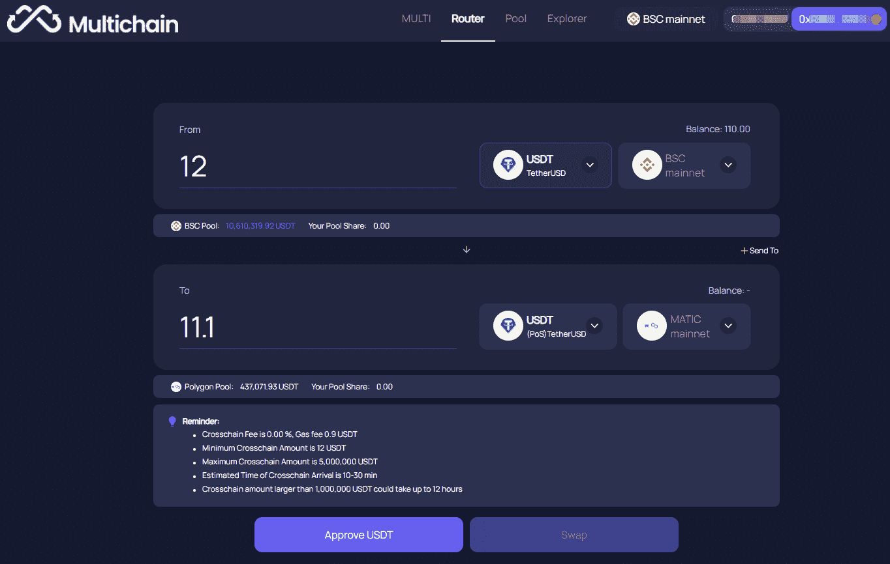

# 足迹分析:更名后的 Anyswap 会成为下一座 Web 3.0 桥梁吗？

> 原文：<https://medium.com/coinmonks/footprint-analytics-will-the-rebranded-anyswap-be-the-next-web-3-0-bridge-8737176eeb04?source=collection_archive---------6----------------------->

2021 年 12 月 vincy@footprint.network

数据来源:[足迹 Anyswap 仪表盘](https://www.footprint.network/guest/dashboard/any-swap-dashboard-fp-6c8f02ec-886f-4a67-811a-2cb05faec7ac?channel=u-QytebM#secret=8A170391E6C74BCF40D2B4D71BB2AC9E)

12 月 16 日。Anyswap 宣布将更名为 Multichain，反映了从资产跨链解决方案到多链资产交互技术的关注点变化。简而言之，Anyswap(现在将被称为 Multichain)希望成为最终的 Web 3.0 路由器。

根据 Footprint Analytics 的最新数据，Multichain 的 TVL 从 10 月 6 日的 15 亿美元上升到 10 月 11 日的峰值 56 亿美元，增长了 273%。TVL 目前稳定在 45-48 亿美元以上，多链的稳定性依赖于区块链的市场规模，为跨多个区块链互操作转移资产创造了一个巨大的跨链市场。

*Footprint Analytics:Anyswap TVL by Chain*

# Anyswap 和多链简介

Anyswap 使用 AMM 机制支持大多数主要代币的跨链交易，直到 2021 年 2 月，但删除了交易功能，以专注于与 Fantom、 [Polygon](https://docs.google.com/document/d/1dcDNyQM45p5bQ0EVcVlPglJe1uTZdXQ-yzb9gkIslDk/edit) 、xDAI、 [Avalanche](https://docs.google.com/document/d/1l2P6E417pmALV49dCQRacdOuOOHYGIpbjBCi3hGyBCY/edit#heading=h.lgi4s1f3dx3m) 等项目的资产跨链解决方案。Avalanche 和其他项目支持 Terra 和 Fantom mainnet 之间的交叉链接。

Multichain 的 TVL 目前在网络上排名第 15 位，支持 27 项链上资产和 1，197 个令牌，是跨链桥的领导者。一系列的更新和迭代为升级后的多链奠定了坚实的基础。

*Screenshot Source：Multichain*

*Footprint Analytics:Top 20 Protocols TVL Ranking*

## 为什么 Anyswap 变成了多链？

随着不同区块链提供的官方跨链桥数量的增加，它们威胁到了 Anyswap 作为第三方开发商和同一技术的独立运营商的地位。

该项目现在被称为多链，旨在成为 Web 3.0 的最终路由器，这是一种为任意跨链交互开发的基础设施，支持令牌、NFT 和链之间公共数据的跨链互操作性，快速、安全且廉价。多链的特性包括:

*   **非托管和 MPC(多方安全计算)模式。** MPC 处理其他链上的多链跨链桥接和智能合约方法。
*   无滑动掉期。 Multichain 的 1:1 交换使用户能够执行 0 滑移转移，消除了与 AMM 相关的隐性成本。
*   **多链路由器。**多链路由器允许用户在任意两个链之间自由切换。它降低了费用和运营的复杂性，并使在不同连锁店之间转移变得更加容易。

## 令牌从任意变为多

Anyswap 以 ANY 为令牌，目前流通供应量 1864 万，最高供应量 1 亿。

任何最初的应用场景都纯粹是作为治理令牌

*   在支持的 mainnet 中使用投票来决定是否访问它。
*   用于激励 Anyswap 工作节点提供稳定、安全的跨链服务。
*   用于投票支持治理规则。

然而，由于协议侧重于资产跨链业务，ANY 的治理应用程序有所削弱。

6 月，Anyswap 宣布了第一个令牌回购和销毁机制，通过分配 20%的跨链业务费用用于回购和销毁任何进入通缩模式的令牌。在这之后，任何成为主要用于认捐和节点选举投票。

自 Anyswap 宣布新机制以来，ANY 的价格一直呈上升趋势，从 6 月 20 日的 2.02 美元上涨至 12 月 15 日的 20.50 美元的峰值，涨幅为 915%，目前回落至 18.94 美元。

在过去的 4 个月里，ANY 的交易量一直保持在 1500 万至 3000 万美元以上，12 月 4 日达到了 2 亿美元的 ATH。当天，币安推出了 Anyswap(任意)，并开通了任意/BTC、任意/BUSD 和任意/USDT 交易对，使用户可以支付任意作为过桥交易费，导致交易量飙升。

*Footprint Analytics:ANY Price & Trading Volume*

ANY 的市值在品牌更新前后一直呈上升趋势，目前为 3.27 亿美元。市场资本化反映了 DeFi 行业中一个项目的市场价值，主要受硬币价格以及流通和可交易代币数量的影响。

*Footprint Analytics:ANY Market Cap Trend*

品牌升级后，治理令牌由任意变为多，**T5【任意】T6**通过智能合约发起令牌交换，比例为 1:1。还会有新的 token logo。

*Screenshot Source：Multichain*

# 升级后跨链体验有什么变化？

Anyswap 团队于 12 月 16 日发布了一个新网站，该网站将原来的交叉链接桥和多链接路由功能合并为多链，提供了一个统一的交叉链接接口。

假设用户想用 12 USDT 交叉链接来自 BSC 的多边形。

**升级前**

在升级之前，用户需要了解 Anyswap 是如何工作的，以便他或她可以在跨链网桥和多链路由之间进行选择。主要目标之一是简化流程。

*Screenshot Source：Anyswap interface before upgrade*

**升级后**

用户可以在多联路由功能上做跨联操作，减去 0.9 USDT 的油费。多边形的实际量是 11.1 USDT，整个交互过程不到 5 分钟。

pool 功能也进行了升级，用户现在可以看到每个代币支持的链，以及跨链用户到每个链的流动资金。目前，最大的跨链池是以太坊和 BSC——加密货币中最活跃的区块链。

用户现在可以轻松访问跨链参考数据，并评估潜在的机会和风险。另外，用户要从顶级 TVL 和可观规模、安全性、行业认知度高、跨链时效、气费等多个方面考虑[如何选择合适的桥](https://docs.google.com/document/d/1iTSYwMRRHOvqhq2i5b93UCbJzhTx4Z8vie9dBW4AFSo/edit#)。

# 多链很可能在跨链市场中扮演重要角色

通过更名，Multichain 提供:

*   具有更多新链的多链资产交互解决方案
*   更好的用户体验

随着 DeFi 市场的不断壮大，用户资产的转移已经成为每个人的刚需。因此，为用户解决资产跨链和资产流动的问题变得至关重要(而且有利可图)。

**什么是足迹分析**

足迹分析是一个一体化的分析平台，用于可视化区块链数据和发现见解。它清理和整合链上数据，因此任何经验水平的用户都可以快速开始研究令牌，项目和协议。凭借一千多个仪表板模板和一个拖放界面，任何人都可以在几分钟内构建自己的定制图表。发掘区块链数据，利用足迹进行更明智的投资。

*足迹网址:*[*https://www . Footprint . network*](https://www.footprint.network/)

*不和:*[*https://discord.gg/3HYaR6USM7*](https://discord.gg/3HYaR6USM7)

*推特:*[*https://twitter.com/Footprint_DeFi*](https://twitter.com/Footprint_DeFi)

*电报:*[*https://t.me/joinchat/4-ocuURAr2thODFh*](https://t.me/joinchat/4-ocuURAr2thODFh)

*Youtube:*[*https://www.youtube.com/channel/UCKwZbKyuhWveetGhZcNtSTg*](https://www.youtube.com/channel/UCKwZbKyuhWveetGhZcNtSTg)

> 加入 Coinmonks [电报频道](https://t.me/coincodecap)和 [Youtube 频道](https://www.youtube.com/c/coinmonks/videos)了解加密交易和投资

## 另外，阅读

*   [3 商业评论](/coinmonks/3commas-review-an-excellent-crypto-trading-bot-2020-1313a58bec92) | [Pionex 评论](https://blog.coincodecap.com/pionex-review-exchange-with-crypto-trading-bot) | [Coinrule 评论](/coinmonks/coinrule-review-2021-a-beginner-friendly-crypto-trading-bot-daf0504848ba)
*   [莱杰 vs n rave](/coinmonks/ledger-vs-ngrave-zero-7e40f0c1d694)|[莱杰 nano s vs x](/coinmonks/ledger-nano-s-vs-x-battery-hardware-price-storage-59a6663fe3b0) | [币安评论](/coinmonks/binance-review-ee10d3bf3b6e)
*   [Bybit Exchange 审查](/coinmonks/bybit-exchange-review-dbd570019b71) | [Bityard 审查](https://blog.coincodecap.com/bityard-reivew) | [Jet-Bot 审查](https://blog.coincodecap.com/jet-bot-review)
*   [3 commas vs crypto hopper](/coinmonks/3commas-vs-pionex-vs-cryptohopper-best-crypto-bot-6a98d2baa203)|[赚取加密利息](/coinmonks/earn-crypto-interest-b10b810fdda3)
*   最好的比特币[硬件钱包](/coinmonks/hardware-wallets-dfa1211730c6) | [BitBox02 回顾](/coinmonks/bitbox02-review-your-swiss-bitcoin-hardware-wallet-c36c88fff29)
*   [BlockFi vs 摄氏度](/coinmonks/blockfi-vs-celsius-vs-hodlnaut-8a1cc8c26630) | [Hodlnaut 审核](/coinmonks/hodlnaut-review-best-way-to-hodl-is-to-earn-interest-on-your-bitcoin-6658a8c19edf) | [KuCoin 审核](https://blog.coincodecap.com/kucoin-review)
*   [Bitsgap 审查](/coinmonks/bitsgap-review-a-crypto-trading-bot-that-makes-easy-money-a5d88a336df2) | [Quadency 审查](/coinmonks/quadency-review-a-crypto-trading-automation-platform-3068eaa374e1) | [Bitbns 审查](/coinmonks/bitbns-review-38256a07e161)
*   [密码本交易平台](/coinmonks/top-10-crypto-copy-trading-platforms-for-beginners-d0c37c7d698c) | [Coinmama 评论](/coinmonks/coinmama-review-ace5641bde6e)
*   [印度的加密交易所](/coinmonks/bitcoin-exchange-in-india-7f1fe79715c9) | [比特币储蓄账户](/coinmonks/bitcoin-savings-account-e65b13f92451)
*   [OKEx vs KuCoin](https://blog.coincodecap.com/okex-kucoin) | [摄氏替代品](https://blog.coincodecap.com/celsius-alternatives) | [如何购买 VeChain](https://blog.coincodecap.com/buy-vechain)
*   [币安期货交易](https://blog.coincodecap.com/binance-futures-trading)|[3 comas vs Mudrex vs eToro](https://blog.coincodecap.com/mudrex-3commas-etoro)
*   [如何购买 Monero](https://blog.coincodecap.com/buy-monero) | [IDEX 评论](https://blog.coincodecap.com/idex-review) | [BitKan 交易机器人](https://blog.coincodecap.com/bitkan-trading-bot)