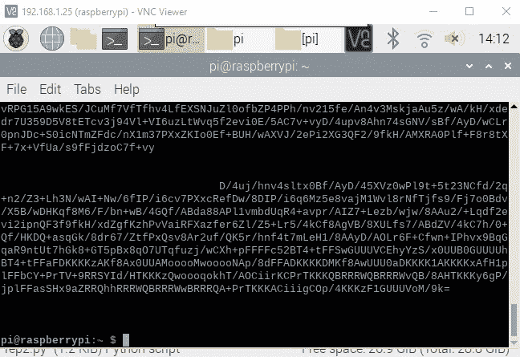
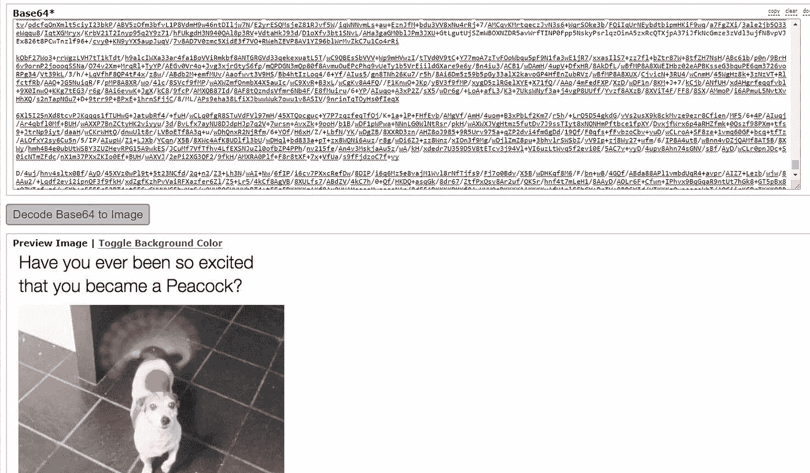

# 对于初学者:从 IOTA Tangle 下载图片

> 原文：<https://medium.com/coinmonks/for-beginners-download-images-from-the-iota-tangle-17ffb79b5ed2?source=collection_archive---------1----------------------->

这个程序的目的:在你上传图片后从 IOTA Tangle 下载图片(见[初学者:上传图片到 IOTA Tangle](/coinmonks/for-beginners-upload-images-onto-the-iota-tangle-6da0d4069705) )。

本文假设您已经安装了与上传程序中描述的相同的环境。本文中的代码只是一个基本的代码，目的是展示它是如何完成的(潜在的改进:在屏幕上输入标签和地址，或者自动将 base64 文本转换为图像)。

如果你被困住了，联系我。另外，如果您看到任何需要改进的地方，请告诉我。

# 下载图像的代码

复制并使用下面的代码(我称之为 iota-images-read.py):

您需要进行两项更改(它们都在代码中突出显示):

1.  插入您的 IOTA 地址
2.  插入您的标签

运行程序:

`python iota-images-read.py`

您将看到以下输出:

突出显示输出并复制它。

使用以下网站解码 base64 代码生成图像:[https://base64.guru/converter/decode/image](https://base64.guru/converter/decode/image)。将文本粘贴到 Base64 字段，然后单击“将 Base64 解码为图像”。

# 错误？

当您看不到图像时，可能会出现一些错误:

*   标签不是唯一的:当一些图片使用相同的标签上传时，你将不能下载你的图片。解决方案:使用新标签重新上传图像。
*   您从终端复制了超过需要的(或少于需要的)内容。

> [直接在您的收件箱中获得最佳软件交易](https://coincodecap.com/?utm_source=coinmonks)

