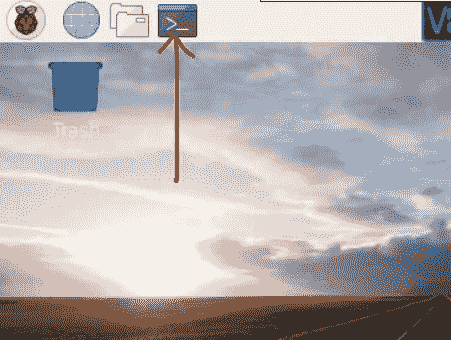

# 对于初学者:如何设置 Raspberry Pi RFID RC522 阅读器并在 IOTA 上记录数据

> 原文：<https://medium.com/coinmonks/for-beginners-how-to-set-up-a-raspberry-pi-rfid-rc522-reader-and-record-data-on-iota-865f67843a2d?source=collection_archive---------0----------------------->

本文档的目的是解释如何使用 RFID 阅读器并在 IOTA tangle 上记录数据的过程。这是一个循序渐进的指南，是我在试图让我在互联网上找到的任何解决方案都行不通之后写的。如果你看到任何需要改进的地方，请告诉我。

本文只是一个例子，说明使用 IOTA 是多么容易，但是当您想在需要长期存储数据的环境中使用这种想法时要小心。原因:为了维护一个小型的 IOTA 分类账数据库，IOTA 会不定期地删除所有余额为零的交易(这称为快照)。我们在示例中生成的事务就属于这一类。只有永久节点将保持跟踪整个历史，这些节点受到激励，以获得每次查询的报酬。

> [发现并回顾最佳区块链软件](https://coincodecap.com/)

# 1.硬件设置

# 1.1 组件

*   [树莓派 3](https://www.amazon.com/CanaKit-Raspberry-Complete-Starter-Kit/dp/B01C6Q2GSY/ref=sr_1_4?ie=UTF8&qid=1547121152&sr=8-4&keywords=raspberry+pi+kit) (或 2)以下组件:WiFi、32GB Micro SD 卡、电源。
*   [RC522 RFID 阅读器](https://www.amazon.com/HiLetgo-RFID-Kit-Arduino-Raspberry/dp/B01CSTW0IA/ref=pd_nav_b2b_ab_bia_t_1?_encoding=UTF8&psc=1&refRID=AGHDVNWJFMX6NN115FKS)
*   [试验板电线 F/F](https://www.amazon.com/Multicolored-Breadboard-Dupont-Jumper-Wires/dp/B073X7P6N2?keywords=Breadboard+Wires+F%2FF&qid=1547299311&s=Electronics&sr=1-7&ref=sr_1_7)

此外，您还需要设置:USB 键盘、USB 鼠标和 HDMI 电缆。

# 1.2 组装

组装很简单。

RFID 阅读器:您需要将引脚接头焊接到模块板上。小心这一步，否则系统将无法工作(您将无法读取/写入标签)。例如，我有一个引脚焊接不正确，我花了很长时间来识别和解决这个问题，因为我最初认为这是一个软件问题。

连接:通过以下方式将阅读器连接到覆盆子:

# 2.软件设置

要操作你的 Raspberry Pi，你需要一个微型 SD 卡。要安装操作软件，请遵循以下流程:[https://www . raspberrypi . org/documentation/installation/installing-images/readme . MD](https://www.raspberrypi.org/documentation/installation/installing-images/README.md)。安装完整版的 Raspbian。将 SD 卡插入树莓派。

连接到 Raspberry Pi:

*   使用 HDMI 电缆的显示器
*   鼠标和键盘
*   电力电缆

重启后，选择菜单→首选项→ Raspberry Pi 配置，然后选择选项卡接口并启用:SSH、SPI 和 VNC。

如果您喜欢远程连接到 Raspberry Pi，请执行以下步骤:

在 Raspberry 上打开终端并使用以下代码:

`sudo apt-get update`

`sudo apt-get install realvnc-vnc-server realvnc-vnc-viewer`

要获取 raspberry Pi 的 ip 地址(例如 192.168.1.20)，请在终端中键入:`***ifconfig***`

重启 Raspberry Pi:

`***sudo reboot***`

在你的电脑上下载 https://www.realvnc.com/en/connect/download/viewer/的 VNC 浏览器，并按照说明进行操作。

安装后，使用 Raspberry Pi IP 地址以及用户名和密码登录到您的 Raspberry。

# **3。RFID 软件的安装**

一旦您的 Raspberry Pi 完成重启，打开终端并检查 spi_bcm2835 是否列出:

`***lsmod | grep spi***`

如果您没有看到 spi_bcm2835，则您没有在配置中激活 spi(见上文)

1.确保您的 Raspberry Pi 运行所有软件的最新版本。在您的 Raspberry Pi 上运行以下两个命令来更新它。

`***sudo apt-get update***`

`***sudo apt-get upgrade***`

2.安装 python 包

`***sudo apt-get install python***`

3.克隆 Python 库 SPI Py 并将其安装到您的 Raspberry Pi 中，以便与 RFID RC522 进行交互。

`cd ~`

`git clone https://github.com/lthiery/SPI-Py.git`

`cd ~/SPI-Py`

`sudo python setup.py install`

`cd ~`

`git clone https://github.com/pimylifeup/MFRC522-python.git`

为了测试系统是否正常运行，让我们编写一个小程序:

`cd ~/`

`sudo nano rfidreader.py`

这将打开树莓编辑器

将以下代码复制到编辑器中:

要保存文件，请按 Ctrl + X，然后按 Y，再按 Enter。

现在运行这个程序:

`sudo python rfidreader.py`

并在 RFID 阅读器旁边拿着一个标签。这将产生如下输出:

按照这些[说明](/@rfkledig/writing-data-on-a-rfid-tag-40b5083794a6)将名字写在卡片上

# 4.激活 IOTA

要与 IOTA tangle 通信，您需要安装 PyOTA 库([https://github.com/iotaledger/iota.lib.py](https://github.com/iotaledger/iota.lib.py)):

`cd ~/`

`sudo apt-get install libffi-dev` (为了避免错误:“为加密构建轮子失败”)

`sudo pip install pyota[ccurl]`

`git clone https://github.com/iotaledger/iota.lib.py.git`

要测试安装是否成功(大约需要 10 分钟):

`cd iota.lib.py`

`python setup.py test`

您可以在 IOTA 官方网页上找到更多信息。

# 5.在纠结上记录数据

对于这一步，您将需要一个 IOTA 地址。为此，我建议在你的电脑上安装三一钱包([https://trinity.iota.org](https://trinity.iota.org/))并获得一个新地址。

为了在缠结上记录数据，我们将编写一个小程序，要求用户投票(是或否)，然后将这个值与缠结上的 RFID 标签号和名称一起记录下来。

现在让我们创建程序。在终端中键入以下命令:

`cd ~/`

`sudo nano cast-a-vote.py`

插入这个[程序](https://github.com/rfkinline/IOTA/blob/master/dataentry.py):

不要忘记在**清理日志地址**后插入您的 IOTA 地址(第 11 行)

要保存文件，请按 Ctrl + X，然后按 Y，再按 Enter。

3.现在让我们运行我们的程序:

`***sudo python cast-a-vote.py***`

4.您现在可以使用 IOTA Explorer(例如 thetangle.org 的)并检查数据是否被成功记录。

> 加入 Coinmonks [电报频道](https://t.me/coincodecap)和 [Youtube 频道](https://www.youtube.com/c/coinmonks/videos)获取每日[加密新闻](http://coincodecap.com/)

## 另外，阅读

*   [密码电报信号](http://Top 4 Telegram Channels for Crypto Traders) | [密码交易机器人](/coinmonks/crypto-trading-bot-c2ffce8acb2a)
*   [复制交易](/coinmonks/top-10-crypto-copy-trading-platforms-for-beginners-d0c37c7d698c) | [加密税务软件](/coinmonks/crypto-tax-software-ed4b4810e338)
*   [网格交易](https://coincodecap.com/grid-trading) | [加密硬件钱包](/coinmonks/the-best-cryptocurrency-hardware-wallets-of-2020-e28b1c124069)
*   [加密交换](/coinmonks/crypto-exchange-dd2f9d6f3769) | [印度的加密应用](/coinmonks/buy-bitcoin-in-india-feb50ddfef94)
*   [开发人员的最佳加密 API](/coinmonks/best-crypto-apis-for-developers-5efe3a597a9f)
*   最佳[加密贷款平台](/coinmonks/top-5-crypto-lending-platforms-in-2020-that-you-need-to-know-a1b675cec3fa)
*   杠杆代币的终极指南
*   [八大加密附属计划](https://coincodecap.com/crypto-affiliate-programs) | [eToro vs 比特币基地](https://coincodecap.com/etoro-vs-coinbase)
*   [最佳以太坊钱包](https://coincodecap.com/best-ethereum-wallets) | [电报上的加密货币机器人](https://coincodecap.com/telegram-crypto-bots)
*   [交易杠杆代币的最佳交易所](https://coincodecap.com/leveraged-token-exchanges) | [购买 Floki](https://coincodecap.com/buy-floki-inu-token)
*   [3Commas 对 Pionex 对 Cryptohopper](https://coincodecap.com/3commas-vs-pionex-vs-cryptohopper) | [Bingbon 评论](https://coincodecap.com/bingbon-review)