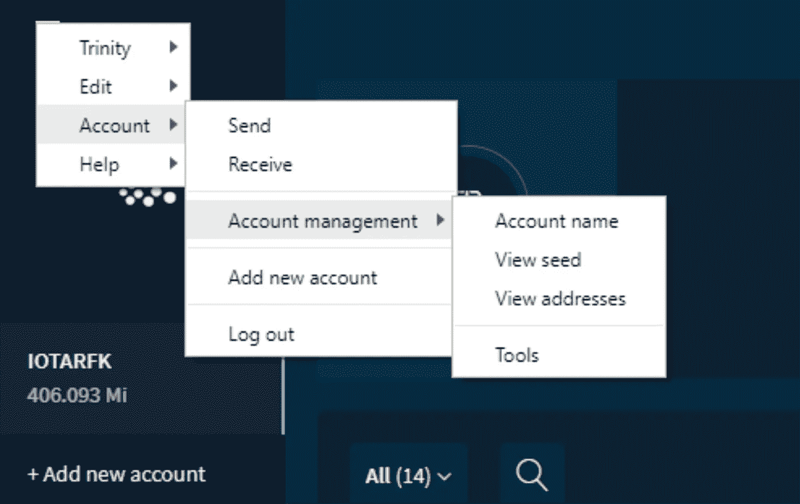

# 对于初学者:打开灯，用树莓派支付 IOTAs

> 原文：<https://medium.com/coinmonks/for-beginners-switch-a-light-on-with-the-payment-of-iotas-e3722809477c?source=collection_archive---------0----------------------->

本文基于 Hugo Gregersen 写的说明:[将物理设备与 IOTA](/coinmonks/integrating-physical-devices-with-iota-83f4e00cc5bb) 集成。我无法按照他的指示让事情运转起来，所以我开始尝试，直到它运转起来。如果你看到任何需要改进的地方，请告诉我。

# **1。硬件设置**

# **1.1 组件**

*   [树莓 Pi 3](https://www.amazon.com/CanaKit-Raspberry-Complete-Starter-Kit/dp/B01C6Q2GSY/ref=sr_1_4?ie=UTF8&qid=1547121152&sr=8-4&keywords=raspberry+pi+kit) (或 2)以下组件:WiFi，32GB Micro SD 卡，电源。
*   Arduino Raspberry Pi ARM AVR 的 1 通道 DC [5V 继电器开关](https://www.ebay.com/itm/322465448278)板卡模块
*   3mm [5mm LED 灯](https://www.ebay.com/itm/391368927437)白色红色绿色黄色混装发光二极管 DIY 套装
*   [试验板](https://www.amazon.com/dp/B01EV640I6/ref=pe_2640190_232748420_TE_item)
*   [红色、黄色、绿色 LED: 150 欧姆电阻，蓝色、白色 LED: 100 欧姆电阻](https://www.amazon.com/dp/B00IWXEUIU/ref=pe_2640190_232748420_TE_item)
*   [试验板电线](https://www.amazon.com/dp/B07DMK2SH2/ref=pe_2640190_232748420_TE_item) (F/M 和 M/M)
*   9V 电池

此外，您还需要设置:USB 键盘、USB 鼠标和 HDMI 电缆。

# **1.2 装配**

仔细看这张图。

1.  LED 有两条腿。较短的引脚必须位于电阻一侧。
2.  继电器的输出端决定开/关操作。如果橙色电缆连接到底部，则它处于关闭/打开状态。如果您将橙色电缆连接到上部插槽，操作将开启/关闭。
3.  一旦你打开了覆盆子，继电器上的红灯应该就亮了

# **2。软件设置**

要操作你的 Raspberry Pi，你需要一个微型 SD 卡。要安装操作软件，请遵循以下流程:[https://www . raspberrypi . org/documentation/installation/installing-images/readme . MD](https://www.raspberrypi.org/documentation/installation/installing-images/README.md)。安装完整版的 Raspbian。将 SD 卡插入树莓派。

连接到 Raspberry Pi:

*   使用 HDMI 电缆的显示器
*   鼠标和键盘
*   电力电缆

重启后，选择菜单→首选项→树莓 Pi 配置，然后选择选项卡接口并启用:SSH、SPI 和 VNC。

如果您喜欢远程连接到 Raspberry Pi，请执行以下步骤:

在 Raspberry 上打开终端并使用以下代码:

`sudo apt-get update`

`sudo apt-get install realvnc-vnc-server realvnc-vnc-viewer`

要获取 raspberry Pi 的 ip 地址(例如 192.168.1.20)，请在终端中键入:`***ifconfig***`

重启 Raspberry Pi:

`***sudo reboot***`

在你的电脑上下载 https://www.realvnc.com/en/connect/download/viewer/ VNC 浏览器并按照说明进行操作。

安装后，使用 Raspberry Pi IP 地址以及用户名和密码登录到您的 Raspberry。

# **3。Python 的安装**

1.确保您的 Raspberry Pi 运行所有软件的最新版本。在您的 Raspberry Pi 上运行以下两个命令来更新它。

`***sudo apt-get update***`

`***sudo apt-get upgrade***`

2.安装 python2.7-dev 包

`***sudo apt-get install python2.7-dev***`

# **4。** **测试光线**

让我们测试一下安装是否成功。

打开覆盆子上的终端

`sudo nano light.py`

并插入以下代码:

要保存文件，请按 Ctrl + X，然后按 Y，再按 Enter。

现在运行这个程序:

`sudo python light.py`

你会听到继电器发出咔嗒声，继电器上的绿灯亮了又灭。如果指示灯不亮，很可能是电池的连接线接错了。

# **4。激活 IOTA**

为了与 IOTA tangle 通信，你需要安装 PyOTA 库([https://github.com/iotaledger/iota.lib.py](https://github.com/iotaledger/iota.lib.py)):

`cd ~/`

`sudo apt-get install libffi-dev`(为了避免错误:“为加密构建轮子失败”)

`sudo pip install pyota[ccurl]`

`git clone https://github.com/iotaledger/iota.lib.py.git`

要测试安装是否成功(大约需要 10 分钟):

`cd iota.lib.py`

`python setup.py test`

# **5。使用 IOTA 支付开关灯**

Hugo 的想法很好:你把 IOTAs 存入一个账户，灯就会根据存入的金额自动打开。他的解决方案检查新令牌何时到达，并忽略帐户中已有的令牌。

现在让我们使用雨果写的[程序。在终端中键入以下命令:](https://gist.github.com/huggre/a3044e6094867fe04096e0c64dc60f3b)

`cd ~/iota.lib.py`

`sudo nano lightson.py`

你需要做两个改变:

*   第 13 行将 LEDPIN 改为 21
*   插入您的 IOTA 地址

你需要一点地址。为此，我建议在你的电脑上安装 trinity 钱包([https://trinity.iota.org](https://trinity.iota.org/))，这样就能获得一个新地址。

这是让它工作的过程:

1.  获取 IOTA 地址(如果该地址上没有令牌也没关系)
2.  在程序 lightson.py 中插入地址
3.  启动 lightson.py 程序

`python lightson.py`

程序将开始运行(0:00:00 代表灯将被打开的时间。它是一个倒计时，直到灯熄灭)。

4.当程序运行时，将例如 121(确保它不是 12m1)传送到上述使用的地址。

5.转移令牌大约需要 2-3 分钟。然后，您将看到灯打开，在我们的示例中，12 秒后(每隔 1 秒)灯将再次关闭。

仅供参考:要找到三一钱包中的地址:

要复制地址，只需点击它。

> [直接在您的收件箱中获得最佳软件交易](https://coincodecap.com/?utm_source=coinmonks)

