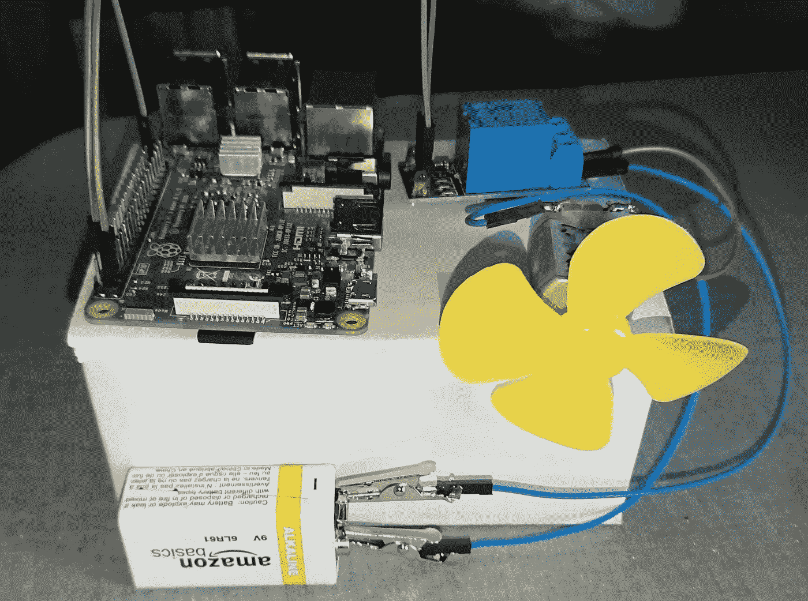
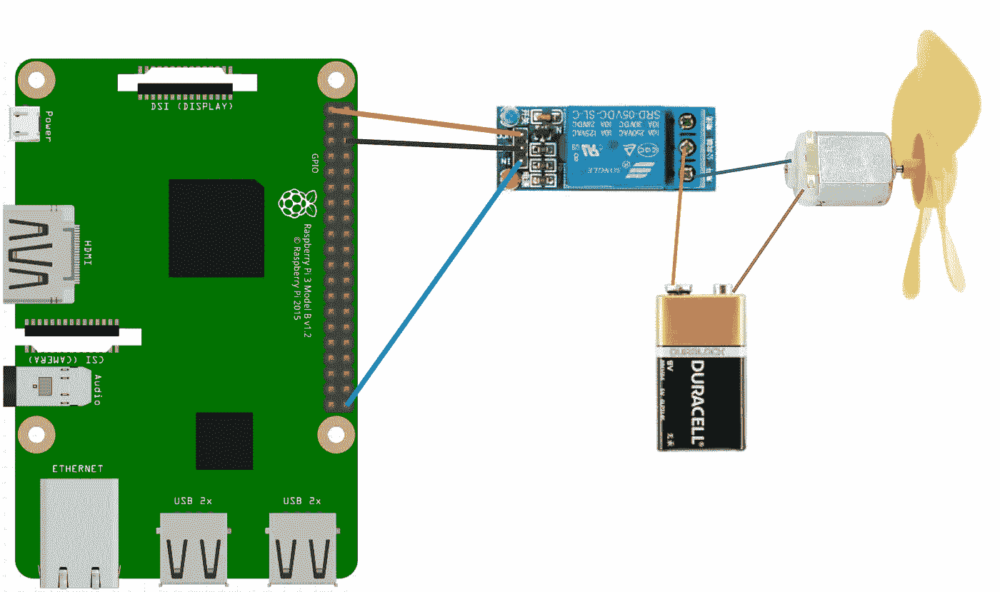
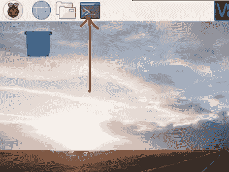
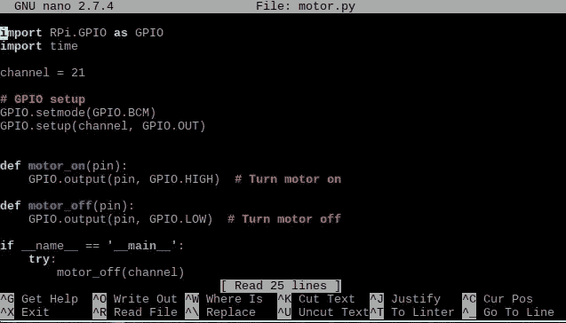
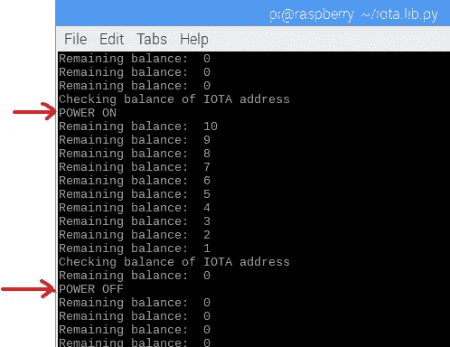
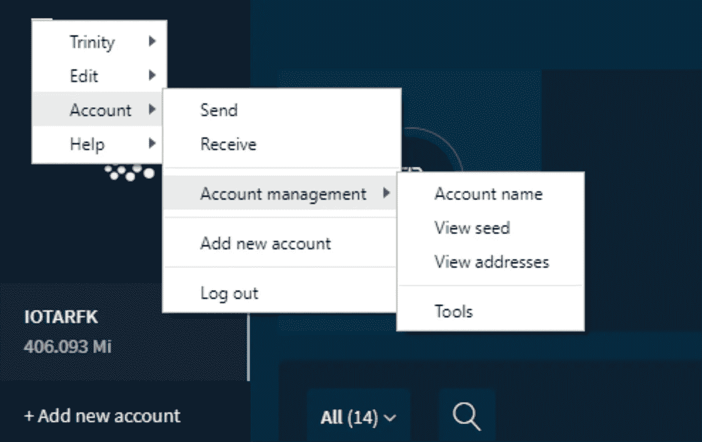

# 对于初学者:使用树莓 Pi 和 IOTA 开关电机

> 原文：<https://medium.com/coinmonks/for-beginners-switch-a-motor-on-off-using-a-raspberry-pi-and-iota-3cf7d0b38d04?source=collection_archive---------0----------------------->

这个程序的目的:IOTA 硬币支付到一个特定的地址将打开一个小马达，直到已支付的硬币被使用(1 秒= 1 IOTA)。

这篇文章基于我的文章“初学者:用树莓派打开 IOTAs 支付的灯”。

如果你被困住了，联系我。另外，如果您看到任何需要改进的地方，请告诉我。

# 1.硬件设置

# 1.1 组件

*   [树莓派 3](https://www.amazon.com/CanaKit-Raspberry-Complete-Starter-Kit/dp/B01C6Q2GSY/ref=sr_1_4?ie=UTF8&qid=1547121152&sr=8-4&keywords=raspberry+pi+kit) (或 2)以下组件:WiFi、32GB Micro SD 卡、电源。
*   Arduino Raspberry Pi ARM AVR 的 1 通道 DC [5V 继电器开关](https://www.ebay.com/itm/322465448278)板卡模块
*   [试验板电线](https://www.amazon.com/dp/B07DMK2SH2/ref=pe_2640190_232748420_TE_item) (F/M 和 M/M)
*   [迷你 DC 马达](https://www.ebay.com/itm/6V-6000RPM-DC-High-Torque-Magnetic-Mini-DC-Motor-No-Vanes/323474502477?hash=item4b5095334d:g:IYQAAOSwd4xbsBqZ)。我在易贝寻找最便宜的汽车。我购买的电机是 6V 的，这意味着你需要一个电阻，或者只有在使用 9V 电池时才能短时间使用电机
*   9V 电池

此外，您还需要设置:USB 键盘、USB 鼠标和 HDMI 电缆。

# 1.2 组装

仔细看这张图。

1.  继电器的输出端决定开/关操作。如果橙色电缆(如下图所示)连接到底部，则它处于关闭/打开状态。如果您将橙色电缆连接到上部插槽，操作将开启/关闭。
2.  一旦你打开树莓，继电器上的红灯就会亮起。只有当继电器被激活时，绿灯才会亮起。

# 2.软件设置

要操作你的 Raspberry Pi，你需要一个微型 SD 卡。要安装操作软件，请遵循以下流程:[https://www . raspberrypi . org/documentation/installation/installing-images/readme . MD](https://www.raspberrypi.org/documentation/installation/installing-images/README.md)。安装完整版的 Raspbian。将 SD 卡插入树莓派。

连接到 Raspberry Pi:

*   使用 HDMI 电缆的显示器
*   鼠标和键盘
*   电力电缆

重启后，选择菜单→首选项→ Raspberry Pi 配置，然后选择选项卡接口并启用:SSH、SPI 和 VNC。

如果您喜欢远程连接到 Raspberry Pi，请执行以下步骤:

在 Raspberry 上打开终端并使用以下代码:

`sudo apt-get update`

`sudo apt-get install realvnc-vnc-server realvnc-vnc-viewer`

要获取 raspberry Pi 的 ip 地址(例如 192.168.1.20)，请在终端中键入:`***ifconfig***`

重启 Raspberry Pi:

`***sudo reboot***`

在你的电脑上下载 https://www.realvnc.com/en/connect/download/viewer/的 VNC 浏览器，并按照说明进行操作。

安装后，使用 Raspberry Pi IP 地址以及用户名和密码登录到您的 Raspberry。

# 3.Python 的安装

1.确保您的 Raspberry Pi 运行所有软件的最新版本。在您的 Raspberry Pi 上运行以下两个命令来更新它。

`***sudo apt-get update***`

`***sudo apt-get upgrade***`

2.安装 python2.7-dev 包

`***sudo apt-get install python2.7-dev***`

# 4.测试电机

让我们测试一下安装是否成功。

打开 Raspberry 上的终端，键入:

`sudo nano motor.py`

插入以下代码:

要保存文件，请按 Ctrl + X，然后按 Y，再按 Enter。

现在运行这个程序:

`sudo python motor.py`

你会听到继电器发出咔嗒声，继电器上的绿灯亮了又灭。如果电机没有启动，你很可能会有电池的电缆接线错误。

# 4.激活 IOTA

为了与 IOTA tangle 通信，你需要安装 PyOTA 库([https://github.com/iotaledger/iota.lib.py](https://github.com/iotaledger/iota.lib.py)):

`cd ~/`

`sudo apt-get install libffi-dev`(为了避免错误:“为加密构建轮子失败”)

`sudo pip install pyota[ccurl]`

`git clone [https://github.com/iotaledger/iota.lib.py.git](https://github.com/iotaledger/iota.lib.py.git)`

要测试安装是否成功(大约需要 10 分钟):

`cd iota.lib.py`

`python setup.py test`

# 5.使用 IOTA 支付来打开/关闭电机

你向一个地址付费，马达根据支付的金额开启并保持运转(1 秒钟的电力)。该解决方案仅在新硬币到达时检查，并忽略帐户中已有的硬币。

在终端中键入以下命令:

`cd ~/iota.lib.py`

`sudo nano power.py`

您需要进行以下更改:插入您的 IOTA 地址

你需要一点地址。为此，我建议在你的电脑上安装三一钱包(【https://trinity.iota.org】)并通过这种方式获得一个新地址。

这是让它工作的过程:

1.  获取 IOTA 地址
2.  在程序 power.py 中插入地址
3.  启动 power.py 程序

`python power.py`

4.当程序运行时，将例如 111(确保不是 11 Mi)传输到上述使用的地址。

5.转移硬币大约需要 2-10 分钟。然后，您将看到电机打开，在我们的示例中，11 秒后(每隔 1 秒)，它将再次关闭。

This is the moment the coins arrive in my address (11 coins = 11 seconds). In the background you hear the relay and then the motor starting. You see the raspberry terminal and in the background the Trinity wallet

仅供参考:要找到三一钱包中的地址:

要复制地址，只需点击它。

# 6.问题/复杂情况/建议

*   IOTA 有不可重复使用的地址。在向外传输(“发送”传输)之前，向给定地址接收任意数量的交易是安全的。之后这个地址就不应该再被重用了！如果你正在为这个程序使用 Trinity 钱包，那么你将会遇到这个问题，因为钱包将开始从一个有资金的地址发送资金。例如，您开始从地址 A 向 B 发送 12 个 iota(B 是您在代码中使用的地址)，在 2 或 3 次尝试后，您将无法再向 B 发送任何 iota(钱包不允许)。解决方案:
    ——用一个三一钱包送，另一个收硬币。
    -每当钱包不再允许您向某个地址发送信息时，只需使用一个新的空地址。
*   耐心一点付款。可能需要 15 分钟。
*   如果你是初学者，接力赛可能会很棘手。重要提示:红色 LED 应该一直亮着，只有当继电器被激活时，绿色灯才亮着。检查电压端口(引脚 1 或 2)。
*   在开始使用 power.py 之前，尝试让 motor.py 工作
*   还有什么:请告诉我！

> [直接在您的收件箱中获得最佳软件交易](https://coincodecap.com/?utm_source=coinmonks)

