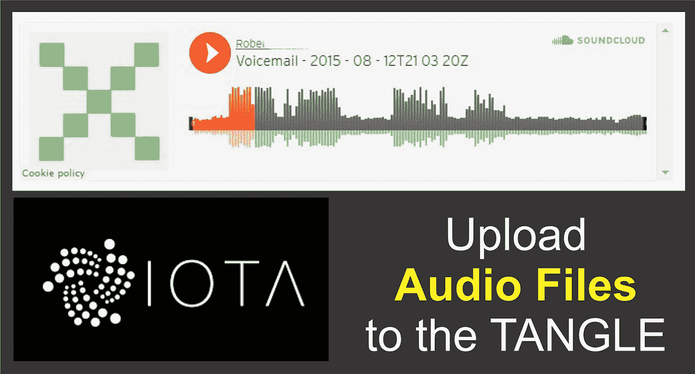
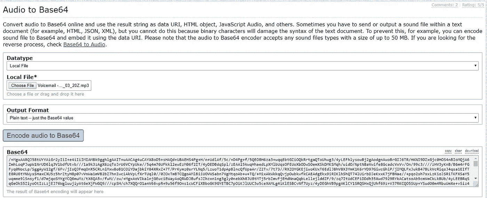
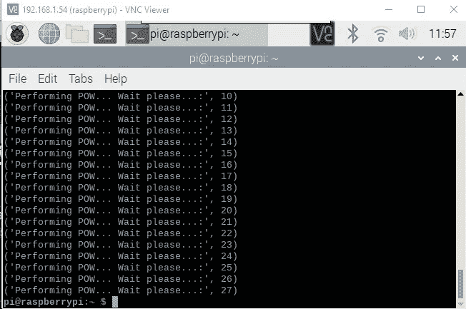
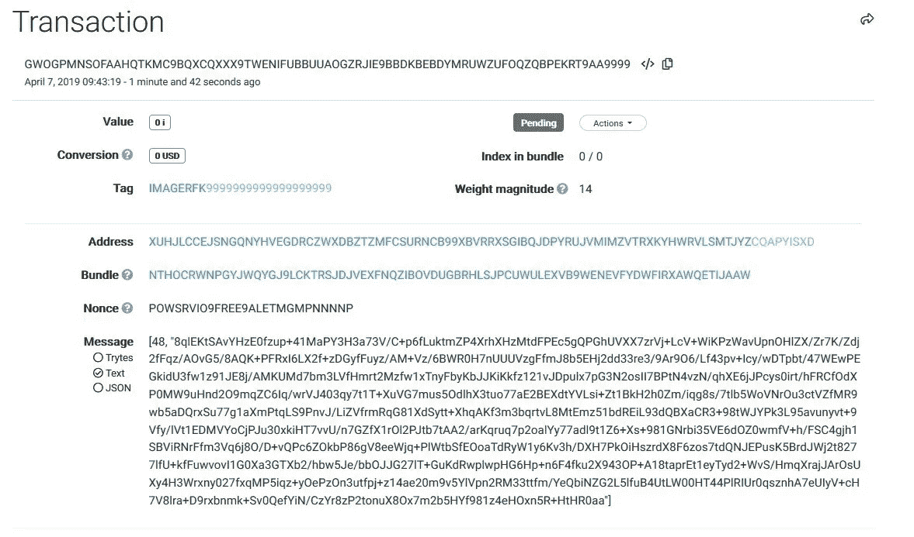
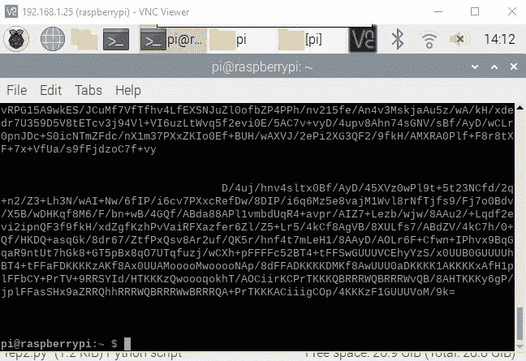
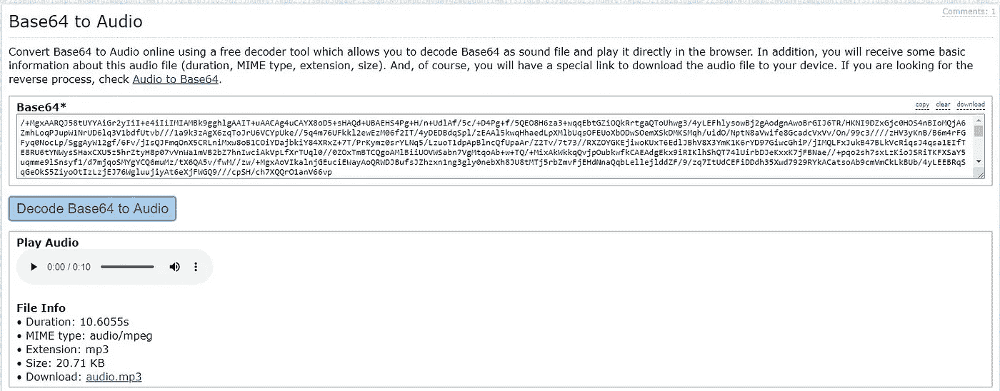

# 对于初学者:免费上传和下载文件到/从 IOTA Tangle

> 原文：<https://medium.com/coinmonks/for-beginners-upload-audio-files-onto-the-iota-tangle-870f8c4e2044?source=collection_archive---------2----------------------->

该计划的目的？它没有办法在 Tangle 上存储音频或视频文件。我心里有两件事。来展示这一丝纠结的潜力。大多数人认为 IOTA 是比特币的“竞争对手”，是区块链。但是:两个系统之间只有很少的接口。我想到的第二件事是:需要在实体之间传输数据(例如一个过程的设置)。在公司内部，这很简单。但是跨越国界，或公司，或组织，或平台，这是困难的，容易出问题。将数据存储在防审查且不可改变的介质上非常重要。

This is the audio file I uploaded to the Tangle. It is a voicemail somebody left me a while ago.

这个程序的目的:上传和存储音频文件到 IOTA Tangle 上。

本文假设您的机器上安装了 Python(我使用的是 Raspberry Pi)。要安装 python 和/或使用终端，请参考我以前的文章。

如果你被困住了，联系我。另外，如果您看到任何需要改进的地方，请告诉我。

# 1.激活 IOTA

为了与 IOTA tangle 通信，你需要安装 PyOTA 库([https://github.com/iotaledger/iota.lib.py](https://github.com/iotaledger/iota.lib.py)):

`cd ~/`

`sudo apt-get install libffi-dev`(为了避免错误:“为加密构建轮子失败”)

`sudo pip install pyota[ccurl]`

`git clone [https://github.com/iotaledger/iota.lib.py.git](https://github.com/iotaledger/iota.lib.py.git)`

要测试安装是否成功(大约需要 10 分钟):

`cd iota.lib.py`

`python setup.py test`

# 2.准备要上传的音频文件

要上传音频文件，您需要先将其转换为 Base64 字符串。有几个网页可以让你这样做。我用的是 [Base64。古鲁](https://base64.guru/converter/encode/audio)([https://base64.guru/converter/encode/audio](https://base64.guru/converter/encode/audio))。

结果将如下所示:

# 3.上传音频文件的代码

复制并使用下面的程序(我称之为 iota-audio.py):

您需要进行三项更改(它们都在代码中突出显示):

1.  插入您的 IOTA 地址
2.  检查您使用的是最佳节点
3.  插入音频文件的 Base64 字符串
4.  插入您的标签，以便您可以捆绑文件(仅允许以下字符:A…Z 和数字 9)

你需要一点地址。为此，我建议在你的电脑上安装三一钱包(【https://trinity.iota.org】)并通过这种方式获得一个新地址。

运行程序:

`python iota-audio.py`

程序运行时，您将看到以下输出:

前往 THETANGLE.ORG，输入你的 IOTA 地址，你将看到你生成的所有交易。要进行检查，请单击其中一个交易，您会看到类似这样的内容:

# 下载音频文件的代码

复制并使用以下代码(我将其命名为 iota-audio-download-read.py):

您需要进行三项更改(它们都在代码中突出显示):

1.  选择一个好的 IOTA 节点
2.  插入您的 IOTA 地址
3.  插入您的标签

运行程序:

`python iota-audio-download.py`

您将看到以下输出:

突出显示输出并复制它。

使用以下网站解码 base64 代码生成音频文件:[https://base64.guru/converter/decode/audio](https://base64.guru/converter/decode/audio)。将文本粘贴到 Base64 字段，然后单击“将 Base64 解码为音频”。

# 错误？

尝试解码数据时可能会出现一些问题:

*   标签不是唯一的:当几个文件使用相同的标签上传时，您将无法下载文件。解决方案:重新上传文件，在代码中添加一个新的标签，检查时间戳。
*   您从终端复制了超过需要的(或少于需要的)内容。

> [直接在您的收件箱中获得最佳软件交易](https://coincodecap.com/?utm_source=coinmonks)

