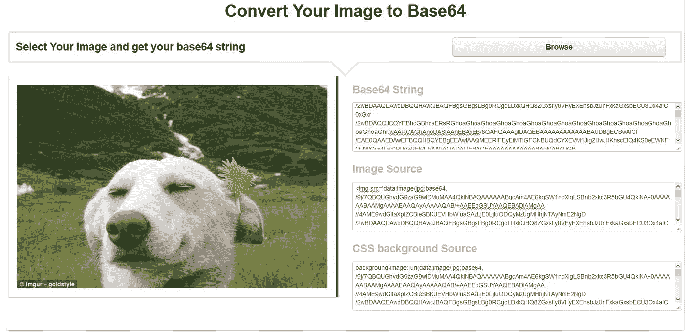

# 对于初学者:上传图片到 IOTA Tangle

> 原文：<https://medium.com/coinmonks/for-beginners-upload-images-onto-the-iota-tangle-6da0d4069705?source=collection_archive---------0----------------------->

This is the image I uploaded to the Tangle

这个程序的目的:上传和存储图像到 IOTA Tangle 上。

本文假设您的机器上安装了 Python(我使用的是 Raspberry Pi)。要安装 python 和/或使用终端，请参考我以前的文章。

如果你被困住了，联系我。另外，如果您看到任何需要改进的地方，请告诉我。

# 1.激活 IOTA

要与 IOTA tangle 通信，您需要安装 PyOTA 库([https://github.com/iotaledger/iota.lib.py](https://github.com/iotaledger/iota.lib.py)):

`cd ~/`

`sudo apt-get install libffi-dev`(为了避免错误:“为加密构建轮子失败”)

`sudo pip install pyota[ccurl]`

`git clone [https://github.com/iotaledger/iota.lib.py.git](https://github.com/iotaledger/iota.lib.py.git)`

要测试安装是否成功(大约需要 10 分钟):

`cd iota.lib.py`

`python setup.py test`

# 2.准备要上传的图像

要上传图像，您需要先将其转换为 Base64 字符串。有几个网页可以让你这样做。我用了[代码美化](https://codebeautify.org/base64-decode)([https://codebeautify.org/base64-decode](https://codebeautify.org/base64-decode))。

结果将如下所示:

在右上方，您可以看到 Base64 字符串，我们稍后会用到它。

# 3.上传图像的程序

复制并使用下面的程序(我称之为 iota-images.py):

您需要进行三项更改(它们都在代码中突出显示):

1.  插入您的 IOTA 地址
2.  插入图像的 Base64 字符串
3.  插入您的标签，以便您可以捆绑图像(仅允许以下字符:A…Z 和数字 9)

你需要一点地址。为此，我建议在你的电脑上安装 trinity 钱包([https://trinity.iota.org](https://trinity.iota.org/))，并通过这种方式获得一个新地址。

运行程序:

`python iota-images.py`

程序运行时，您将看到以下输出:

**潜在错误“BadApiResponse: 500 来自节点的响应”**。您可能会遇到以下错误信息。在这种情况下，请等待几个小时，然后重试或在代码中加入延迟:

该数字是正在生成的事务的计数(要计算总数，请将 Base64 字符串复制到例如 Word 中，并检查字符数。用这个数字除以 1000，你就会知道你会产生多少笔交易。在我的例子中，生成了 53 个事务。

大约需要 10 分钟才能完成传输。

前往[THETANGLE.ORG](https://thetangle.org/)，插入你的 IOTA 地址，你将看到你生成的所有交易。要进行检查，请单击其中一个交易，您会看到类似这样的内容:

# 下载图像

您想再次下载您的图像吗？[在这里你可以找到一个非常简单的代码:对于初学者:从 IOTA Tangle](/@rfkledig/for-beginners-download-images-from-the-iota-tangle-17ffb79b5ed2) 下载图片。

# REDDIT.com/r/IOTA

Reddit 上关于该计划的热烈讨论:

> [在您的收件箱中直接获得最佳软件交易](https://coincodecap.com/?utm_source=coinmonks)

