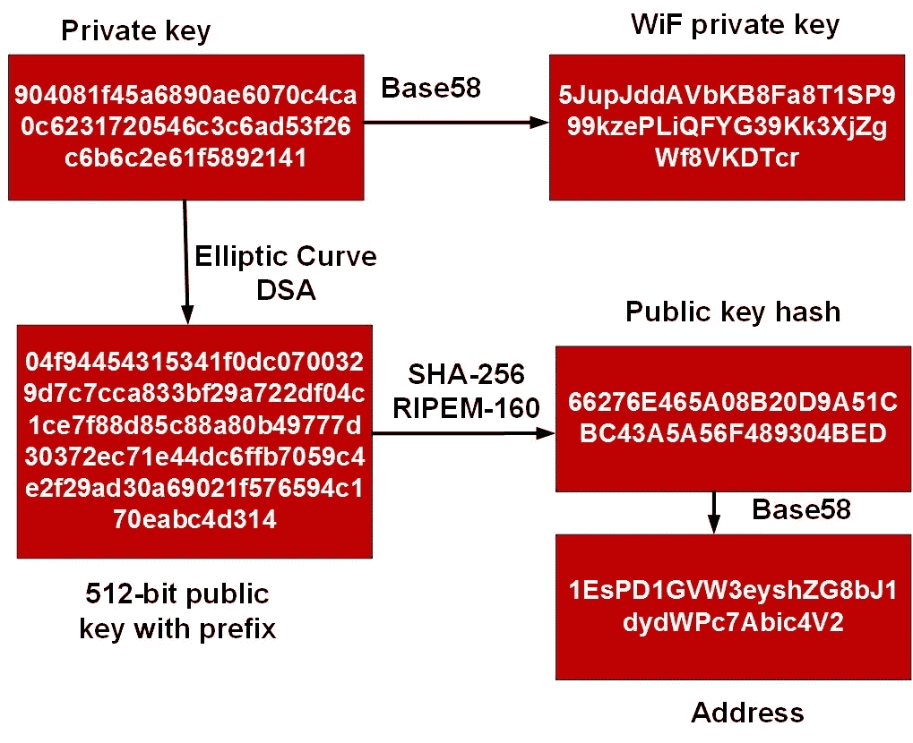

# 出于对计算的热爱:你指的是 0 还是 0？

> 原文：<https://medium.com/coinmonks/for-the-love-of-computing-did-you-mean-0-or-o-bd6ea8446e86?source=collection_archive---------7----------------------->

我们都曾处于不知道自己是零(“0”)还是“0”的境地。那么我们如何避免这种情况呢？在将非打印字符编码为可打印字符时，我们通常采用 Base-64，每次取 6 位，然后转换为 Base-64 字符。

但是看起来相似的字母呢:0(零)，O(大写 O)，I(大写 I)和 L(小写 L)，还有非字母数字…